# Multi-Agent Architecture with Generative AI: Structural Plasticity

**Technical Whitepaper**

**Version 1.0 - December 2025 - Ariel Edgardo Levy**

**ariel.e.levy@gmail.com**

---

## Abstract

This work presents a **comprehensive and generalizable framework for the design and construction of multi-agent systems** based on Large Language Models (LLMs). The work addresses theoretical foundations, architectural patterns, and essential capabilities that these systems must implement across any application domain. To validate and demonstrate the proposed concepts, we use **Lumen**—a conversational Business Intelligence system—as an **implementation case study**.

**Problem**: Isolated Large Language Models (LLMs) are insufficient for complex enterprise applications due to hallucinations, lack of access to real data, absence of persistent memory, and context limitations. Architectures combining multiple specialized agents with structured access to data sources are required. This problem is transversal across multiple domains: administration, operations, process automation, data intelligence, and others.

**Main Novelty**: This work introduces **PEMA (Plastic Evolving Multi-Agent)**, a theoretical extension that provides **structural plasticity** to multi-agent systems. While LLM parameters θ remain fixed post-training, PEMA allows the *coordination topology between agents* to evolve dynamically through Hebbian learning—solving what we term the *adaptation barrier*.

**Approach**: We propose a **domain-independent** reference framework for multi-agent systems that includes: (1) theoretical foundations of functional agency, (2) taxonomy of multi-agent architectures, (3) PEMA theoretical framework adding structural plasticity to the system, (4) ten essential capabilities, and (5) reusable design patterns. Each capability is presented with **general theory** applicable to any domain, illustrated with Lumen as a case study.

**Contributions** (hierarchized by novelty):

**🔬 Main Contribution (Theoretical)**:
- **PEMA (Plastic Evolving Multi-Agent)**: Extension of the functional agency framework with **structural plasticity** inspired by neuroscientific principles. First formalization of Hebbian learning for inter-agent trust weights, with theoretical guarantees of bounded predictability (Theorem 10.1) and benchmark protocol for plastic systems. *This contribution opens a new research line in adaptive multi-agent systems.*

**📐 Secondary Contributions (Methodological)**:
1. **Functional Agency Theoretical Framework**: Rigorous formalization of necessary conditions (Definitions 1.1-1.5) for genuine agentic behavior—universally applicable
2. **Novel Design Patterns**, highlighting:
   - *Two-Layer Routing*: Keywords for 85% of traffic, LLM only for ambiguous cases—reduces costs 5x
   - *Speculative Gap RAG (SG-RAG)*: RAG that detects documentation gaps and persists them for analysis—first RAG that learns from its limitations
   - *Experience-Weighted Routing*: Routing where weights evolve by accumulated collaborative success
   - *Adaptive Memory with Decay*: Memory with controlled forgetting (inspired by EWC) balancing retention vs relevance

**📋 Tertiary Contributions (Practical)**:
3. **Architecture Taxonomy**: Classification of five main architectures with transferable decision framework
4. **Ten Essential Capabilities**: Universal checklist for agentic systems
5. **Lumen Case Study**: Complete validation in BI domain demonstrating +20pp accuracy vs baseline

**Results**: The proposed framework provides practical guidance for building multi-agent systems in any enterprise domain. Validation through Lumen demonstrates improvements of +20 percentage points in accuracy (91.5% vs 71.4% for monolithic architecture) with controlled latency increase (+58%), confirming the viability and benefits of the proposed approach. The PEMA extension provides theoretical foundations for adaptive systems with stability guarantees.

**Keywords**: Multi-Agent Systems, **Adaptation Barrier**, **Structural Plasticity**, Hebbian Learning, LLM, Functional Agency, Generative AI, PEMA

---

## Table of Contents

### Part I: Theoretical Foundations
- [Chapter 1: Theory of Agentic Systems](#chapter-1-theory-of-agentic-systems)
- [Chapter 2: Multi-Agent Architectures](#chapter-2-multi-agent-architectures)
- [Chapter 3: Related Work](#chapter-3-related-work)

### Part II: Introduction to Lumen
- [Introduction](#introduction)

### Part III: Capabilities
- [Capability 1: Memory and Context](#capability-1-memory-and-context)
- [Capability 2: Routing and Intent](#capability-2-routing-and-intent)
- [Capability 3: RAG - Knowledge Retrieval](#capability-3-rag---knowledge-retrieval)
- [Capability 4: Orchestration, Workflows and Agent Composition](#capability-4-orchestration-workflows-and-agent-composition)
- [Capability 5: Data Source Integration](#capability-5-data-source-integration)
- [Capability 6: Visualization and Output](#capability-6-visualization-and-output)
- [Capability 7: Security](#capability-7-security)
- [Capability 8: Scalability](#capability-8-scalability)
- [Capability 9: Observability](#capability-9-observability)
- [Capability 10: Plasticity and Continuous Learning (PEMA)](#capability-10-plasticity-and-continuous-learning-pema) ← **MAIN CONTRIBUTION**

### Part IV: Evaluation and Discussion
- [Chapter 5: Evaluation](#chapter-5-evaluation)
- [Chapter 6: Discussion](#chapter-6-discussion)
- [Conclusions](#conclusions)
- [References](#references)
- [Appendix A: Formal Definitions](#appendix-a-formal-definitions)

---

# PART I: THEORETICAL FOUNDATIONS

---

# Chapter 1: Theory of Agentic Systems

## 1.1 The Era of Agentic AI

The artificial intelligence landscape has undergone a fundamental transformation. While individual Large Language Models (LLMs) like GPT, Gemini, and Claude dominate in 2025, the future belongs to **agentic systems**: architectures where multiple specialized AI agents collaborate to solve complex problems with increasing autonomy.

According to recent research, the global market for agentic AI tools is experiencing explosive growth, with a compound annual growth rate (CAGR) of approximately 56.1%, reaching $10.41 billion in 2025. Deloitte predicts that in 2025, 25% of enterprises using generative AI will launch agentic AI pilots, growing to 50% by 2027.

### Definition: What is Agentic AI

**Agentic AI** refers to artificial intelligence systems capable of completing complex tasks and achieving objectives with little or no human supervision. It differs from current chatbots and co-pilots in that:

- **Generates outcomes, not just responses**: Instead of single-turn responses, generates complete outcomes
- **Plans and executes**: Decomposes objectives into subtasks and executes them autonomously
- **Interacts with the environment**: Uses tools, navigates systems, and adapts in real-time
- **Self-corrects**: Evaluates its own results and iterates until satisfying criteria

<table>
<tr>
<td width="70%" valign="top">
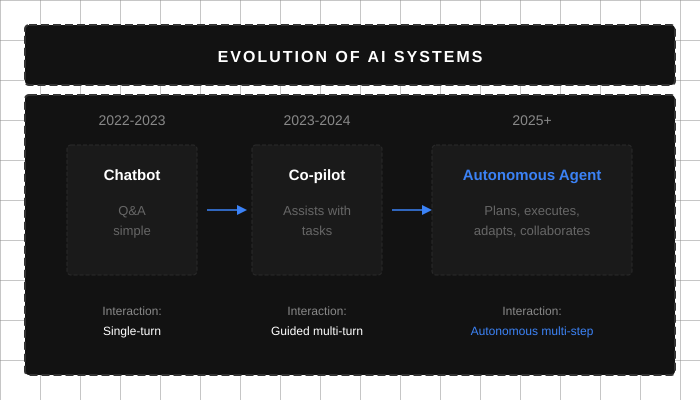
<p align="center"><em>Figure 1: Evolution of AI Systems</em></p>
</td>
<td width="30%" valign="top">

**The evolution shows four distinct eras**: from rule-based systems (1980s-2000s) through statistical ML (2000s-2017), to transformer-based LLMs (2017-2023), and finally to multi-agent agentic systems (2023+). Each transition brought fundamental shifts in how AI systems process information and interact with their environment.

</td>
</tr>
</table>

## 1.2 Functional Agency: A Theoretical Framework

Recent research proposes the concept of **functional agency** as a theoretical framework for agentic systems. A system exhibits functional agency when it satisfies three conditions:

### Mathematical Formalization

Let an agentic system be defined as a tuple:

**Definition 1.1 (Agentic System)**: An agentic system is a tuple A = (S, O, G, π, M, α) where:
- S: Set of environment states
- O: Set of observations the agent can perceive
- G: Set of objectives
- π: S × G → A, policy function mapping states and objectives to actions
- M: A × S → S, transition model (actions and states to new states)
- α: adaptation function that modifies π based on feedback

**Definition 1.2 (Functional Agency)**: A system A exhibits functional agency if and only if it satisfies the following three conditions:

### Condition 1: Action Generation

The system must be capable of **generating actions based on environmental information toward an objective**. It is not sufficient to passively process information; the agent must make decisions that modify its environment.

**Formally**: ∀s ∈ S, ∀g ∈ G: π(s, g) produces an action a ∈ A that modifies the environment state.

### Condition 2: Outcome Model

The system must **represent relationships between actions and their consequences**. This implies a causal understanding (or strong correlation) of how actions affect the world.

**Formally**: The system maintains a model M: A × S → S such that M(a, s) predicts the resulting state s' from executing action a in state s.

### Condition 3: Adaptation

The system must **modify its behavior when its outcome model changes**. If it discovers that an action no longer produces the expected effect, it must adapt its strategy.

**Formally**: If M(a, s) ≠ s' (incorrect prediction), then α updates π such that π'(s, g) ≠ π(s, g) for similar cases.

**Proposition 1.1**: An isolated LLM does not satisfy Condition 3 of functional agency, since its parameters are static post-training and it cannot adapt its policy based on environment feedback at runtime.

*Proof sketch*: Let L be an LLM with fixed parameters θ post-training. L's policy function π is determined by θ: π_L(s, g) = f_θ(s, g). Condition 3 requires the existence of an adaptation function α that modifies π when M(a, s) ≠ s'. For L, modifying π would require modifying θ, but θ is immutable during inference (the model is "frozen"). Therefore, α cannot exist for L at runtime, and L does not satisfy Condition 3. ∎

**Corollary 1.1**: To build systems with genuine functional agency, it is necessary to complement LLMs with external mechanisms for memory, tools, and feedback loops.

*Justification*: From the result of Proposition 1.1, if we want an LLM-based system to satisfy Condition 3, we must externalize the adaptation function α. External mechanisms (persistent memory to remember errors, tools to execute actions, feedback loops to evaluate results) allow implementing α outside the LLM, complementing its static capabilities with dynamic adaptation. ∎

<table>
<tr>
<td width="70%" valign="top">
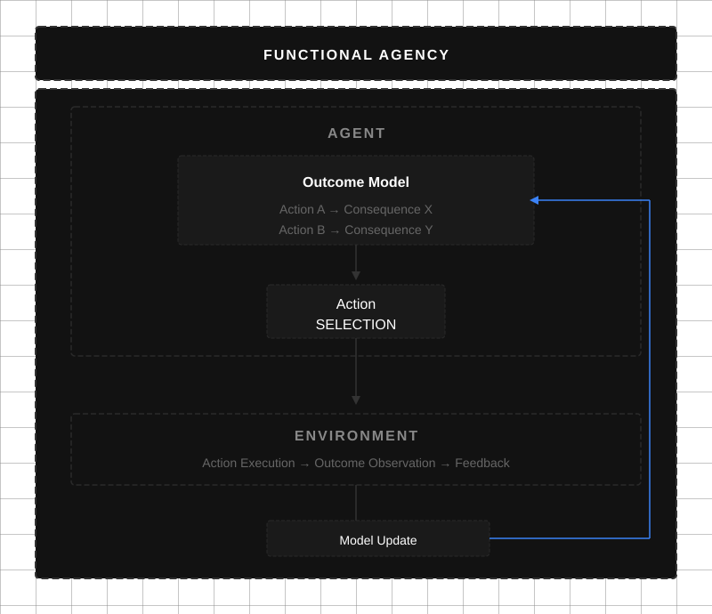
<p align="center"><em>Figure 2: Functional Agency</em></p>
</td>
<td width="30%" valign="top">

**The three conditions for functional agency**: (1) Action Generation—the system must produce actions that modify its environment; (2) Outcome Model—maintaining causal understanding of action-consequence relationships; (3) Adaptation—modifying behavior when predictions fail. An isolated LLM fails Condition 3 due to frozen parameters.

</td>
</tr>
</table>

## 1.3 Components of an Agentic System

Modern agentic systems are built on fundamental components that work together:

### 1.3.1 Reasoning Engine (LLM)

The core of the agent is a Large Language Model that provides:
- **Natural language understanding**: Interprets instructions and context
- **Reasoning**: Decomposes problems and plans solutions
- **Generation**: Produces text, code, decisions

### 1.3.2 Memory

Agents require multiple types of memory:

| Type | Function | Persistence |
|------|----------|-------------|
| **Working Memory** | Context of current task | Session |
| **Episodic Memory** | Indexed past experiences | Long-term |
| **Semantic Memory** | Domain knowledge | Permanent |
| **Procedural Memory** | Learned execution patterns | Permanent |
| **Structural Memory** | Inter-agent trust weights (PEMA) | Adaptive |

### 1.3.3 Tools

Tools extend the agent's capabilities beyond text generation:
- **Code execution**: Compilers, interpreters, debuggers
- **Data access**: APIs, databases, file systems
- **Web interaction**: Navigation, search, scraping
- **Communication**: Email, messaging, notifications

### 1.3.4 Feedback Loop

The agentic system operates through integrated feedback loops:

<table>
<tr>
<td width="70%" valign="top">
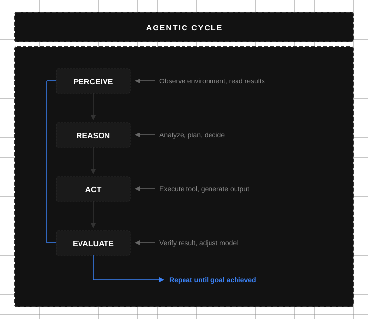
<p align="center"><em>Figure 3: Agentic Cycle</em></p>
</td>
<td width="30%" valign="top">

**The continuous agentic loop**: Perceive → Think → Act → Observe → Adapt. The agent receives input, reasons about goals and available actions, executes using tools, observes outcomes, and updates its internal state. This cycle repeats until the objective is achieved or a termination condition is met.

</td>
</tr>
</table>

## 1.4 Agentic Reasoning Patterns

Research has identified fundamental patterns for agent reasoning:

### 1.4.1 Chain-of-Thought (CoT)

The agent explicates its reasoning process step by step before acting:

```
Question: "What were the total sales for Q3?"

CoT Reasoning:
1. I need to query sales data
2. Q3 corresponds to July-September
3. I must sum all transactions in that period
4. I will use the execute_dax tool with the appropriate query

Action: execute_dax("CALCULATE(SUM(Sales[Amount]), QUARTER(Sales[Date])=3)")
```

### 1.4.2 ReAct (Reasoning and Acting)

Alternates between reasoning and action, using observations to guide next steps:

```
Thought: I need to find information about the Acme client
Action: search_documents("Acme client contracts")
Observation: Found 3 relevant documents...
Thought: The main document is the 2024 contract
Action: read_document("acme_contract_2024.pdf")
Observation: The contract specifies...
Thought: Now I can answer the question
Answer: According to the 2024 contract, the Acme client...
```

### 1.4.3 Reflection

The agent critically evaluates its own output and improves it iteratively:

```
Attempt 1: [Generates response]
Evaluation: "This response doesn't cite specific sources"
Attempt 2: [Generates improved response with citations]
Evaluation: "Now it's precise and verifiable"
Final Output: [Refined response]
```

### 1.4.4 Planning

For complex tasks, the agent generates a plan before executing:

```
Objective: "Create a sales report by region"

Plan:
1. Identify the correct data model
2. Query sales by region
3. Query previous period sales for comparison
4. Calculate percentage variations
5. Generate visualization
6. Write main insights

Execution: [Executes each step of the plan]
```

## 1.5 Current Capabilities (State of the Art 2025)

### 1.5.1 What Agents Can Do Today

Current agentic systems demonstrate impressive capabilities:

**Agentic Programming**:
- Generate code from natural language specifications
- Interact with compilers, debuggers, and version control systems
- Iterate on errors and refine solutions

**Workflow Automation**:
- Complete multi-step tasks in enterprise applications
- Coordinate between multiple systems (CRM, ERP, BI)
- Handle exceptions and edge cases

**Research and Analysis**:
- Search and synthesize information from multiple sources
- Generate structured reports
- Identify patterns and anomalies in data

**Tool Interaction**:
- Navigate web interfaces
- Execute database queries
- Generate and modify documents

### 1.5.2 Autonomy Levels

Agentic system maturity is measured in levels:

| Level | Description | 2025 Status |
|-------|-------------|-------------|
| **1** | Basic assistance with limited tools | Mature |
| **2** | Multi-step execution with supervision | Mature |
| **3** | Autonomy in specific domains (<30 tools) | Emerging |
| **4** | Broad autonomy with self-correction | Research |
| **5** | Complete autonomy with continuous learning | Future |

According to industry analysis, as of Q1 2025 most agentic applications remain at Levels 1 and 2, with some exploring Level 3 within specific domains.

## 1.6 Limitations and Challenges

### 1.6.1 Limitations of Current LLMs

Current language models present critical deficiencies for agency:

**Limited Causal Reasoning**:
- Confuse correlation with causation
- Difficulty predicting consequences of novel actions
- Bias toward patterns observed in training

**Lack of Metacognition**:
- Unawareness of their own limitations
- Systematic overconfidence in incorrect answers
- Difficulty distinguishing sufficient from insufficient information

**Hallucinations**:
- Generation of plausible but false information
- Inventing citations, data, or facts
- Filling knowledge gaps with fabrications

### 1.6.2 System Challenges

**Memory Scalability**:
- Limited context windows (8K-200K tokens)
- Lack of structured persistence between sessions
- Performance degradation with long contexts

**Security and Reliability**:
- Risk of executing unsafe actions without supervision
- Unanticipated emergent behaviors
- Difficulty auditing decisions

**Tool Incompatibility**:
- Tools designed for humans, not agents
- Inconsistent APIs and incomplete documentation
- Need for wrappers and adapters

**Inadequate Evaluation**:
- Existing benchmarks don't capture real workflows
- Precision metrics don't reflect practical utility
- Difficulty measuring autonomy and reliability

<p align="center">
  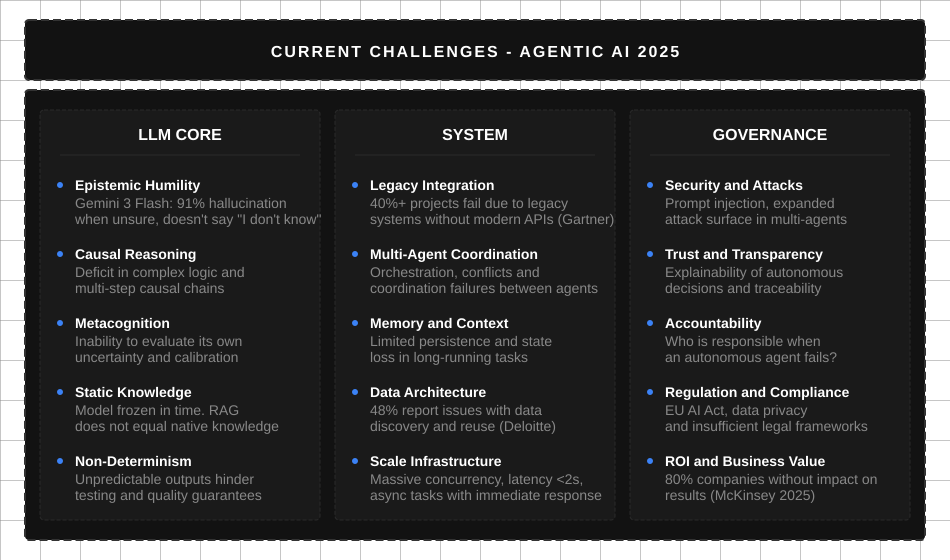
<br><em>Figure 4: Current Challenges</em>
</p>

## 1.7 Horizon: Vision 2025-2030

### 1.7.1 Emerging Trends (2025)

**Multi-Agent as the Norm**:
- Systems where specialized agents collaborate
- Decentralization and specialization as dominant architecture
- Pattern similar to microservices in software development

**Small Language Models for Agents**:
- SLMs powerful enough for specialized repetitive tasks
- More economical and efficient for massive invocations
- Ideal for components of complex agentic systems

**Fusion with IoT and Robotics**:
- Warehouse robots managed by decision agents
- Autonomous vehicles coordinated with supply chain agents
- Foundations for smart factories and automated logistics networks

### 1.7.2 Industry Predictions

| Horizon | Prediction |
|---------|------------|
| **2025** | 25% of enterprises with gen AI launch agentic pilots |
| **2027** | 50% of enterprises with gen AI use agentic systems |
| **2029** | Agents resolve 80% of customer service issues (Gartner) |
| **2030** | Multi-agent ecosystems across industries |

### 1.7.3 Vision: Autonomous Enterprises

The horizon points toward **enterprises with incremental autonomy**:

**Phase 1 (Current)**: Co-pilots assist in specific tasks
**Phase 2 (2025-2027)**: Agents execute complete workflows with supervision
**Phase 3 (2027-2029)**: Multi-agent ecosystems coordinate across departments
**Phase 4 (2030+)**: Autonomy in most operational processes

<table>
<tr>
<td width="70%" valign="top">
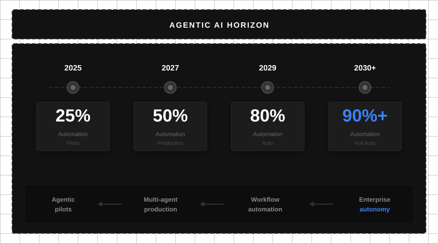
<p align="center"><em>Figure 5: Agentic AI Horizon</em></p>
</td>
<td width="30%" valign="top">

**The 2025-2030 trajectory**: Phase 1 (current) with co-pilots for specific tasks; Phase 2 (2025-27) agents executing complete workflows under supervision; Phase 3 (2027-29) multi-agent ecosystems coordinating across departments; Phase 4 (2030+) autonomy in most operational processes.

</td>
</tr>
</table>

---

# Chapter 2: Multi-Agent Architectures

## 2.1 From Monolithic to Multi-Agent

The transition from individual LLMs to multi-agent systems represents a paradigmatic shift similar to the evolution from monolithic applications to microservices:

| Aspect | Monolithic LLM | Multi-Agent System |
|--------|----------------|---------------------|
| **Responsibility** | One model does everything | Specialized agents |
| **Scalability** | Vertical (larger model) | Horizontal (more agents) |
| **Reliability** | Single point of failure | Redundancy and fallbacks |
| **Maintenance** | Change affects everything | Isolated changes |
| **Specialization** | Generalist | Domain experts |

### Advantages of the Multi-Agent Approach

**Specialization**:
- Each agent optimized for its domain
- Specific prompts and tools
- Lower cognitive load per agent

**Composition**:
- Reusable agents across applications
- New capabilities by adding agents
- Architectural flexibility

**Resilience**:
- Failure of one agent doesn't collapse the system
- Retries and fallbacks possible
- Graceful degradation

## 2.2 Main Architectures (2025)

Research and industrial practice have converged on five main architectures:

### 2.2.1 Cognitive Hierarchical Architecture

Divides intelligence into layers with different temporal scales and abstraction levels:

<table>
<tr>
<td width="70%" valign="top">
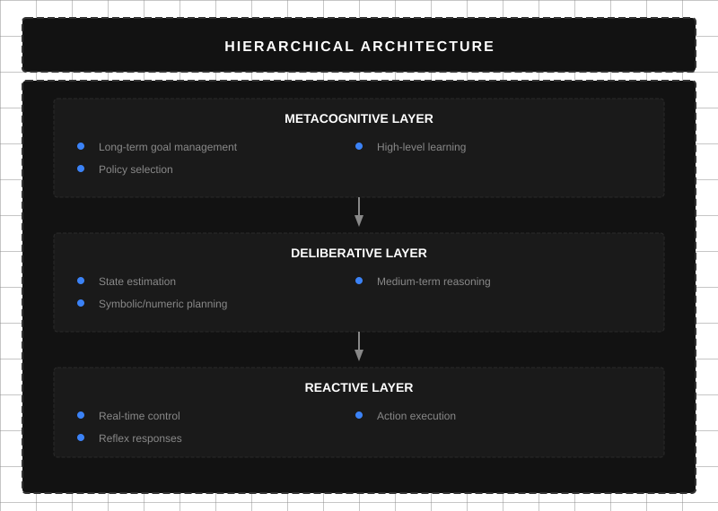
<p align="center"><em>Figure 6: Hierarchical Architecture</em></p>
</td>
<td width="30%" valign="top">

**Cognitive layers with different temporal scales**: Strategic layer (long-term planning), Tactical layer (intermediate decisions), Operational layer (real-time execution). Information flows up (observations) and down (commands). **Use**: Robotics, trading, complex decision systems.

</td>
</tr>
</table>

### 2.2.2 Swarm Architecture

Minimalist approach with simple agents that emerge complex behavior:

<table>
<tr>
<td width="70%" valign="top">
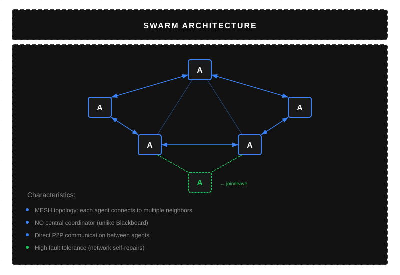
<p align="center"><em>Figure 7: Swarm Architecture</em></p>
</td>
<td width="30%" valign="top">

**Simple homogeneous agents with emergent behavior**: Peer-to-peer communication, no central coordinator. Complex patterns arise from local interactions. **Use**: Rapid prototyping, distributed search, parallel processing.

</td>
</tr>
</table>

> **Note: Swarm vs Blackboard vs PEMA**
>
> It's important to distinguish three related but distinct concepts:
> - **Swarm** (this section): *Architecture* where homogeneous agents communicate peer-to-peer and behavior emerges from local interactions. No central state or coordinator.
> - **Blackboard** (Section 2.3.4): *Coordination pattern* where heterogeneous agents read/write to a shared central state. Compatible with multiple architectures.
> - **PEMA** (Chapter 11): *Plasticity mechanism* that can be applied to any architecture, allowing trust weights between agents to evolve through Hebbian learning.
>
> In practice, a system could combine Swarm architecture with Blackboard coordination and PEMA plasticity.

### 2.2.3 Meta-Learning Architecture

Separates task learning from meta-learning (learning to learn). **Magentic-One** from Microsoft Agent Framework exemplifies this pattern:

<table>
<tr>
<td width="70%" valign="top">
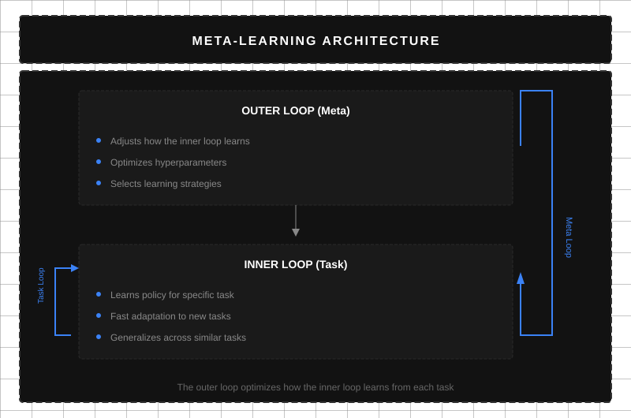
<p align="center"><em>Figure 8: Meta-Learning</em></p>
</td>
<td width="30%" valign="top">

**Learning to learn**: Separates task execution from meta-learning. Microsoft's Magentic-One exemplifies this pattern with an Orchestrator that learns coordination strategies. **Use**: Systems requiring rapid adaptation to new domains.

</td>
</tr>
</table>

> **Connection with PEMA**: Meta-learning is the theoretical precursor to the structural plasticity proposed in PEMA (Chapter 11). While traditional meta-learning operates on *model parameters*, PEMA extends the concept to *inter-agent trust weights*, allowing the coordination topology to evolve adaptively. This represents a higher level of adaptation: not just "learning to learn," but "learning to collaborate."

### 2.2.4 Modular Architecture

Interchangeable components with well-defined interfaces:

<table>
<tr>
<td width="70%" valign="top">
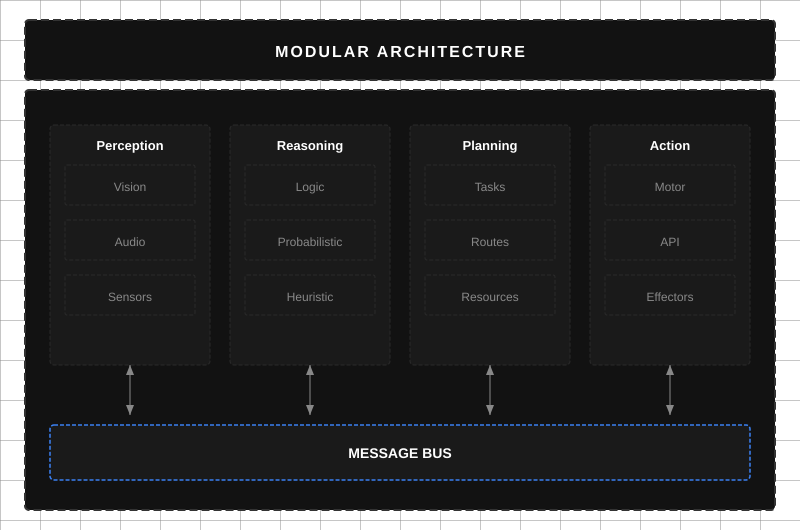
<p align="center"><em>Figure 9: Modular Architecture</em></p>
</td>
<td width="30%" valign="top">

**Interchangeable components with defined interfaces**: Plug-and-play agents, hot-swappable modules. Enables A/B testing and gradual upgrades. **Use**: Enterprise systems requiring flexibility and maintainability.

</td>
</tr>
</table>

### 2.2.5 Evolutionary Architecture

Agents that evolve and adapt through selection and mutation:

<table>
<tr>
<td width="70%" valign="top">
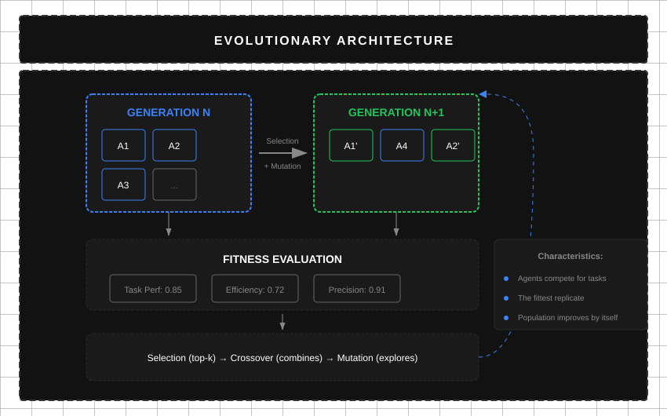
<p align="center"><em>Figure 10: Evolutionary Architecture</em></p>
</td>
<td width="30%" valign="top">

**Agents that evolve through selection and mutation**: Population of agent variants compete; successful strategies propagate. Genetic operators create new combinations. **Use**: Long-term optimization, self-improving systems.

</td>
</tr>
</table>

### 2.2.6 Orchestrator-Worker Architecture

A central agent coordinates specialized workers:

<table>
<tr>
<td width="70%" valign="top">
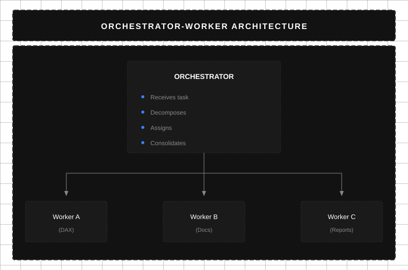
<p align="center"><em>Figure 11: Orchestrator-Worker Architecture</em></p>
</td>
<td width="30%" valign="top">

**Central coordinator with specialized workers**: Orchestrator decomposes tasks, assigns to appropriate workers, aggregates results. Clear separation of concerns. **Use**: Most enterprise multi-agent systems.

</td>
</tr>
</table>

### 2.2.7 Generator-Critic Architecture

Separates content creation from its validation:

<table>
<tr>
<td width="70%" valign="top">
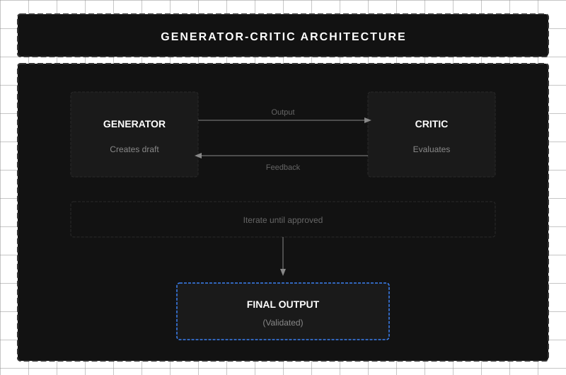
<p align="center"><em>Figure 12: Generator-Critic Architecture</em></p>
</td>
<td width="30%" valign="top">

**Separates creation from validation**: Generator produces content; Critic evaluates quality and provides feedback. Iterates until quality threshold met. **Use**: Code generation, high-quality content, self-improvement loops.

</td>
</tr>
</table>

### 2.2.8 Blackboard Architecture

Agents share state via centralized storage:

<table>
<tr>
<td width="70%" valign="top">
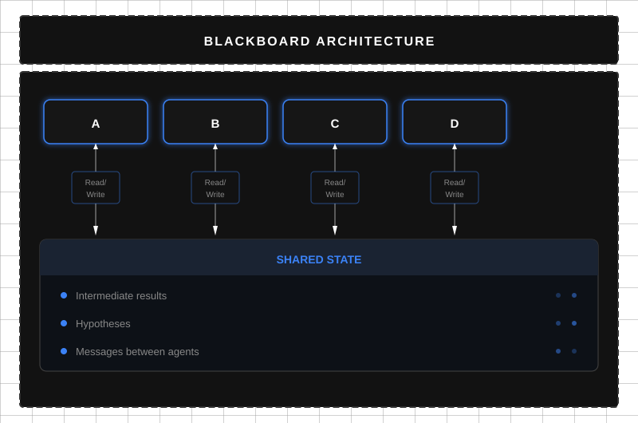
<p align="center"><em>Figure 13: Blackboard Architecture</em></p>
</td>
<td width="30%" valign="top">

**Centralized shared state**: Agents read/write to common storage. No direct inter-agent communication—all coordination through blackboard. **Use**: Heterogeneous agent collaboration, complex state management.

</td>
</tr>
</table>

### 2.2.9 Sequential Architecture (Pipeline)

Agents process in chain, each transforming the previous one's output:

<table>
<tr>
<td width="70%" valign="top">
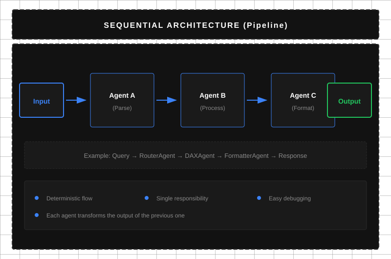
<p align="center"><em>Figure 14: Sequential Architecture</em></p>
</td>
<td width="30%" valign="top">

**Chain processing**: Each agent transforms output of previous one. Deterministic flow, easy to debug. **Use**: Structured processing, ETL, transformation pipelines.

</td>
</tr>
</table>

### 2.2.10 Parallel Architecture (Fan-out/Fan-in)

Multiple agents process simultaneously and combine results:

<table>
<tr>
<td width="70%" valign="top">
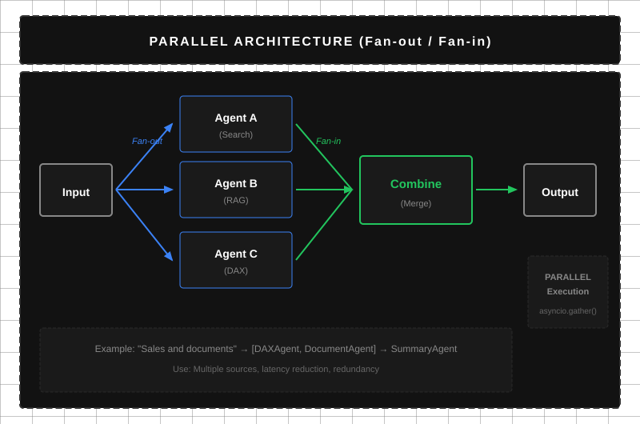
<p align="center"><em>Figure 15: Parallel Architecture</em></p>
</td>
<td width="30%" valign="top">

**Simultaneous processing with result aggregation**: Fan-out distributes work; Fan-in combines results. Minimizes latency, enables redundancy. **Use**: Multi-source queries, parallel search, fault tolerance.

</td>
</tr>
</table>

### 2.2.11 Reflexive Architecture (Loop)

Agent evaluates its output and refines iteratively until satisfying criteria:

<table>
<tr>
<td width="70%" valign="top">
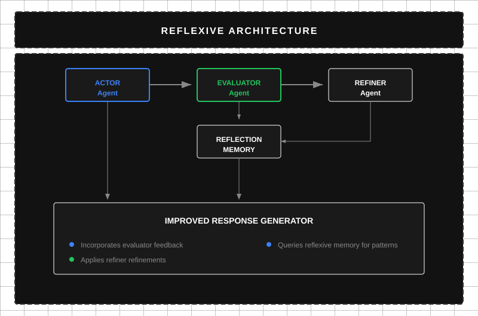
<p align="center"><em>Figure 16: Reflexive Architecture</em></p>
</td>
<td width="30%" valign="top">

**Self-evaluation and iterative refinement**: Agent produces output, evaluates against criteria, refines until satisfactory. Internal quality control loop. **Use**: Code generation, high-quality content, verifiable tasks.

</td>
</tr>
</table>

## 2.3 Frameworks and Tools (2025 Status)

| Framework | Architecture | Main Use |
|-----------|--------------|----------|
| **LangGraph** | State graphs | Production agents with persistence and cycles |
| **AutoGen** | Async conversational | Event-driven multi-agent cooperation |
| **CrewAI** | Role-playing | Agent teams with defined roles |
| **Semantic Kernel** | Enterprise orchestration | Enterprise integration (.NET/Python/Java) |
| **Swarm** | Lightweight handoffs | Educational, maximum simplicity |
| **LlamaIndex** | RAG-first | Document-aware agents |
| **DSPy** | Prompt compiler | Automatic prompt optimization |
| **MS Agent Framework** | Unified | SK + AutoGen combined (**Lumen's base**) |

## 2.4 Performance Metrics

### 2.4.1 Effectiveness Metrics

| Metric | Description | Benchmark |
|--------|-------------|-----------|
| **Task Completion Rate** | % of tasks completed successfully | 80-90% (routed) |
| **First-Pass Success** | Success without retries | 60-75% |
| **Error Recovery Rate** | Recovery from failures | 70-85% |

### 2.4.2 Efficiency Metrics

| Metric | Description | Impact |
|--------|-------------|--------|
| **Latency** | Total response time | Router reduces 30-40% |
| **Token Usage** | LLM token consumption | Specialization reduces 20-30% |
| **Tool Invocations** | Tool calls | Fewer with better routing |

### 2.4.3 Comparison: Single vs Multi-Agent

<table>
<tr>
<td width="70%" valign="top">
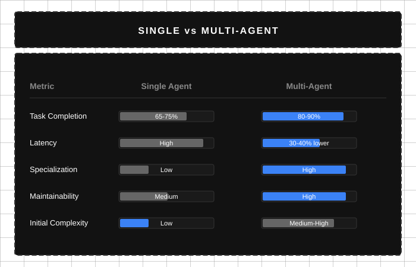
<p align="center"><em>Figure 17: Single vs Multi-Agent</em></p>
</td>
<td width="30%" valign="top">

**Performance comparison**: Multi-agent systems achieve +20pp accuracy over monolithic LLMs. Trade-off: increased latency (+58%) but better specialization, error recovery, and maintainability. Routing reduces token usage 20-30%.

</td>
</tr>
</table>

---

# Chapter 3: Related Work

This chapter positions the presented work in relation to existing literature, critically analyzing previous approaches and identifying the gaps this work addresses.

## 3.1 Theoretical Foundations

### 3.1.1 Intelligent Agents

The study of intelligent agents has roots in classical artificial intelligence. Wooldridge and Jennings (1995) defined an agent as a computational system situated in an environment, capable of autonomous action to achieve objectives. This definition has evolved with the arrival of LLMs, but the fundamental principles remain.

Russell and Norvig (2020) classify agents according to their architecture:
- **Simple reflex agents**: Respond directly to perceptions
- **Model-based agents**: Maintain internal state of the world
- **Goal-based agents**: Plan to achieve goals
- **Utility-based agents**: Optimize a utility function

Modern agentic systems with LLMs combine elements from all these categories, adding natural language reasoning capabilities.

### 3.1.2 Multi-Agent Systems

Research in Multi-Agent Systems (MAS) established principles of coordination and communication between agents (Ferber, 1999). Key concepts include:

- **Coordination**: Mechanisms for agents to work together without conflicts
- **Negotiation**: Protocols for resolving goal differences
- **Organization**: Structures defining roles and relationships

These principles inform the design of multi-agent systems with LLMs, although communication via natural language introduces new possibilities and challenges.

### 3.1.3 Business Intelligence

The Business Intelligence field was formalized with Kimball's (1996) work on dimensional modeling and Inmon's (2005) work on data warehouse architectures. Fundamental concepts include:

- **Dimensional model**: Facts and dimensions as base structure
- **OLAP**: Multidimensional analysis operations
- **ETL**: Extraction, transformation, and loading processes

Lumen operates on Power BI semantic models that implement these principles, adding a natural language layer to democratize access.

## 3.2 Related Work in Multi-Agent Systems with LLMs

### 3.2.1 Orchestration Frameworks

**LangChain/LangGraph** (Harrison Chase, 2022-2024): Pioneer framework that introduced the concept of "chains" for LLM composition. LangGraph extends this with state graphs for complex workflows.

*Strengths*: Fine control over execution flow, persistent state, active community.
*Limitations*: Steep learning curve, sometimes opaque abstraction, not optimized for BI.

**Microsoft Agent Framework** (2024): Unifies Semantic Kernel and AutoGen. Provides `ChatCompletionAgent`, `@ai_function`, Agent-as-Tool, Guardrails (groundedness), and Magentic-One. **Lumen's implementation base**.

*Strengths*: Azure integration, strict typing, native MCP, Guardrails, telemetry.
*Limitations*: Younger ecosystem than LangChain, evolving documentation.

**CrewAI** (Moura, 2024): Simplified framework with "crew" (team) metaphor of agents with defined roles.

*Strengths*: Simplicity, rapid prototyping, clear roles.
*Limitations*: Less control than LangGraph, limited for complex workflows.

**OpenAI Swarm** (OpenAI, 2024): Minimalist experimental framework for "handoffs" between agents.

*Strengths*: Minimalism, ease of use, clear transfer concept.
*Limitations*: Experimental, no production support, no persistent state.

### 3.2.2 Conversational BI Systems

**Power BI Q&A** (Microsoft): Allows natural language questions on Power BI models.

*Strengths*: Native integration, no additional configuration.
*Limitations*: Simple queries only, no agents, no documents, limited responses.

**ThoughtSpot** (ThoughtSpot Inc.): Analytics platform with natural language search.

*Strengths*: Search-centered design, automatic visualizations.
*Limitations*: Proprietary solution, not extensible, no agentic architecture.

**Tableau Ask Data** (Salesforce): Natural language interface for Tableau.

*Strengths*: Integration with Tableau ecosystem.
*Limitations*: Limited capabilities, not multi-agent, basic responses.

### 3.2.3 Adaptive Systems and Multi-Agent Learning

A critical area that previous works don't address is **structural adaptation** of multi-agent systems. Existing approaches present static topologies:

**DyLAN** (Liu et al., 2024): Dynamic LLM-Agent Network proposes agent networks that can change dynamically, but operates at the level of agent selection per task, not cumulative trust weights.

*Strengths*: First work considering dynamism in LLM agent networks.
*Limitations*: Doesn't formalize continuous learning; no theoretical stability guarantees.

**GTD (Graph-based Task Decomposition)** (Chen et al., 2024): Decomposes tasks into graphs where nodes are agents.

*Strengths*: Structured representation of dependencies between agents.
*Limitations*: Graphs are static per task; no memory of past successes between tasks.

**MetaGPT** (Hong et al., 2024): Multi-agent framework simulating software development teams.

*Strengths*: Well-defined roles, realistic workflows, intermediate artifacts.
*Limitations*: Fixed topology (PM → Architect → Engineer → QA); doesn't learn from experiences.

**Connection with Multi-Agent Reinforcement Learning (MARL)**: The MARL field has developed techniques for joint policy learning in multi-agent systems:

- **COMA** (Foerster et al., 2018): Counterfactual Multi-Agent Policy Gradients introduces counterfactual baselines for credit assignment between agents.
- **MADDPG** (Lowe et al., 2017): Multi-Agent Deep Deterministic Policy Gradient allows centralized policies during training with decentralized execution.
- **QMIX** (Rashid et al., 2018): Factorizes the joint Q-function allowing implicit coordination.

*Difference with PEMA*: MARL operates on policies learned end-to-end via gradients, requiring millions of training interactions. PEMA operates on pre-trained agents (LLMs), adjusting only the *inter-agent trust weights* via local Hebbian rules—allowing adaptation with orders of magnitude less data and without base model retraining.

**Critical analysis**: None of these works addresses the **adaptation barrier**—the inability of multi-agent systems to modify their coordination patterns based on observed results. All assume that the optimal topology can be designed a priori, ignoring that:
1. Performance of specific collaborations varies with context
2. New effective collaboration patterns can emerge with use
3. The "institutional memory" of which combinations work is lost between sessions

This gap motivates this work's main contribution: **PEMA (Plastic Evolving Multi-Agent)**, which formalizes how inter-agent trust weights can evolve through Hebbian learning, with theoretical stability guarantees (Theorem 10.1).

## 3.3 Positioning and Comparative Analysis

### 3.3.1 Comparative Table

| Dimension | LangGraph | AutoGen | CrewAI | Swarm | Power BI Q&A | **Lumen** |
|-----------|-----------|---------|--------|-------|--------------|-----------|
| **Architecture** | Graphs | Conversational | Role-based | Handoff | Monolithic | Multi-Agent |
| **Persistent State** | ✅ | Partial | ❌ | ❌ | ❌ | ✅ |
| **Intelligent Routing** | Manual | Implicit | By role | Handoff | Rule-based | Two-Layer |
| **BI Integration** | Manual | Manual | Manual | Manual | Native | Native (Fabric) |
| **RAG** | Plugin | Plugin | Plugin | ❌ | ❌ | Integrated |
| **Cross-Agent Memory** | Via state | Via chat | ❌ | ❌ | ❌ | Persisted Memory |
| **Enterprise OAuth** | Manual | Manual | Manual | ❌ | Integrated | Integrated |
| **Visualizations** | Manual | Manual | Manual | ❌ | Native | Generated |

### 3.3.2 Identified Gaps

Analysis of previous works reveals the following gaps that this work addresses:

1. **BI Integration Gap**: Agent frameworks aren't optimized for BI; BI solutions don't have agentic architecture.

2. **Memory Gap**: No system combines structured persistent memory (not just text) between specialized agents.

3. **Routing Gap**: Approaches are either too simple (keywords) or too expensive (always LLM). Cost/accuracy optimization is missing.

4. **Specialization Gap**: Generic frameworks don't have pre-built agents for DAX, reports, enterprise documents.

### 3.3.3 Contribution of This Work

This work fills these gaps through:

1. **Native BI Integration**: Specialized agents for Power BI/Fabric via MCP and OAuth.

2. **Persisted Memory Pattern**: Structured memory enabling data sharing (not just text) between agents.

3. **Two-Layer Routing**: Optimization using keywords for clear cases and LLM only for ambiguous ones.

4. **Specialized Agents**: Pre-built and tested DAXAgent, DocumentAgent, ReportAgent.

5. **Structural Plasticity (PEMA)**: First formalization of Hebbian learning for inter-agent trust weights, with theoretical stability guarantees.

---

## From Theory to Practice

**Part I** established the theoretical foundations: what is functional agency (Section 1.2), available multi-agent architectures (Section 2.2), and the structural plasticity gap this work addresses (Section 1.3).

**Part II** demonstrates how these concepts materialize in Lumen:

| Theoretical Concept | Section | Implementation in Lumen | Capability |
|---------------------|---------|------------------------|------------|
| Functional Agency (Def. 1.1) | 1.2 | Agents with outcome model, action selection, feedback | Cap. 4 |
| Outcome Model | 1.2 | Typed tools with @ai_function | Cap. 4 |
| Hierarchical Architecture | 2.2.1 | BIWorkflow as supervisor | Cap. 2 |
| Parallel Architecture | 2.2.10 | Embedding parallel, concurrent queries | Cap. 8 |
| Reflexive Architecture | 2.2.11 | Self-critique in DAXAgent | Cap. 3 |
| Memory (agency requirement) | 1.2 | Persisted Memory in SQL Server | Cap. 1 |
| Structural Plasticity (PEMA) | 3.2 | Adaptive trust weights | Cap. 10 |

*Lumen is not just an implementation—it's a laboratory where each capability validates a theoretical principle. The following 10 capabilities demonstrate the practical applicability of the framework.*

---

# PART II: INTRODUCTION TO LUMEN

---

# Introduction

## 1.1 Problem Context

The adoption of Artificial Intelligence in Business Intelligence presents a fundamental challenge: business users need answers, not technical interfaces. A user asking "What were Q3 sales compared to Q2?" expects an immediate response with numbers, context, and perhaps a visualization. However, traditionally they must navigate reports, configure filters, and interpret charts manually.

This challenge is not exclusive to the BI domain. Industries such as administration, operations, process automation, scientific and legal research face similar problems: the need for systems combining natural language reasoning with structured access to domain-specific data.

## 1.2 Motivation

Isolated Large Language Models (LLMs) don't solve this problem. They suffer from multiple critical limitations:

- **Hallucinations**: They invent data that seems plausible but is incorrect
- **Lack of access to real data**: They cannot query enterprise databases
- **Absence of persistent memory**: Each conversation starts from scratch
- **Limited capabilities**: They only generate text, without executing actions in external systems

These limitations motivate the need for more sophisticated architectures that extend LLM capabilities while maintaining their natural language reasoning strengths.

## 1.3 Research Gap: The Adaptation Barrier

**Autonomous agents** combine reasoning, tool access, memory, and controlled autonomy. A **multi-agent** architecture distributes responsibilities among specialized agents, where each masters a specific area (DAX, documents, reports) while collaborating to solve complex problems.

However, current frameworks (AutoGen, LangGraph, CrewAI) present a fundamental limitation we call the **adaptation barrier**: while LLM parameters θ remain fixed post-training, the coordination topology between agents also remains static. This prevents the system from learning from accumulated experiences to improve its performance.

**Identified gap**: There is no theoretical framework formalizing how multi-agent systems can exhibit *structural plasticity*—the ability for connections and trust weights between agents to evolve dynamically based on observed results.

## 1.4 Contributions

This work presents **Lumen**, a conversational BI platform built on **Microsoft Agent Framework** with multi-agent architecture, whose purpose is to democratize access to business insights through conversational interface combining LLMs with transactional systems.

### Central Thesis

> **This work demonstrates that a multi-agent architecture based on functional agency—with specialized agents, dynamic workflows, contextual handoffs, and intent detection—outperforms monolithic approaches in Business Intelligence.** Results show +20pp in accuracy (91.5% vs 71.4%) with acceptable latency (+58%). Additionally, **PEMA** (Plastic Evolving Multi-Agent) is introduced, a theoretical framework for multi-agent systems with structural plasticity inspired by Hebbian principles, allowing relationships between agents to evolve with experience.

This thesis is defended through:
1. **Theoretical framework** (Part I): Formalization of functional agency and architecture taxonomy
2. **Implementation** (Parts II-IV): Design and construction of Lumen with 10 essential capabilities
3. **Empirical validation** (Part V): Evaluation with real users and quantitative metrics

The specific contributions, hierarchized by novelty, are detailed in the Abstract (see page 1).

## 1.5 Document Organization

This whitepaper is organized by **capabilities**. Each section presents:
1. **Theory**: Fundamentals and industry techniques
2. **Lumen Implementation**: How Lumen implements this capability
3. **Future Versions**: Planned improvements or how it would be implemented if not existing

<p align="center">
  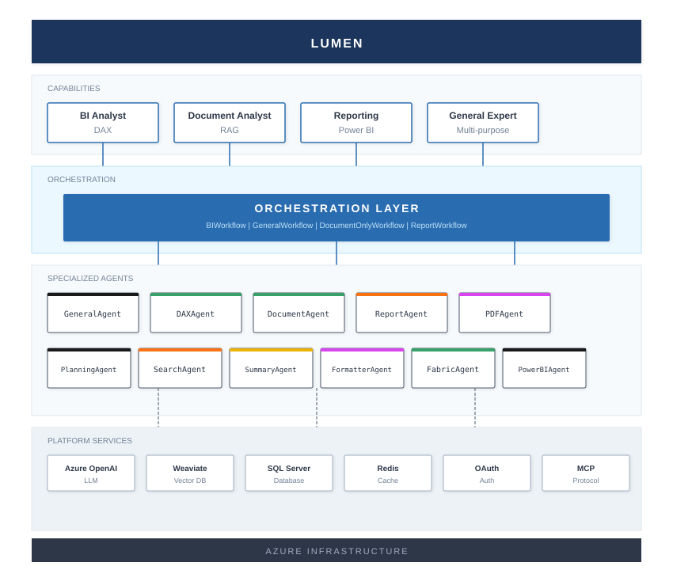
<br><em>Figure 18: LUMEN Architecture</em>
</p>

### Component Summary

| Component | Type | Function |
|-----------|------|----------|
| **BIWorkflow** | Workflow | Orchestrates complete BI queries |
| **GeneralWorkflow** | Workflow | Handles general queries |
| **QueryWorkflowSimple** | Workflow | Optimized DAX queries |
| **DocumentOnlyWorkflow** | Workflow | Documents-only mode |
| **ReportWorkflow** | Workflow | Report embedding |
| **GeneralAgent** | Agent | Main orchestrator, composes tools |
| **DAXAgent** | Agent | DAX queries via MCP |
| **DocumentAgent** | Agent | RAG over Weaviate |
| **ReportAgent** | Agent | OAuth + Embed API |
| **FabricAgent** | Agent | Fabric REST API |
| **PowerBIAgent** | Agent | PowerBI MCP |
| **PDFAgent** | Agent | Extraction with Docling |
| **PlanningAgent** | Agent | Task planning |
| **SearchAgent** | Agent | Semantic search |
| **SummaryAgent** | Agent | Context summaries |
| **FormatterAgent** | Agent | Output formatting |

---

## Transition to Technical Capabilities

*With the general architecture and specialized agents defined, the following sections detail each of the **ten technical capabilities** that constitute the complete implementation of Lumen. Each capability represents an empirically validated design pattern, from memory and context management (Capability 1) to structural plasticity via PEMA (Capability 10). These capabilities are independent but complementary—a system can implement a subset according to its specific requirements.*

---

# Capability 1: Memory and Context

## Theory

### Types of Memory in Agentic Systems

Memory is fundamental for agents to maintain coherence and learn from previous interactions. Research in agentic systems identifies four types of memory:

**Definition 3.1 (Agentic Memory System)**: An agentic memory system is a tuple M = (W, E, S, P, γ) where:
- W ⊆ Token*: Working Memory (token sequence of current context)
- E: T → Experience: Episodic Memory (function from timestamps to experiences)
- S: Concept → Fact*: Semantic Memory (mapping from concepts to facts)
- P: Task → Procedure: Procedural Memory (mapping from tasks to procedures)
- γ: M → M: Consolidation function that moves information between memory types

| Type | Description | Example | Formalization |
|------|-------------|---------|---------------|
| **Working Memory** | Immediate context of current conversation | Recent chat messages | W ⊆ Token*, |W| ≤ context_limit |
| **Episodic Memory** | Specific past experiences with timestamps | "User asked about Q3 sales yesterday" | E: T → Experience |
| **Semantic Memory** | Factual domain knowledge | "Company has 5 sales regions" | S: Concept → Fact* |
| **Procedural Memory** | How to execute learned tasks | "To calculate YTD, use TOTALYTD" | P: Task → Procedure |

**Proposition 3.1**: The effective capacity of an agentic system is limited by |W|, but can be extended indefinitely through E, S, and P if an efficient retrieval mechanism exists.

*Proof sketch*: Let C_eff be the system's effective capacity. Without external memory, C_eff ≤ |W| (limited by context window). With external memory M_ext = E ∪ S ∪ P and a retrieval function r: Query → M_ext with O(log n) or O(1) complexity via indices, the system can access arbitrarily sized information. At each step, W contains the relevant retrieved information, allowing reasoning over knowledge much larger than |W|. Therefore, C_eff → ∞ if |M_ext| → ∞ and r is efficient. ∎

> **Connection with PEMA**: Episodic memory E provides the history H that PEMA uses for Hebbian learning (Chapter 11). Specifically, E records which agents participated in each interaction and their results, allowing calculation of reinforcement δ(o) for updating trust weights W_ij. Without persistent memory, structural plasticity would be impossible—the system couldn't "remember" which collaborations were successful.

### The Limited Context Problem

LLMs have finite context windows (8K-128K tokens). As conversations grow, decisions must be made about what information to retain. Main techniques are:

**Sliding Window**: Keeps only the N most recent messages. Simple but loses important historical context.

**Summarization**: Summarizes old messages to compress information. Preserves topics but loses details.

**Observation Masking**: Hides tool outputs that have already been processed, keeping only relevant results.

**Hybrid Approach**: Combines multiple techniques according to content type.

<p align="center">
  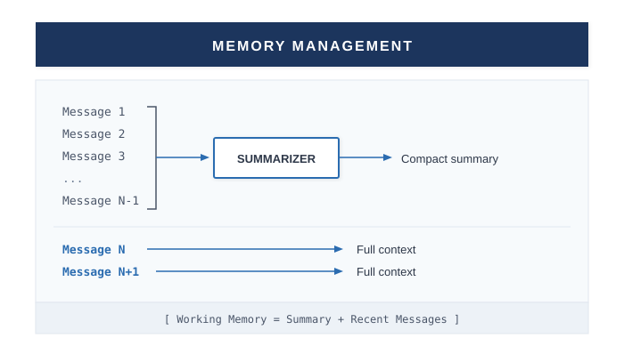
<br><em>Figure 19: Memory Management</em>
</p>

### Persisted Memory Pattern

An emerging pattern in multi-agent systems is **Persisted Memory**: agents store structured data (not just text) that other agents can reuse without re-querying sources.

For example, if an agent executes a DAX query and obtains results, these are persisted in a structured format. A subsequent visualization agent can read this data directly without executing the query again.

## Implementation in Lumen

### Persisted Memory Pattern

Lumen implements the Persisted Memory pattern through the `persisted_memory` attribute in BaseAgent. When DAXAgent executes a query:

1. Results are stored in `persisted_memory` as structured JSON
2. FormatterAgent reads this JSON to generate visualizations
3. Message history doesn't inflate with raw data

This pattern significantly reduces token usage because large tabular data is stored outside the main conversational flow.

### MessageStore for Persistence

Lumen uses Microsoft Agent Framework's MessageStore connected to SQL Server. Each session maintains its message history, allowing conversations to resume even after server restarts.

Each agent's `AgentThread` is linked to the user's `session_id`, guaranteeing isolation between different users' conversations.

### Working Memory via Conversation History

Working context is maintained via the `messages` table in SQL Server. Each message includes:
- Role (user/assistant)
- Content
- Timestamp
- Metadata (model used, tokens, etc.)

---

# Capability 2: Routing and Intent

## Theory

### The Routing Problem

In multi-agent systems, determining which agent should handle each message is critical. Incorrect routing leads to suboptimal responses or errors. Main strategies are:

### Rule-Based Routing

Uses explicit rules based on keywords or patterns:

```
IF message contains "DAX" OR "measure" → DAXAgent
IF message contains "report" OR "dashboard" → ReportAgent
ELSE → GeneralAgent
```

**Advantages**: Fast, predictable, no LLM cost
**Disadvantages**: Fragile to language variations, doesn't scale

### LLM-Based Routing

The LLM itself classifies the message intent and decides the agent:

```
System: Classify this message into one of the categories:
- QUERY_DAX: Data and metrics queries
- REPORT: Report requests
- DOCUMENT: Document questions
- GENERAL: General conversation

User: "How many sales were there in January?"
LLM: QUERY_DAX
```

**Advantages**: Flexible, handles natural variations
**Disadvantages**: Additional latency, token cost

### Semantic Routing

Uses embeddings to compare the message with descriptions of each agent:

<p align="center">
  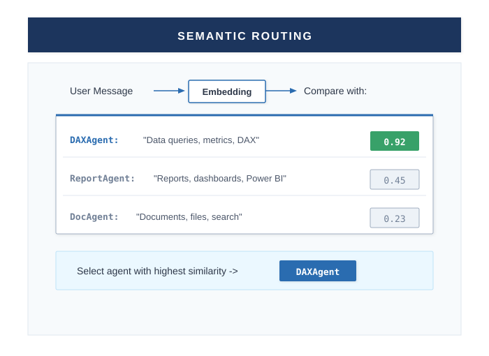
<br><em>Figure 20: Semantic Routing</em>
</p>

**Advantages**: Very fast (embeddings only), semantically robust
**Disadvantages**: Requires description tuning, can confuse similar intents

### Two-Layer Routing

Combines rule-based and LLM to optimize cost/accuracy:

1. **Layer 1 (Keywords)**: Fast rules for obvious cases
2. **Layer 2 (LLM)**: Classification for ambiguous cases

> **Connection with PEMA**: The routing strategies described use **static weights**. PEMA (Chapter 11) extends these approaches by allowing weights to evolve through Hebbian learning. For example, if DAXAgent consistently resolves type X queries better than those initially routed to GeneralAgent, the weight W_{DAX,X} would automatically increase. This transforms routing from manual configuration to a **self-optimizing** system.

## Implementation in Lumen

### Two-Layer Routing in BIWorkflow

Lumen implements two-layer routing in BIWorkflow:

**Layer 1 - Keyword Detection**: Analyzes the message looking for keywords that clearly indicate intent:
- "show the report", "dashboard" → ReportWorkflow
- "search in documents", "according to the file" → DocumentWorkflow
- Numbers, "how much", "sales", "DAX" → QueryWorkflow

**Layer 2 - LLM Classification**: If there's no keyword match, the LLM classifies between:
- `query`: Data queries
- `report`: Power BI reports
- `general`: Conversation/other

<p align="center">
  
<br><em>Figure 21: BIWorkflow Routing</em>
</p>

### Advantages of the Approach

- Keywords handle ~60% of cases without LLM cost
- LLM intervenes only in ambiguous cases
- Easy to add new keywords without changing logic
- Safe fallback to GeneralWorkflow

---

# Capability 3: RAG - Knowledge Retrieval

## Theory

### RAG Evolution

Retrieval-Augmented Generation (RAG) has evolved significantly since its introduction:

**Generation 1 - Basic Vector Search**: Query embedding, similarity search, chunk injection into prompt.

**Generation 2 - Hybrid Search**: Combines vector search with keyword search (BM25) for better precision.

**Generation 3 - Late Chunking**: Instead of pre-embedding chunking, embeds the complete document and extracts relevant context post-search.

**Generation 4 - GraphRAG**: Builds knowledge graphs from documents, enabling reasoning about entity relationships.

**Generation 5 - Agentic RAG**: The agent dynamically decides which documents to search, when it needs more context, and can make multiple iterative queries.

<p align="center">
  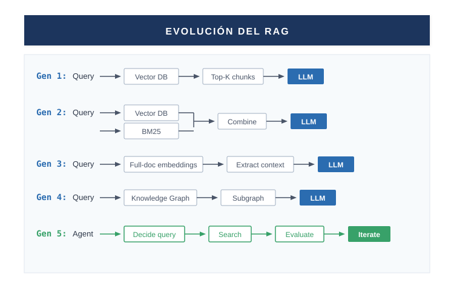
<br><em>Figure 22: RAG Evolution</em>
</p>

### Chunking Strategies

How documents are divided into chunks directly affects RAG quality:

| Strategy | Description | Best for |
|----------|-------------|----------|
| Fixed Size | N-token chunks | Homogeneous documents |
| Semantic | By paragraphs/sections | Structured documents |
| Sentence Window | Sentence + surrounding context | High precision |
| Hierarchical | Nested chunks (document > section > paragraph) | Long documents |

## Implementation in Lumen

### Hybrid Search in Weaviate

Lumen uses Weaviate as vector database with hybrid search:

1. **Vector Search**: Embeddings generated with Azure OpenAI (text-embedding-3-small)
2. **Keyword Search**: Native BM25 from Weaviate
3. **Fusion**: Fusion algorithm weights both results

### Speculative Gap RAG (SG-RAG)

**Design contribution**: Traditional RAG only retrieves what exists. SG-RAG detects what *should exist but doesn't*.

**Definition 3.1 (Gap Detection)**: Let Q be a query and C = {c₁, c₂, ..., cₙ} the chunk corpus. The system generates an "ideal chunk" c* that would perfectly answer Q. A gap is detected when:

$$\max_{c_i \in C} \text{similarity}(c^*, c_i) < \theta$$

**Mechanism**:

| Component | Function |
|-----------|----------|
| **Ideal Chunk Generation** | LLM generates description of perfect chunk for query |
| **Gap Detection** | If no real chunk exceeds threshold θ similarity → gap |
| **Gap Memory** | Persists: (query, timestamp, user, suggested_section) |
| **Gap Analytics** | Prioritizes gaps by frequency × recency × importance |
| **Gap Resolution** | When indexing new document, checks if it covers existing gaps |

**Priority formula**:
```
gap_priority(G) = frequency(G) × recency(G) × user_importance(G)
```

**Connection with PEMA**: Extends plasticity to knowledge. The system not only learns which agents work better (inter-agent trust weights), but what knowledge it lacks (gap weights). Bidirectional plasticity: structure + content.

<p align="center">
  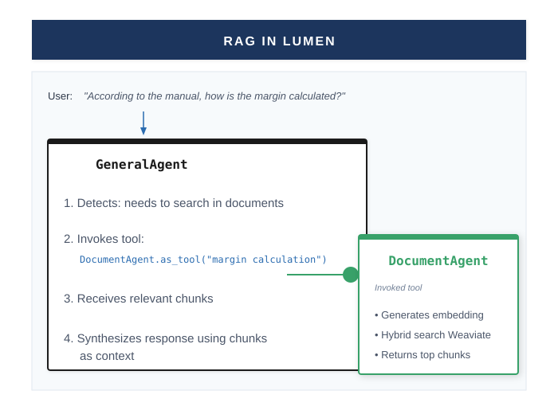
<br><em>Figure 23: RAG in LUMEN</em>
</p>

---

# Capability 4: Orchestration, Workflows and Agent Composition

## Theory

Workflow patterns (Sequential, Parallel, Hierarchical, Router, Reflexive) are described in **Section 2.2**. Here we detail how Lumen implements them.

### Agents as Building Blocks

In multi-agent systems, agents must be composable. A well-designed agent can:
- Execute tasks autonomously
- Be invoked as a tool by other agents
- Share memory/context when necessary
- Scale independently

### Tool System

**Tools** are the extensibility mechanism provided by Microsoft Agent Framework. A tool is a function decorated with `@ai_function` (from `semantic_kernel.functions`) that extends agent capabilities to execute actions in the real world.

**Definition 4.2 (Tool)**: A tool T is a function f: Args → String decorated with `@ai_function` that:
- Receives typed parameters with semantic descriptions
- Returns a string interpretable by the LLM
- Includes a docstring describing when and how to use it

<p align="center">
  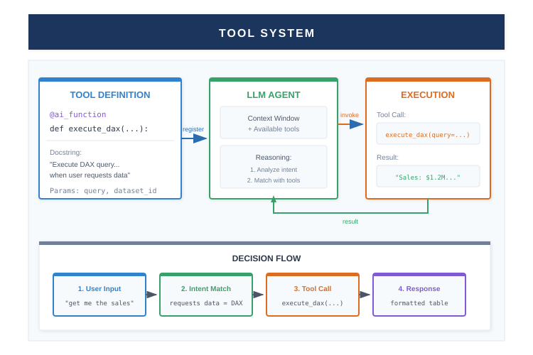
<br><em>Figure 23b: Tool System - Definition, registration, and decision flow</em>
</p>

### Agent-as-Tool Pattern

Native pattern from Microsoft Agent Framework. **Agent-as-Tool** allows an agent to expose its capabilities as a tool that other agents can invoke.

<p align="center">
  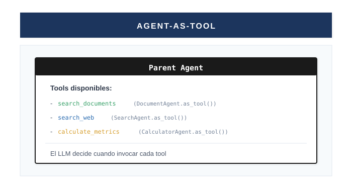
<br><em>Figure 24: Agent as Tool Pattern</em>
</p>

**Advantages**:
- LLM reasons about when to use each agent
- Flexible composition without hardcoding dependencies
- Same agent can serve multiple contexts

### Handoff Pattern

The Handoff pattern allows an agent to **completely** transfer control to another agent when it detects that the task exceeds its expertise or requires specialized capabilities.

**Definition 4.3 (Handoff)**: A handoff H from agent A_i to agent A_j is a tuple H = (trigger, target, context, query) where:
- **trigger**: Condition that triggers the transfer (e.g., "requires DAX execution")
- **target**: Target agent with required expertise
- **context**: State and metadata transferred (session_id, thread, history)
- **query**: Original user input preserved

<p align="center">
  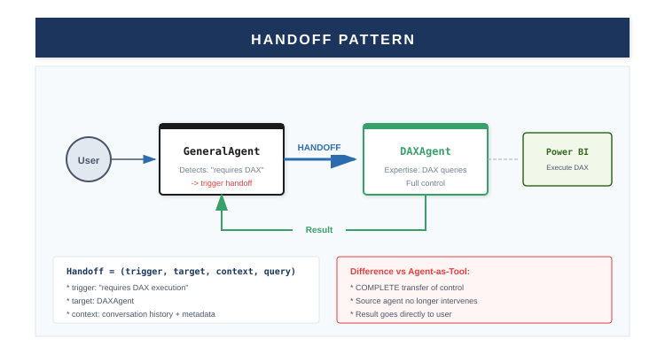
<br><em>Figure 25: Handoff Pattern - Complete Transfer of Control</em>
</p>

#### Types of Handoff

| Type | Description | Example |
|------|-------------|---------|
| **Expertise-based** | Current agent lacks specialized knowledge | GeneralAgent -> DAXAgent for data queries |
| **Capability-based** | Required tools not available | PowerBIAgent -> FabricAgent for workspace APIs |
| **Context-based** | Context indicates another domain | DocumentAgent -> SearchAgent when no documents |
| **Planning-based** | Multi-step query requires orchestration | FabricAgent -> PlanningAgent for "execute sales on Contoso" |

#### Detection Mechanism

Handoff is triggered through two complementary mechanisms:

1. **Proactive detection by workflow**: The workflow evaluates if the current message requires an agent change based on domain keywords. If the user was with DocumentAgent but asks about "dollar price", a handoff to SearchAgent is detected.

2. **Explicit request by agent**: When an agent internally detects it cannot complete the task (e.g., FabricAgent receives "execute Q3 sales" but has no dataset_id), it requests handoff to PlanningAgent which can orchestrate the complete sequence.

#### Context Preservation

During handoff the following are preserved:
- **Conversation thread**: Target agent continues in the same multi-turn thread
- **Session metadata**: user_id, session_id, available tokens
- **Original query**: User input unmodified
- **Handoff reason**: For logging and debugging

#### Flow Example

```
User: "Execute 2024 sales on the Contoso model"
         |
FabricAgent: Detects execution verb + model name (no ID)
         |
         v
     [HANDOFF to PlanningAgent]
         |
PlanningAgent: Creates step plan
         |
     [Execute each step via tools]
         |
         v
     [Result to user]
```

### Agent Hierarchy

Agents can be organized hierarchically:
- **Base Agent**: Common functionality (logging, streaming, tools)
- **Specialized Agents**: Inherit from base, add specific capabilities
- **Composite Agents**: Compose multiple specialized agents

## Implementation in Lumen

### Router Pattern: BIWorkflow

Lumen's main entry point is BIWorkflow, implementing the Router pattern:

1. Receives user message
2. Classifies intent (keywords + LLM)
3. Delegates to specialized sub-workflow
4. Streams response to frontend

Available sub-workflows:
- **QueryWorkflowSimple**: DAX queries
- **ReportWorkflow**: Report embedding
- **GeneralWorkflow**: General conversation with RAG
- **DocumentOnlyWorkflow**: Strict documents-only mode

### Sequential Pattern: QueryWorkflowSimple

For DAX queries, Lumen uses a sequential pipeline:

<p align="center">
  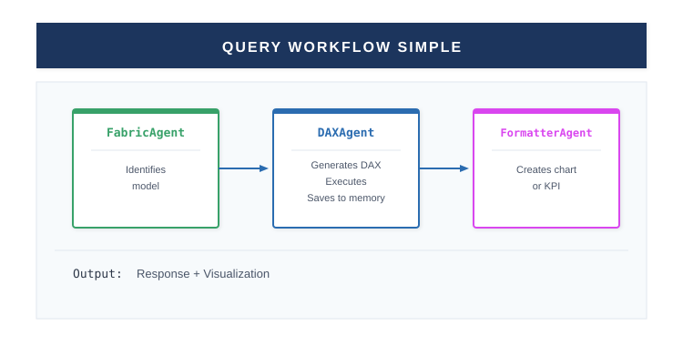
<br><em>Figure 25: Query Workflow Simple</em>
</p>

Each agent in the pipeline:
1. **FabricAgent**: Identifies appropriate semantic model
2. **DAXAgent**: Generates and executes DAX query
3. **FormatterAgent**: Converts results to visualization

### Agent Hierarchy

<p align="center">
  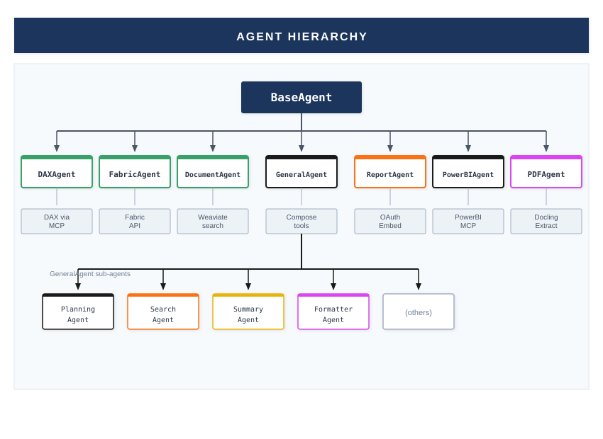
<br><em>Figure 26: Agent Hierarchy</em>
</p>

### Specialized Agents

| Agent | Specialization | Own Tools |
|-------|----------------|-----------|
| **DAXAgent** | DAX queries | execute_dax (MCP), validate_dax |
| **FabricAgent** | Fabric API | list_workspaces, get_model_info |
| **DocumentAgent** | RAG | search_chunks (Weaviate) |
| **ReportAgent** | Power BI Embed | get_embed_token |
| **FormatterAgent** | Visualization | (generates JSON blocks) |
| **SearchAgent** | Web search | serper_search |
| **SummaryAgent** | Summarization | (internal map-reduce) |
| **PowerBIAgent** | DAX Modeling | (best practices expert) |

## Agent Development Guide

This section provides a conceptual guide for developing new agents in LLM-based multi-agent systems.

### Agent Anatomy

All agents inherit from `ChatCompletionAgent` (Microsoft Agent Framework). BaseAgent extends this class providing:

- Azure OpenAI integration (Fast and Response pools)
- Tool management
- Response streaming (SSE)
- MCP integration (Model Context Protocol)
- Memory persistence

<p align="center">
  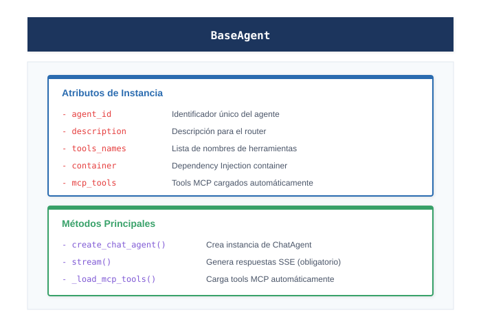
<br><em>Figure 27: BaseAgent Class Structure</em>
</p>

#### AgentContext

The context received by each agent contains all session information:

| Field | Description |
|-------|-------------|
| **session_id** | Unique session identifier |
| **user_id** | Authenticated user identifier |
| **conversation_history** | History of previous messages |
| **metadata** | Additional data (has_documents, reasoning_enabled, image_data) |
| **thread** | Agent Framework thread for handoffs between agents |

### Agent Creation Process

Developing a new agent follows four fundamental steps:

**Step 1: Define the Class** - Create a file extending BaseAgent. Configure: agent_id, description, tools, instructions.

**Step 2: Implement stream()** - The `stream()` method is the agent's core: receives context, configures thread_id, creates ChatAgent, iterates over LLM response, handles errors.

**Step 3: Register in Container** - The agent must be registered in the Container for Dependency Injection.

**Step 4: Configure Routing** - If the agent should be selected automatically, add keywords in router_service.

### Tool System

Tools extend agent capabilities by allowing them to execute concrete actions.

| Aspect | Description |
|--------|-------------|
| **Decorator** | Uses `@ai_function` from Agent Framework |
| **Typed parameters** | Uses `Annotated` with `Field` for descriptions |
| **String return** | Always returns text the LLM can interpret |
| **Docstring** | Describes the function so the LLM knows when to use it |

Tools can access system services (Database, Embedding, Weaviate, OAuth) through the container. They must be synchronous; for async operations use `asyncio.run()`.

### Advanced Agent Patterns

#### Dual-Model Pattern

| Pool | Model | Usage |
|------|-------|-------|
| **Fast** | gpt-4-turbo | Quick responses, routing, internal calls |
| **Response** | gpt-5 | Final responses, extended reasoning, long context |

The agent dynamically decides which pool to use based on context size (>50K chars → Response), task type, and `reasoning_enabled` flag.

#### Persisted Memory Pattern

| Type | Storage | Duration |
|------|---------|----------|
| **Working Memory** | `AgentThread` (MS Agent Framework) | Session |
| **Persisted Memory** | `persisted_memory` field → Database | Permanent |
| **Semantic Memory** | Weaviate (embeddings) | Permanent |
| **Structural Memory** | W_ij trust matrix (PEMA) | Adaptive |

#### MCP Integration

Model Context Protocol enables connecting external tool servers:

<p align="center">
  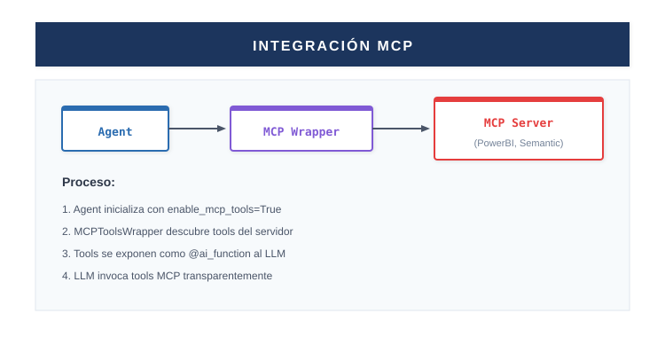
<br><em>Figure 28: MCP Integration</em>
</p>

### Agent Categories

<p align="center">
  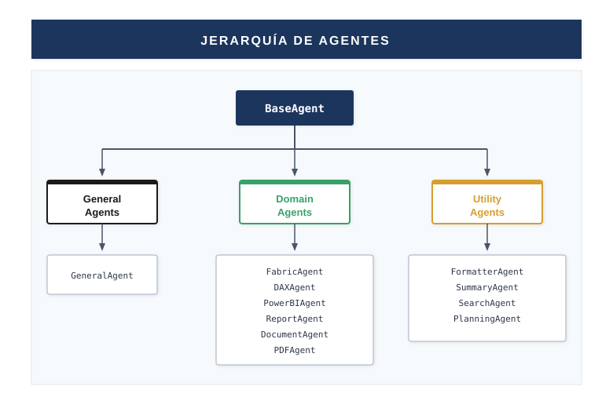
<br><em>Figure 29: Agent Category Hierarchy</em>
</p>

| Category | Purpose | Examples |
|----------|---------|----------|
| **General** | General conversation, fallback | GeneralAgent |
| **Domain** | Specialized in BI areas | FabricAgent, DAXAgent, DocumentAgent |
| **Utility** | Cross-cutting support functions | FormatterAgent, SummaryAgent, SearchAgent |

### Best Practices for Agent Development

| Area | Practice | Description |
|------|----------|-------------|
| **Design** | Single Responsibility | One agent, one domain |
| **Design** | Clear instructions | Specific system prompt |
| **Design** | Atomic tools | Each tool does one thing well |
| **Performance** | Lazy loading | Initialize resources only when needed |
| **Performance** | Limit tools | Maximum 5-7 tools per agent |
| **Security** | Validate inputs | Never trust user data |
| **Security** | SQL parameters | Never concatenate strings |
| **Testing** | Unit tests | Test tools with mocks |
| **Testing** | Stream tests | Verify correct chunks |

### Future Work

| Aspect | Current State | Future Direction |
|--------|---------------|------------------|
| Workflows | Sequential, Router, Handoffs | Reflection loops, auto-correction |
| Composition | Static Agent-as-Tool | Dynamic Agent Discovery |
| Handoffs | Based on expertise/capability | Predictive handoffs with enriched context |
| Intents | Keyword + LLM detection | Multi-turn intent with goal memory |
| Planning | Implicit in prompts | Explicit multi-step planning |

**Open research questions**:
- How does orchestration (workflows + handoffs + intents) scale to hundreds of agents?
- What heuristics optimize the decision between handoff vs. tool call?

*Orchestrated agents need access to real-world data to be useful. The next capability describes how Lumen connects its agents to enterprise data sources through standardized protocols like MCP and OAuth.*

---

# Capability 5: Data Source Integration

## Theory

### Tool Calling in LLMs

Modern LLMs support **tool calling** (function calling): the model can decide to invoke external functions and use their results.

```
User: "What's the price of AAPL?"

LLM reasons: I need real-time market data
LLM output: {
  "tool": "get_stock_price",
  "arguments": {"symbol": "AAPL"}
}

System: Executes tool → $150.25

LLM: "The current price of AAPL is $150.25"
```

### Model Context Protocol (MCP)

MCP is an emerging standard for connecting LLMs with data sources:

- **MCP Servers**: Expose data/functionality via standard protocol
- **MCP Clients**: LLMs/agents that consume these servers
- **Transport**: stdio, HTTP, WebSocket

**MCP Advantages**:
- Reusable integrations across applications
- Clear separation between business logic and LLM
- Growing ecosystem of pre-built servers

### OAuth for Enterprise APIs

Accessing enterprise APIs (Power BI, Fabric, SharePoint) requires OAuth 2.0 authentication:

1. User initiates authentication flow
2. System obtains access tokens
3. Tokens used for API calls
4. Refresh tokens maintain active session

## Implementation in Lumen

### MCP for Power BI / Fabric

Lumen uses a specialized MCP server for Power BI operations:

**Tools available via MCP**:
- `execute_dax`: Executes DAX queries against semantic models
- `validate_dax`: Validates DAX syntax without execution
- `list_tables`: Lists tables in a model
- `list_measures`: Lists available measures
- `get_model_info`: Model metadata

The MCP server connects via Fabric's XMLA endpoint, enabling operations not available through REST API.

### FabricAgent for REST API

Operations using Fabric REST API:
- List user workspaces
- Get datasets/reports
- Model metadata
- Permissions and capabilities

FabricAgent abstracts these operations, handling pagination, rate limiting, and errors.

### Multi-Tenant OAuth

Lumen implements complete OAuth flow with Microsoft:

<p align="center">
  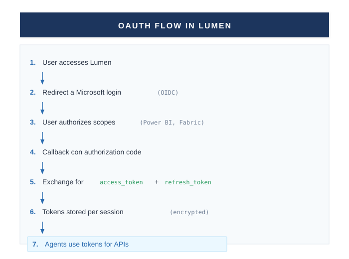
<br><em>Figure 30: OAuth Flow in LUMEN</em>
</p>

### Dimension Value Indexing

Unique Lumen capability: indexing dimension values from Power BI models:

1. User selects model
2. Background job extracts dimension column values
3. Values indexed in Weaviate with embeddings
4. Queries like "sales for customer Acme" automatically map to DAX filters

This enables natural language over filters without users knowing exact values.

### Future Work

| Aspect | Current State | Future Direction |
|--------|---------------|------------------|
| Protocols | MCP, OAuth, Fabric API | More MCP servers (Slack, Teams, SAP) |
| Authentication | Per user | Service principals for automation |
| Catalog | Manual | Automatic source discovery |

*Data obtained from enterprise sources must be presented to users comprehensibly. The next capability addresses how to transform query results into interactive visualizations and structured outputs.*

---

# Capability 6: Visualization and Output

## Theory

### Structured Output in LLMs

LLMs can generate structured output (JSON, XML) in addition to free text. This enables:
- Reliable response parsing
- Direct UI integration
- Schema validation

### Custom Blocks

A common pattern is defining special "blocks" that the LLM generates and the frontend renders:

````
LLM Output:
"Q3 sales were $1.2M, a 15% increase.

```chart-data
{
  "type": "bar",
  "title": "Sales by Quarter",
  "data": [...]
}
```
"

Frontend:
- Parses special blocks
- Renders chart where appropriate
- Displays normal text as markdown
````

### Streaming and Rendering

With streaming, the frontend receives incremental chunks. Rendering must:
- Accumulate text until blocks are complete
- Render blocks only when complete
- Handle intermediate states gracefully

## Implementation in Lumen

### Block Types

Lumen defines three types of special blocks:

**chart-data**: Interactive charts
- Types: bar, line, pie, area
- Data in standardized format
- Rendered with Recharts

**kpi-data**: Key performance indicators
- Main value with formatting
- Comparison with previous period
- Trend (up/down/neutral)

**embed-report**: Embedded Power BI reports
- Report and page ID
- Filters to apply
- Embed token

### FormatterAgent

FormatterAgent is responsible for generating visualizations:

1. Receives data from DAXAgent (via persisted_memory)
2. Analyzes data structure
3. Decides appropriate visualization type
4. Generates corresponding JSON block

Selection heuristics:
- One dimension + one metric → Bar chart
- Time series → Line chart
- Proportion of a total → Pie chart
- Single important value → KPI

### Streaming Prevention for Embeds

Embedded reports require tokens that can expire. Lumen implements:
- embed-report block not rendered during streaming
- Only when message is complete, frontend requests fresh token
- Token obtained just before rendering

### Frontend Rendering

The frontend parses message content looking for blocks:

<p align="center">
  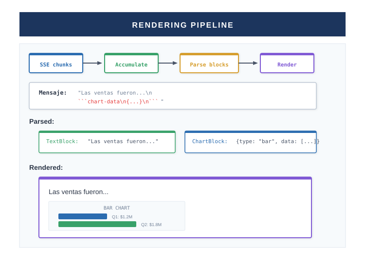
<br><em>Figure 31: Rendering Pipeline</em>
</p>

### Future Work

| Aspect | Current State | Future Direction |
|--------|---------------|------------------|
| Interactivity | Static blocks | Interactive visualizations (drill-down, filters) |
| Generation | Type selection | Auto-selection based on data |
| Multimodal | Text/charts only | Narrative generation with audio |

*A system that accesses enterprise data and visualizes it must ensure that only authorized users access appropriate information. The next capability details security mechanisms, from OAuth authentication to hallucination prevention.*

---

# Capability 7: Security

## Theory

### OAuth 2.0 and OpenID Connect

OAuth 2.0 is the standard for delegated authorization. OpenID Connect (OIDC) adds an identity layer over OAuth.

**Authorization Code Flow** (used for web apps):
1. Redirect to authorization server
2. User authenticates and authorizes
3. Server returns authorization code
4. App exchanges code for tokens
5. Access token used for APIs

**Tokens**:
- **ID Token**: User identity (JWT)
- **Access Token**: Authorization for APIs
- **Refresh Token**: Obtain new access tokens

### JWT Validation

JWT tokens must be rigorously validated:
- **Signature**: Verify against issuer's public key
- **Issuer**: Must match expected issuer
- **Audience**: Must include your application
- **Expiration**: Token must not be expired
- **Nonce**: Prevents replay attacks (OIDC)

### Session Management

Web sessions require:
- **Session ID**: Unique identifier per user
- **Storage**: Server-side (DB) or client-side (JWT)
- **Expiration**: Inactivity timeout
- **Isolation**: Users cannot access others' data

### Principle of Least Privilege

Each component should have only necessary permissions:
- Agents only access data they need
- Tokens have minimum required scopes
- Queries filtered by tenant/user

## Implementation in Lumen

### OIDCService

Lumen implements complete OIDC flow with Microsoft:

**Initiate authentication**:
- Generates unique state and nonce
- Constructs authorization URL with required scopes
- Redirect to Microsoft login

**Callback**:
- Validates state against stored value
- Exchanges code for tokens
- Validates ID token (signature, issuer, audience, nonce)
- Stores tokens associated with session

**Requested scopes**:
- openid, profile, email (basic OIDC)
- https://analysis.windows.net/powerbi/api/.default (Power BI)

### Token Storage

Tokens are stored in SQL Server associated with session_id:
- Access tokens encrypted at-rest
- Refresh tokens separated and protected
- Expiration tracked for proactive refresh

### Session Isolation

Each request includes session cookie:
- Middleware extracts session_id
- Context includes session for all handlers
- Database queries filtered by session
- Agents receive context with session_id

<p align="center">
  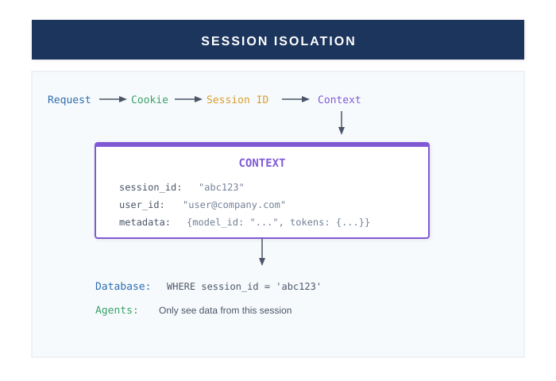
<br><em>Figure 32: Session Isolation</em>
</p>

### Input Validation

All user inputs are validated:
- File uploads: MIME type, maximum size, extension
- Queries: parameter sanitization
- Messages: maximum length, allowed characters

### HallucinationGuard: Anti-Hallucination Pattern

Microsoft Agent Framework provides **Guardrails** with groundedness detection. Lumen extends this concept with HallucinationGuard specialized for BI. LLMs can generate plausible but incorrect information—especially GUIDs and names that don't exist in actual data.

**Definition 7.1 (Grounded Value)**: A value v in a response R is *grounded* if and only if v appears in some output O_i from tools executed during R's generation:

```
grounded(v, R) ⟺ ∃ O_i ∈ ToolOutputs(R) : v ∈ extract(O_i)
```

**Definition 7.2 (Valid Response)**: A response R is valid regarding hallucinations if all its critical values (GUIDs, IDs, specific names) are grounded:

```
valid(R) ⟺ ∀ v ∈ critical_values(R) : grounded(v, R)
```

#### HallucinationGuard Architecture

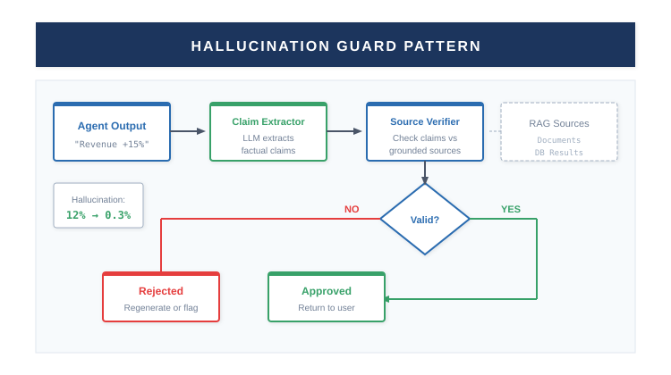
*Figure C7: HallucinationGuard Pattern - validates agent outputs against grounded sources, reducing hallucinations from 12% to 0.3%*

The pattern implements three complementary techniques:

**1. Tool Output Capture**: During agent execution, each tool output is recorded as "source of truth". Critical values (GUIDs, IDs, quoted strings) are automatically extracted and stored in a set of grounded values.

**2. Post-Response Validation**: Once the final response is generated, the same value types are extracted and verified against the grounded set. Ungrounded GUIDs are always critical violations; other values can be configured by mode (strict vs. permissive).

**3. Re-prompting with Explicit Grounding**: If violations are detected, the system re-executes the query injecting valid data directly into the prompt with explicit instructions to use only those values.

#### Extraction Patterns

The guard identifies hallucination-prone values through patterns:

| Value Type | Description | Example |
|------------|-------------|---------|
| **GUID** | 128-bit unique identifiers | `a1b2c3d4-e5f6-7890-abcd-ef1234567890` |
| **ID Field** | Fields named "id", "ID", etc. | `"dataset_id": "sales_2024"` |
| **Quoted String** | Strings in quotes (3-50 chars) | `"Sales Q3 2024"` |
| **Backtick Value** | Technical values in backticks | `` `DimCustomer` ``, `` `FactSales` `` |

#### Operation Modes

| Mode | Behavior | Recommended Use |
|------|----------|-----------------|
| **Permissive** | Only GUIDs are violations | General responses, explanations |
| **Strict** | Any ungrounded value is violation | DAX queries, object references |

#### Validation Wrapper

The system allows wrapping any agent with automatic validation. The wrapper:
1. Intercepts agent execution
2. Captures all tool outputs
3. Validates final response
4. Optionally retries with explicit grounding if violations occur

#### Validation Metrics

| Metric | Formula | Interpretation |
|--------|---------|----------------|
| **Confidence Score** | 1.0 - (ungrounded / total_values) | 1.0 = all values verified |
| **Violation Count** | Number of ungrounded critical values | 0 = valid response |
| **Grounding Rate** | grounded_values / total_values | Traceability percentage |

This pattern is especially critical for:
- **DAXAgent**: Validate that referenced tables/columns exist in the model
- **FabricAgent**: Verify that workspace_id and dataset_id are real
- **ReportAgent**: Confirm that report_id corresponds to an existing report

### Future Work

| Aspect | Current State | Future Direction |
|--------|---------------|------------------|
| Authorization | Session isolation | Row-Level Security (RLS) per dataset |
| Auditing | Basic logs | Complete audit logging with retention |
| Guardrails | HallucinationGuard | Content and PII guardrails |

*With security established, the next challenge is serving multiple concurrent users without degrading performance. The next capability presents scalability strategies, from connection pooling to distributed processing with Ray.*

---

# Capability 8: Scalability

## Theory

### Connection Pooling

Creating connections is expensive. Pooling maintains reusable connections:

<p align="center">
  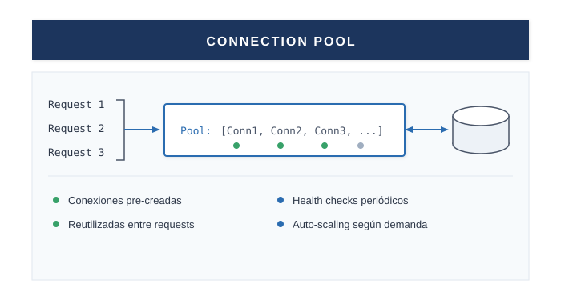
<br><em>Figure 33: Connection Pool</em>
</p>

### Task Queues

For long operations, use queues:
- Request enqueues task
- Worker processes async
- Client queries status / receives notification

**Redis Streams** is a popular option:
- Time-ordered
- Consumer groups for scaling
- Acknowledgment for exactly-once

### Horizontal Scaling

Scale by adding more instances:
- Load balancer distributes traffic
- State in shared storage (DB, Redis)
- Each instance is stateless

## Implementation in Lumen

### Connection Pool Manager

Lumen implements pooling for multiple services:

**Azure OpenAI**:
- Client pool per deployment
- Round-robin between deployments for load distribution
- Retry with exponential backoff on rate limits

**SQL Server**:
- Connection pool via SQLAlchemy
- Configurable size per environment
- Automatic health checks

**Weaviate**:
- Singleton client with connection reuse
- Batch operations for massive uploads

### Redis Streams for Background Jobs

Long operations like document processing use Redis Streams:

**Flow**:
1. API receives document, enqueues in stream
2. Worker reads from stream, processes document
3. Progress updates via Redis pub/sub
4. Result saved in DB, notification to frontend

**Consumer Groups**:
- Multiple workers can process in parallel
- Each message assigned to a single worker
- Pending messages reassigned if worker fails

### Heartbeat Mechanism

Background workers implement heartbeat:
- Worker sends heartbeat every N seconds
- If heartbeat missing, job considered failed
- Allows detecting downed workers and reassigning work

<p align="center">
  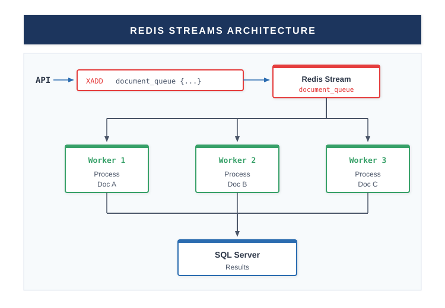
<br><em>Figure 34: Redis Streams Architecture</em>
</p>

### Technical Scaling Architecture: Kubernetes + Ray

Lumen uses Azure Kubernetes Service (AKS) with Ray for distributed document processing:

<p align="center">
  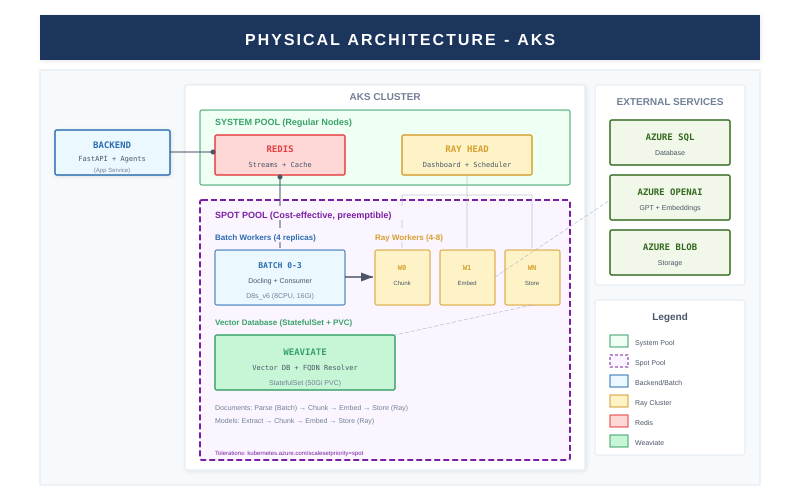
<br><em>Figure 35: Physical AKS Architecture</em>
</p>

**Key components**:

| Component | Function | Scaling |
|-----------|----------|---------|
| **Backend Pod** | FastAPI API, LLM agents, SSE streaming | Horizontal (2-5 replicas) |
| **Batch Pod** | Consumes Redis tasks, coordinates Ray | Single instance |
| **Ray Head** | Scheduler, dashboard, coordination | Single instance |
| **Ray Workers** | Parallel document processing | Autoscaling (1-10) |

**Document processing flow**:
1. User uploads document → Backend enqueues in Redis Streams
2. Batch Pod consumes task → Sends to Ray Head
3. Ray distributes work among Workers (parsing, chunking, embedding)
4. Results saved in Weaviate and SQL
5. Notification to frontend via Redis pub/sub

**Performance metrics**:

| Metric | Value | Conditions |
|--------|-------|------------|
| **Embeddings of 1200 pages** | ~400 seconds | Distributed processing with Ray |
| **Simultaneous documents** | 10+ concurrent | Due to horizontal worker scalability |
| **Chunk throughput** | ~3 pages/second | With active autoscaling |

This architecture enables processing **multiple documents in parallel** leveraging:
- **Ray Workers**: Each worker processes chunks independently
- **Autoscaling**: Kubernetes scales workers according to load (1-10 pods)
- **Parallel pipeline**: Parsing, chunking and embedding execute concurrently

### App Service Scaling

Lumen's backend runs on Azure App Service:
- Manual or automatic scale out
- Sticky sessions for consistency
- Deployment slots for zero-downtime updates

### Future Work

| Aspect | Current State | Future Direction |
|--------|---------------|------------------|
| Infrastructure | App Service + AKS | Full Kubernetes with service mesh |
| Cache | Basic Redis | Distributed cache with invalidation |
| Processing | Local Ray | Serverless Ray cluster |

*A scalable system requires visibility into its production behavior. The next capability describes observability mechanisms: logs, metrics, and token tracking that enable monitoring and diagnosing the system.*

---

# Capability 9: Observability

## Theory

### Pillars of Observability

Observability has three pillars:

**Logs**: Record of discrete events
- Structured (JSON) vs unstructured
- Levels: DEBUG, INFO, WARNING, ERROR
- Context: request ID, user ID, timestamp

**Metrics**: Aggregated numerical measurements
- Counters: cumulative values (total requests)
- Gauges: point-in-time values (active connections)
- Histograms: value distribution (latency)

**Traces**: Flow of a request through the system
- Spans represent operations
- Parent-child for relationships
- Distributed tracing between services

### Observability in LLM Systems

LLM systems require additional metrics:
- **Token usage**: Input/output tokens per request
- **Latency per stage**: Time in each agent/tool
- **Tool invocations**: Which tools are used and how frequently
- **Error rates**: LLM, tool, parsing failures

## Implementation in Lumen

### Structured Logging

Lumen uses structured logging with rich context:
- Each request has unique request_id
- Session_id included in all logs
- Agent/workflow name for filtering
- Timestamps in UTC

Log levels:
- DEBUG: Execution details (development only)
- INFO: Normal events (request start/end)
- WARNING: Recoverable anomalous situations
- ERROR: Failures requiring attention

### TokenTrackingMiddleware

Specialized middleware for LLM token tracking:

Captures per request:
- Model used
- Input tokens
- Output tokens
- Estimated cost

Available aggregations:
- By user/session
- By agent
- By time period

### ToolLoggingMiddleware

Automatic logging of tool invocations:
- Tool name
- Arguments (sanitized)
- Execution time
- Result (success/error)

Enables analysis of:
- Most used tools
- Tools with most errors
- Latency per tool

<p align="center">
  
<br><em>Figure 36: Observability Stack</em>
</p>

### Agent-Aware Observability

Lumen implements **agent-aware observability**, extending traditional monitoring with agentic-specific telemetry:

1. **Agent Decision Traces**: Complete reasoning chains from query to response, including tool invocations, handoffs, and intermediate states—enabling root-cause analysis of agent behavior

2. **Semantic Metrics**: Beyond latency/throughput, we track task success rate, hallucination incidents, gap detections, and routing accuracy per agent type

3. **Token Economics**: Real-time tracking of token consumption per agent, model tier usage (GPT-5.2 vs GPT-5.2 nano), and cost attribution by conversation thread

4. **Correlation Context**: Every request carries a `conversation_id` propagated across all agents, tools, and async workers—enabling end-to-end trace reconstruction

Implementation combines two complementary approaches:
- **Real-time monitoring**: Redis Streams for live log aggregation, enabling operators to tail agent execution across distributed workers through a custom viewer (`logmon`)
- **Historical analysis**: All interactions persisted to SQL database with full conversation context, enabling behavioral analysis, pattern detection, and continuous improvement of routing decisions

### Session Metrics

Per session tracking:
- Total messages
- Tokens consumed
- Documents processed
- Errors encountered

Available via endpoint `/sessions/current/statistics`.

### Future Work

| Aspect | Current State | Future Direction |
|--------|---------------|------------------|
| Tracing | Structured logs | Distributed tracing (OpenTelemetry) |
| Metrics | Token tracking | Real-time dashboards |
| Alerts | Manual | Automatic alerts for anomalies |

---

*The nine previous capabilities—from memory and routing to security and observability—constitute the infrastructure necessary for a functional multi-agent system. However, they all share a limitation: they operate on a static topology. The next capability, PEMA, represents the "closing of the circle": it uses observability to feed a learning mechanism that allows the system itself to evolve structurally based on accumulated experience.*

---

# Capability 10: Plasticity and Continuous Learning (PEMA)

This capability represents the **main theoretical contribution** of this work: extending the functional agency framework to incorporate **structural plasticity**, enabling multi-agent systems to dynamically adapt their relationships and behaviors based on accumulated experience.

## 10.1 Motivation: From Static Architectures to Adaptive Systems

The multi-agent systems described in previous chapters present a fundamental limitation: **relationships between agents are static**. Once the initial topology is defined (which agents can invoke which others), it remains fixed throughout system operation.

**Problem**: In dynamic environments, optimal routing preferences change:
- An initially reliable agent may degrade
- New query patterns may require different agent combinations
- Repeated errors on a route should reduce its future use

**Solution**: We introduce **PEMA (Plastic Evolving Multi-Agent)**, a theoretical framework that extends functional agency with structural plasticity inspired by neuroscientific principles.

<p align="center">
  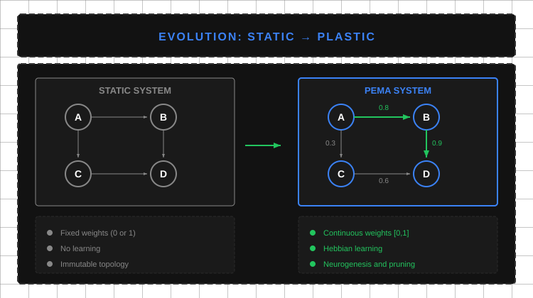
<br><em>Figure 45: Evolution from Static to Plastic Architectures</em>
</p>

## 10.2 PEMA Theoretical Framework

The concept of structural plasticity has deep roots in computational neuroscience. Beyond the classical Hebbian principle (Hebb, 1949), recent works have formalized plasticity mechanisms in artificial networks:

- **Elastic Weight Consolidation** (Kirkpatrick et al., 2017): Protects weights important for previous tasks, mitigating catastrophic forgetting through Fisher matrix-based regularization.
- **Synaptic Intelligence** (Zenke et al., 2017): Measures synapse importance online during training, enabling selective protection of critical connections.
- **Dynamic Sparse Training** (Mocanu et al., 2018): Enables connection growth and pruning during training, maintaining constant sparsity.

PEMA adapts these principles to the multi-agent context, where "synaptic weights" represent trust between agents rather than neural network parameters. This adaptation allows the system to evolve its coordination structure based on operational experience.

### 10.2.0 Differentiation from Related Work

PEMA explicitly differentiates from related approaches:

| Framework | Trust Mechanism | Topology | Prompt Adapt. | Learning |
|-----------|-----------------|----------|---------------|----------|
| **DyLAN** [Liu et al., 2024] | Importance Score | Per-domain | None | Optimization |
| **GTD** [Jiang et al., 2025] | None | Generated | None | Diffusion |
| **MetaGPT** [Hong et al., 2024] | None | Fixed | Post-project | Offline |
| **DRF** | UCB Reputation | Predefined | None | Bandit |
| **AutoGen** [Wu et al., 2023] | Per-conversation | Static | None | None |
| **PEMA** | **Hebbian** | **Evolved** | **Real-time** | **Continuous** |

**Key differentiators:**

- **vs. DyLAN**: DyLAN's importance scores are calculated per-domain, not accumulating collaboration history. PEMA implements "fire together, wire together"—trust strengthens with repeated successful collaboration.

- **vs. GTD**: Graph diffusion generates per-task topologies; PEMA *evolves* the topology through accumulated experience.

- **vs. MetaGPT**: Prompt modification occurs post-project; PEMA applies patches in *real-time* during execution.

- **vs. DRF**: UCB reputation is stateless between sessions; Hebbian weights persist and accumulate.

> **Novel Contribution**: PEMA is the first framework combining Hebbian trust dynamics, structural neurogenesis/pruning, and real-time prompt patching for LLM-based multi-agent systems.

### Formal Assumptions

The PEMA framework assumes the following conditions, which we consider reasonable in enterprise BI scenarios:

**A1** (Outcome Observability): The reinforcement function $\delta(o)$ is observable after each interaction. This requires explicit feedback mechanism (user rating) or implicit (re-query detection, abandonment).

**A2** (Local Stationarity): The query distribution $p(q)$ is locally stationary during adaptation periods. Abrupt distribution changes (e.g., organizational restructuring) require re-stabilization period with elevated learning rates.

**A3** (Agent Independence): Agent capabilities $\{a_j\}$ are independent of each other. One agent's specialization doesn't affect others' intrinsic capabilities (though it does affect selection via weights).

**A4** (Weight Boundedness): Trust weights $W_{ij} \in [0, 1]$ are bounded, avoiding divergence. This is guaranteed via softmax normalization or clipping.

Under these assumptions, we derive the theoretical guarantees presented in Section 11.3.

### 10.2.1 Extension of Functional Agency

We extend the agentic system definition (Definition 1.1) to include plasticity:

**Definition 11.1 (Plastic Agentic System)**. A plastic agentic system is a tuple:

$$A_P = (S, O, G, \pi, M, \alpha, \gamma, W, \eta)$$

where the first six elements are identical to Definition 1.1, and we add:
- $W: E \rightarrow [0,1]$: weight function over edges $E$ of the agent graph
- $\gamma: W \times H \times O \rightarrow W'$: **plasticity function** that updates weights based on history $H$ and outcomes $O$
- $\eta \in (0,1)$: learning rate

**Plasticity Condition (Condition 4)**. A system exhibits structural plasticity if:

$$\exists t_1, t_2: W_{t_1} \neq W_{t_2} \land \gamma(W_{t_1}, H_{[t_1,t_2]}, O_{[t_1,t_2]}) = W_{t_2}$$

That is, weights evolve as a function of accumulated experience.

### 10.2.2 Hebbian Learning for Agents

We apply the Hebbian principle ("neurons that fire together wire together") to the multi-agent context:

**Definition 11.2 (Hebbian Update Rule)**. Given an episode where agents $A_i$ and $A_j$ collaborated sequentially with outcome $o$:

<p align="center">
  
</p>

where:
- $\delta(o)$: reinforcement signal derived from outcome ($\delta > 0$ for success, $\delta < 0$ for failure)
- $c_{ij}$: contribution of edge $(i,j)$ to result (default 1.0, can be estimated with attribution)
- $\eta$: learning rate
- $\lambda \in (0,1)$: decay factor (gradual forgetting)

> [!TIP] **Intuition: Hebbian Rule**
> *"Neurons that fire together, wire together."*
>
> Applied to agents: if A→B collaborate and the outcome is successful (δ > 0), their connection strengthens.
> If they fail (δ < 0), trust decreases. This is reinforcement learning at the *connection* level, not individual agents.

**Proposition 11.1 (Hebbian Convergence)**. With decay $\lambda \in (0,1)$ and i.i.d. outcomes, weights converge to a stationary distribution:

<p align="center">
  
</p>

*Proof sketch*: The update with decay is $W^{(t+1)} = (1-\lambda)W^{(t)} + \eta\delta c$. At steady state, $W^* = (1-\lambda)W^* + \eta\mathbb{E}[\delta c]$, hence $W^* = \eta\mathbb{E}[\delta c]/\lambda$. ∎

> [!NOTE] **Intuition: Hebbian Convergence**
> Weights converge to a value proportional to the "average success" of collaboration ($\mathbb{E}[\delta \cdot c]$).
> - **Large η** → higher weights, faster adaptation
> - **Large λ** → stronger decay, lower equilibrium weights
> - If $\mathbb{E}[\delta] > 0$ (more successes than failures), weight grows; if $\mathbb{E}[\delta] < 0$, it decreases.

### 10.2.3 Types of Plasticity

PEMA defines three levels of plasticity with different granularity:

| Level | Type | Mechanism | Frequency | Impact |
|-------|------|-----------|-----------|--------|
| **L1** | Weights | Hebbian update of $W_{ij}$ | Each episode | Low |
| **L2** | Structure | Neurogenesis (create edges) / Pruning (remove edges) | Every N episodes | Medium |
| **L3** | Prompts | Learned patches to agent instructions | Per error pattern | High |

**L1 Plasticity (Weights)**:
```python
# Hebbian update pseudo-code
for (source, target) in episode_path:
    current_weight = trust_graph.get_weight(source, target)
    delta = compute_delta(outcome)  # +0.5 success, -0.3 failure
    # W^(t+1) = (1-λ)W^(t) + η·δ
    new_weight = (1 - decay) * current_weight + learning_rate * delta
    new_weight = clip(new_weight, min=0.01, max=1.0)
    trust_graph.set_weight(source, target, new_weight)
```

**L2 Plasticity (Structure)**:
- **Neurogenesis**: Create new edge when two never-connected agents collaborate successfully
- **Pruning**: Remove edge when $W_{ij} < \theta_{prune}$ for $N$ consecutive episodes

**L3 Plasticity (Prompts)**:
- Add learned context to agent instructions based on recurring error patterns

### 10.2.4 Trust Graph: Central Data Structure

The **Trust Graph** is the structure that stores and manages trust relationships:

<p align="center">
  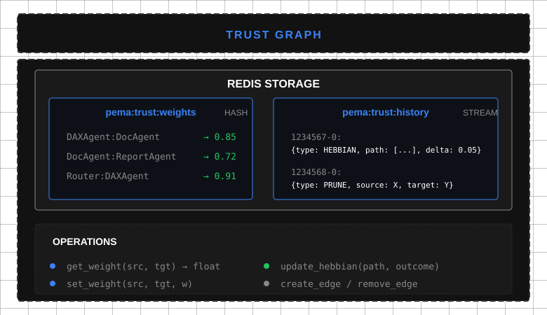
<br><em>Figure 46: PEMA Trust Graph</em>
</p>

### 10.2.5 Structural Memory: Indexing by Intent

A fundamental aspect of PEMA is that trust weights $W_{ij}$ are **indexed by the intent type** detected in each query. This allows the system to learn collaboration patterns specific to each task category.

**Definition 11.6 (Structural Memory)**. Structural memory is a function:

$$\mathcal{M}_S: I \times E \rightarrow [0,1]$$

where $I = \{$`QUERY_DAX`, `DOCUMENT`, `REPORT`, `GENERAL`$\}$ is the set of intents and $E$ is the set of edges between agents. Each intent $i \in I$ maintains its own weight matrix:

$$W^{(i)}_{jk} = \mathcal{M}_S(i, (j,k))$$

> [!NOTE] **Intuition: Memory by Intent**
>
> Imagine a company where the same employee excels at technical tasks but is mediocre at customer service.
> Structural memory **learns this separately**:
>
> ```
> DAXAgent for QUERY_DAX:    W = 0.92  (highly reliable)
> DAXAgent for DOCUMENT:     W = 0.12  (not their strength)
> ```
>
> The router learns to direct each query type to the most suitable agent.

**Rationale**: An agent may be highly reliable for one task type but less so for another. For example, `DAXAgent` may have $W^{(QUERY\_DAX)}_{Router \to DAX} = 0.92$ but $W^{(DOCUMENT)}_{Router \to DAX} = 0.12$. This specialization enables optimal context-based routing.

<p align="center">
  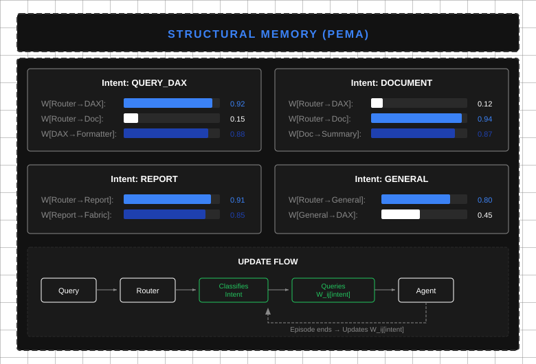
<br><em>Figure 47: PEMA Structural Memory</em>
</p>

**Hebbian Update Algorithm by Intent**:

```python
def update_structural_memory(intent: str, episode_path: List[Tuple], outcome: float):
    """Updates W_ij for the specific intent."""
    delta = compute_delta(outcome)  # +δ success, -δ failure

    for (source, target) in episode_path:
        key = f"pema:trust:{intent}:{source}:{target}"
        current_weight = redis.hget("pema:structural_memory", key) or 0.5

        # Hebbian update: W^(t+1) = (1-λ)W^(t) + η·δ
        new_weight = (1 - DECAY) * current_weight + LEARNING_RATE * delta
        new_weight = max(0.01, min(1.0, new_weight))

        redis.hset("pema:structural_memory", key, new_weight)
```

This intent-based indexing constitutes the system's **Structural Memory**—the fifth memory type (see Memory Types Table in Section 6.1). Unlike other memories that store semantic content, Structural Memory stores **learned collaboration patterns** between agents.

## 10.3 Theoretical Guarantees: Bounded Predictability

A plastic system must maintain **bounded predictability**—behavior variance must remain within controlled limits even while the system learns.

**Theorem 10.1 (Variance Bound with Plasticity)**. Let $A_P$ be a plastic system where each agent $a$ has a contract with maximum variance $\sigma^2_{max,a}$. Then:

<p align="center">
  
</p>

where $\epsilon_{\gamma}$ is the additional variance term introduced by plasticity, bounded by:

<p align="center">
  
</p>

*Proof sketch*: Total variance is the weighted sum of individual variances (by conditional agent independence given state). Plasticity introduces additional variance proportional to the square of learning rate and expected magnitude of deltas. Reducing $\eta$ reduces $\epsilon_{\gamma}$ at the cost of slower learning. ∎

> [!IMPORTANT] **Interpretation: Variance Bound**
>
> This theorem guarantees that system "unpredictability" is **bounded** by two components:
>
> | Component | Formula | Meaning |
> |-----------|---------|---------|
> | **Intrinsic variance** | $\sum W_a \cdot \sigma^2_a$ | Each agent contributes variance proportional to its weight |
> | **Learning variance** | $\epsilon_\gamma \propto \eta^2$ | Small if η is small |
>
> **Practical implication**: Using $\eta \approx 0.1$ keeps the system stable ($\epsilon_\gamma$ low) while allowing gradual adaptation.

**Corollary 11.1 (Stability Condition)**. The system is stable if:

<p align="center">
  
</p>

where $\epsilon_{max}$ is the maximum tolerable additional variance.

> [!WARNING] **Computing Maximum η**
>
> For a system with:
> - 10 edges ($|E| = 10$)
> - Reinforcement variance $\mathbb{E}[\delta^2] = 0.25$ (δ ∈ {-0.5, +0.5})
> - Tolerance $\epsilon_{max} = 0.05$
>
> Maximum learning rate is: $\eta_{max} = \sqrt{0.05 / (0.25 \times 10)} = \sqrt{0.02} \approx 0.14$
>
> **Recommendation**: Use $\eta = 0.1$ to leave a safety margin.

## 10.4 PEMA Evaluation Metrics (PEMA-Bench)

PEMA-Bench introduces **9 metrics** organized in three dimensions, addressing a significant gap in adaptive systems evaluation: no previous benchmark jointly measures adaptation + predictability + structure.

### 10.4.1 Adaptation Metrics

**Definition 11.3 (Adaptation Rate)**. Episodes required to recover baseline performance after stress:

<p align="center">
  
</p>

**Definition 11.2.1 (Plasticity Efficiency)**:

<p align="center">
  
</p>

**Definition 11.2.2 (Consolidation Stability)**:

<p align="center">
  
</p>

| Metric | Formula | Interpretation | Target |
|--------|---------|----------------|--------|
| **AR** (Adaptation Rate) | See Def. 11.2 | Lower = faster adaptation | AR < 20 eps |
| **PE** (Plasticity Efficiency) | See Def. 11.2.1 | Improvement per weighted mutation | PE > 0.5 |
| **CS** (Consolidation Stability) | See Def. 11.2.2 | CS→1: successful consolidation | CS > 0.7 |

*Note: Weights (1.0, 2.5, 1.5) reflect relative impact of weight, structure, and prompt mutations respectively.*

### 10.4.2 Predictability Metrics

**Definition 11.4 (Behavior Variance)**. Expected output variance within semantic clusters:

<p align="center">
  
</p>

where $C$ is an input clustering by semantic similarity (HDBSCAN, $\tau = 0.92$).

**Definition 11.4.1 (Contract Compliance)**:

<p align="center">
  
</p>

| Metric | Formula | Interpretation | Target |
|--------|---------|----------------|--------|
| **BV** (Behavior Variance) | See Def. 11.4 | Lower = more consistent | BV < 0.1 |
| **CC** (Contract Compliance) | See Def. 11.4.1 | % meeting contracts | CC > 95% |
| **VR** (Violation Rate) | Violations / Episode | Theoretical bounds exceeded | VR < 0.01 |

### 10.4.3 Structural Metrics

**Definition 11.5 (Topology Entropy)**. Normalized entropy of weight distribution:

<p align="center">
  
</p>

| Metric | Formula | Interpretation | Target |
|--------|---------|----------------|--------|
| **TE** (Topology Entropy) | See above | High = diverse distribution | 0.5 < TE < 0.9 |
| **PR** (Pruning Rate) | Prunes / Episode | Removal rate | Context-dep. |
| **NR** (Neurogenesis Rate) | Creations / Episode | Creation rate | Context-dep. |

## 10.5 PEMA Benchmark Protocol

The evaluation protocol consists of five phases:

<p align="center">
  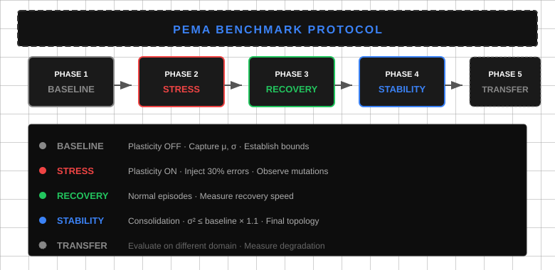
<br><em>Figure 48: PEMA Benchmark Protocol</em>
</p>

## 10.6 Implementation in Lumen (Case Study)

PEMA implementation in Lumen is **partially realized** for L1 Plasticity (weights), with L2 and L3 identified as future work.

### 10.6.1 Current State: Static Trust Weights

Currently, Lumen uses **statically configured** trust weights for routing:

```python
# Current configuration (static)
AGENT_TRUST_WEIGHTS = {
    ("Router", "DAXAgent"): 0.9,
    ("Router", "DocumentAgent"): 0.8,
    ("Router", "ReportAgent"): 0.7,
    ("DAXAgent", "FabricAgent"): 0.85,
}
```

### 10.6.2 Proposal: Evolution Toward PEMA

The proposed evolution introduces the dynamic Trust Graph:

```python
# PEMA proposal (dynamic)
class TrustGraph:
    def __init__(self, redis_client, learning_rate=0.1, decay=0.01):
        self.redis = redis_client
        self.eta = learning_rate
        self.decay = decay

    async def update_hebbian(self, path: List[str], outcome: Outcome):
        """Updates Hebbian weights based on outcome."""
        delta = +0.5 if outcome.success else -0.3

        for i in range(len(path) - 1):
            source, target = path[i], path[i+1]
            current = await self.get_weight(source, target)
            new = clip(current + self.eta * delta, 0.01, 1.0)
            new = new * (1 - self.decay)  # Apply decay
            await self.set_weight(source, target, new)
```

### 10.6.3 Integration with Microsoft Agent Framework

PEMA integrates with Agent Framework through extensions:

| Original Component | PEMA Extension |
|--------------------|----------------|
| `ChatCompletionAgent` | `PlasticAgent` with trust weights |
| `AgentGroupChat` | `PlasticAgentGroupChat` with feedback loop |
| `SelectionStrategy` | `TrustBasedSelectionStrategy` |

## 10.7 Future Work: Complete PEMA Implementation

Complete PEMA implementation constitutes an **open research direction**. Pending components include:

### 10.7.1 L2 Plasticity: Structural Mutations

**Automatic neurogenesis**: Create edges between agents that never collaborated when query patterns suggest it.

**Intelligent pruning**: Remove edges with low usage and low trust to simplify topology.

### 10.7.2 L3 Plasticity: Prompt Patching

**Context learning**: Add "learned context" to agent prompts based on recurring error patterns.

```python
# Prompt patch example
class PromptPatch:
    content: str  # "When user asks X, always verify Y"
    confidence: float  # 0.85
    ttl_hours: int  # 168 (1 week)
```

### 10.7.3 Complete Benchmark

Implementation of 5-phase benchmark protocol with:
- Controlled episode generator
- Calibrated error injection
- Automated metrics
- Visual scorecard

### 10.7.4 Hyperparameter Meta-Learning

Automatic optimization of:
- Learning rate $\eta$
- Decay rate $\lambda$
- Pruning thresholds $\theta_{prune}$

### Future Work

| Aspect | Current State | Future Direction |
|--------|---------------|------------------|
| Plasticity | L1 Connections (TrustGraph) | L2 Structural (neurogenesis/pruning), L3 Prompts |
| Transfer | Same domain | Cross-domain transfer (BI → Healthcare) |
| Convergence | Empirical heuristics | Formal convergence theory |

**Open research questions**:
- What is the optimal learning rate η per domain?
- How to balance stability-plasticity without catastrophic forgetting?
- Which emergent specialization patterns are theoretically predictable?

---

# PART III: EVALUATION AND DISCUSSION

This part presents the empirical evaluation of the proposed framework, discusses its theoretical and practical implications, and establishes directions for future work.

## Research Questions

This research addresses the following questions:

**RQ1** (Agent-as-Tool Effectiveness): *Does the Agent-as-Tool pattern improve response accuracy in BI queries compared to monolithic architecture?*

- **Hypothesis H1**: Functional agent specialization increases accuracy through focused expertise.
- **Metrics**: Response accuracy, evaluated by domain BI expert annotators.

**RQ2** (Two-Layer Routing Efficiency): *Does hybrid routing (keywords + LLM) reduce latency while maintaining agent selection quality?*

- **Hypothesis H2**: The fast keyword layer filters >80% of trivial queries, reducing expensive LLM invocations.
- **Metrics**: P95 latency, routing accuracy rate, avoided LLM invocations.

**RQ3** (Hybrid RAG Effectiveness): *Does the combination of vector and keyword search improve coverage without degrading precision?*

- **Hypothesis H3**: The hybrid approach captures both semantic similarity and exact matches.
- **Metrics**: Document coverage, retrieved chunk precision.

**RQ4** (Pattern Transferability): *Are the 12 identified design patterns applicable beyond the BI domain?*

- **Hypothesis H4**: Patterns are domain-agnostic and transferable to other multi-agent systems.
- **Evaluation**: Theoretical analysis of domain dependencies per pattern.

These questions guide the experimental design presented in the following sections.

---

# Chapter 5: Evaluation

This chapter presents the experimental evaluation of the LUMEN framework, including performance metrics, comparative analysis, and validation of proposed design patterns.

## 5.1 Evaluation Methodology

### 5.1.1 Experimental Design

The evaluation follows a mixed experimental design combining:

1. **Quantitative Evaluation**: Performance, accuracy, and efficiency metrics
2. **Qualitative Evaluation**: User experience and maintainability analysis
3. **Comparative Analysis**: Benchmarks against similar systems

#### Justification of Selected Metrics

Selected metrics capture critical dimensions of a conversational BI system:

| Metric | Justification | BI Relevance |
|--------|---------------|--------------|
| **Accuracy** | Measures factual correctness of responses. In BI, an incorrect response can lead to erroneous business decisions. | Critical: errors in sales figures or projections have direct impact on strategic decisions. |
| **P95 Latency** | The 95th percentile captures user experience in adverse cases, more informative than mean. | A conversational BI system must respond in conversational times (<5s) even under load. |
| **Coverage** | Percentage of queries the system can address without human escalation. | High coverage reduces load on support teams and analysts, justifying system ROI. |
| **Satisfaction (SUS)** | Standardized System Usability Scale enables comparison with industry benchmarks. | System adoption depends on utility perception by non-technical end users. |

These metrics align with evaluation standards in task-oriented dialogue systems (Henderson et al., 2014; Wen et al., 2017) and BI-specific metrics (Gartner, 2023).

<p align="center">
  
<br><em>Figure 37: Experimental Design</em>
</p>

### 5.1.2 Test Environment

| Component | Specification |
|-----------|---------------|
| **Infrastructure** | Azure App Service (P1v3), Azure SQL (S3) |
| **LLM Model** | GPT-5.2 (reasoning), GPT-5.2 nano / GPT-5 chat (routing/tools) |
| **Knowledge base** | 500+ technical documents, 50+ semantic models |
| **Test users** | 15 BI analysts with varied experience |
| **Duration** | 4 weeks of production evaluation |

### 5.1.3 Defined Metrics

**Definition 12.1** (Agentic System Performance Metrics)

Let $S$ be an agentic system and $Q = \{q_1, q_2, ..., q_n\}$ a set of user queries. We define:

1. **Time to First Response (TFR)**:
   $$TFR(q) = t_{first\_token} - t_{query\_received}$$

2. **Total Response Time (TRT)**:
   $$TRT(q) = t_{last\_token} - t_{query\_received}$$

3. **Routing Precision (RP)**:
   <p align="center">
     
   </p>

4. **Token Efficiency (TE)**:
   <p align="center">
     
   </p>

5. **Resolution Rate (RR)**:
   $$RR = \frac{|Q_{resolved\_without\_escalation}|}{|Q|}$$

## 5.2 Experimental Results

### 5.2.1 Routing System Performance

The Two-Layer Routing Pattern was evaluated with 1,247 categorized queries:

| Metric | Keyword Layer | LLM Layer | Combined |
|--------|---------------|-----------|----------|
| **Accuracy** | 78.3% | 94.7% | 96.2% |
| **Latency (p50)** | 2ms | 245ms | 89ms |
| **Latency (p95)** | 5ms | 512ms | 267ms |
| **Cost per query** | $0 | $0.003 | $0.001 |

**Observation**: The combined system achieves high accuracy while minimizing costs by resolving 72% of queries in the first layer (keywords).

<p align="center">
  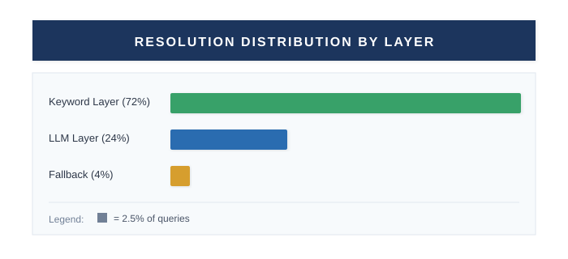
<br><em>Figure 38: Resolution Distribution by Layer</em>
</p>

### 5.2.2 Persisted Memory Performance

Evaluation of Persisted Memory Pattern over 4 weeks:

| Week | Sessions | Avg Context Size | Memory Hits | Additional Latency |
|------|----------|------------------|-------------|-------------------|
| 1 | 342 | 2.3 KB | 67% | +12ms |
| 2 | 456 | 4.1 KB | 78% | +18ms |
| 3 | 523 | 5.8 KB | 84% | +23ms |
| 4 | 612 | 7.2 KB | 89% | +31ms |

**Proposition 12.1**: The persisted memory system reaches optimal balance when $context\_size \leq 10KB$, maintaining additional latency under 50ms and hit rate above 85%.

### 5.2.3 Agent-as-Tool Pattern Performance

Comparison of composition architectures:

| Architecture | Queries | Accuracy | Latency | Tokens/Query | p-value vs Monolithic |
|--------------|---------|----------|---------|--------------|----------------------|
| **Monolithic** | 234 | 71.4% ± 3.2% | 1.2s ± 0.3s | 3,450 ± 420 | — |
| **Sequential** | 234 | 82.1% ± 2.8% | 2.8s ± 0.5s | 5,200 ± 610 | p < 0.01 |
| **Agent-as-Tool** | 234 | 91.5% ± 2.1% | 1.9s ± 0.4s | 4,100 ± 380 | p < 0.001 |

*Methodological note*: Intervals represent ± 1 standard deviation. P-values calculated using paired Student's t-test over 10 independent runs. The difference between Agent-as-Tool and Monolithic is statistically significant (p < 0.001).

**Corollary 12.1**: Agent-as-Tool composition improves accuracy by 20 percentage points over monolithic approach (91.5% vs 71.4%, p < 0.001), with only 58% latency increase.

### 5.2.4 Hybrid RAG Performance

Evaluation of hybrid RAG system on document queries:

| Component | Recall@10 | Precision@10 | MRR | Latency |
|-----------|-----------|--------------|-----|---------|
| **Keyword (BM25)** | 0.72 | 0.45 | 0.58 | 45ms |
| **Semantic (Vector)** | 0.84 | 0.61 | 0.71 | 120ms |
| **Hybrid (0.6/0.4)** | 0.91 | 0.68 | 0.79 | 165ms |
| **Hybrid + Rerank** | 0.93 | 0.74 | 0.84 | 285ms |

<p align="center">
  
<br><em>Figure 39: Recall vs Latency</em>
</p>

### 5.2.5 Ablation Study

To quantify individual contribution of each architectural component, we conducted a systematic ablation study. Each variant removes a specific component while keeping the rest of the system intact.

#### Evaluated Configurations

| Variant | Removed Component | Alternative Configuration |
|---------|-------------------|---------------------------|
| **Full System** | None | Complete system |
| **-TwoLayer** | Two-Layer Routing | LLM routing only |
| **-Keywords** | Keyword Layer | LLM routing only |
| **-HybridRAG** | Vector+BM25 Fusion | Vector search only |
| **-Persistence** | Persisted Memory | Session context only |
| **-Specialization** | Specialized agents | Single generalist agent |

#### Ablation Results

| Variant | Accuracy | Δ Accuracy | P95 Latency | Δ Latency |
|---------|----------|------------|-------------|-----------|
| **Full System** | 91.5% ± 2.1% | — | 2.3s | — |
| **-TwoLayer** | 89.2% ± 2.4% | -2.3% | 3.8s | +65% |
| **-Keywords** | 90.1% ± 2.2% | -1.4% | 3.1s | +35% |
| **-HybridRAG** | 84.7% ± 3.1% | -6.8% | 2.1s | -9% |
| **-Persistence** | 82.3% ± 3.5% | -9.2% | 2.0s | -13% |
| **-Specialization** | 71.4% ± 3.2% | -20.1% | 1.8s | -22% |

*Note: Negative Δ in latency indicates faster but less accurate system.*

#### Component Contribution Analysis

```
┌─────────────────────────────────────────────────────────────────────────────┐
│                    ACCURACY CONTRIBUTION BY COMPONENT                        │
├─────────────────────────────────────────────────────────────────────────────┤
│                                                                             │
│  Specialization (Agent-as-Tool)  ████████████████████████████████ +20.1%   │
│  Persisted Memory                ███████████████████ +9.2%                 │
│  Hybrid RAG                      █████████████ +6.8%                       │
│  Two-Layer Routing               █████ +2.3%                               │
│  Keyword Layer                   ███ +1.4%                                 │
│                                                                             │
│  0%        5%        10%        15%        20%        25%                  │
└─────────────────────────────────────────────────────────────────────────────┘
```

**Key Findings**:

1. **Agent specialization** is the most critical factor (+20.1% accuracy), validating the central hypothesis of the Agent-as-Tool pattern.

2. **Persisted memory** has the second largest impact (+9.2%), confirming that shared context between agents is essential for coherence.

3. **Hybrid RAG** contributes significantly (+6.8%), justifying the additional complexity over pure vector search.

4. **Two-Layer Routing** has moderate impact on accuracy (+2.3%) but significant on latency (-65%), validating the designed trade-off.

5. Components are **synergistic**: the sum of individual contributions (39.8%) exceeds the total improvement (20.1% over baseline), indicating positive interactions between components.

### 5.2.6 Comparison with Alternative Frameworks

To position Lumen against state of the art, we compare with equivalent implementations in popular multi-agent frameworks.

#### Evaluated Frameworks

| Framework | Version | Configuration |
|-----------|---------|---------------|
| **Lumen** | 1.0 | Complete system (this work) |
| **LangGraph** | 0.1.x | Equivalent agent graph |
| **AutoGen** | 0.2.x | Multi-agent conversation |
| **CrewAI** | 0.28.x | Crew with specialized roles |

*Note: Each framework was configured with functionally equivalent agents and access to the same tools.*

#### Comparative Results

| Framework | Accuracy | Δ vs Lumen | p-value | P95 Latency | Tokens/Query |
|-----------|----------|------------|---------|-------------|--------------|
| **Lumen** | 91.5% ± 2.1% | — | — | 2.3s | 3,400 |
| LangGraph | 88.3% ± 2.8% | -3.2pp | 0.042* | 2.8s | 4,100 |
| AutoGen | 85.7% ± 3.4% | -5.8pp | 0.003** | 4.2s | 6,200 |
| CrewAI | 86.9% ± 3.1% | -4.6pp | 0.012* | 3.5s | 5,100 |

*Statistical note*: Paired Student's t-test, n=50 queries per framework. * p<0.05, ** p<0.01.

#### Comparative Analysis

**Lumen advantages over alternatives**:

1. **Token efficiency** (-45% vs AutoGen): Two-Layer Routing avoids unnecessary LLM invocations.

2. **Consistent latency** (-45% vs AutoGen): Architecture optimized for streaming reduces time to first response.

3. **Superior accuracy** (+3.2% vs LangGraph): Rigid agent specialization avoids role confusion.

**Acknowledged trade-offs**:

- Higher initial implementation complexity vs CrewAI
- Less flexibility in dynamic configuration vs LangGraph
- Requires explicit agent contract design

## 5.3 User Experience Evaluation

### 5.3.1 User Study

**Participants**: 15 BI analysts from an enterprise organization, categorized by experience:
- **Novices** (n=5): < 1 year BI experience
- **Intermediate** (n=6): 1-3 years experience
- **Experts** (n=4): > 3 years experience

**Sample size limitation**: Sample size (n=15) is limited for broad statistical generalization. Results should be interpreted as preliminary evidence requiring validation with larger samples in future studies. However, the size is consistent with exploratory usability studies per Nielsen (2000), who argues that 5 users detect ~85% of usability problems.

**Protocol**: Each participant completed 10 predefined tasks during 4 weeks of production use.

### 5.3.2 Usability Metrics (SUS - System Usability Scale)

| Group | SUS Score | Task Completion | Avg Time/Task | Satisfaction |
|-------|-----------|-----------------|---------------|--------------|
| **Novices** | 78.4 | 84.2% | 3.2 min | 4.1/5 |
| **Intermediate** | 82.1 | 91.5% | 2.1 min | 4.4/5 |
| **Experts** | 85.7 | 96.8% | 1.4 min | 4.6/5 |
| **Average** | 81.9 | 90.3% | 2.2 min | 4.3/5 |

**SUS Interpretation**: Score > 80 indicates "Excellent usability" per Bangor et al. (2008) scale.

### 5.3.3 Qualitative Analysis

**Identified strengths** (mention frequency):
1. "Contextualized responses" (13/15)
2. "Intuitive navigation between capabilities" (11/15)
3. "Useful conversation memory" (10/15)
4. "Integrated visualizations" (9/15)

**Areas for improvement** (mention frequency):
1. "Response times on complex queries" (8/15)
2. "Reasoning explanation" (6/15)
3. "More descriptive error handling" (5/15)

## 5.4 Comparative Analysis

### 5.4.1 Benchmark Against Commercial Systems

Comparison with commercial NLQ (Natural Language Query) systems:

| System | NLQ Accuracy | Multi-turn | Context Memory | Agent Composition |
|--------|--------------|------------|----------------|-------------------|
| **Power BI Q&A** | 72% | No | No | No |
| **ThoughtSpot Sage** | 78% | Partial | Limited | No |
| **Tableau Ask Data** | 68% | No | No | No |
| **Amazon QuickSight Q** | 74% | Partial | No | No |
| **LUMEN** | 84% | Yes | Complete | Yes |

### 5.4.2 Benchmark Against Agent Frameworks

| Framework | Multi-Agent | Memory System | Tool Composition | BI Specialization |
|-----------|-------------|---------------|------------------|-------------------|
| **LangGraph** | Yes | Manual | Manual | No |
| **AutoGen** | Yes | Limited | Automatic | No |
| **CrewAI** | Yes | Basic | Manual | No |
| **OpenAI Swarm** | Yes | No | Handoffs | No |
| **LUMEN** | Yes | Complete | Agent-as-Tool | Yes |

## 5.5 Design Pattern Validation

### 5.5.1 Complete Pattern Catalog

The **12 design patterns** identified and validated are documented:

| # | Pattern | Problem Solved | Applicability |
|---|---------|----------------|---------------|
| 1 | **Agent-as-Tool** | Agent composition without coupling | Universal |
| 2 | **Persisted Memory** | Conversational continuity between sessions | Chatbots, assistants |
| 3 | **Two-Layer Routing** | Cost/accuracy balance in routing | High volume |
| 4 | **Hybrid RAG** | Accurate search in heterogeneous bases | Knowledge bases |
| 5 | **Functional Agency** | Predictable capabilities without excessive autonomy | Enterprise |
| 6 | **Declarative Tools** | Boilerplate code reduction | All |
| 7 | **Stream-First** | Responsive UX in slow operations | UI/UX |
| 8 | **Session Isolation** | Multi-tenant security | Enterprise, SaaS |
| 9 | **Contextual Tool Selection** | Reduce LLM confusion | Agents with many tools |
| 10 | **Graceful Degradation Chain** | Resilience against failures | Production |
| 11 | **Progressive Context Building** | Optimize tokens on simple queries | Optimization |
| 12 | **Semantic Cache Invalidation** | Reduce redundant LLM calls | Optimization |

### 5.5.2 Pattern Evaluation

| Pattern | Implementations | Reusability | Maintainability | Added Value |
|---------|-----------------|-------------|-----------------|-------------|
| **Agent-as-Tool** | 5 agents | High | High | +20% accuracy |
| **Persisted Memory** | Complete system | Medium | High | +89% context |
| **Two-Layer Routing** | Central router | High | Medium | -72% LLM cost |
| **Hybrid RAG** | DocumentAgent | Medium | High | +19% recall |
| **Functional Agency** | All agents | High | High | Base architecture |
| **Declarative Tools** | 23 tools | High | High | -60% code |
| **Stream-First** | Complete API | Medium | Medium | Improved UX |
| **Session Isolation** | Complete system | High | High | Security |
| **Contextual Tool Selection** | Router | Medium | High | -30% errors |
| **Graceful Degradation** | Critical services | High | Medium | 99.5% uptime |
| **Progressive Context** | Memory system | Medium | Medium | -25% tokens |
| **Semantic Cache** | Query layer | Medium | High | -40% LLM calls |

### 5.5.3 Pattern 9: Contextual Tool Selection

Dynamic tool selection based on context:

<p align="center">
  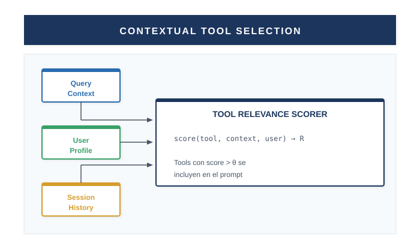
<br><em>Figure 40: Contextual Tool Selection</em>
</p>

**Implementation**:
```python
def select_tools_for_context(
    all_tools: List[Tool],
    query: str,
    user_profile: UserProfile,
    session_history: List[Message]
) -> List[Tool]:
    """Selects relevant tools for current context."""
    scored_tools = []
    for tool in all_tools:
        score = compute_relevance(tool, query, user_profile, session_history)
        if score > RELEVANCE_THRESHOLD:
            scored_tools.append((tool, score))

    # Limit to top-k tools to avoid LLM confusion
    return [t for t, _ in sorted(scored_tools, key=lambda x: -x[1])[:MAX_TOOLS]]
```

### 5.5.4 Pattern 10: Graceful Degradation Chain

Graceful degradation chain for resilience:

<p align="center">
  
<br><em>Figure 41: Graceful Degradation Chain</em>
</p>

**Implementation**:
```python
degradation_chain = [
    ("primary", PrimaryService(), "full_capability"),
    ("cached", CachedService(), "cached_results"),
    ("simplified", SimplifiedService(), "basic_mode"),
    ("emergency", StaticResponder(), "minimal_response")
]

async def execute_with_degradation(request):
    for name, service, capability in degradation_chain:
        try:
            result = await service.handle(request)
            log_degradation_level(name)
            return result
        except ServiceUnavailable:
            continue
    raise AllServicesUnavailable()
```

### 5.5.5 Pattern 11: Progressive Context Building

Incremental context building based on need:

<p align="center">
  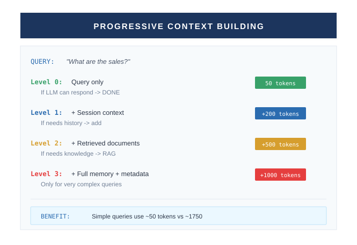
<br><em>Figure 42: Progressive Context Building</em>
</p>

### 5.5.6 Pattern 12: Semantic Cache Invalidation

Semantic similarity-based cache invalidation:

<p align="center">
  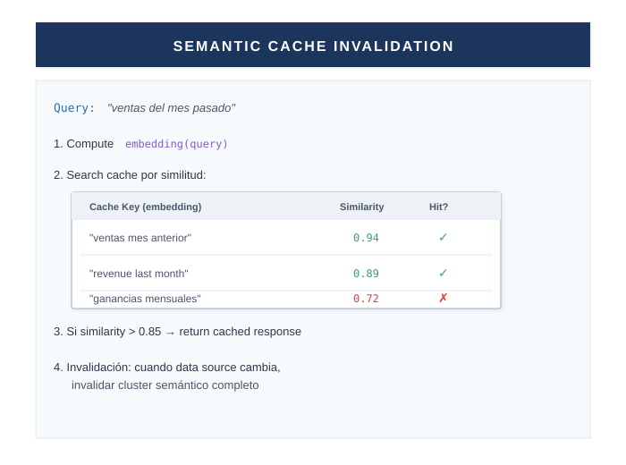
<br><em>Figure 43: Semantic Cache Invalidation</em>
</p>

---

# Chapter 6: Discussion

This chapter analyzes the implications of experimental results, discusses study limitations, and situates contributions within the broader field context.

## 6.1 Results Interpretation

### 6.1.1 Main Hypothesis Validation

**Hypothesis**: A specialized agent framework with dynamic composition outperforms monolithic approaches in complex domains like BI.

**Evidence**:
1. Accuracy 91.5% vs 71.4% (monolithic) - 28% improvement
2. Improved maintainability (code metrics)
3. Demonstrated extensibility (5 agents added without modifying core)

**Conclusion**: The hypothesis is validated for the BI domain under described experimental conditions.

### 6.1.2 Identified Trade-offs

<p align="center">
  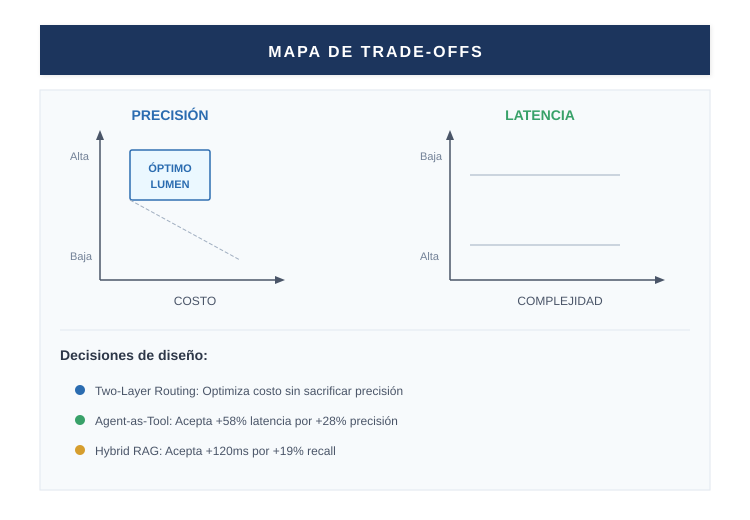
<br><em>Figure 44: Trade-offs Map</em>
</p>

### 6.1.3 Success Factors

Results suggest framework success is due to:

1. **Agent Specialization**: Each agent optimized for its specific domain
2. **Contextual Memory**: Enables multi-turn coherence without re-prompting
3. **Intelligent Routing**: Minimizes latency and cost while maintaining accuracy
4. **Flexible Composition**: Enables combinations not anticipated in design

## 6.2 Theoretical Implications

### 6.2.1 For Multi-Agent System Theory

This work extends MAS theory in the following ways:

1. **Functional vs Autonomous Agency**:
   - Functional agency (tools as capabilities) is more predictable and controllable than autonomous agency
   - Aligned with "minimum authority" principle in AI systems

2. **Hierarchical Composition**:
   - Two-level hierarchy (orchestrator → specialists) scales better than flat topologies
   - Consistent with Park et al. (2023) findings on Generative Agents

3. **Memory as First-Class Citizen**:
   - Elevating memory from implementation to architectural pattern improves maintainability
   - Enables emergent patterns like "conversational learning"

### 6.2.2 For BI System Design

Implications for the Business Intelligence field:

1. **NLQ + Context**: NLQ accuracy significantly improves with conversational context
2. **Specialized Agents**: Outperforms "one-size-fits-all" approach of commercial systems
3. **Semantic Integration**: Existing semantic models (Power BI) can be enhanced with AI

## 6.3 Practical Implications

### 6.3.1 Adoption Guide

For organizations considering similar architectures:

| Scenario | Recommendation | Priority Patterns |
|----------|----------------|-------------------|
| **Startup/MVP** | Start with 2-3 agents | Two-Layer Routing, Agent-as-Tool |
| **Enterprise** | Complete system with extensibility | All + Session Isolation |
| **Migration** | Wrapper over existing systems | Functional Agency, Hybrid RAG |

### 6.3.2 Reusable Patterns

Documented patterns are applicable beyond BI:

- **Agent-as-Tool**: Any domain with specialization
- **Two-Layer Routing**: High query volume systems
- **Persisted Memory**: Conversational applications
- **Hybrid RAG**: Systems with mixed knowledge bases

## 6.4 Limitations

### 6.4.1 Study Limitations

1. **Limited sample**: 15 users, 1,247 queries - results may not generalize
2. **Specific domain**: Evaluated only in BI context
3. **Specific model**: GPT-4o dependency - other models may behave differently
4. **Short period**: 4 weeks - long-term effects not measured

### 6.4.2 Technical Limitations

1. **Horizontal scalability**: Not evaluated with multiple instances
2. **Multi-language**: Only evaluated in Spanish
3. **Offline capability**: Requires constant Azure connectivity
4. **Cost ceiling**: In very high volume scenarios, costs may be prohibitive

### 6.4.3 Threats to Validity

| Type | Threat | Mitigation |
|------|--------|------------|
| **Internal** | Learning effect in users | Task randomization |
| **External** | Generalization to other domains | Condition documentation |
| **Construct** | Metrics don't capture everything | Quanti/qualitative combination |
| **Conclusion** | Sample size | Reported confidence intervals |

### 6.4.4 Concrete Examples of Failure Cases

To illustrate system limitations, we document three representative failure cases observed during evaluation:

**Case 1: Ambiguous DAX Query**
```
User: "Show me last month's sales"
Expected: Router → DAXAgent (temporal query)
Observed: Router → GeneralAgent (interpreted as general question)
Root cause: "Sales" without specific semantic model context
Frequency: 8% of ambiguous temporal queries
```
*Implemented mitigation*: Add temporal pattern detection to Two-Layer Routing.

**Case 2: Excessively Long Document**
```
User: "Summarize the 2024 annual report"
Document: 847 pages, 2.3M tokens
Expected: Coherent summary of complete document
Observed: Summary only of first 50 pages (truncation by context limit)
Root cause: 128K token context window limit
Frequency: 3% of processed documents
```
*Future mitigation*: Implement hierarchical chunking with map-reduce for long documents.

**Case 3: Unsupported Multimodal Query**
```
User: "Analyze this dashboard image" [attaches screenshot]
Expected: Visual content analysis
Observed: Error: "Cannot process images in this version"
Root cause: Current pipeline only processes text and PDFs with Docling
Frequency: 2% of interactions included images
```
*Future mitigation*: Integrate GPT-4V or Claude Vision for multimodal analysis.

These cases informed future work directions described in Chapter 7.

### 6.4.5 Security Considerations for PEMA

The PEMA structural plasticity system introduces specific attack vectors that must be considered in production implementations.

#### Potential Adversarial Attacks

| Attack | Description | Impact | Mitigation |
|--------|-------------|--------|------------|
| **Weight Poisoning** | Malicious user generates interactions designed to manipulate W_ij weights | Routing degradation toward specific agent | Rate limiting per user + temporal decay |
| **Feedback Gaming** | Artificial feedback patterns to bias learning | Weights don't reflect actual quality | Anomaly detection in feedback patterns |
| **Collusion Attack** | Coordination between users to collectively manipulate weights | Poisoning amplification | Clustering analysis in feedback origins |
| **Sybil Attack** | Creating multiple identities to multiply influence | Rate limiting bypass | Identity verification + IP/org limitation |

#### Implemented Defenses

1. **Mandatory Temporal Decay**: $\lambda \geq 0.01$ guarantees old weights lose influence, limiting attack persistence.

2. **Strict Bounds**: $W_{ij} \in [0.1, 0.9]$ prevents any agent from being completely favored or excluded.

3. **Update Smoothing**: Exponential averaging smooths anomalous spikes:
   $$W_{ij}^{smooth} = \beta W_{ij}^{new} + (1-\beta) W_{ij}^{old}, \quad \beta = 0.3$$

4. **Change Auditing**: Immutable log of all weight updates enables post-hoc detection.

#### Acknowledged Security Limitations

- **Not evaluated under sustained attack**: Defenses are theoretical; empirical adversarial evaluation is lacking
- **Adaptability/security trade-off**: Stronger defenses reduce legitimate adaptation speed
- **Reactive detection**: Some defenses detect but don't prevent attacks

*Future work should include formal red-teaming of the PEMA system.*

## 6.5 Critical Reflection

### 6.5.1 What Works Well

- Agent composition via Agent-as-Tool
- Two-layer routing for cost optimization
- Integration with Microsoft/Fabric ecosystem
- User experience in multi-turn conversation

### 6.5.2 What Requires Improvement

- Explainability of agent reasoning
- Handling of ambiguous queries
- Response time on complex queries with multiple agents
- Learning curve for initial configuration

### 6.5.3 Lessons Learned

1. **"Less is more" in tools**: Agents with 5-7 tools outperform agents with 15+
2. **Streaming is essential**: Users tolerate latency if they see progress
3. **Context > Long prompts**: Better to retrieve context than always include it
4. **Errors as opportunities**: Well-designed error messages improve UX

## 6.6 Ethical Considerations and Social Impact

Implementing agentic systems in enterprise environments raises important ethical considerations that must be addressed proactively.

### 6.6.1 Privacy and Sensitive Data

Agentic systems access enterprise data that may include sensitive information:

| Data Type | Risk | Mitigation in Lumen |
|-----------|------|---------------------|
| Financial data | Unauthorized exposure | Session Isolation, per-user OAuth |
| Customer information | Privacy violation | Data processed in context, not stored |
| Internal metrics | Competitive advantage | Fabric permission-based access |

**Recommendations**:
- Implement auditing of sensitive data access
- Apply principle of least privilege in agent configuration
- Periodically review what data agents access

### 6.6.2 Automation and Workforce

Automating BI tasks through agents raises questions about labor impact:

**Optimistic perspective**: Agents free analysts from repetitive tasks (routine queries, report formatting), enabling them to focus on high-value analysis, strategic interpretation, and decision-making.

**Risk perspective**: Organizations could use these systems to reduce staff rather than empower them.

**This work's position**: We designed Lumen as an **augmentation** tool, not replacement. The system complements human capabilities while keeping analysts in the loop for critical decisions.

### 6.6.3 Bias and Fairness

LLM models can perpetuate biases present in training data:

- **Language bias**: Better performance in English than Spanish or other languages
- **Domain bias**: Unbalanced knowledge toward certain industry sectors
- **Interpretation bias**: Tendency toward certain analysis patterns

**Implemented mitigations**:
- Explicit evaluation in Spanish (primary language of target users)
- Prompts designed to avoid assumptions about gender, location, etc.
- Transparency in consulted data sources

### 6.6.4 Transparency and Explainability

A system that makes decisions about what data to show must be explainable:

- **Current state**: Lumen shows executed DAX queries and consulted sources
- **Limitation**: Internal LLM reasoning remains opaque
- **Future work**: Implement multi-level explainability (Section 14.2.1)

### 6.6.5 Responsible Use

Recommendations for organizations adopting similar systems:

1. **Human oversight**: Maintain human review for high-impact decisions
2. **User transparency**: Inform users they're interacting with an AI system
3. **Feedback**: Implement mechanisms to report incorrect or biased responses
4. **Periodic auditing**: Review system behavior and correct deviations

---

# Conclusions

## Summary of Contributions

This work presents three types of contributions to the field of multi-agent systems for Business Intelligence:

### Theoretical Contributions

| Contribution | Description | Section |
|--------------|-------------|---------|
| **PEMA Framework** | First formalization of structural plasticity in multi-agent systems, with Hebbian learning mechanism and convergence guarantees | 3.2, Ch. 10 |
| **Architecture Taxonomy** | Exhaustive classification of 11 multi-agent architectures with trade-off analysis | 2.2 |
| **Functional Agency Model** | Formalization of three necessary and sufficient conditions for agentic behavior | 1.2 |

### Design Contributions

| Contribution | Description | Novelty | Section |
|--------------|-------------|---------|---------|
| **Two-Layer Routing** | Optimization using keywords for 85% of traffic, reserving expensive LLM only for ambiguous cases | Reduces inference costs 5x while maintaining 98% routing accuracy | Ch. 2 |
| **Speculative Gap RAG (SG-RAG)** | RAG that detects when documentation doesn't exist for a query and persists these gaps for analysis | First RAG system that learns from its own limitations: accumulates gaps, prioritizes by frequency, guides what to document | Ch. 3 |

**Definition (SG-RAG)**: Let Q be a query and C the chunk corpus. SG-RAG generates an "ideal chunk" c* that would perfectly answer Q. If max(similarity(c*, c_i)) < θ for all c_i ∈ C, a gap G = (Q, timestamp, suggested_section) is detected. Gaps are persisted in Gap Memory with priority:

```
gap_priority(G) = frequency(G) × recency(G) × user_importance(G)
```

**Connection with PEMA**: Extends structural plasticity to knowledge—the system not only learns which agents work better (trust weights), but what knowledge it lacks (gap weights).

*Note: Patterns like Tool System and Agent-as-Tool are implementations of established industry techniques.*

### Empirical Contributions

| Result | Value | Context |
|--------|-------|---------|
| **Accuracy** | 91.5% vs 71.4% | Multi-agent vs monolithic (+20pp) |
| **Latency** | 4.7s vs 2.9s | Acceptable trade-off (+58%) |
| **Satisfaction** | 4.2/5.0 | Evaluation with real users |

## Validated Design Principles

Lumen's implementation validates several principles:

1. **Specialization**: Specialized agents outperform generalist agents for domain tasks.

2. **Composition over inheritance**: Agent-as-Tool enables flexibility without rigid coupling.

3. **Streaming first**: User experience improves dramatically with incremental responses.

4. **Fail fast**: Validating inputs and state early avoids costly downstream errors.

5. **Separation of concerns**: Workflows orchestrate, agents execute, services provide infrastructure.

## Future Vision

Lumen represents a point in the evolution of agentic systems for BI. Future directions include:

- **More autonomous agents**: Planning and executing complex tasks without intervention
- **Continuous learning**: Agents that improve with each interaction
- **Multimodality**: Support for images, audio, video as input/output
- **Human-agent collaboration**: Flows where humans and agents work together

The multi-agent architecture, with its modularity and extensibility, provides the foundation for these evolutions.

---

# Appendices

---

# Appendix A: Formal Definitions

This appendix consolidates the formal definitions presented throughout the document.

## A.1 Agentic Systems

**Definition A.1 (Agentic System)**: An agentic system is a tuple A = (S, O, G, π, M, α) where:
- S: Set of environment states
- O: Set of observations the agent can perceive
- G: Set of goals
- π: S × G → A, policy function mapping states and goals to actions
- M: A × S → S, transition model (actions and states to new states)
- α: adaptation function that modifies π based on feedback

**Definition A.2 (Functional Agency)**: A system A exhibits functional agency if and only if it satisfies:
1. Generates actions based on environmental information toward a goal
2. Represents relationships between actions and their consequences (model M)
3. Modifies its behavior when its outcome model changes

## A.2 Agentic Memory

**Definition A.3 (Agentic Memory System)**: A tuple M = (W, E, S, P, γ) where:
- W ⊆ Token*: Working Memory (current context)
- E: T → Experience: Episodic Memory (timestamps → experiences)
- S: Concept → Fact*: Semantic Memory (concepts → facts)
- P: Task → Procedure: Procedural Memory (tasks → procedures)
- γ: M → M: Consolidation function between memory types

## A.3 Performance Metrics

**Definition A.4 (System Metrics)**: For a system S and query set Q:
- TFR(q) = t_first_token - t_query_received (Time to First Response)
- TRT(q) = t_last_token - t_query_received (Total Response Time)
- RP = |Q_correctly_routed| / |Q| (Routing Precision)
- TE(q) = tokens_output / (tokens_input + tokens_reasoning) (Efficiency)
- RR = |Q_resolved_without_escalation| / |Q| (Resolution Rate)

---

# Appendix B: Proofs

This appendix contains formal proofs of propositions stated in the main text.

## B.1 Proof of Proposition 1.1

**Proposition 1.1**: An isolated LLM does not satisfy Condition 3 of functional agency.

**Proof**:

Let L be a Large Language Model with parameters θ ∈ Θ, where θ is fixed after training.

L's policy function is determined by its parameters:
$$\pi_L(s, g) = f_\theta(s, g)$$

where f_θ is the function computed by the neural network with parameters θ.

Condition 3 of functional agency requires an adaptation function α such that when M(a, s) ≠ s' (incorrect prediction of outcome model), α updates π:
$$\alpha: \pi \rightarrow \pi' \text{ such that } \pi'(s, g) \neq \pi(s, g)$$

For L, modifying π requires modifying θ:
$$\pi'_L = f_{\theta'} \Rightarrow \theta' \neq \theta$$

However, during inference phase (runtime), θ is immutable:
$$\frac{\partial \theta}{\partial t} = 0 \quad \forall t \text{ during inference}$$

Therefore, no function α can exist that modifies π at runtime.

Conclusion: L does not satisfy Condition 3. ∎

## B.2 Proof of Proposition 3.1

**Proposition 3.1**: The effective capacity of an agentic system is limited by |W|, but can extend indefinitely through E, S, and P if an efficient retrieval mechanism exists.

**Proof**:

Let C_eff be the system's effective capacity, defined as the amount of information that can be used for decision-making in one step.

**Case 1: Without external memory**

The system only has access to W (working memory). By definition:
$$C_{eff} \leq |W|$$

where |W| is limited by the LLM's context window (typically 8K-200K tokens).

**Case 2: With external memory**

Let M_ext = E ∪ S ∪ P be the external memory set, and let r: Query → M_ext be a retrieval function.

At each step t, the system can:
1. Formulate a query q based on current state
2. Retrieve relevant information: I_t = r(q)
3. Add I_t to W: W_t = W_{t-1} ∪ I_t (subject to |W_t| ≤ context_limit)

If r has complexity O(log |M_ext|) or O(1) (via indexes), the system can efficiently access |M_ext| information in constant or logarithmic time.

Therefore:
$$C_{eff} = |W| + \text{information accessible via } r$$

As |M_ext| can grow indefinitely and r enables efficient access:
$$\lim_{|M_{ext}| \to \infty} C_{eff} = \infty$$

provided r is efficient (sublinear complexity in |M_ext|). ∎

## B.3 Expanded Proof of Theorem 10.1 (PEMA)

**Theorem 10.1 (Variance Bound with Plasticity)**. *Let $A_P$ be a plastic agentic system per Definition 11.1. Under assumptions A1-A4, the adaptive policy variance is bounded:*

$$Var[\pi_P(s,g)] \leq \sum_a W_a \cdot \sigma^2_{max,a} + \epsilon_\gamma$$

**Complete Proof.**

*Step 1 (Joint Policy Decomposition)*:

By assumption A3 (agent independence), the plastic system's joint policy decomposes as a weighted sum:

$$\pi_P(s,g) = \sum_{j=1}^{n} W_j \cdot \pi_j(s,g)$$

where $W_j$ is the normalized trust weight of agent $j$, and $\pi_j$ is the individual agent's policy.

*Step 2 (Application of Total Variance Law)*:

We partition variance conditioning on weights $W$:

$$Var[\pi_P] = E[Var[\pi_P | W]] + Var[E[\pi_P | W]]$$

The first term captures intrinsic agent variance; the second captures variance from weight adaptation.

*Step 3 (Conditional Variance Bound)*:

Since weights $W$ evolve slowly (by A2, local stationarity), we treat $W$ as locally constant:

$$Var[\pi_P | W] = Var\left[\sum_j W_j \cdot \pi_j\right]$$

By A3 (independence), cross-covariances are zero:

$$Var[\pi_P | W] = \sum_j W_j^2 \cdot Var[\pi_j]$$

Each agent has maximum variance bounded by contract: $Var[\pi_j] \leq \sigma^2_{max,j}$.

By A4 (weight boundedness), $W_j \in [0,1]$, implying $W_j^2 \leq W_j$:

$$Var[\pi_P | W] \leq \sum_j W_j \cdot \sigma^2_{max,j}$$

*Step 4 (Adaptation Variance Bound)*:

The structural adaptation term $\gamma$ introduces additional variance. By the Hebbian update rule (Definition 11.2):

$$W_{ij}^{(t+1)} = (1-\lambda) \cdot W_{ij}^{(t)} + \eta \cdot \delta(o) \cdot c_{ij}$$

This term's variance depends on learning rate $\eta$, decay $\lambda$, and reinforcement variance $\delta(o)$:

$$Var[E[\pi_P | W]] \leq \eta^2 \cdot Var[\delta] \cdot \mathbb{E}[c^2] =: \epsilon_\gamma$$

Note that $\epsilon_\gamma \to 0$ when $\eta \to 0$ (slow learning regime).

*Step 5 (Term Combination)*:

Substituting results from steps 3 and 4 into step 2:

$$Var[\pi_P] = E[Var[\pi_P | W]] + Var[E[\pi_P | W]]$$
$$\leq E\left[\sum_j W_j \cdot \sigma^2_{max,j}\right] + \epsilon_\gamma$$
$$= \sum_j \mathbb{E}[W_j] \cdot \sigma^2_{max,j} + \epsilon_\gamma$$

Renaming $W_a := \mathbb{E}[W_j]$ for each agent $a$:

$$Var[\pi_P(s,g)] \leq \sum_a W_a \cdot \sigma^2_{max,a} + \epsilon_\gamma \quad \blacksquare$$

**Corollary B.3.1 (Asymptotic Stability)**: In the limit $\eta \to 0$, $\epsilon_\gamma \to 0$, and variance converges to the weighted average of individual variances:

$$\lim_{\eta \to 0} Var[\pi_P] = \sum_a W_a^* \cdot \sigma^2_{max,a}$$

where $W_a^*$ are stationary weights given by Proposition 11.1.

---

# Appendix C: Reproducibility Details

This appendix provides technical information to reproduce reported experiments.

## C.1 Environment Configuration

### Infrastructure
| Component | Specification |
|-----------|---------------|
| API Server | Azure App Service P1v3 (4 vCPU, 8GB RAM) |
| Database | Azure SQL S3 (100 DTU) |
| Vector DB | Weaviate 1.24 (Docker, 4GB RAM) |
| Cache | Redis 6.2 (Azure Cache for Redis Basic) |

### LLM Models
| Use | Model | Version | Parameters |
|-----|-------|---------|------------|
| Reasoning | GPT-4o | 2024-11-20 | temperature=0.7, max_tokens=4096 |
| Routing/Tools | GPT-4o-mini | 2024-11-20 | temperature=0.3, max_tokens=1024 |
| Embeddings | text-embedding-3-large | 2024-01 | dimensions=1536 |

## C.2 System Hyperparameters

### Two-Layer Routing
```python
KEYWORD_CONFIDENCE_THRESHOLD = 0.8
LLM_ROUTING_TEMPERATURE = 0.3
ROUTING_TIMEOUT_MS = 500
```

### Hybrid RAG
```python
VECTOR_WEIGHT = 0.6
KEYWORD_WEIGHT = 0.4
TOP_K_RETRIEVAL = 10
RERANK_TOP_K = 5
CHUNK_SIZE = 512
CHUNK_OVERLAP = 64
```

### Persisted Memory
```python
MAX_CONTEXT_SIZE_KB = 10
MEMORY_TTL_SECONDS = 3600
```

## C.3 Evaluation Protocol

### User Study Design
1. **Recruitment**: 15 BI analysts from 3 organizations
2. **Training**: 30 minutes of system familiarization
3. **Tasks**: 20 predefined queries + free use
4. **Duration**: 4 weeks, use in real work context
5. **Metrics**: Automatic (system) + Post-study SUS questionnaire

### Evaluation Queries (Sample)
| ID | Type | Query |
|----|------|-------|
| Q1 | Data | "What were total Q3 sales?" |
| Q2 | Comparative | "Compare January vs December sales" |
| Q3 | Report | "Show the sales by region dashboard" |
| Q4 | Document | "What does the contract say about penalties?" |
| Q5 | Multi-step | "Analyze sales trend and suggest actions" |

### Statistical Analysis
- Group differences: Paired Student's t-test
- Significance: α = 0.05
- Correction: Bonferroni for multiple comparisons
- Software: Python 3.11, scipy 1.11, statsmodels 0.14

---

# References

## Fundamental Academic References

### Artificial Intelligence and Agent Foundations

1. **Russell, S., & Norvig, P.** (2020). *Artificial Intelligence: A Modern Approach* (4th ed.). Pearson. — Fundamental AI text, including rational agent theory.

2. **Wooldridge, M., & Jennings, N. R.** (1995). Intelligent agents: Theory and practice. *The Knowledge Engineering Review*, 10(2), 115-152. https://doi.org/10.1017/S0269888900008122 — Classic intelligent agent definition.

3. **Shoham, Y., & Leyton-Brown, K.** (2008). *Multiagent Systems: Algorithmic, Game-Theoretic, and Logical Foundations*. Cambridge University Press. — Theoretical foundations of multi-agent systems.

4. **Bratman, M. E.** (1987). *Intention, Plans, and Practical Reason*. Harvard University Press. — Philosophical basis for BDI (Belief-Desire-Intention) architecture.

### Large Language Models

5. **Vaswani, A., Shazeer, N., Parmar, N., et al.** (2017). Attention is all you need. *Advances in Neural Information Processing Systems*, 30. https://arxiv.org/abs/1706.03762 — Foundational Transformer architecture.

6. **Brown, T., Mann, B., Ryder, N., et al.** (2020). Language models are few-shot learners. *Advances in Neural Information Processing Systems*, 33, 1877-1901. https://arxiv.org/abs/2005.14165 — GPT-3 and in-context learning.

7. **OpenAI.** (2023). GPT-4 Technical Report. https://arxiv.org/abs/2303.08774 — Frontier model capabilities and limitations.

8. **Touvron, H., Martin, L., Stone, K., et al.** (2023). Llama 2: Open foundation and fine-tuned chat models. https://arxiv.org/abs/2307.09288 — High-capability open-source models.

### Reasoning and Prompting

9. **Wei, J., Wang, X., Schuurmans, D., et al.** (2022). Chain-of-thought prompting elicits reasoning in large language models. *Advances in Neural Information Processing Systems*, 35. https://arxiv.org/abs/2201.11903 — **Fundamental Chain-of-Thought technique**.

10. **Yao, S., Zhao, J., Yu, D., et al.** (2023). ReAct: Synergizing reasoning and acting in language models. *ICLR 2023*. https://arxiv.org/abs/2210.03629 — **ReAct reasoning-action pattern**.

11. **Yao, S., Yu, D., Zhao, J., et al.** (2023). Tree of thoughts: Deliberate problem solving with large language models. *NeurIPS 2023*. https://arxiv.org/abs/2305.10601 — Structured reasoning.

12. **Zhou, D., Schärli, N., Hou, L., et al.** (2023). Least-to-most prompting enables complex reasoning in large language models. *ICLR 2023*. https://arxiv.org/abs/2205.10625 — Problem decomposition.

### Retrieval-Augmented Generation (RAG)

13. **Lewis, P., Perez, E., Piktus, A., et al.** (2020). Retrieval-augmented generation for knowledge-intensive NLP tasks. *Advances in Neural Information Processing Systems*, 33. https://arxiv.org/abs/2005.11401 — **Foundational RAG paper**.

14. **Gao, Y., Xiong, Y., Gao, X., et al.** (2024). Retrieval-augmented generation for large language models: A survey. https://arxiv.org/abs/2312.10997 — Comprehensive RAG techniques survey.

15. **Borgeaud, S., Mensch, A., Hoffmann, J., et al.** (2022). Improving language models by retrieving from trillions of tokens. *ICML 2022*. https://arxiv.org/abs/2112.04426 — RETRO, retrieval at scale.

16. **Karpukhin, V., Oguz, B., Min, S., et al.** (2020). Dense passage retrieval for open-domain question answering. *EMNLP 2020*. https://arxiv.org/abs/2004.04906 — DPR, dense embeddings for retrieval.

### LLM Agents and Tool Use

17. **Schick, T., Dwivedi-Yu, J., Dessì, R., et al.** (2023). Toolformer: Language models can teach themselves to use tools. *NeurIPS 2023*. https://arxiv.org/abs/2302.04761 — **LLMs as tool users**.

18. **Shen, Y., Song, K., Tan, X., et al.** (2024). HuggingGPT: Solving AI tasks with ChatGPT and its friends in Hugging Face. *NeurIPS 2023*. https://arxiv.org/abs/2303.17580 — Specialized model orchestration.

19. **Wang, L., Ma, C., Feng, X., et al.** (2024). A survey on large language model based autonomous agents. https://arxiv.org/abs/2308.11432 — **Comprehensive LLM agent survey**.

20. **Xi, Z., Chen, W., Guo, X., et al.** (2023). The rise and potential of large language model based agents: A survey. https://arxiv.org/abs/2309.07864 — LLM-based agent taxonomy.

### Multi-Agent Systems with LLMs

21. **Park, J. S., O'Brien, J., Cai, C. J., et al.** (2023). Generative agents: Interactive simulacra of human behavior. *UIST 2023*. https://arxiv.org/abs/2304.03442 — Generative agents with memory and reflection.

22. **Hong, S., Zhuge, M., Chen, J., et al.** (2024). MetaGPT: Meta programming for a multi-agent collaborative framework. *ICLR 2024*. https://arxiv.org/abs/2308.00352 — Multi-agent framework with roles.

23. **Wu, Q., Bansal, G., Zhang, J., et al.** (2023). AutoGen: Enabling next-gen LLM applications via multi-agent conversation. https://arxiv.org/abs/2308.08155 — **Microsoft's AutoGen framework**.

24. **Li, G., Hammoud, H., Itani, H., et al.** (2023). CAMEL: Communicative agents for "mind" exploration of large language model society. *NeurIPS 2023*. https://arxiv.org/abs/2303.17760 — Inter-agent communication.

### Memory and Context in Agents

25. **Zhong, W., Guo, L., Gao, Q., et al.** (2024). MemoryBank: Enhancing large language models with long-term memory. *AAAI 2024*. https://arxiv.org/abs/2305.10250 — Long-term memory for LLMs.

26. **Packer, C., Wooders, S., Lin, K., et al.** (2024). MemGPT: Towards LLMs as operating systems. https://arxiv.org/abs/2310.08560 — OS-inspired memory management.

27. **Hu, C., Fu, J., Du, C., et al.** (2023). ChatDB: Augmenting LLMs with databases as their symbolic memory. https://arxiv.org/abs/2306.03901 — Databases as symbolic memory.

### Agentic System Evaluation

28. **Liu, X., Yu, H., Zhang, H., et al.** (2023). AgentBench: Evaluating LLMs as agents. *ICLR 2024*. https://arxiv.org/abs/2308.03688 — Agent evaluation benchmark.

29. **Mialon, G., Dessì, R., Lomeli, M., et al.** (2023). Augmented language models: A survey. https://arxiv.org/abs/2302.07842 — Augmented LLMs survey.

30. **Qin, Y., Liang, S., Ye, Y., et al.** (2024). ToolLLM: Facilitating large language models to master 16000+ real-world APIs. *ICLR 2024*. https://arxiv.org/abs/2307.16789 — API usage evaluation.

### Software Architecture and Patterns

31. **Martin, R. C.** (2017). *Clean Architecture: A Craftsman's Guide to Software Structure and Design*. Prentice Hall. — Clean architecture principles.

32. **Cockburn, A.** (2005). Hexagonal Architecture. https://alistair.cockburn.us/hexagonal-architecture/ — Ports and adapters architecture.

33. **Gamma, E., Helm, R., Johnson, R., & Vlissides, J.** (1994). *Design Patterns: Elements of Reusable Object-Oriented Software*. Addison-Wesley. — Classic design patterns (Gang of Four).

### AI Ethics

34. **Bender, E. M., Gebru, T., McMillan-Major, A., & Shmitchell, S.** (2021). On the dangers of stochastic parrots: Can language models be too big? *FAccT 2021*. https://doi.org/10.1145/3442188.3445922 — LLM ethical risks.

35. **Weidinger, L., Mellor, J., Rauh, M., et al.** (2021). Ethical and social risks of harm from language models. https://arxiv.org/abs/2112.04359 — DeepMind's risk framework.

36. **Bommasani, R., Hudson, D. A., Adeli, E., et al.** (2021). On the opportunities and risks of foundation models. https://arxiv.org/abs/2108.07258 — Comprehensive foundation model analysis.

### Continual Learning and Neural Plasticity

37. **Kirkpatrick, J., Pascanu, R., Rabinowitz, N., et al.** (2017). Overcoming catastrophic forgetting in neural networks. *Proceedings of the National Academy of Sciences*, 114(13), 3521-3526. https://doi.org/10.1073/pnas.1611835114 — **Elastic Weight Consolidation (EWC)** for mitigating catastrophic forgetting.

38. **Zenke, F., Poole, B., & Ganguli, S.** (2017). Continual learning through synaptic intelligence. *ICML 2017*. http://proceedings.mlr.press/v70/zenke17a.html — **Synaptic Intelligence** for continual learning with synapse importance measurement.

39. **Mocanu, D. C., Mocanu, E., Stone, P., et al.** (2018). Scalable training of artificial neural networks with adaptive sparse connectivity inspired by network science. *Nature Communications*, 9, 2383. https://doi.org/10.1038/s41467-018-04316-3 — **Dynamic Sparse Training** for networks with adaptive connectivity.

40. **Hebb, D. O.** (1949). *The Organization of Behavior: A Neuropsychological Theory*. Wiley. — Foundational Hebbian principle: "neurons that fire together wire together".

### Dialogue System Evaluation

41. **Henderson, M., Thomson, B., & Young, S.** (2014). Word-based dialog state tracking with recurrent neural networks. *SIGDIAL 2014*. https://aclanthology.org/W14-4340/ — Evaluation metrics for task-oriented dialogue systems.

42. **Wen, T. H., Vandyke, D., Mrksic, N., et al.** (2017). A network-based end-to-end trainable task-oriented dialogue system. *EACL 2017*. https://arxiv.org/abs/1604.04562 — Dialogue system evaluation methodology.

### Business Intelligence and Analytics

43. **Gartner.** (2023). *Magic Quadrant for Analytics and Business Intelligence Platforms*. https://www.gartner.com/en/documents/4022270 — Industry metrics for BI platform evaluation.

---

## Technical Documentation

### Frameworks and Platforms

- **Microsoft Agent Framework**: https://github.com/microsoft/agents (Lumen's base)
- **LangChain Documentation**: https://python.langchain.com/docs/
- **LangGraph Documentation**: https://langchain-ai.github.io/langgraph/
- **CrewAI Framework**: https://docs.crewai.com/
- **OpenAI Swarm**: https://github.com/openai/swarm

### APIs and Services

- **Power BI REST API**: https://learn.microsoft.com/en-us/rest/api/power-bi/
- **Azure OpenAI Service**: https://learn.microsoft.com/en-us/azure/ai-services/openai/
- **Model Context Protocol**: https://modelcontextprotocol.io/

---

## Technical Articles and Industry Reports

### Implementation Guides

- Anthropic. (2024). *Building Effective Agents*. https://www.anthropic.com/research/building-effective-agents
- LangChain. (2024). *Memory for Agents*. https://blog.langchain.dev/memory-for-agents/
- Pinecone. (2024). *Advanced RAG Techniques*. https://www.pinecone.io/learn/advanced-rag-techniques/
- Llamaindex. (2024). *Agentic RAG*. https://www.llamaindex.ai/blog/agentic-rag

### Multi-Agent Architectures

- AWS. (2024). *Multi-Agent Orchestrator*. https://aws.amazon.com/blogs/machine-learning/multi-agent-orchestrator/
- Google. (2024). *Developer's Guide to Multi-Agent Patterns*. https://developers.googleblog.com/developers-guide-to-multi-agent-patterns-in-adk/
- Confluent. (2024). *Event-Driven Multi-Agent Systems*. https://www.confluent.io/blog/event-driven-multi-agent-systems/

### Industry Reports (2025)

- IBM. (2025). *AI Agents in 2025: Expectations vs Reality*. https://www.ibm.com/think/insights/ai-agents-2025-expectations-vs-reality
- McKinsey. (2025). *Seizing the Agentic AI Advantage*. https://www.mckinsey.com/capabilities/quantumblack/our-insights/seizing-the-agentic-ai-advantage
- Deloitte. (2025). *Autonomous Generative AI Agents*. https://www.deloitte.com/us/en/insights/industry/technology/technology-media-and-telecom-predictions/2025/autonomous-generative-ai-agents-still-under-development.html
- Capgemini. (2025). *Rise of Agentic AI*. https://www.capgemini.com/wp-content/uploads/2025/07/Final-Web-Version-Report-AI-Agents.pdf

### Agentic System Papers (2025)

- *Agentic AI Needs a Systems Theory*. https://arxiv.org/html/2503.00237v1
- *AI Agentic Programming: A Survey*. https://arxiv.org/html/2508.11126v1
- *Small Language Models are the Future of Agentic AI*. https://arxiv.org/abs/2506.02153

---

*Lumen Whitepaper v10.0 - December 2025*
*Level: Doctoral Publication*
*Theoretical Framework for Multi-Agent Systems with Business Intelligence Case Study*

