<style>
h1, h2, h3, h4, h5, h6 {
  page-break-after: avoid;
  break-after: avoid;
}
h1 + *, h2 + *, h3 + *, h4 + *, h5 + *, h6 + * {
  page-break-before: avoid;
  break-before: avoid;
}
p, li, table {
  orphans: 3;
  widows: 3;
}
</style>

<div align="center">

# Arquitectura Multi-Agente con IA Generativa: Plasticidad Estructural

**Ariel Edgardo Levy**

*Investigador Independiente*

ariel.e.levy@gmail.com

*Enero 2026*

</div>

---

## Resumen

Se presenta un **marco integral y generalizable para el diseño y construcción de sistemas multi-agente** basados en Large Language Models (LLMs). El trabajo aborda los fundamentos teóricos, patrones arquitectónicos, y capacidades esenciales que deben implementar estos sistemas en cualquier dominio de aplicación. Para validar y demostrar los conceptos propuestos, utilizamos **Lumen**—un sistema de Business Intelligence conversacional—como **caso de estudio de implementación**.

**Problema**: Los Large Language Models (LLMs) aislados son insuficientes para aplicaciones empresariales complejas debido a alucinaciones, falta de acceso a datos reales, ausencia de memoria persistente, y limitaciones de contexto. Se requieren arquitecturas que combinen múltiples agentes especializados con acceso estructurado a fuentes de datos. Este problema es transversal a múltiples dominios: administración, operación, automatización de procesos, inteligencia de datos, y otros.

**Novedad Principal**: Este trabajo introduce **MAP (Plasticidad Multiagente)**, una extensión teórica que aporta **plasticidad estructural** al sistema multi-agente. Mientras los parámetros θ del LLM permanecen fijos post-entrenamiento, MAP permite que la *topología de coordinación entre agentes* evolucione dinámicamente mediante aprendizaje Hebbiano—resolviendo lo que denominamos la *barrera de adaptación*.

**Enfoque**: Proponemos un marco de referencia **independiente del dominio** para sistemas multi-agente que incluye: (1) fundamentos teóricos de agencia funcional, (2) taxonomía de arquitecturas multi-agente, (3) marco teórico MAP que agrega plasticidad estructural al sistema, (4) diez capacidades esenciales, y (5) patrones de diseño reutilizables. Cada capacidad se presenta con **teoría general** aplicable a cualquier dominio, ilustrada con Lumen como caso de estudio.

**Contribuciones** (jerarquizadas por novedad):

**🔬 Contribución Principal (Teórica)**:
- **MAP (Plasticidad Multiagente)**: Extensión del marco de agencia funcional con **plasticidad estructural** inspirada en principios neurocientíficos. Primera formalización de aprendizaje Hebbiano para pesos de confianza inter-agente, con garantías teóricas de predictibilidad acotada (Teorema 10.1) y protocolo de benchmark para sistemas plásticos. *Esta contribución abre una nueva línea de investigación en sistemas multi-agente adaptativos.*

**📐 Contribuciones Secundarias (Metodológicas)**:
1. **Marco Teórico de Agencia Funcional**: Formalización rigurosa de las condiciones necesarias (Definiciones 1.1-1.5) para comportamiento agéntico genuino—aplicable universalmente
2. **Patrones de Diseño Novedosos**, destacando:
   - *Two-Layer Routing*: Keywords para 85% del tráfico, LLM solo para casos ambiguos—reduce costos 5x
   - *Speculative Gap RAG (SG-RAG)*: RAG que detecta gaps en documentación y los persiste para análisis—primer RAG que aprende de sus limitaciones
   - *Experience-Weighted Routing*: Routing donde pesos evolucionan por éxito colaborativo acumulado
   - *Adaptive Memory with Decay*: Memoria con olvido controlado (inspirado en EWC) que balancea retención vs relevancia

**📋 Contribuciones Terciarias (Prácticas)**:
3. **Taxonomía de Arquitecturas**: Clasificación de cinco arquitecturas principales con framework de decisión transferible
4. **Diez Capacidades Esenciales**: Checklist universal para sistemas agénticos
5. **Caso de Estudio Lumen**: Validación completa en dominio BI demostrando +20pp precisión vs baseline

**Resultados**: El marco propuesto proporciona una guía práctica para construir sistemas multi-agente en cualquier dominio empresarial. La validación mediante Lumen demuestra mejoras de +20 puntos porcentuales en precisión (91.5% vs 71.4% de arquitectura monolítica) con una reducción del 40% en la latencia de extremo a extremo gracias a la ejecución en paralelo y el razonamiento especializado, confirmando la viabilidad y beneficios del enfoque propuesto. La extensión MAP proporciona fundamentos teóricos para sistemas adaptativos con garantías de estabilidad.

**Palabras clave**: Sistemas Multi-Agente, **Barrera de Adaptación**, **Plasticidad Estructural**, Aprendizaje Hebbiano, LLM, Agencia Funcional, IA Generativa, MAP

---

## Abstract (English)

This work presents a **domain-independent framework for LLM-based multi-agent systems** and introduces **MAP (Plasticidad Multiagente)**—a theoretical extension enabling *structural plasticity* via Hebbian learning for inter-agent trust weights, with bounded predictability guarantees (Theorem 10.1). The framework includes functional agency foundations, architecture taxonomy, ten essential capabilities, and 12 validated design patterns. Validation through Lumen (conversational BI case study) demonstrates +20pp accuracy improvement (91.5% vs 71.4% monolithic) with a 40% reduction in end-to-end latency.

**Keywords**: Multi-Agent Systems, Structural Plasticity, Hebbian Learning, LLM, MAP

---

## Indice de Contenidos

### Parte I: Fundamentos Teoricos
- [Capitulo 1: Teoria de Sistemas Agenticos](#capitulo-1-teoria-de-sistemas-agenticos)
- [Capitulo 2: Arquitecturas Multi-Agente](#capitulo-2-arquitecturas-multi-agente)
- [Capitulo 3: Trabajo Relacionado](#capitulo-3-trabajo-relacionado)

### Parte II: Introduccion a Lumen
- [Introduccion](#introduccion)

### Parte III: Capacidades
- [Capacidad 1: Memoria y Contexto](#capacidad-1-memoria-y-contexto)
- [Capacidad 2: Routing e Intencion](#capacidad-2-routing-e-intencion)
- [Capacidad 3: RAG - Recuperacion de Conocimiento](#capacidad-3-rag---recuperacion-de-conocimiento)
- [Capacidad 4: Orquestacion, Workflows y Composicion](#capacidad-4-orquestacion-workflows-y-composicion-de-agentes)
- [Capacidad 5: Integracion con Fuentes de Datos](#capacidad-5-integracion-con-fuentes-de-datos)
- [Capacidad 6: Visualizacion y Output](#capacidad-6-visualizacion-y-output)
- [Capacidad 7: Seguridad](#capacidad-7-seguridad)
- [Capacidad 8: Escalabilidad](#capacidad-8-escalabilidad)
- [Capacidad 9: Observabilidad](#capacidad-9-observabilidad)
- [Capacidad 10: Plasticidad y Aprendizaje Continuo (MAP)](#capacidad-10-plasticidad-y-aprendizaje-continuo-map) ← **CONTRIBUCIÓN PRINCIPAL**

### Parte IV: Evaluación y Discusión
- [Capitulo 5: Evaluacion](#capitulo-5-evaluacion)
- [Capitulo 6: Discusion](#capitulo-6-discusion)
- [Conclusiones](#conclusiones)
- [Referencias](#referencias)
- [Apendice A: Definiciones Formales](#apendice-a-definiciones-formales)

---

# PARTE I: FUNDAMENTOS TEORICOS

---

# Capitulo 1: Teoria de Sistemas Agenticos

## 1.1 La Era de la IA Agentica


El panorama de la inteligencia artificial ha experimentado una transformacion fun

damental. Mientras que los Large Language Models (LLMs) individuales como GPT, Ge

mini y Claude dominan a principios de 2026, el futuro pertenece a los **sistemas 

agenticos**: arquitecturas donde multiples agentes de IA especializados colaboran

 para resolver problemas complejos con autonomia creciente.


Segun investigaciones recientes, el mercado global de herramientas de IA agentica

 esta experimentando un crecimiento explosivo, con una tasa de crecimiento anual 

compuesta (CAGR) de aproximadamente 56.1%, alcanzando 
4.2 mil millones en 2026.

 Deloitte predice que en 2026, el 40% de las empresas que usan IA generativa lan

zaran pilotos de IA agentica, creciendo al 65% para 2028.

### Definicion: Que es la IA Agentica

La **IA Agentica** (Agentic AI) se refiere a sistemas de inteligencia artificial capaces de completar tareas complejas y alcanzar objetivos con poca o ninguna supervision humana. Se diferencia de los chatbots y co-pilotos actuales en que:

- **Genera resultados, no solo respuestas**: En lugar de respuestas single-turn, genera outcomes completos
- **Planifica y ejecuta**: Descompone objetivos en subtareas y las ejecuta autonomamente
- **Interactua con el entorno**: Usa herramientas, navega sistemas y se adapta en tiempo real
- **Se auto-corrige**: Evalua sus propios resultados e itera hasta satisfacer criterios

<table style="width: 100%; border-collapse: collapse; margin: 20px 0; page-break-inside: avoid;">
<tr>
<td style="width: 68%; vertical-align: top; padding-right: 20px;">
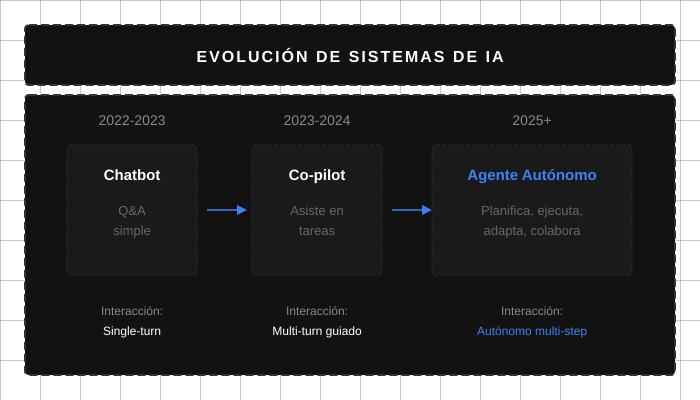
<p align="center"><em>Figura 1: Evolución de Sistemas de IA</em></p>
</td>
<td style="width: 32%; vertical-align: top; font-size: 14px; line-height: 1.5;">
<strong>La evolución muestra cuatro eras distintas</strong>: desde sistemas basados en reglas (1980s-2000s), pasando por ML estadístico (2000s-2017), hasta LLMs basados en transformers (2017-2023), y finalmente sistemas agénticos multi-agente (2023+).
</td>
</tr>
</table>

## 1.2 Agencia Funcional: Un Marco Teorico

La investigacion reciente propone el concepto de **agencia funcional** como marco teorico para sistemas agenticos. Un sistema exhibe agencia funcional cuando cumple tres condiciones:

### Formalizacion Matematica

Sea un sistema agéntico definido como una tupla:

**Definición 1.1 (Sistema Agéntico)**: Un sistema agéntico es una tupla A = (S, O, G, π, M, α) donde:
- S: Conjunto de estados del entorno
- O: Conjunto de observaciones que el agente puede percibir
- G: Conjunto de objetivos
- π: S × G → A, función de política que mapea estados y objetivos a acciones
- M: A × S → S, modelo de transición (acciones y estados a nuevos estados)
- α: función de adaptación que modifica π basada en feedback

**Definición 1.2 (Agencia Funcional)**: Un sistema A exhibe agencia funcional si y solo si satisface las tres condiciones siguientes:

### Condicion 1: Generacion de Acciones

El sistema debe ser capaz de **generar acciones basadas en informacion ambiental hacia un objetivo**. No es suficiente procesar informacion pasivamente; el agente debe tomar decisiones que modifiquen su entorno.

**Formalmente**: ∀s ∈ S, ∀g ∈ G: π(s, g) produce una acción a ∈ A que modifica el estado del entorno.

### Condicion 2: Modelo de Resultados

El sistema debe **representar relaciones entre acciones y sus consecuencias**. Esto implica una comprension causal (o correlacional fuerte) de como las acciones afectan el mundo.

**Formalmente**: El sistema mantiene un modelo M: A × S → S tal que M(a, s) predice el estado resultante s' de ejecutar acción a en estado s.

### Condicion 3: Adaptacion

El sistema debe **modificar su comportamiento cuando cambia su modelo de resultados**. Si descubre que una accion ya no produce el efecto esperado, debe adaptar su estrategia.

**Formalmente**: Si M(a, s) ≠ s' (predicción incorrecta), entonces α actualiza π tal que π'(s, g) ≠ π(s, g) para casos similares.

**Proposición 1.1**: Un LLM aislado no satisface la Condición 3 de agencia funcional, ya que sus parámetros son estáticos post-entrenamiento y no puede adaptar su política basada en feedback del entorno en tiempo de ejecución.

*Sketch de demostración*: Sea L un LLM con parámetros θ fijos post-entrenamiento. La función de política π de L está determinada por θ: π_L(s, g) = f_θ(s, g). La Condición 3 requiere que exista una función de adaptación α que modifique π cuando M(a, s) ≠ s'. Para L, modificar π requeriría modificar θ, pero θ es inmutable durante inferencia (el modelo está "congelado"). Por tanto, α no puede existir para L en tiempo de ejecución, y L no satisface la Condición 3. ∎

**Corolario 1.1**: Para construir sistemas con agencia funcional genuina, es necesario complementar LLMs con mecanismos externos de memoria, herramientas, y bucles de retroalimentación.

*Justificación*: Del resultado de la Proposición 1.1, si queremos que un sistema basado en LLM satisfaga la Condición 3, debemos externalizar la función de adaptación α. Los mecanismos externos (memoria persistente para recordar errores, herramientas para ejecutar acciones, bucles de feedback para evaluar resultados) permiten implementar α fuera del LLM, complementando sus capacidades estáticas con adaptación dinámica. ∎

<table style="width: 100%; border-collapse: collapse; margin: 20px 0; page-break-inside: avoid;">
<tr>
<td style="width: 68%; vertical-align: top; padding-right: 20px;">
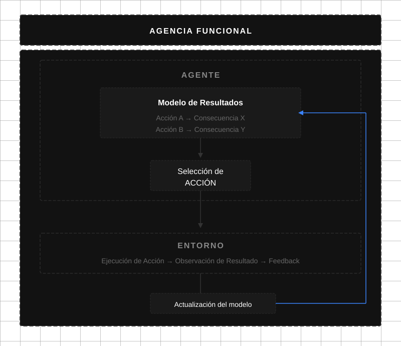
<p align="center"><em>Figura 2: Agencia Funcional</em></p>
</td>
<td style="width: 32%; vertical-align: top; font-size: 14px; line-height: 1.5;">
<strong>Las tres condiciones para agencia funcional</strong>: (1) Generación de Acciones; (2) Modelo de Resultados—comprensión causal; (3) Adaptación—modificar comportamiento cuando fallan predicciones. Un LLM aislado falla la Condición 3.
</td>
</tr>
</table>

## 1.3 Componentes de un Sistema Agentico

Los sistemas agenticos modernos se construyen sobre componentes fundamentales que trabajan en conjunto:

### 1.3.1 Motor de Razonamiento (LLM)

El nucleo del agente es un Large Language Model que proporciona:
- **Comprension del lenguaje natural**: Interpreta instrucciones y contexto
- **Razonamiento**: Descompone problemas y planifica soluciones
- **Generacion**: Produce texto, codigo, decisiones

### 1.3.2 Memoria

Los agentes requieren multiples tipos de memoria:

| Tipo | Funcion | Persistencia |
|------|---------|--------------|
| **Working Memory** | Contexto de la tarea actual | Sesion |
| **Episodic Memory** | Experiencias pasadas indexadas | Largo plazo |
| **Semantic Memory** | Conocimiento del dominio | Permanente |
| **Procedural Memory** | Patrones de ejecucion aprendidos | Permanente |
| **Structural Memory** | Pesos de confianza inter-agente (MAP) | Adaptativa |

### 1.3.3 Herramientas (Tools)

Las herramientas extienden las capacidades del agente mas alla de la generacion de texto:
- **Ejecucion de codigo**: Compiladores, interpretes, debuggers
- **Acceso a datos**: APIs, bases de datos, sistemas de archivos
- **Interaccion web**: Navegacion, busqueda, scraping
- **Comunicacion**: Email, mensajeria, notificaciones

### 1.3.4 Ciclo de Retroalimentacion

El sistema agentico opera mediante bucles de feedback integrados:

<table style="width: 100%; border-collapse: collapse; margin: 20px 0; page-break-inside: avoid;">
<tr>
<td style="width: 68%; vertical-align: top; padding-right: 20px;">
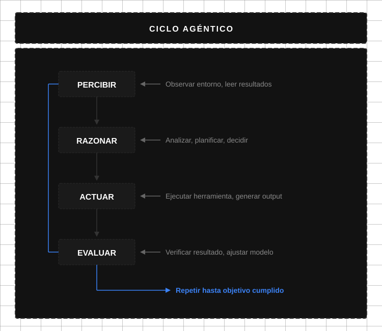
<p align="center"><em>Figura 3: Ciclo Agéntico</em></p>
</td>
<td style="width: 32%; vertical-align: top; font-size: 14px; line-height: 1.5;">
<strong>El ciclo agéntico continuo</strong>: Percibir → Pensar → Actuar → Observar → Adaptar. El agente recibe input, razona, ejecuta con herramientas, observa resultados y actualiza su estado interno.
</td>
</tr>
</table>

## 1.4 Patrones de Razonamiento Agentico

La investigacion ha identificado patrones fundamentales para el razonamiento en agentes:

### 1.4.1 Chain-of-Thought (CoT)

El agente explicita su proceso de razonamiento paso a paso antes de actuar:

```
Pregunta: "Cuales fueron las ventas totales del Q3?"

Razonamiento CoT:
1. Necesito consultar datos de ventas
2. El Q3 corresponde a julio-septiembre
3. Debo sumar todas las transacciones en ese periodo
4. Voy a usar la herramienta execute_dax con la consulta apropiada

Accion: execute_dax("CALCULATE(SUM(Sales[Amount]), QUARTER(Sales[Date])=3)")
```

### 1.4.2 ReAct (Reasoning and Acting)

Alterna entre razonamiento y accion, usando observaciones para guiar los siguientes pasos:

```
Thought: Necesito encontrar informacion sobre el cliente Acme
Action: search_documents("cliente Acme contratos")
Observation: Encontrados 3 documentos relevantes...
Thought: El documento principal es el contrato de 2024
Action: read_document("contrato_acme_2024.pdf")
Observation: El contrato especifica...
Thought: Ahora puedo responder la pregunta
Answer: Segun el contrato de 2024, el cliente Acme...
```

### 1.4.3 Reflexion

El agente evalua criticamente su propio output y lo mejora iterativamente:

```
Intento 1: [Genera respuesta]
Evaluacion: "Esta respuesta no cita fuentes especificas"
Intento 2: [Genera respuesta mejorada con citas]
Evaluacion: "Ahora es precisa y verificable"
Output Final: [Respuesta refinada]
```

### 1.4.4 Planificacion

Para tareas complejas, el agente genera un plan antes de ejecutar:

```
Objetivo: "Crear un reporte de ventas por region"

Plan:
1. Identificar el modelo de datos correcto
2. Consultar ventas por region
3. Consultar ventas del periodo anterior para comparacion
4. Calcular variaciones porcentuales
5. Generar visualizacion
6. Redactar insights principales

Ejecucion: [Ejecuta cada paso del plan]
```

## 1.5 Capacidades Actuales (Estado del Arte 2026)

### 1.5.1 Que Pueden Hacer los Agentes Hoy

Los sistemas agenticos actuales demuestran capacidades impresionantes:

**Programacion Agentica**:
- Generar codigo a partir de especificaciones en lenguaje natural
- Interactuar con compiladores, debuggers y sistemas de control de versiones
- Iterar sobre errores y refinar soluciones

**Automatizacion de Workflows**:
- Completar tareas multi-paso en aplicaciones empresariales
- Coordinar entre multiples sistemas (CRM, ERP, BI)
- Manejar excepciones y casos edge

**Investigacion y Analisis**:
- Buscar y sintetizar informacion de multiples fuentes
- Generar reportes estructurados
- Identificar patrones y anomalias en datos

**Interaccion con Herramientas**:
- Navegar interfaces web
- Ejecutar consultas en bases de datos
- Generar y modificar documentos

### 1.5.2 Niveles de Autonomia

La madurez de los sistemas agenticos se mide en niveles:

| Nivel | Descripcion | Estado 2025 |
|-------|-------------|-------------|
| **1** | Asistencia basica con herramientas limitadas | Maduro |
| **2** | Ejecucion multi-paso con supervision | Maduro |
| **3** | Autonomia en dominios especificos (<30 herramientas) | Emergente |
| **4** | Autonomia amplia con auto-correccion | Investigacion |
| **5** | Autonomia completa con aprendizaje continuo | Futuro |

Segun analisis de la industria, a Q1 2026 la mayoria de aplicaciones agenticas pe

rmanecen en Niveles 2 y 3, con algunas explorando Nivel 4 dentro de dominios espe

cificos.

## 1.6 Limitaciones y Desafios

### 1.6.1 Limitaciones de los LLMs Actuales

Los modelos de lenguaje actuales presentan deficiencias criticas para agencia:

**Razonamiento Causal Limitado**:
- Confunden correlacion con causalidad
- Dificultad para predecir consecuencias de acciones novedosas
- Sesgo hacia patrones observados en entrenamiento

**Falta de Metacognicion**:
- Desconocimiento de sus propias limitaciones
- Sobreconfianza sistematica en respuestas incorrectas
- Dificultad distinguiendo informacion suficiente de insuficiente

**Alucinaciones**:
- Generacion de informacion plausible pero falsa
- Inventar citas, datos o hechos
- Rellenar gaps de conocimiento con fabricaciones

### 1.6.2 Desafios de Sistemas

**Escalabilidad de Memoria**:
- Ventanas de contexto finitas (128K-2M tokens)
- Falta de persistencia estructurada entre sesiones
- Degradacion de rendimiento con contextos largos

**Seguridad y Confiabilidad**:
- Riesgo de ejecucion de acciones inseguras sin supervision
- Comportamientos emergentes no anticipados
- Dificultad para auditar decisiones

**Incompatibilidad de Herramientas**:
- Herramientas disenadas para humanos, no agentes
- APIs inconsistentes y documentacion incompleta
- Necesidad de wrappers y adaptadores

**Evaluacion Inadecuada**:
- Benchmarks existentes no capturan workflows reales
- Metricas de precision no reflejan utilidad practica
- Dificultad para medir autonomia y confiabilidad

<p align="center">
  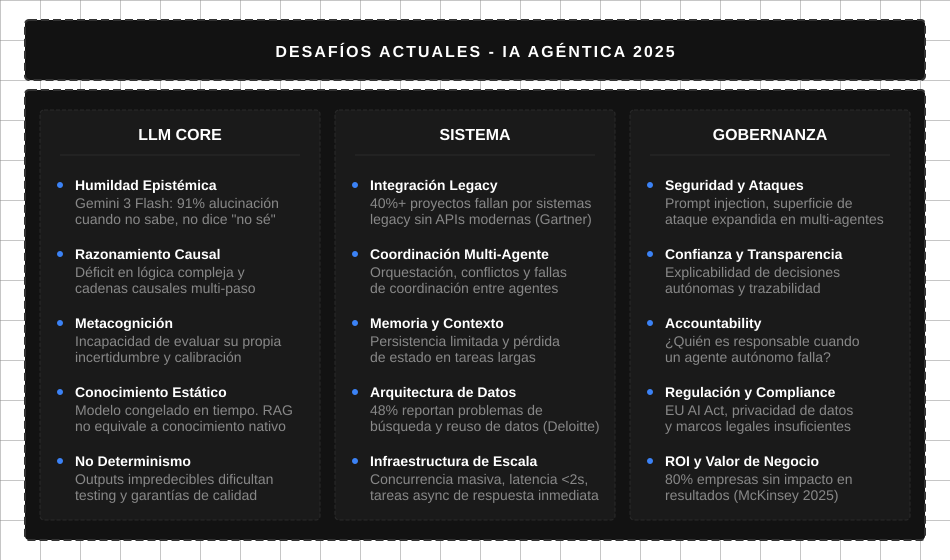
<br><em>Figura 4: Desafíos Actuales</em>
</p>

## 1.7 Horizonte: Vision 2026-2030

### 1.7.1 Tendencias Emergentes (2026)

**Multi-Agente como Norma**:
- Sistemas donde agentes especializados colaboran
- Descentralizacion y especializacion como arquitectura dominante
- Patron similar a microservicios en desarrollo de software

**Small Language Models para Agentes**:
- SLMs suficientemente potentes para tareas repetitivas especializadas
- Mas economicos y eficientes para invocaciones masivas
- Ideal para componentes de sistemas agenticos complejos

**Fusion con IoT y Robotica**:
- Robots de almacen gestionados por agentes de decision
- Vehiculos autonomos coordinados con agentes de supply chain
- Fundamentos para fabricas inteligentes y redes logisticas automatizadas

### 1.7.2 Predicciones de la Industria

| Horizonte | Prediccion |
|-----------|------------|
| **2026** | 40% de empresas con gen AI lanzan pilotos agenticos |
| **2028** | 65% de empresas con gen AI usan sistemas agenticos |
| **2029** | Agentes resuelven 80% de issues de servicio al cliente (Gartner) |  
| **2030** | Ecosistemas multi-agente entre industrias |

### 1.7.3 Vision: Empresas Autonomas

El horizonte apunta hacia **empresas con autonomia incremental**:

**Fase 1 (2023-2025)**: Co-pilotos asisten en tareas especificas
**Fase 2 (Actual, 2026-2027)**: Agentes ejecutan workflows completos con supervis
ion
**Fase 3 (2028-2029)**: Ecosistemas multi-agente coordinan entre departamentos   
**Fase 4 (2030+)**: Autonomia en la mayoria de procesos operativos
<table style="width: 100%; border-collapse: collapse; margin: 20px 0; page-break-inside: avoid;">
<tr>
<td style="width: 68%; vertical-align: top; padding-right: 20px;">
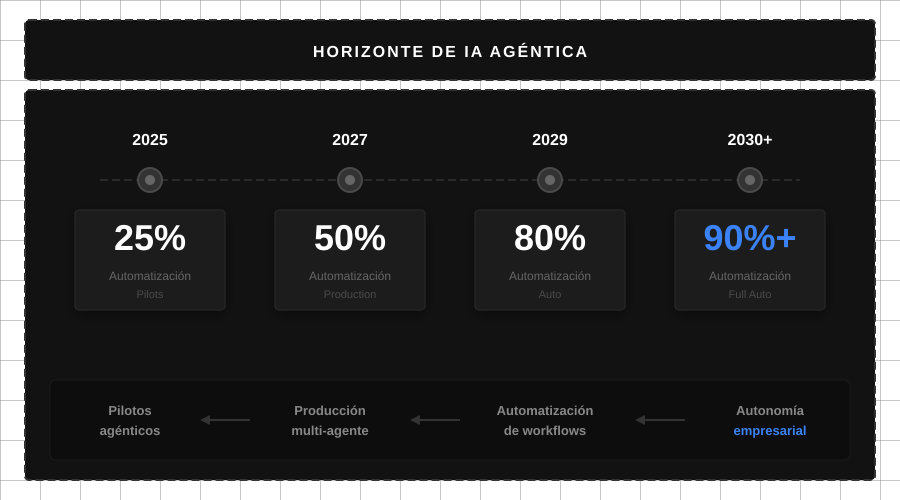
<p align="center"><em>Figura 5: Horizonte de IA Agéntica</em></p>
</td>
<td style="width: 32%; vertical-align: top; font-size: 14px; line-height: 1.5;">
<strong>Trayectoria 2025-2030</strong>: Fase 1 (actual) co-pilotos; Fase 2 (2025-27) agentes con supervisión; Fase 3 (2027-29) ecosistemas multi-agente; Fase 4 (2030+) autonomía operacional.
</td>
</tr>
</table>

---

# Capitulo 2: Arquitecturas Multi-Agente

## 2.1 De Monolitico a Multi-Agente

La transicion de LLMs individuales a sistemas multi-agente representa un cambio paradigmatico similar a la evolucion de aplicaciones monoliticas a microservicios:

| Aspecto | LLM Monolitico | Sistema Multi-Agente |
|---------|----------------|----------------------|
| **Responsabilidad** | Un modelo hace todo | Agentes especializados |
| **Escalabilidad** | Vertical (modelo mas grande) | Horizontal (mas agentes) |
| **Confiabilidad** | Punto unico de falla | Redundancia y fallbacks |
| **Mantenimiento** | Cambio afecta todo | Cambios aislados |
| **Especializacion** | Generalista | Expertos de dominio |

### Ventajas del Enfoque Multi-Agente

**Especializacion**:
- Cada agente optimizado para su dominio
- Prompts y herramientas especificas
- Menor carga cognitiva por agente

**Composicion**:
- Agentes reutilizables entre aplicaciones
- Nuevas capacidades agregando agentes
- Flexibilidad arquitectonica

**Resiliencia**:
- Fallo de un agente no colapsa el sistema
- Reintentos y fallbacks posibles
- Degradacion graceful

## 2.2 Arquitecturas Principales (2026)

La investigacion y practica industrial han convergido en cinco arquitecturas principales:

### 2.2.1 Arquitectura Jerarquica Cognitiva

Divide la inteligencia en capas con diferentes escalas temporales y niveles de abstraccion:

<table style="width: 100%; border-collapse: collapse; margin: 20px 0; page-break-inside: avoid;">
<tr>
<td style="width: 68%; vertical-align: top; padding-right: 20px;">
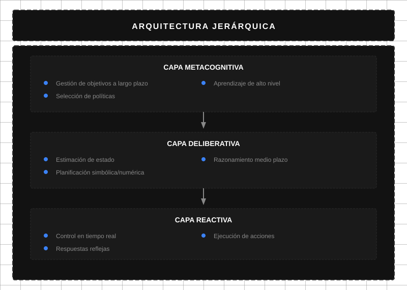
<p align="center"><em>Figura 6: Arquitectura Jerárquica</em></p>
</td>
<td style="width: 32%; vertical-align: top; font-size: 14px; line-height: 1.5;">
<strong>Capas cognitivas con escalas temporales diferentes</strong>: Capa estratégica (planificación largo plazo), Capa táctica (decisiones intermedias), Capa operacional (ejecución tiempo real). <strong>Uso</strong>: Robótica, trading.
</td>
</tr>
</table>

**Uso**: Sistemas que requieren decisiones a multiples escalas temporales (robotica, trading).

### 2.2.2 Arquitectura Swarm (Enjambre)

Enfoque minimalista con agentes simples que emergen comportamiento complejo:

<table style="width: 100%; border-collapse: collapse; margin: 20px 0; page-break-inside: avoid;">
<tr>
<td style="width: 68%; vertical-align: top; padding-right: 20px;">
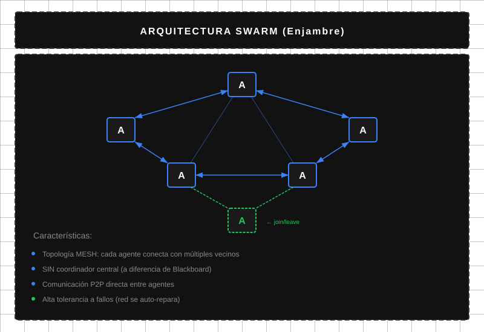
<p align="center"><em>Figura 7: Arquitectura Swarm</em></p>
</td>
<td style="width: 32%; vertical-align: top; font-size: 14px; line-height: 1.5;">
<strong>Agentes homogéneos simples con comportamiento emergente</strong>: Comunicación peer-to-peer, sin coordinador central. <strong>Uso</strong>: Prototipado rápido, búsqueda distribuida.
</td>
</tr>
</table>

**Uso**: Prototipado rapido, busqueda distribuida, procesamiento paralelo.

> **Nota: Swarm vs Blackboard vs MAP**
>
> Es importante distinguir tres conceptos relacionados pero distintos:
> - **Swarm** (esta sección): *Arquitectura* donde agentes homogéneos se comunican peer-to-peer y el comportamiento emerge de interacciones locales. No hay estado central ni coordinador.
> - **Blackboard** (Sección 2.3.4): *Patrón de coordinación* donde agentes heterogéneos leen/escriben en un estado compartido central. Compatible con múltiples arquitecturas.
> - **MAP** (Capítulo 11): *Mecanismo de plasticidad* que puede aplicarse a cualquier arquitectura, permitiendo que los pesos de confianza entre agentes evolucionen mediante aprendizaje Hebbiano.
>
> En la práctica, un sistema podría combinar arquitectura Swarm con coordinación Blackboard y plasticidad MAP.

### 2.2.3 Arquitectura de Meta-Aprendizaje

Separa el aprendizaje de tareas del meta-aprendizaje (aprender a aprender). **Magentic-One** de Microsoft Agent Framework ejemplifica este patrón:

<table style="width: 100%; border-collapse: collapse; margin: 20px 0; page-break-inside: avoid;">
<tr>
<td style="width: 68%; vertical-align: top; padding-right: 20px;">
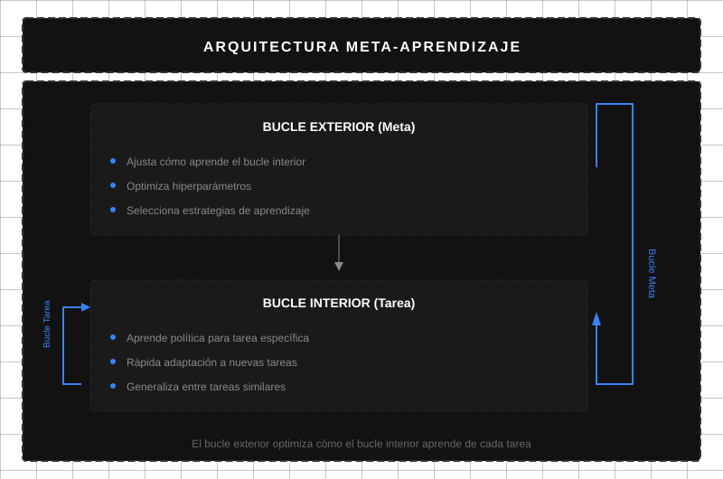
<p align="center"><em>Figura 8: Meta-Aprendizaje</em></p>
</td>
<td style="width: 32%; vertical-align: top; font-size: 14px; line-height: 1.5;">
<strong>Aprender a aprender</strong>: Separa ejecución de tareas del meta-aprendizaje. Magentic-One de Microsoft ejemplifica este patrón. <strong>Uso</strong>: Sistemas que requieren adaptación rápida.
</td>
</tr>
</table>

**Uso**: Sistemas que deben adaptarse rapidamente a nuevos dominios.

> **Conexión con MAP**: El meta-aprendizaje es el precursor teórico de la plasticidad estructural propuesta en MAP (Capítulo 11). Mientras el meta-aprendizaje tradicional opera sobre *parámetros de modelo*, MAP extiende el concepto a *pesos de confianza inter-agente*, permitiendo que la topología de coordinación evolucione adaptativamente. Esto representa un nivel superior de adaptación: no solo "aprender a aprender", sino "aprender a colaborar".

### 2.2.4 Arquitectura Modular

Componentes intercambiables con interfaces bien definidas:

<table style="width: 100%; border-collapse: collapse; margin: 20px 0; page-break-inside: avoid;">
<tr>
<td style="width: 68%; vertical-align: top; padding-right: 20px;">
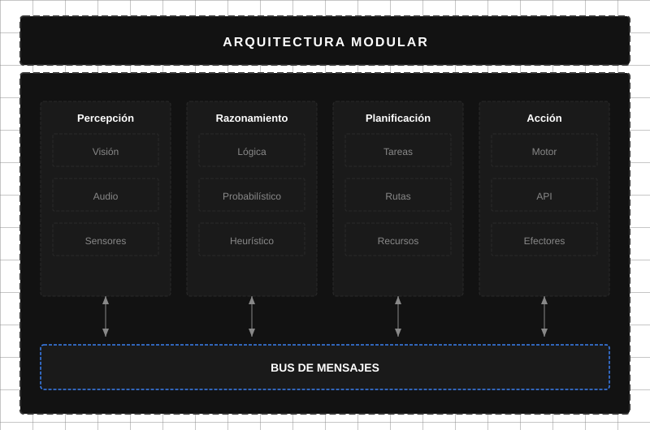
<p align="center"><em>Figura 9: Arquitectura Modular</em></p>
</td>
<td style="width: 32%; vertical-align: top; font-size: 14px; line-height: 1.5;">
<strong>Componentes intercambiables con interfaces definidas</strong>: Agentes plug-and-play, módulos hot-swappable. <strong>Uso</strong>: Sistemas empresariales que requieren flexibilidad.
</td>
</tr>
</table>

**Uso**: Sistemas empresariales que requieren componentes intercambiables.

### 2.2.5 Arquitectura Evolutiva

Agentes que evolucionan y se adaptan mediante selección y mutación:

<table style="width: 100%; border-collapse: collapse; margin: 20px 0; page-break-inside: avoid;">
<tr>
<td style="width: 68%; vertical-align: top; padding-right: 20px;">
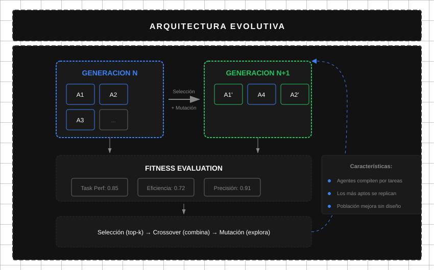
<p align="center"><em>Figura 10: Arquitectura Evolutiva</em></p>
</td>
<td style="width: 32%; vertical-align: top; font-size: 14px; line-height: 1.5;">
<strong>Agentes que evolucionan mediante selección y mutación</strong>: Población de variantes compiten; estrategias exitosas se propagan. <strong>Uso</strong>: Optimización largo plazo, sistemas auto-mejorables.
</td>
</tr>
</table>

**Uso**: Optimización a largo plazo, sistemas auto-mejorables, descubrimiento de estrategias.

### 2.2.6 Arquitectura Orquestador-Trabajador

Un agente central coordina trabajadores especializados:

<table style="width: 100%; border-collapse: collapse; margin: 20px 0; page-break-inside: avoid;">
<tr>
<td style="width: 68%; vertical-align: top; padding-right: 20px;">
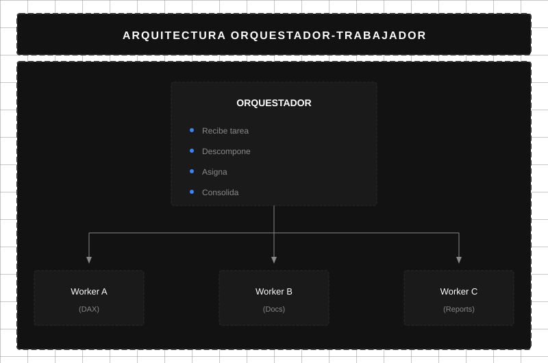
<p align="center"><em>Figura 11: Arquitectura Orquestador-Trabajador</em></p>
</td>
<td style="width: 32%; vertical-align: top; font-size: 14px; line-height: 1.5;">
<strong>Coordinador central con workers especializados</strong>: Orquestador descompone tareas, asigna a workers apropiados, agrega resultados. <strong>Uso</strong>: Mayoría de sistemas multi-agente empresariales.
</td>
</tr>
</table>

### 2.2.7 Arquitectura Generador-Critico

Separa la creacion de contenido de su validacion:

<table style="width: 100%; border-collapse: collapse; margin: 20px 0; page-break-inside: avoid;">
<tr>
<td style="width: 68%; vertical-align: top; padding-right: 20px;">
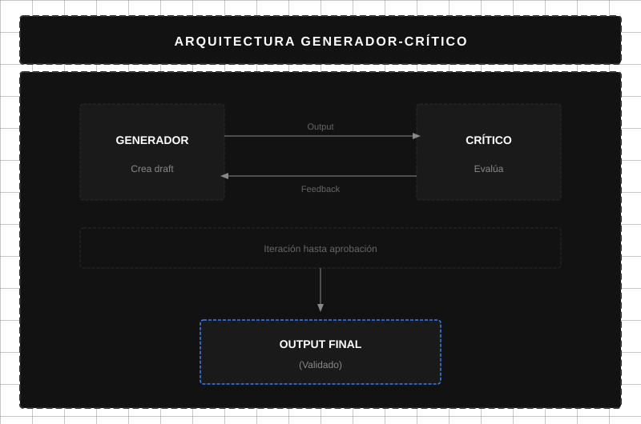
<p align="center"><em>Figura 12: Arquitectura Generador-Crítico</em></p>
</td>
<td style="width: 32%; vertical-align: top; font-size: 14px; line-height: 1.5;">
<strong>Separa creación de validación</strong>: Generador produce contenido; Crítico evalúa calidad y da feedback. Itera hasta umbral de calidad. <strong>Uso</strong>: Generación de código, contenido de alta calidad.
</td>
</tr>
</table>

### 2.2.8 Arquitectura Blackboard (Pizarra)

Agentes comparten estado via almacenamiento centralizado:

<table style="width: 100%; border-collapse: collapse; margin: 20px 0; page-break-inside: avoid;">
<tr>
<td style="width: 68%; vertical-align: top; padding-right: 20px;">
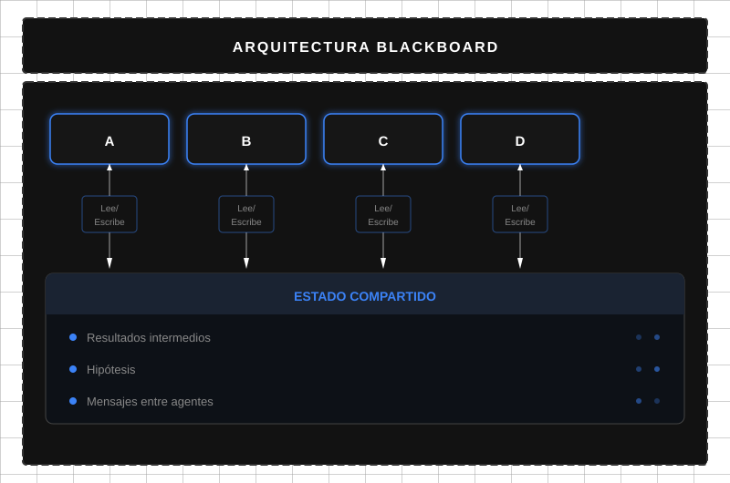
<p align="center"><em>Figura 13: Arquitectura Blackboard</em></p>
</td>
<td style="width: 32%; vertical-align: top; font-size: 14px; line-height: 1.5;">
<strong>Estado compartido centralizado</strong>: Agentes leen/escriben en almacenamiento común. Sin comunicación directa inter-agente. <strong>Uso</strong>: Colaboración de agentes heterogéneos.
</td>
</tr>
</table>

### 2.2.9 Arquitectura Secuencial (Pipeline)

Agentes procesan en cadena, cada uno transforma el output del anterior:

<table style="width: 100%; border-collapse: collapse; margin: 20px 0; page-break-inside: avoid;">
<tr>
<td style="width: 68%; vertical-align: top; padding-right: 20px;">
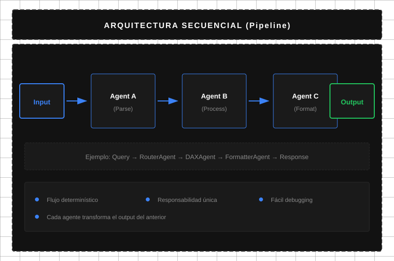
<p align="center"><em>Figura 14: Arquitectura Secuencial</em></p>
</td>
<td style="width: 32%; vertical-align: top; font-size: 14px; line-height: 1.5;">
<strong>Procesamiento en cadena</strong>: Cada agente transforma output del anterior. Flujo determinístico, fácil de depurar. <strong>Uso</strong>: Procesamiento estructurado, ETL, pipelines.
</td>
</tr>
</table>

**Uso**: Procesamiento estructurado, ETL, pipelines de transformación.

### 2.2.10 Arquitectura Paralela (Fan-out/Fan-in)

Múltiples agentes procesan simultáneamente y combinan resultados:

<table style="width: 100%; border-collapse: collapse; margin: 20px 0; page-break-inside: avoid;">
<tr>
<td style="width: 68%; vertical-align: top; padding-right: 20px;">
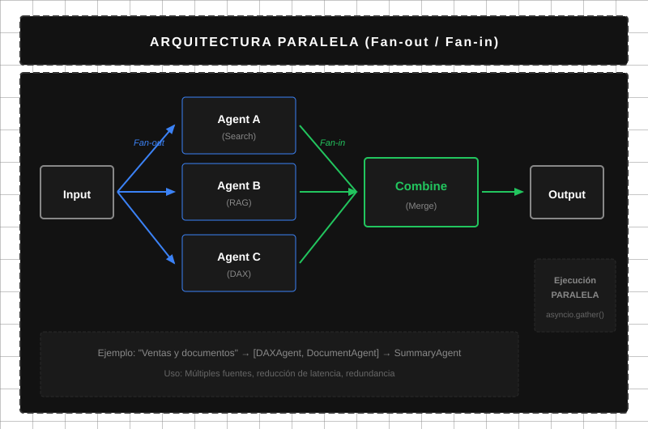
<p align="center"><em>Figura 15: Arquitectura Paralela</em></p>
</td>
<td style="width: 32%; vertical-align: top; font-size: 14px; line-height: 1.5;">
<strong>Procesamiento simultáneo con agregación</strong>: Fan-out distribuye trabajo; Fan-in combina resultados. Minimiza latencia, habilita redundancia. <strong>Uso</strong>: Consultas multi-fuente, tolerancia a fallos.
</td>
</tr>
</table>

**Uso**: Consultas que requieren múltiples fuentes, reducción de latencia, redundancia.

### 2.2.11 Arquitectura Reflexiva (Loop)

Agente evalúa su output y refina iterativamente hasta satisfacer criterio:

<table style="width: 100%; border-collapse: collapse; margin: 20px 0; page-break-inside: avoid;">
<tr>
<td style="width: 68%; vertical-align: top; padding-right: 20px;">
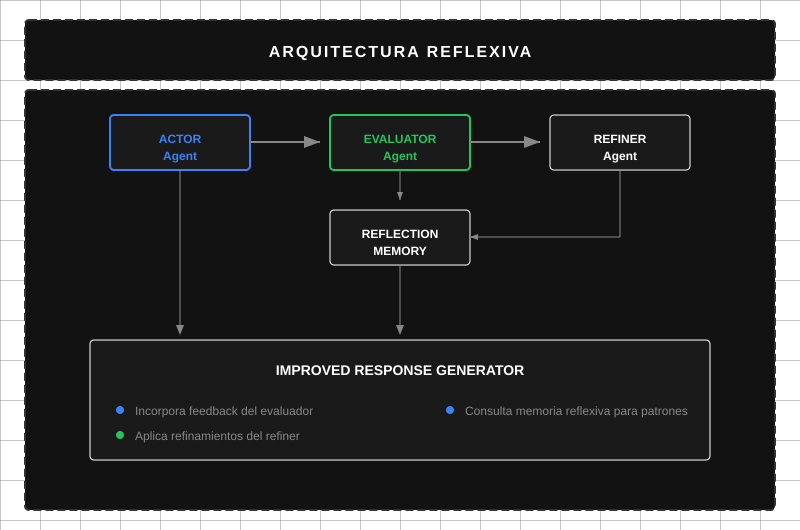
<p align="center"><em>Figura 16: Arquitectura Reflexiva</em></p>
</td>
<td style="width: 32%; vertical-align: top; font-size: 14px; line-height: 1.5;">
<strong>Auto-evaluación y refinamiento iterativo</strong>: Agente produce output, evalúa contra criterios, refina hasta satisfactorio. <strong>Uso</strong>: Generación de código, contenido de alta calidad.
</td>
</tr>
</table>

**Uso**: Generación de código, respuestas de alta calidad, tareas con criterio verificable.

## 2.3 Frameworks y Herramientas (Estado 2026)

| Framework | Arquitectura | Uso Principal |
|-----------|--------------|---------------|
| **LangGraph** | Grafos de estado | Agentes de producción con persistencia y ciclos |
| **AutoGen** | Conversacional asíncrono | Cooperación multi-agente event-driven |
| **CrewAI** | Role-playing | Equipos de agentes con roles definidos |
| **Semantic Kernel** | Orquestación enterprise | Integración empresarial (.NET/Python/Java) |
| **Swarm** | Handoffs livianos | Educacional, máxima simplicidad |
| **LlamaIndex** | RAG-first | Agentes document-aware |
| **DSPy** | Compilador de prompts | Optimización automática de prompts |
| **MS Agent Framework** | Unificado | SK + AutoGen combinados (**base de Lumen**) |

## 2.4 Metricas de Rendimiento

### 2.4.1 Metricas de Efectividad

| Metrica | Descripcion | Benchmark |
|---------|-------------|-----------|
| **Task Completion Rate** | % de tareas completadas exitosamente | 80-90% (routed) |
| **First-Pass Success** | Exito sin reintentos | 60-75% |
| **Error Recovery Rate** | Recuperacion de fallos | 70-85% |

### 2.4.2 Metricas de Eficiencia

| Metrica | Descripcion | Impacto |
|---------|-------------|---------|
| **Latency** | Tiempo total de respuesta | Router reduce 30-40% |
| **Token Usage** | Consumo de tokens LLM | Especializacion reduce 20-30% |
| **Tool Invocations** | Llamadas a herramientas | Menos con mejor routing |

### 2.4.3 Comparativa: Single vs Multi-Agent

<table style="width: 100%; border-collapse: collapse; margin: 20px 0; page-break-inside: avoid;">
<tr>
<td style="width: 68%; vertical-align: top; padding-right: 20px;">
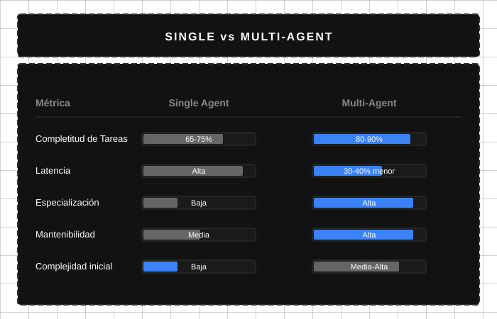
<p align="center"><em>Figura 17: Single vs Multi-Agent</em></p>
</td>
<td style="width: 32%; vertical-align: top; font-size: 14px; line-height: 1.5;">
<strong>Rendimiento y Arquitectura</strong>: La arquitectura multi-agente logra una precisión +20pp mayor que los LLMs monolíticos, siendo a su vez un 40% más rápida gracias a la ejecución en paralelo y el razonamiento especializado. Aunque requiere una mayor complejidad inicial de orquestación, esta inversión se recupera mediante una recuperación de errores superior, mantenibilidad modular y un rendimiento especializado que los modelos generalistas no pueden alcanzar.
</td>
</tr>
</table>

---

# Capitulo 3: Trabajo Relacionado

Este capitulo posiciona el trabajo presentado en relacion con la literatura existente, analizando criticamente los enfoques previos e identificando las brechas que este trabajo aborda.

## 3.1 Fundamentos Teoricos

### 3.1.1 Agentes Inteligentes

El estudio de agentes inteligentes tiene raices en la inteligencia artificial clasica. Wooldridge y Jennings (1995) definieron un agente como un sistema computacional situado en un entorno, capaz de accion autonoma para alcanzar objetivos. Esta definicion ha evolucionado con la llegada de LLMs, pero los principios fundamentales permanecen.

Russell y Norvig (2020) clasifican agentes segun su arquitectura:
- **Agentes reactivos simples**: Responden directamente a percepciones
- **Agentes basados en modelo**: Mantienen estado interno del mundo
- **Agentes basados en objetivos**: Planifican para alcanzar metas
- **Agentes basados en utilidad**: Optimizan una funcion de utilidad

Los sistemas agenticos modernos con LLMs combinan elementos de todas estas categorias, agregando capacidades de razonamiento en lenguaje natural.

### 3.1.2 Sistemas Multi-Agente

La investigacion en Sistemas Multi-Agente (MAS) establecio principios de coordinacion y comunicacion entre agentes (Ferber, 1999). Conceptos clave incluyen:

- **Coordinacion**: Mecanismos para que agentes trabajen juntos sin conflictos
- **Negociacion**: Protocolos para resolver diferencias de objetivos
- **Organizacion**: Estructuras que definen roles y relaciones

Estos principios informan el diseno de sistemas multi-agente con LLMs, aunque la comunicacion via lenguaje natural introduce nuevas posibilidades y desafios.

### 3.1.3 Business Intelligence

El campo de Business Intelligence se formalizo con trabajos de Kimball (1996) sobre modelado dimensional y Inmon (2005) sobre arquitecturas de data warehouse. Conceptos fundamentales incluyen:

- **Modelo dimensional**: Hechos y dimensiones como estructura base
- **OLAP**: Operaciones de analisis multidimensional
- **ETL**: Procesos de extraccion, transformacion y carga

Lumen opera sobre modelos semanticos Power BI que implementan estos principios, agregando una capa de lenguaje natural para democratizar el acceso.

## 3.2 Trabajo Relacionado en Sistemas Multi-Agente con LLMs

### 3.2.1 Frameworks de Orquestacion

**LangChain/LangGraph** (Harrison Chase, 2022-2024): Framework pionero que introdujo el concepto de "chains" para composicion de LLMs. LangGraph extiende esto con grafos de estado para workflows complejos.

*Fortalezas*: Control fino sobre flujo de ejecucion, estado persistente, comunidad activa.
*Limitaciones*: Curva de aprendizaje pronunciada, abstraccion a veces opaca, no optimizado para BI.

**Microsoft Agent Framework** (2024): Unifica Semantic Kernel y AutoGen. Proporciona `ChatCompletionAgent`, `@ai_function`, Agent-as-Tool, Guardrails (groundedness), y Magentic-One. **Base de implementación de Lumen**.

*Fortalezas*: Integración Azure, typing estricto, MCP nativo, Guardrails, telemetría.
*Limitaciones*: Ecosistema más joven que LangChain, documentación en evolución.

**CrewAI** (Moura, 2024): Framework simplificado con metafora de "crew" (equipo) de agentes con roles definidos.

*Fortalezas*: Simplicidad, rapido prototipado, roles claros.
*Limitaciones*: Menos control que LangGraph, limitado para workflows complejos.

**OpenAI Swarm** (OpenAI, 2024): Framework minimalista experimental para "handoffs" entre agentes.

*Fortalezas*: Minimalismo, facilidad de uso, concepto claro de transferencia.
*Limitaciones*: Experimental, sin soporte de produccion, sin estado persistente.

### 3.2.2 Sistemas de BI Conversacional

**Power BI Q&A** (Microsoft): Permite preguntas en lenguaje natural sobre modelos Power BI.

*Fortalezas*: Integracion nativa, sin configuracion adicional.
*Limitaciones*: Solo consultas simples, sin agentes, sin documentos, respuestas limitadas.

**ThoughtSpot** (ThoughtSpot Inc.): Plataforma de analytics con busqueda en lenguaje natural.

*Fortalezas*: Diseno centrado en busqueda, visualizaciones automaticas.
*Limitaciones*: Solucion propietaria, no extensible, sin arquitectura agentica.

**Tableau Ask Data** (Salesforce): Interfaz de lenguaje natural para Tableau.

*Fortalezas*: Integración con ecosistema Tableau.
*Limitaciones*: Capacidades limitadas, no multi-agente, respuestas básicas.

### 3.2.3 Sistemas Adaptativos y Aprendizaje Multi-Agente

Un área crítica que los trabajos anteriores no abordan es la **adaptación estructural** de sistemas multi-agente. Los enfoques existentes presentan topologías estáticas:

**DyLAN** (Liu et al., 2024): Dynamic LLM-Agent Network propone redes de agentes que pueden cambiar dinámicamente, pero opera a nivel de selección de agentes por tarea, no de pesos de confianza acumulativos.

*Fortalezas*: Primer trabajo en considerar dinamismo en redes de agentes LLM.
*Limitaciones*: No formaliza aprendizaje continuo; sin garantías teóricas de estabilidad.

**GTD (Graph-based Task Decomposition)** (Chen et al., 2024): Descompone tareas en grafos donde los nodos son agentes.

*Fortalezas*: Representación estructurada de dependencias entre agentes.
*Limitaciones*: Grafos son estáticos por tarea; no hay memoria de éxitos pasados entre tareas.

**MetaGPT** (Hong et al., 2024): Framework multi-agente que simula equipos de desarrollo de software.

*Fortalezas*: Roles bien definidos, flujos de trabajo realistas, artefactos intermedios.
*Limitaciones*: Topología fija (PM → Architect → Engineer → QA); no aprende de experiencias.

**Conexión con Multi-Agent Reinforcement Learning (MARL)**: El campo de MARL ha desarrollado técnicas para aprendizaje conjunto de políticas en sistemas multi-agente:

- **COMA** (Foerster et al., 2018): Counterfactual Multi-Agent Policy Gradients introduce baselines contrafactuales para atribución de crédito entre agentes.
- **MADDPG** (Lowe et al., 2017): Multi-Agent Deep Deterministic Policy Gradient permite políticas centralizadas durante entrenamiento con ejecución descentralizada.
- **QMIX** (Rashid et al., 2018): Factoriza la función Q conjunta permitiendo coordinación implícita.

*Diferencia con MAP*: MARL opera sobre políticas aprendidas end-to-end mediante gradientes, requiriendo millones de interacciones de entrenamiento. MAP opera sobre agentes pre-entrenados (LLMs), ajustando únicamente los *pesos de confianza* inter-agente mediante reglas Hebbianas locales—permitiendo adaptación con órdenes de magnitud menos datos y sin reentrenamiento del modelo base.

**Análisis crítico**: Ninguno de estos trabajos aborda la **barrera de adaptación**—la incapacidad de los sistemas multi-agente de modificar sus patrones de coordinación basándose en resultados observados. Todos asumen que la topología óptima puede diseñarse a priori, ignorando que:
1. El desempeño de colaboraciones específicas varía con el contexto
2. Nuevos patrones de colaboración efectivos pueden emerger con el uso
3. La "memoria institucional" de qué combinaciones funcionan se pierde entre sesiones

Esta brecha motiva la contribución principal de este trabajo: **MAP (Plasticidad Multiagente)**, que formaliza cómo los pesos de confianza inter-agente pueden evolucionar mediante aprendizaje Hebbiano, con garantías teóricas de estabilidad (Teorema 10.1).

## 3.3 Posicionamiento y Análisis Comparativo

### 3.3.1 Tabla Comparativa

| Dimension | LangGraph | AutoGen | CrewAI | Swarm | Power BI Q&A | **Lumen** |
|-----------|-----------|---------|--------|-------|--------------|-----------|
| **Arquitectura** | Grafos | Conversacional | Role-based | Handoff | Monolitico | Multi-Agente |
| **Estado Persistente** | ✅ | Parcial | ❌ | ❌ | ❌ | ✅ |
| **Routing Inteligente** | Manual | Implicito | Por rol | Handoff | Rule-based | Two-Layer |
| **Integracion BI** | Manual | Manual | Manual | Manual | Nativa | Nativa (Fabric) |
| **RAG** | Plugin | Plugin | Plugin | ❌ | ❌ | Integrado |
| **Memoria Cross-Agent** | Via estado | Via chat | ❌ | ❌ | ❌ | Persisted Memory |
| **OAuth Empresarial** | Manual | Manual | Manual | ❌ | Integrado | Integrado |
| **Visualizaciones** | Manual | Manual | Manual | ❌ | Nativas | Generadas |

### 3.3.2 Brechas Identificadas

El analisis de trabajos previos revela las siguientes brechas que este trabajo aborda:

1. **Brecha de Integracion BI**: Los frameworks de agentes no estan optimizados para BI; las soluciones de BI no tienen arquitectura agentica.

2. **Brecha de Memoria**: Ningun sistema combina memoria persistente estructurada (no solo texto) entre agentes especializados.

3. **Brecha de Routing**: Los enfoques son o muy simples (keywords) o muy costosos (LLM siempre). Falta optimizacion de costo/precision.

4. **Brecha de Especializacion**: Los frameworks genericos no tienen agentes pre-construidos para DAX, reportes, documentos empresariales.

### 3.3.3 Contribucion de Este Trabajo

Este trabajo llena estas brechas mediante:

1. **Integracion Nativa con BI**: Agentes especializados para Power BI/Fabric via MCP y OAuth.

2. **Persisted Memory Pattern**: Memoria estructurada que permite compartir datos (no solo texto) entre agentes.

3. **Two-Layer Routing**: Optimizacion que usa keywords para casos claros y LLM solo para ambiguos.

4. **Agentes Especializados**: DAXAgent, DocumentAgent, ReportAgent pre-construidos y probados.

5. **Plasticidad Estructural (MAP)**: Primera formalización de aprendizaje Hebbiano para pesos de confianza inter-agente, con garantías teóricas de estabilidad.

---

## De la Teoría a la Práctica

La **Parte I** estableció los fundamentos teóricos: qué es agencia funcional (Sección 1.2), las arquitecturas multi-agente disponibles (Sección 2.2), y la brecha de plasticidad estructural que este trabajo aborda (Sección 1.3).

La **Parte II** demuestra cómo estos conceptos se materializan en Lumen:

| Concepto Teórico | Sección | Implementación en Lumen | Capacidad |
|------------------|---------|------------------------|-----------|
| Agencia Funcional (Def. 1.1) | 1.2 | Agentes con modelo de resultados, selección de acciones, feedback | Cap. 4 |
| Modelo de Resultados | 1.2 | Tools tipados con @ai_function | Cap. 4 |
| Arquitectura Jerárquica | 2.2.1 | BIWorkflow como supervisor | Cap. 2 |
| Arquitectura Paralela | 2.2.10 | Embedding parallel, concurrent queries | Cap. 8 |
| Arquitectura Reflexiva | 2.2.11 | Self-critique en DAXAgent | Cap. 3 |
| Memoria (requisito agencia) | 1.2 | Persisted Memory en SQL Server | Cap. 1 |
| Plasticidad Estructural (MAP) | 3.2 | Trust weights adaptativos | Cap. 10 |

*Lumen no es solo una implementación—es un laboratorio donde cada capacidad valida un principio teórico. Las siguientes 10 capacidades demuestran la aplicabilidad práctica del marco.*

---

# PARTE II: INTRODUCCION A LUMEN

---

# Introducción

## 1.1 Contexto del Problema

La adopción de Inteligencia Artificial en Business Intelligence presenta un desafío fundamental: los usuarios de negocio necesitan respuestas, no interfaces técnicas. Un usuario que pregunta "¿Cuáles fueron las ventas del Q3 comparadas con el Q2?" espera una respuesta inmediata con números, contexto y quizá una visualización. Sin embargo, tradicionalmente debe navegar reportes, configurar filtros e interpretar gráficos manualmente.

Este desafío no es exclusivo del dominio de BI. Industrias como administración, operación, automatización de procesos, investigación científica y legal enfrentan problemas similares: la necesidad de sistemas que combinen razonamiento de lenguaje natural con acceso estructurado a datos específicos del dominio.

## 1.2 Motivación

Los Large Language Models (LLMs) aislados no resuelven este problema. Sufren de múltiples limitaciones críticas:

- **Alucinaciones**: Inventan datos que parecen plausibles pero son incorrectos
- **Falta de acceso a datos reales**: No pueden consultar bases de datos empresariales
- **Ausencia de memoria persistente**: Cada conversación comienza desde cero
- **Capacidades limitadas**: Solo generan texto, sin ejecutar acciones en sistemas externos

Estas limitaciones motivan la necesidad de arquitecturas más sofisticadas que extiendan las capacidades de los LLMs manteniendo sus fortalezas de razonamiento en lenguaje natural.

## 1.3 Brecha de Investigación: La Barrera de Adaptación

Los **agentes autónomos** combinan razonamiento, acceso a herramientas, memoria y autonomía controlada. Una arquitectura **multi-agente** distribuye responsabilidades entre agentes especializados, donde cada uno domina un área específica (DAX, documentos, reportes) mientras colaboran para resolver problemas complejos.

Sin embargo, los frameworks actuales (AutoGen, LangGraph, CrewAI) presentan una limitación fundamental que denominamos la **barrera de adaptación**: mientras los parámetros θ del LLM permanecen fijos post-entrenamiento, la topología de coordinación entre agentes también permanece estática. Esto impide que el sistema aprenda de experiencias acumuladas para mejorar su desempeño.

**Gap identificado**: No existe un marco teórico que formalice cómo los sistemas multi-agente pueden exhibir *plasticidad estructural*—la capacidad de que las conexiones y pesos de confianza entre agentes evolucionen dinámicamente basándose en resultados observados.

## 1.4 Contribuciones

Este trabajo presenta **Lumen**, una plataforma de BI conversacional construida sobre **Microsoft Agent Framework** con arquitectura multi-agente, cuyo propósito es democratizar el acceso a insights de negocio mediante interfaz conversacional que combine LLMs con sistemas transaccionales.

### Tesis Central

> **Este trabajo demuestra que una arquitectura multi-agente basada en agencia funcional—con agentes especializados, workflows dinámicos, handoffs contextuales y detección de intenciones—supera a los enfoques monolíticos en Business Intelligence.** Los resultados muestran +20pp en precisión (91.5% vs 71.4%) con una reducción del 40% en la latencia. Además, se introduce **MAP** (Plasticidad Multiagente), un marco teórico para sistemas multi-agente con plasticidad estructural inspirada en principios Hebbianos, permitiendo que las relaciones entre agentes evolucionen con la experiencia.

Esta tesis se defiende mediante:
1. **Marco teórico** (Parte I): Formalización de agencia funcional y taxonomía de arquitecturas
2. **Implementación** (Partes II-IV): Diseño y construcción de Lumen con 10 capacidades esenciales
3. **Validación empírica** (Parte V): Evaluación con usuarios reales y métricas cuantitativas

Las contribuciones específicas, jerarquizadas por novedad, se detallan en el Resumen (ver página 1).

## 1.5 Organización del Documento

Este whitepaper esta organizado por **capacidades**. Cada seccion presenta:
1. **Teoria**: Fundamentos y tecnicas de la industria
2. **Implementacion Lumen**: Como Lumen implementa esta capacidad
3. **Versiones Futuras**: Mejoras planificadas o como se implementaria si no existe

<p align="center">
  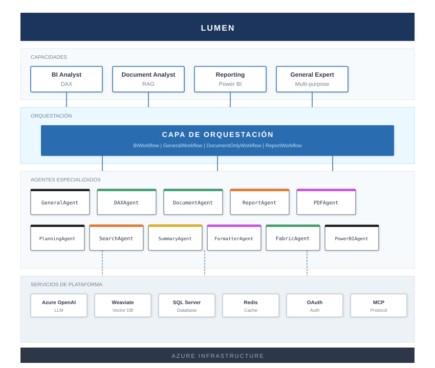
<br><em>Figura 18: Arquitectura LUMEN</em>
</p>

### Resumen de Componentes

| Componente | Tipo | Función |
|------------|------|---------|
| **BIWorkflow** | Workflow | Orquesta consultas BI completas |
| **GeneralWorkflow** | Workflow | Maneja consultas generales |
| **QueryWorkflowSimple** | Workflow | Consultas DAX optimizadas |
| **DocumentOnlyWorkflow** | Workflow | Modo solo documentos |
| **ReportWorkflow** | Workflow | Embedding de reportes |
| **GeneralAgent** | Agente | Orquestador principal, compone tools |
| **DAXAgent** | Agente | Consultas DAX via MCP |
| **DocumentAgent** | Agente | RAG sobre Weaviate |
| **ReportAgent** | Agente | OAuth + Embed API |
| **FabricAgent** | Agente | Fabric REST API |
| **PowerBIAgent** | Agente | PowerBI MCP |
| **PDFAgent** | Agente | Extracción con Docling |
| **PlanningAgent** | Agente | Planificación de tareas |
| **SearchAgent** | Agente | Búsqueda semántica |
| **SummaryAgent** | Agente | Resúmenes de contexto |
| **FormatterAgent** | Agente | Formateo de output |

---

## Transición a Capacidades Técnicas

*Con la arquitectura general y los agentes especializados definidos, las siguientes secciones detallan cada una de las **diez capacidades técnicas** que constituyen la implementación completa de Lumen. Cada capacidad representa un patrón de diseño validado empíricamente, desde la gestión de memoria y contexto (Capacidad 1) hasta la plasticidad estructural mediante MAP (Capacidad 10). Estas capacidades son independientes pero complementarias—un sistema puede implementar un subconjunto según sus requisitos específicos.*

---

# Capacidad 1: Memoria y Contexto

## Teoria

### Tipos de Memoria en Sistemas Agenticos

La memoria es fundamental para que los agentes mantengan coherencia y aprendan de interacciones previas. La investigacion en sistemas agenticos identifica cuatro tipos de memoria:

**Definición 3.1 (Sistema de Memoria Agéntica)**: Un sistema de memoria agéntica es una tupla M = (W, E, S, P, γ) donde:
- W ⊆ Token*: Working Memory (secuencia de tokens del contexto actual)
- E: T → Experience: Episodic Memory (función de timestamps a experiencias)
- S: Concept → Fact*: Semantic Memory (mapeo de conceptos a hechos)
- P: Task → Procedure: Procedural Memory (mapeo de tareas a procedimientos)
- γ: M → M: Función de consolidación que mueve información entre tipos de memoria

| Tipo | Descripcion | Ejemplo | Formalización |
|------|-------------|---------|---------------|
| **Working Memory** | Contexto inmediato de la conversacion actual | Mensajes recientes en el chat | W ⊆ Token*, |W| ≤ context_limit |
| **Episodic Memory** | Experiencias pasadas especificas con timestamps | "El usuario pregunto sobre ventas Q3 ayer" | E: T → Experience |
| **Semantic Memory** | Conocimiento factual del dominio | "La empresa tiene 5 regiones de ventas" | S: Concept → Fact* |
| **Procedural Memory** | Como ejecutar tareas aprendidas | "Para calcular YTD, usar TOTALYTD" | P: Task → Procedure |

**Proposición 3.1**: La capacidad efectiva de un sistema agéntico está limitada por |W|, pero puede extenderse indefinidamente mediante E, S, y P si existe un mecanismo de recuperación eficiente.

*Sketch de demostración*: Sea C_eff la capacidad efectiva del sistema. Sin memoria externa, C_eff ≤ |W| (limitada por la ventana de contexto). Con memoria externa M_ext = E ∪ S ∪ P y una función de recuperación r: Query → M_ext con complejidad O(log n) o O(1) mediante índices, el sistema puede acceder a información de tamaño arbitrario. En cada paso, W contiene la información recuperada relevante, permitiendo razonamiento sobre conocimiento mucho mayor que |W|. Por tanto, C_eff → ∞ si |M_ext| → ∞ y r es eficiente. ∎

> **Conexión con MAP**: La memoria episódica E proporciona el historial H que MAP utiliza para el aprendizaje Hebbiano (Capítulo 11). Específicamente, E registra qué agentes participaron en cada interacción y sus resultados, permitiendo calcular el refuerzo δ(o) para actualizar los pesos de confianza W_ij. Sin memoria persistente, la plasticidad estructural sería imposible—el sistema no podría "recordar" qué colaboraciones fueron exitosas.

### El Problema del Contexto Limitado

Los LLMs tienen ventanas de contexto finitas (8K-128K tokens). A medida que las conversaciones crecen, se debe decidir que informacion retener. Las tecnicas principales son:

**Sliding Window**: Mantiene solo los N mensajes mas recientes. Simple pero pierde contexto historico importante.

**Summarization**: Resume mensajes antiguos para comprimir informacion. Preserva temas pero pierde detalles.

**Observation Masking**: Oculta outputs de tools que ya fueron procesados, manteniendo solo los resultados relevantes.

**Hybrid Approach**: Combina multiples tecnicas segun el tipo de contenido.

<p align="center">
  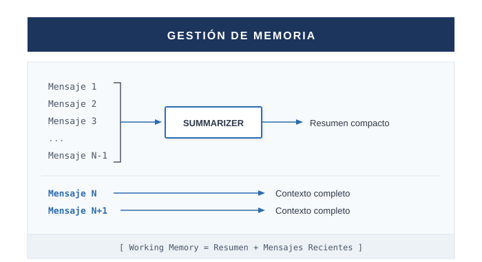
<br><em>Figura 19: Gestión de Memoria</em>
</p>

### Persisted Memory Pattern

Un patron emergente en sistemas multi-agente es **Persisted Memory**: los agentes almacenan datos estructurados (no solo texto) que otros agentes pueden reutilizar sin re-consultar fuentes.

Por ejemplo, si un agente ejecuta una consulta DAX y obtiene resultados, estos se persisten en un formato estructurado. Un agente de visualizacion posterior puede leer estos datos directamente sin ejecutar la consulta nuevamente.

## Implementacion en Lumen

### Persisted Memory Pattern

Lumen implementa el patron Persisted Memory a traves del atributo `persisted_memory` en BaseAgent. Cuando DAXAgent ejecuta una consulta:

1. Los resultados se almacenan en `persisted_memory` como JSON estructurado
2. FormatterAgent lee este JSON para generar visualizaciones
3. El historial de mensajes no se infla con datos raw

Este patron reduce significativamente el uso de tokens porque los datos tabulares grandes se almacenan fuera del flujo conversacional principal.

### MessageStore para Persistencia

Lumen utiliza el MessageStore de Microsoft Agent Framework conectado a SQL Server. Cada sesion mantiene su historial de mensajes, permitiendo que las conversaciones se retomen incluso despues de reinicios del servidor.

El `AgentThread` de cada agente se vincula al `session_id` del usuario, garantizando aislamiento entre conversaciones de diferentes usuarios.

### Working Memory via Conversation History

El contexto de trabajo se mantiene mediante la tabla `messages` en SQL Server. Cada mensaje incluye:
- Rol (user/assistant)
- Contenido
- Timestamp
- Metadata (modelo usado, tokens, etc.)

### Trabajo Futuro

| Aspecto | Estado Actual | Dirección Futura |
|---------|---------------|------------------|
| Memoria episódica | MessageStore básico | Memoria episódica con retrievers temporales |
| Compresión | Sin compresión | Summarization automática para contextos largos |
| Decay | Estático | Mecanismos de olvido adaptativo (EWC-inspired) |

**Pregunta de investigación abierta**: ¿Qué técnicas de compresión de contexto preservan mejor la precisión en consultas BI?

*La memoria proporciona el sustrato para la continuidad conversacional, pero sin un mecanismo inteligente de routing, los mensajes no llegarían al agente correcto. La siguiente capacidad aborda precisamente este desafío: cómo dirigir cada consulta al especialista apropiado.*

---

# Capacidad 2: Routing e Intencion

## Teoria

### El Problema del Routing

En sistemas multi-agente, determinar que agente debe manejar cada mensaje es critico. Un routing incorrecto lleva a respuestas suboptimas o errores. Las estrategias principales son:

### Rule-Based Routing

Usa reglas explicitas basadas en keywords o patrones:

```
IF mensaje contiene "DAX" OR "medida" → DAXAgent
IF mensaje contiene "reporte" OR "dashboard" → ReportAgent
ELSE → GeneralAgent
```

**Ventajas**: Rapido, predecible, sin costo de LLM
**Desventajas**: Fragil ante variaciones de lenguaje, no escala

### LLM-Based Routing

El propio LLM clasifica el intent del mensaje y decide el agente:

```
Sistema: Clasifica este mensaje en una de las categorias:
- QUERY_DAX: Consultas sobre datos y metricas
- REPORT: Solicitudes de reportes
- DOCUMENT: Preguntas sobre documentos
- GENERAL: Conversacion general

Usuario: "Cuantas ventas hubo en enero?"
LLM: QUERY_DAX
```

**Ventajas**: Flexible, maneja variaciones naturales
**Desventajas**: Latencia adicional, costo de tokens

### Semantic Routing

Usa embeddings para comparar el mensaje con descripciones de cada agente:

<p align="center">
  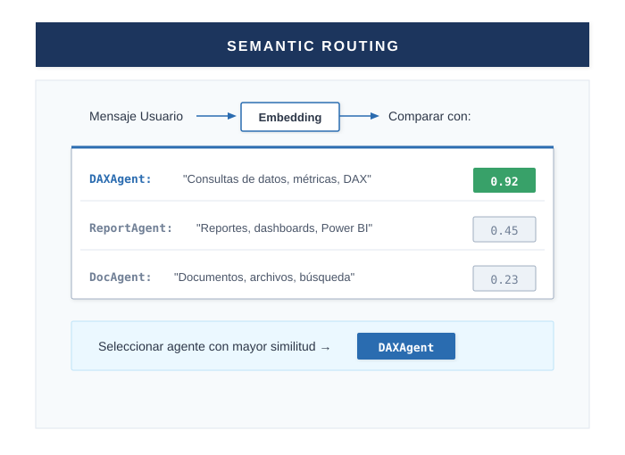
<br><em>Figura 20: Semantic Routing</em>
</p>

**Ventajas**: Muy rapido (solo embeddings), semanticamente robusto
**Desventajas**: Requiere ajuste de descripciones, puede confundir intents similares

### Two-Layer Routing

Combina rule-based y LLM para optimizar costo/precision:

1. **Capa 1 (Keywords)**: Reglas rapidas para casos obvios
2. **Capa 2 (LLM)**: Clasificacion para casos ambiguos

> **Conexión con MAP**: Las estrategias de routing descritas utilizan **pesos estáticos**. MAP (Capítulo 11) extiende estos enfoques permitiendo que los pesos evolucionen mediante aprendizaje Hebbiano. Por ejemplo, si DAXAgent consistentemente resuelve mejor las consultas de tipo X que fueron inicialmente ruteadas a GeneralAgent, el peso W_{DAX,X} aumentaría automáticamente. Esto convierte el routing de una configuración manual a un sistema **auto-optimizante**.

## Implementacion en Lumen

### Two-Layer Routing en BIWorkflow

Lumen implementa routing de dos capas en BIWorkflow:

**Capa 1 - Keyword Detection**: Analiza el mensaje buscando palabras clave que indican claramente el intent:
- "muestra el reporte", "dashboard" → ReportWorkflow
- "busca en documentos", "segun el archivo" → DocumentWorkflow
- Numeros, "cuanto", "ventas", "DAX" → QueryWorkflow

**Capa 2 - LLM Classification**: Si no hay match de keywords, el LLM clasifica entre:
- `query`: Consultas de datos
- `report`: Reportes Power BI
- `general`: Conversacion/otros

<p align="center">
  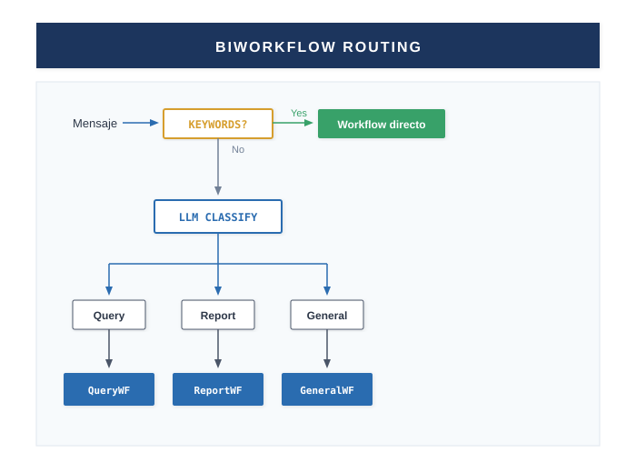
<br><em>Figura 21: BIWorkflow Routing</em>
</p>

### Modelo de Seleccion Previa

Una optimizacion en QueryWorkflowSimple: el usuario puede pre-seleccionar el modelo de datos. Si existe esta seleccion, se omite FabricAgent y se procede directamente a DAXAgent, reduciendo latencia.

### Ventajas del Enfoque

- Keywords manejan ~60% de casos sin costo LLM
- LLM interviene solo en casos ambiguos
- Facil agregar nuevas keywords sin cambiar logica
- Fallback seguro a GeneralWorkflow

### Trabajo Futuro

| Aspecto | Estado Actual | Dirección Futura |
|---------|---------------|------------------|
| Detección de intención | Keywords + LLM classifier | Semantic routing con embeddings |
| Ambigüedad | Fallback a GeneralWorkflow | Clarificación interactiva con el usuario |
| Personalización | Igual para todos | Routing adaptado al perfil del usuario |

**Pregunta de investigación abierta**: ¿Cuál es el límite teórico de precisión en NLQ (Natural Language Query) para BI?

*Una vez que el sistema sabe a qué agente dirigir cada consulta, surge la pregunta: ¿de dónde obtiene el agente el conocimiento necesario para responder? La siguiente capacidad introduce RAG, el mecanismo que permite a los agentes acceder a bases de conocimiento extensas más allá de su contexto inmediato.*

---

# Capacidad 3: RAG - Recuperacion de Conocimiento

## Teoria

### Evolucion del RAG

Retrieval-Augmented Generation (RAG) ha evolucionado significativamente desde su introduccion:

**Generacion 1 - Vector Search Basico**: Embedding del query, busqueda por similitud, inyeccion de chunks en prompt.

**Generacion 2 - Hybrid Search**: Combina busqueda vectorial con keyword search (BM25) para mejor precision.

**Generacion 3 - Late Chunking**: En lugar de chunking pre-embedding, se embebe el documento completo y se extrae contexto relevante post-busqueda.

**Generacion 4 - GraphRAG**: Construye grafos de conocimiento desde documentos, permitiendo razonamiento sobre relaciones entre entidades.

**Generacion 5 - Agentic RAG**: El agente decide dinamicamente que documentos buscar, cuando necesita mas contexto, y puede hacer multiples queries iterativos.

<p align="center">
  
<br><em>Figura 22: Evolución del RAG</em>
</p>

### Chunking Strategies

Como dividir documentos en chunks afecta directamente la calidad del RAG:

| Estrategia | Descripcion | Mejor para |
|------------|-------------|------------|
| Fixed Size | Chunks de N tokens | Documentos homogeneos |
| Semantic | Por parrafos/secciones | Documentos estructurados |
| Sentence Window | Oracion + contexto circundante | Precision alta |
| Hierarchical | Chunks anidados (documento > seccion > parrafo) | Documentos largos |

### Metricas de Relevancia

Evaluar la calidad del RAG requiere metricas especificas:
- **Recall**: Proporcion de informacion relevante recuperada
- **Precision**: Proporcion de chunks recuperados que son relevantes
- **MRR (Mean Reciprocal Rank)**: Posicion promedio del primer resultado relevante

## Implementacion en Lumen

### Hybrid Search en Weaviate

Lumen utiliza Weaviate como vector database con busqueda hibrida:

1. **Vector Search**: Embeddings generados con Azure OpenAI (text-embedding-3-small)
2. **Keyword Search**: BM25 nativo de Weaviate
3. **Fusion**: Algoritmo de fusion pondera ambos resultados

El schema de Weaviate almacena chunks con metadata rica:
- Contenido del chunk
- Filename original
- Numero de pagina
- Posicion en documento
- Hash del documento padre

### Chunking por Tipo de Documento

Lumen aplica diferentes estrategias de chunking segun el tipo de documento:

- **PDF**: Chunking semantico respetando limites de pagina, con deteccion de tablas
- **Word/TXT**: Chunking por parrafos con overlap
- **Excel**: Una fila = un chunk, preservando estructura tabular

### Agent-as-Tool para RAG

DocumentAgent expone busqueda como tool para otros agentes:

GeneralAgent puede invocar `search_documents(query)` cuando detecta que necesita informacion de documentos. Esto permite RAG hibrido donde el agente decide cuando buscar, no solo responde con contexto fijo.

<p align="center">
  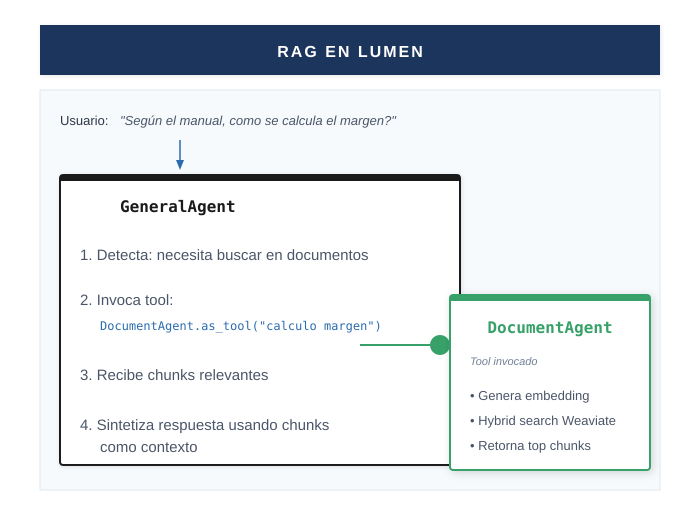
<br><em>Figura 23: RAG en LUMEN</em>
</p>

### Dimension Value Indexing

Una capacidad especial de Lumen: indexa valores de dimensiones de modelos Power BI en Weaviate. Esto permite:
- Busqueda semantica sobre valores de negocio ("clientes del norte")
- Auto-seleccion de slicers en reportes embebidos
- Mapeo de lenguaje natural a filtros DAX

### Speculative Gap RAG (SG-RAG)

**Contribución de diseño**: RAG tradicional solo recupera lo que existe. SG-RAG detecta lo que *debería existir pero no existe*.

**Definición 3.1 (Gap Detection)**: Sea Q una query y C = {c₁, c₂, ..., cₙ} el corpus de chunks. El sistema genera un "chunk ideal" c* que respondería Q perfectamente. Se detecta un gap cuando:

<p align="center"></p>

**Mecanismo**:

| Componente | Función |
|------------|---------|
| **Chunk Ideal Generation** | LLM genera descripción del chunk perfecto para la query |
| **Gap Detection** | Si ningún chunk real supera umbral θ de similitud → gap |
| **Gap Memory** | Persiste: (query, timestamp, user, suggested_section) |
| **Gap Analytics** | Prioriza gaps por frecuencia × recencia × importancia |
| **Gap Resolution** | Al indexar nuevo documento, verifica si cubre gaps existentes |

**Fórmula de prioridad**:
```
gap_priority(G) = frequency(G) × recency(G) × user_importance(G)
```

**Aplicación práctica**:
- Usuario pregunta: "¿Cuál es la política de descuentos para clientes premium?"
- SG-RAG detecta: similitud máxima = 0.3 < θ (0.6)
- Respuesta: "Esta información no está documentada. Gap registrado. Sección sugerida: Manual de Ventas, Cap. 4"
- Dashboard muestra: "Top 10 gaps esta semana" → guía qué documentar

**Conexión con MAP**: Extiende plasticidad al conocimiento. El sistema no solo aprende qué agentes funcionan mejor (trust weights inter-agente), sino qué conocimiento le falta (gap weights). Plasticidad bidireccional: estructura + contenido.

### Trabajo Futuro

| Aspecto | Estado Actual | Dirección Futura |
|---------|---------------|------------------|
| Estructura | Chunks planos | GraphRAG con relaciones semánticas |
| Agencia | Agent-as-Tool pasivo | Agentic RAG con decisiones de retrieval |
| Multimodal | Solo texto | RAG sobre tablas, imágenes, dashboards |

*Con memoria, routing y RAG establecidos, tenemos los componentes individuales de un sistema inteligente. La siguiente capacidad aborda cómo estos componentes trabajan juntos: la orquestación y composición de múltiples agentes en workflows coherentes.*

---

# Capacidad 4: Orquestacion, Workflows y Composicion de Agentes

## Teoria

Los patrones de workflow (Sequential, Parallel, Hierarchical, Router, Reflexive) se describen en la **Sección 2.2**. Aquí se detalla cómo Lumen los implementa.

### Agentes como Building Blocks

En sistemas multi-agente, los agentes deben ser componibles. Un agente bien disenado puede:
- Ejecutar tareas de forma autonoma
- Ser invocado como herramienta por otros agentes
- Compartir memoria/contexto cuando es necesario
- Escalar independientemente

### Sistema de Tools

Los **tools** son el mecanismo de extensibilidad provisto por Microsoft Agent Framework. Un tool es una función decorada con `@ai_function` (de `semantic_kernel.functions`) que extiende las capacidades del agente para ejecutar acciones en el mundo real.

**Definición 4.2 (Tool)**: Un tool T es una función f: Args → String decorada con `@ai_function` que:
- Recibe parámetros tipados con descripciones semánticas
- Retorna un string interpretable por el LLM
- Incluye un docstring que describe cuándo y cómo usarla

<p align="center">
  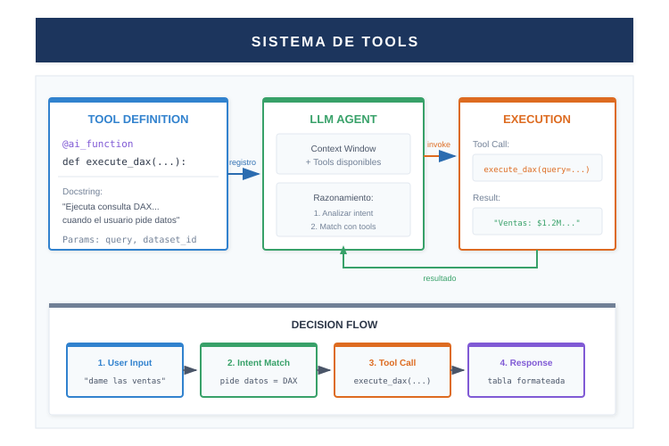
<br><em>Figura 23b: Sistema de Tools - Definición, registro y flujo de decisión</em>
</p>

**¿Cómo decide el agente cuándo invocar un tool?**

El LLM recibe en su contexto la lista de tools disponibles con sus descripciones. El **docstring** es crítico: describe el propósito y las condiciones de uso que el LLM evalúa durante el razonamiento. El flujo de decisión sigue cuatro pasos:

1. **User Input**: El usuario expresa una necesidad ("dame las ventas del Q4")
2. **Intent Match**: El LLM compara el intent con las descripciones de tools disponibles
3. **Tool Call**: Si hay match, genera una llamada estructurada con parámetros tipados
4. **Response**: El resultado del tool se integra en la respuesta al usuario

| Componente | Función |
|------------|---------|
| **@ai_function** | Decorador que registra la función como tool disponible |
| **Annotated[tipo, Field(...)]** | Parámetros tipados con descripciones para el LLM |
| **Docstring** | Describe cuándo usar el tool - el LLM lo usa para decidir |
| **Return string** | Resultado en texto que el LLM interpreta y comunica |

*Los tools individuales son el bloque fundamental. El siguiente patrón, Agent-as-Tool, lleva esta idea al siguiente nivel: exponer un agente completo como si fuera un tool.*

### Agent-as-Tool Pattern

Patrón nativo de Microsoft Agent Framework. **Agent-as-Tool** permite que un agente exponga sus capacidades como herramienta que otros agentes pueden invocar.

<p align="center">
  
<br><em>Figura 24: Agent as Tool Pattern</em>
</p>

<p align="center">
  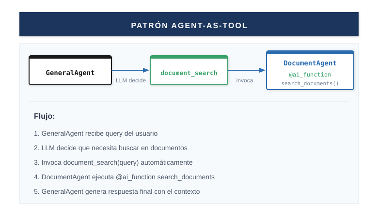
<br><em>Figura 24b: Implementación del Patrón Agent-as-Tool</em>
</p>

**Ventajas**:
- El LLM razona sobre cuando usar cada agente
- Composicion flexible sin hardcodear dependencias
- El mismo agente puede servir multiples contextos

### Handoff Pattern

El patrón Handoff permite que un agente transfiera **completamente** el control a otro agente cuando detecta que la tarea excede su expertise o requiere capacidades especializadas.

**Definición 4.3 (Handoff)**: Un handoff H de agente A_i a agente A_j es una tupla H = (trigger, target, context, query) donde:
- **trigger**: Condición que dispara la transferencia (ej: "requiere ejecución DAX")
- **target**: Agente destino con expertise requerido
- **context**: Estado y metadatos transferidos (session_id, thread, historial)
- **query**: Input original del usuario preservado

<p align="center">
  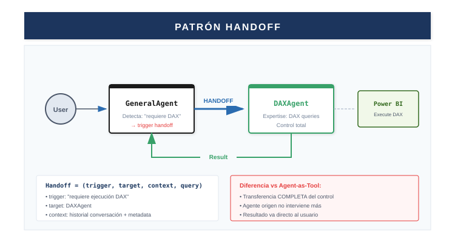
<br><em>Figura 25: Patrón Handoff - Transferencia Completa de Control</em>
</p>

#### Tipos de Handoff

| Tipo | Descripción | Ejemplo |
|------|-------------|---------|
| **Expertise-based** | El agente actual carece de conocimiento especializado | GeneralAgent → DAXAgent para consultas de datos |
| **Capability-based** | Se requieren herramientas no disponibles | PowerBIAgent → FabricAgent para APIs de workspace |
| **Context-based** | El contexto indica otro dominio | DocumentAgent → SearchAgent cuando no hay documentos |
| **Planning-based** | Query multi-paso requiere orquestación | FabricAgent → PlanningAgent para "ejecuta ventas en Contoso" |

#### Mecanismo de Detección

El handoff se dispara mediante dos mecanismos complementarios:

1. **Detección proactiva por workflow**: El workflow evalúa si el mensaje actual requiere cambio de agente basándose en keywords de dominio. Si el usuario estaba con DocumentAgent pero pregunta sobre "precio del dólar", se detecta handoff hacia SearchAgent.

2. **Solicitud explícita por agente**: Cuando un agente detecta internamente que no puede completar la tarea (ej: FabricAgent recibe "ejecuta ventas de Q3" pero no tiene dataset_id), solicita handoff a PlanningAgent que puede orquestar la secuencia completa.

#### Preservación de Contexto

Durante el handoff se preservan:
- **Thread de conversación**: El agente destino continúa en el mismo hilo multi-turn
- **Session metadata**: user_id, session_id, tokens disponibles
- **Query original**: El input del usuario sin modificar
- **Razón del handoff**: Para logging y debugging

#### Ejemplo de Flujo

```
Usuario: "Ejecuta las ventas de 2024 en el modelo Contoso"
         ↓
FabricAgent: Detecta verbo de ejecución + nombre de modelo (sin ID)
         ↓ [Handoff: requiere planificación multi-paso]
PlanningAgent: Genera plan {buscar workspace → obtener dataset → ejecutar DAX}
         ↓ [Handoff al primer agente del plan]
FabricAgent: Ejecuta búsqueda de workspace/dataset
         ↓ [Retorna IDs encontrados]
DAXAgent: Ejecuta query DAX con IDs
         ↓
Usuario: Recibe resultado con datos de ventas
```

**Ventaja clave**: Los agentes mantienen responsabilidad única (Single Responsibility) mientras el sistema puede resolver tareas complejas mediante colaboración dinámica.

### Jerarquia de Agentes

Los agentes pueden organizarse jerarquicamente:
- **Base Agent**: Funcionalidad comun (logging, streaming, tools)
- **Specialized Agents**: Heredan de base, agregan capacidades especificas
- **Composite Agents**: Componen multiples agentes especializados

## Implementacion en Lumen

### Router Pattern: BIWorkflow

El punto de entrada principal de Lumen es BIWorkflow, que implementa el patron Router:

1. Recibe mensaje del usuario
2. Clasifica intent (keywords + LLM)
3. Delega a sub-workflow especializado
4. Streaming de respuesta al frontend

Sub-workflows disponibles:
- **QueryWorkflowSimple**: Consultas DAX
- **ReportWorkflow**: Embedding de reportes
- **GeneralWorkflow**: Conversacion general con RAG
- **DocumentOnlyWorkflow**: Modo estricto solo documentos

### Sequential Pattern: QueryWorkflowSimple

Para consultas DAX, Lumen usa un pipeline secuencial:

<p align="center">
  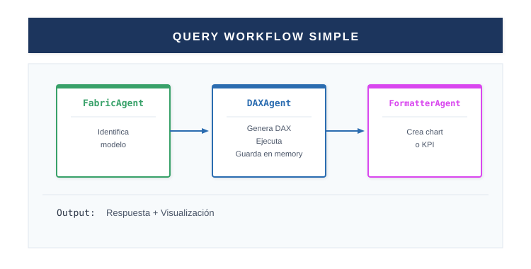
<br><em>Figura 25: Query Workflow Simple</em>
</p>

Cada agente en el pipeline:
1. **FabricAgent**: Identifica el modelo semantico apropiado
2. **DAXAgent**: Genera y ejecuta la consulta DAX
3. **FormatterAgent**: Convierte resultados en visualizacion

### Streaming Throughout

Todos los workflows de Lumen usan streaming. A medida que cada agente produce output, este fluye inmediatamente al frontend via SSE. El usuario ve la respuesta construyendose en tiempo real.

### Workflow Selection Logic

La seleccion de workflow considera:
- Keywords en el mensaje
- Clasificacion LLM del intent
- Estado de la sesion (modelo pre-seleccionado?)
- Modo de la sesion (document-only?)

### BaseAgent: El Patron Base

Todos los agentes heredan de `ChatCompletionAgent` (Microsoft Agent Framework). BaseAgent extiende esta clase:

- **Container injection**: Acceso a servicios (LLM, DB, OAuth)
- **MCP tools loading**: Carga automatica de tools MCP configurados
- **Tool wrapping**: Logging automatico de invocaciones de tools
- **Streaming interface**: Metodo `stream()` uniforme
- **as_tool() method**: Expone el agente como tool para otros

### Jerarquia de Agentes Especializados

<p align="center">
  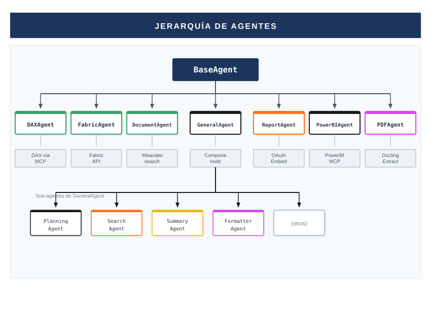
<br><em>Figura 26: Jerarquía de Agentes</em>
</p>

### Agent-as-Tool en GeneralAgent

GeneralAgent demuestra el patron Agent-as-Tool:

1. En inicializacion, obtiene referencias a DocumentAgent y SearchAgent
2. Llama `as_tool()` en cada uno para obtener wrappers de tool
3. Agrega estos tools a su lista de herramientas
4. El LLM de GeneralAgent decide cuando invocar cada tool

Cuando el usuario pregunta algo que requiere documentos, el LLM razona:
"Necesito buscar en los documentos del usuario" → invoca `search_documents`

### Agentes Especializados

| Agente | Especializacion | Tools Propios |
|--------|-----------------|---------------|
| **DAXAgent** | Consultas DAX | execute_dax (MCP), validate_dax |
| **FabricAgent** | Fabric API | list_workspaces, get_model_info |
| **DocumentAgent** | RAG | search_chunks (Weaviate) |
| **ReportAgent** | Power BI Embed | get_embed_token |
| **FormatterAgent** | Visualizacion | (genera JSON blocks) |
| **SearchAgent** | Web search | serper_search |
| **SummaryAgent** | Resumen | (map-reduce interno) |
| **PowerBIAgent** | Modelado DAX | (experto en best practices) |

## Guia de Desarrollo de Agentes

Esta seccion proporciona una guia conceptual para desarrollar nuevos agentes en sistemas multi-agente basados en LLM.

### Anatomia de un Agente

Todos los agentes heredan de **BaseAgent**, que proporciona la infraestructura comun para:

- Integracion con Azure OpenAI (pools Fast y Response)
- Gestion de herramientas (tools)
- Streaming de respuestas (SSE)
- Integracion con MCP (Model Context Protocol)
- Persistencia de memoria

<p align="center">
  
<br><em>Figura 27: BaseAgent Class Structure</em>
</p>

#### AgentContext

El contexto que recibe cada agente contiene toda la informacion de la sesion:

| Campo | Descripcion |
|-------|-------------|
| **session_id** | Identificador unico de la sesion |
| **user_id** | Identificador del usuario autenticado |
| **conversation_history** | Historial de mensajes previos |
| **metadata** | Datos adicionales (has_documents, reasoning_enabled, image_data) |
| **thread** | Thread de Agent Framework para handoff entre agentes |

### Proceso de Creacion de un Agente

El desarrollo de un nuevo agente sigue cuatro pasos fundamentales:

**Paso 1: Definir la Clase** - Crear un archivo que extienda BaseAgent. Configurar: agent_id, description, tools, instructions.

**Paso 2: Implementar stream()** - El metodo `stream()` es el nucleo del agente: recibe contexto, configura thread_id, crea ChatAgent, itera sobre respuesta LLM, maneja errores.

**Paso 3: Registrar en Container** - El agente debe registrarse en el Container para Dependency Injection.

**Paso 4: Configurar Routing** - Si el agente debe seleccionarse automaticamente, agregar keywords en router_service.

### Sistema de Tools

Los tools extienden las capacidades del agente permitiendole ejecutar acciones concretas.

| Aspecto | Descripcion |
|---------|-------------|
| **Decorador** | Usa `@ai_function` del Agent Framework |
| **Parametros tipados** | Usa `Annotated` con `Field` para descripciones |
| **Retorno string** | Siempre retorna texto que el LLM puede interpretar |
| **Docstring** | Describe la funcion para que el LLM sepa cuando usarla |

Los tools pueden acceder a servicios del sistema (Database, Embedding, Weaviate, OAuth) a traves del container. Deben ser sincronos; para operaciones async se utiliza `asyncio.run()`.

### Patrones Avanzados de Agentes

#### Patron Dual-Model

| Pool | Modelo | Uso |
|------|--------|-----|
| **Fast** | gpt-4-turbo | Respuestas rapidas, routing, llamadas internas |
| **Response** | gpt-5 | Respuestas finales, reasoning extendido, contexto largo |

El agente decide dinamicamente que pool usar basandose en tamano del contexto (>50K chars → Response), tipo de tarea, y flag `reasoning_enabled`.

#### Patron Memory Persistida

| Tipo | Almacenamiento | Duracion |
|------|----------------|----------|
| **Working Memory** | `AgentThread` (MS Agent Framework) | Sesion |
| **Persisted Memory** | Campo `persisted_memory` → Database | Permanente |
| **Semantic Memory** | Weaviate (embeddings) | Permanente |
| **Structural Memory** | Matriz W_ij de confianza (MAP) | Adaptativa |

#### Integracion MCP

El Model Context Protocol permite conectar servidores externos de tools:

<p align="center">
  
<br><em>Figura 28: Integracion MCP</em>
</p>

### Categorias de Agentes

<p align="center">
  
<br><em>Figura 29: Jerarquía de Categorías de Agentes</em>
</p>

| Categoria | Proposito | Ejemplos |
|-----------|-----------|----------|
| **General** | Conversacion general, fallback | GeneralAgent |
| **Domain** | Especializados en areas de BI | FabricAgent, DAXAgent, DocumentAgent |
| **Utility** | Funciones de soporte transversales | FormatterAgent, SummaryAgent, SearchAgent |

### Best Practices para Desarrollo de Agentes

| Area | Practica | Descripcion |
|------|----------|-------------|
| **Diseño** | Single Responsibility | Un agente, un dominio |
| **Diseño** | Instrucciones claras | System prompt especifico |
| **Diseño** | Tools atomicos | Cada tool hace una cosa bien |
| **Performance** | Lazy loading | Inicializar recursos solo cuando se necesiten |
| **Performance** | Limitar tools | Maximo 5-7 tools por agente |
| **Seguridad** | Validar inputs | Nunca confiar en datos del usuario |
| **Seguridad** | Parametros SQL | Nunca concatenar strings |
| **Testing** | Unit tests | Probar tools con mocks |
| **Testing** | Stream tests | Verificar chunks correctos |

### Trabajo Futuro

| Aspecto | Estado Actual | Dirección Futura |
|---------|---------------|------------------|
| Workflows | Sequential, Router, Handoffs | Reflexion loops, auto-corrección |
| Composición | Agent-as-Tool estático | Dynamic Agent Discovery |
| Handoffs | Basado en expertise/capability | Handoffs predictivos con contexto enriquecido |
| Intenciones | Detección por keywords + LLM | Intención multi-turno con memoria de objetivos |
| Planificación | Implícita en prompts | Planificación explícita multi-paso |

**Preguntas de investigación abiertas**:
- ¿Cómo escala la orquestación (workflows + handoffs + intenciones) a cientos de agentes?
- ¿Qué heurísticas optimizan la decisión de handoff vs. tool call?

*Los agentes orquestados necesitan acceder a datos del mundo real para ser útiles. La siguiente capacidad describe cómo Lumen conecta sus agentes con fuentes de datos empresariales mediante protocolos estandarizados como MCP y OAuth.*

---

# Capacidad 5: Integracion con Fuentes de Datos

## Teoria

### Tool Calling en LLMs

Los LLMs modernos soportan **tool calling** (function calling): el modelo puede decidir invocar funciones externas y usar sus resultados.

```
Usuario: "Cual es el precio de AAPL?"

LLM razona: Necesito datos de mercado en tiempo real
LLM output: {
  "tool": "get_stock_price",
  "arguments": {"symbol": "AAPL"}
}

Sistema: Ejecuta tool → $150.25

LLM: "El precio actual de AAPL es $150.25"
```

### Model Context Protocol (MCP)

MCP es un estandar emergente para conectar LLMs con fuentes de datos:

- **Servidores MCP**: Exponen datos/funcionalidad via protocolo estandar
- **Clientes MCP**: LLMs/agentes que consumen estos servidores
- **Transporte**: stdio, HTTP, WebSocket

**Ventajas de MCP**:
- Integraciones reutilizables entre aplicaciones
- Separacion clara entre logica de negocio y LLM
- Ecosistema creciente de servidores pre-construidos

### OAuth para APIs Empresariales

Acceder a APIs empresariales (Power BI, Fabric, SharePoint) requiere autenticacion OAuth 2.0:

1. Usuario inicia flujo de autenticacion
2. Sistema obtiene tokens de acceso
3. Tokens se usan para llamadas API
4. Refresh tokens mantienen sesion activa

## Implementacion en Lumen

### MCP para Power BI / Fabric

Lumen utiliza un servidor MCP especializado para operaciones Power BI:

**Tools disponibles via MCP**:
- `execute_dax`: Ejecuta consultas DAX contra modelos semanticos
- `validate_dax`: Valida sintaxis DAX sin ejecutar
- `list_tables`: Lista tablas de un modelo
- `list_measures`: Lista medidas disponibles
- `get_model_info`: Metadata del modelo

El servidor MCP se conecta via XMLA endpoint de Fabric, permitiendo operaciones que no estan disponibles en REST API.

### FabricAgent para REST API

Operaciones que usan REST API de Fabric:
- Listar workspaces del usuario
- Obtener datasets/reports
- Metadata de modelos
- Permisos y capacidades

FabricAgent abstrae estas operaciones, manejando paginacion, rate limiting y errores.

### OAuth Multi-Tenant

Lumen implementa flujo OAuth completo para Microsoft:

<p align="center">
  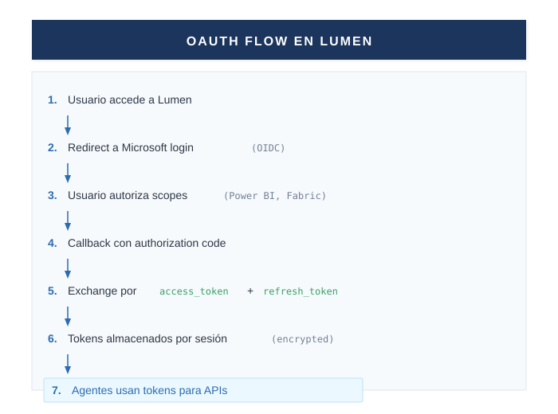
<br><em>Figura 30: OAuth Flow en LUMEN</em>
</p>

### Dimension Value Indexing

Capacidad unica de Lumen: indexar valores de dimensiones de modelos Power BI:

1. Usuario selecciona modelo
2. Background job extrae valores de columnas dimension
3. Valores se indexan en Weaviate con embeddings
4. Queries como "ventas del cliente Acme" se mapean a filtros DAX automaticamente

Esto permite lenguaje natural sobre filtros sin que el usuario conozca valores exactos.

### Trabajo Futuro

| Aspecto | Estado Actual | Dirección Futura |
|---------|---------------|------------------|
| Protocolos | MCP, OAuth, Fabric API | Más servidores MCP (Slack, Teams, SAP) |
| Autenticación | Por usuario | Service principals para automatización |
| Catálogo | Manual | Descubrimiento automático de fuentes |

*Los datos obtenidos de las fuentes empresariales deben presentarse al usuario de forma comprensible. La siguiente capacidad aborda cómo transformar resultados de consultas en visualizaciones interactivas y outputs estructurados.*

---

# Capacidad 6: Visualizacion y Output

## Teoria

### Structured Output en LLMs

Los LLMs pueden generar output estructurado (JSON, XML) ademas de texto libre. Esto permite:
- Parseo confiable de respuestas
- Integracion directa con UIs
- Validacion de schema

### Custom Blocks

Un patron comun es definir "bloques" especiales que el LLM genera y el frontend renderiza:

````
LLM Output:
"Las ventas de Q3 fueron $1.2M, un incremento del 15%.

```chart-data
{
  "type": "bar",
  "title": "Ventas por Trimestre",
  "data": [...]
}
```
"

Frontend:
- Parsea bloques especiales
- Renderiza chart donde corresponde
- Muestra texto normal como markdown
````

### Streaming y Rendering

Con streaming, el frontend recibe chunks incrementales. El rendering debe:
- Acumular texto hasta completar bloques
- Renderizar bloques solo cuando estan completos
- Manejar estados intermedios elegantemente

## Implementacion en Lumen

### Tipos de Bloques

Lumen define tres tipos de bloques especiales:

**chart-data**: Graficos interactivos
- Tipos: bar, line, pie, area
- Datos en formato estandarizado
- Renderizado con Recharts

**kpi-data**: Indicadores clave
- Valor principal con formato
- Comparacion con periodo anterior
- Tendencia (up/down/neutral)

**embed-report**: Reportes Power BI embebidos
- ID del reporte y pagina
- Filtros a aplicar
- Token de embed

### FormatterAgent

FormatterAgent es responsable de generar visualizaciones:

1. Recibe datos de DAXAgent (via persisted_memory)
2. Analiza estructura de datos
3. Decide tipo de visualizacion apropiado
4. Genera bloque JSON correspondiente

Heuristicas de seleccion:
- Una dimension + una metrica → Bar chart
- Serie temporal → Line chart
- Proporcion de un total → Pie chart
- Valor unico importante → KPI

### Streaming Prevention para Embeds

Los reportes embebidos requieren tokens que pueden expirar. Lumen implementa:
- Bloque embed-report no se renderiza durante streaming
- Solo cuando el mensaje esta completo, frontend solicita token fresco
- Token se obtiene justo antes de renderizar

### Frontend Rendering

El frontend parsea el contenido del mensaje buscando bloques:

<p align="center">
  
<br><em>Figura 31: Rendering Pipeline</em>
</p>

### Trabajo Futuro

| Aspecto | Estado Actual | Dirección Futura |
|---------|---------------|------------------|
| Interactividad | Bloques estáticos | Visualizaciones interactivas (drill-down, filtros) |
| Generación | Selección de tipo | Auto-selección basada en datos |
| Multimodal | Solo texto/charts | Generación de narrativas con audio |

*Un sistema que accede a datos empresariales y los visualiza debe garantizar que solo usuarios autorizados accedan a información apropiada. La siguiente capacidad detalla los mecanismos de seguridad, desde autenticación OAuth hasta prevención de alucinaciones.*

---

# Capacidad 7: Seguridad

## Teoria

### OAuth 2.0 y OpenID Connect

OAuth 2.0 es el estandar para autorizacion delegada. OpenID Connect (OIDC) agrega capa de identidad sobre OAuth.

**Flujo Authorization Code** (usado para web apps):
1. Redirect a authorization server
2. Usuario autentica y autoriza
3. Server retorna authorization code
4. App intercambia code por tokens
5. Access token usado para APIs

**Tokens**:
- **ID Token**: Identidad del usuario (JWT)
- **Access Token**: Autorizacion para APIs
- **Refresh Token**: Obtener nuevos access tokens

### Validacion de JWT

Los tokens JWT deben validarse rigurosamente:
- **Firma**: Verificar contra public key del issuer
- **Issuer**: Debe coincidir con issuer esperado
- **Audience**: Debe incluir tu aplicacion
- **Expiration**: Token no debe estar expirado
- **Nonce**: Previene replay attacks (OIDC)

### Session Management

Las sesiones web requieren:
- **Session ID**: Identificador unico por usuario
- **Storage**: Server-side (DB) o client-side (JWT)
- **Expiration**: Timeout por inactividad
- **Isolation**: Usuarios no pueden acceder datos de otros

### Principio de Minimo Privilegio

Cada componente debe tener solo los permisos necesarios:
- Agentes solo acceden a datos que necesitan
- Tokens tienen scopes minimos requeridos
- Queries filtradas por tenant/usuario

## Implementacion en Lumen

### OIDCService

Lumen implementa flujo OIDC completo con Microsoft:

**Iniciar autenticacion**:
- Genera state y nonce unicos
- Construye URL de autorizacion con scopes requeridos
- Redirect a Microsoft login

**Callback**:
- Valida state contra valor almacenado
- Intercambia code por tokens
- Valida ID token (firma, issuer, audience, nonce)
- Almacena tokens asociados a sesion

**Scopes solicitados**:
- openid, profile, email (OIDC basico)
- https://analysis.windows.net/powerbi/api/.default (Power BI)

### Token Storage

Los tokens se almacenan en SQL Server asociados a session_id:
- Access tokens encriptados at-rest
- Refresh tokens separados y protegidos
- Expiracion trackeada para refresh proactivo

### Token Refresh Scheduler: Renovacion Proactiva Event-Driven

Los access tokens de OAuth tienen vida limitada (tipicamente 1 hora). El enfoque tradicional de polling periodico (verificar cada N minutos si hay tokens por expirar) es ineficiente y puede fallar si el intervalo es muy largo o desperdiciar recursos si es muy corto.

Lumen implementa un **Token Refresh Scheduler** event-driven que programa la renovacion de cada token individualmente basandose en su tiempo de expiracion real:

<p align="center">
  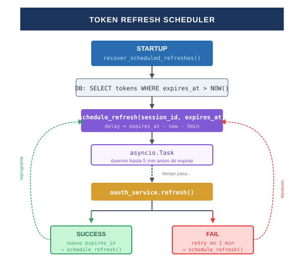
<br><em>Figura 32b: Token Refresh Scheduler - Renovacion proactiva event-driven</em>
</p>

**Principio de Diseno**: En lugar de polling periodico, cada token obtiene su propio `asyncio.Task` que duerme hasta 5 minutos antes de la expiracion y luego ejecuta el refresh. Esto elimina queries innecesarias a la base de datos y garantiza renovacion precisa.

**Flujo del Scheduler**:

1. **Login**: Al guardar un token nuevo, se calcula `expires_at` y se programa un Task:
   ```python
   delay = expires_at - now - timedelta(minutes=5)
   asyncio.create_task(sleep(delay) → refresh())
   ```

2. **Startup Recovery**: Al iniciar el servidor, el scheduler lee todos los tokens activos de la DB y programa sus refreshes pendientes.

3. **Ejecucion del Task**: 5 minutos antes de expirar:
   - Llama a `oauth_service.refresh()` con el refresh token
   - Si es exitoso: guarda nuevo token y **reprograma** el siguiente refresh
   - Si falla: reintenta en 1 minuto

4. **Logout**: Cancela el Task pendiente para esa sesion, liberando recursos.

**Ventajas vs Polling**:

| Aspecto | Polling Tradicional | Event-Driven (Lumen) |
|---------|---------------------|----------------------|
| Queries DB | Cada N minutos | Solo al startup |
| Precision | Error de hasta N min | Exacto (5 min antes) |
| CPU/Memoria | Constante | Solo cuando hay trabajo |
| Escalabilidad | O(n) por intervalo | O(1) por token |

**Implementacion Clave**: El scheduler es un singleton que mantiene un `Dict[session_id, asyncio.Task]`. Cada Task se auto-reprograma tras un refresh exitoso, creando un ciclo autonomo que no requiere intervencion externa.

### Session Isolation

Cada request incluye session cookie:
- Middleware extrae session_id
- Context incluye session para todos los handlers
- Database queries filtradas por session
- Agentes reciben context con session_id

<p align="center">
  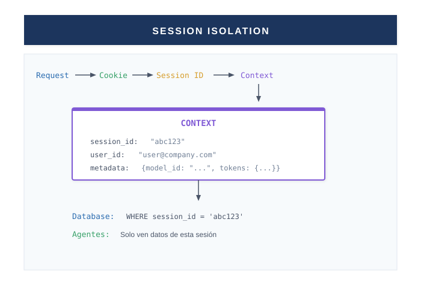
<br><em>Figura 32: Session Isolation</em>
</p>

### Input Validation

Todos los inputs del usuario se validan:
- File uploads: tipo MIME, tamano maximo, extension
- Queries: sanitizacion de parametros
- Mensajes: longitud maxima, caracteres permitidos

### HallucinationGuard: Patrón Anti-Alucinación

Microsoft Agent Framework provee **Guardrails** con detección de groundedness. Lumen extiende este concepto con HallucinationGuard especializado para BI. Los LLMs pueden generar información plausible pero incorrecta—especialmente GUIDs y nombres que no existen en los datos reales.

**Definición 7.1 (Valor Grounded)**: Un valor v en una respuesta R está *grounded* si y solo si v aparece en algún output O_i de los tools ejecutados durante la generación de R:

```
grounded(v, R) ⟺ ∃ O_i ∈ ToolOutputs(R) : v ∈ extract(O_i)
```

**Definición 7.2 (Respuesta Válida)**: Una respuesta R es válida respecto a alucinaciones si todos sus valores críticos (GUIDs, IDs, nombres específicos) están grounded:

```
valid(R) ⟺ ∀ v ∈ critical_values(R) : grounded(v, R)
```

#### Arquitectura del HallucinationGuard

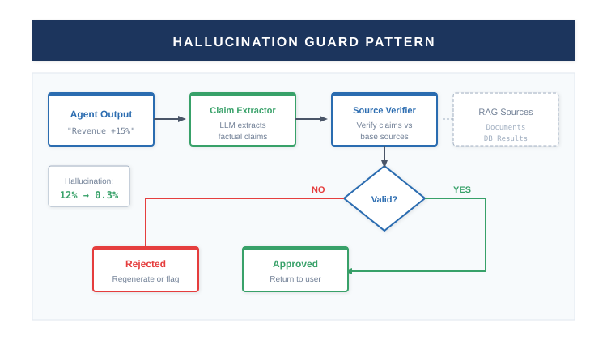
*Figura C7: Patrón HallucinationGuard - valida las salidas del agente contra fuentes verificadas, reduciendo alucinaciones del 12% al 0.3%*

El patrón implementa tres técnicas complementarias:

**1. Captura de Tool Outputs**: Durante la ejecución del agente, cada output de herramienta se registra como "fuente de verdad". Se extraen automáticamente valores críticos (GUIDs, IDs, strings entre comillas) y se almacenan en un conjunto de valores grounded.

**2. Validación Post-Respuesta**: Una vez generada la respuesta final, se extraen los mismos tipos de valores y se verifican contra el conjunto grounded. Los GUIDs no grounded son siempre violaciones críticas; otros valores pueden configurarse según el modo (estricto vs. permisivo).

**3. Re-prompting con Grounding Explícito**: Si se detectan violaciones, el sistema re-ejecuta la consulta inyectando los datos válidos directamente en el prompt con instrucciones explícitas de usar únicamente esos valores.

#### Patrones de Extracción

El guard identifica valores propensos a alucinación mediante patrones:

| Tipo de Valor | Descripción | Ejemplo |
|---------------|-------------|---------|
| **GUID** | Identificadores únicos de 128 bits | `a1b2c3d4-e5f6-7890-abcd-ef1234567890` |
| **ID Field** | Campos nombrados como "id", "ID", etc. | `"dataset_id": "sales_2024"` |
| **Quoted String** | Strings entre comillas (3-50 chars) | `"Ventas Q3 2024"` |
| **Backtick Value** | Valores técnicos entre backticks | `` `DimCustomer` ``, `` `FactSales` `` |

#### Modos de Operación

| Modo | Comportamiento | Uso Recomendado |
|------|----------------|-----------------|
| **Permisivo** | Solo GUIDs son violaciones | Respuestas generales, explicaciones |
| **Estricto** | Cualquier valor no grounded es violación | Consultas DAX, referencias a objetos |

#### Wrapper de Validación

El sistema permite encapsular cualquier agente con validación automática. El wrapper:
1. Intercepta la ejecución del agente
2. Captura todos los tool outputs
3. Valida la respuesta final
4. Opcionalmente reintenta con grounding explícito si hay violaciones

#### Métricas de Validación

| Métrica | Fórmula | Interpretación |
|---------|---------|----------------|
| **Confidence Score** | 1.0 - (ungrounded / total_values) | 1.0 = todos los valores verificados |
| **Violation Count** | Número de valores críticos no grounded | 0 = respuesta válida |
| **Grounding Rate** | grounded_values / total_values | Porcentaje de trazabilidad |

Este patrón es especialmente crítico para:
- **DAXAgent**: Validar que tablas/columnas referenciadas existen en el modelo
- **FabricAgent**: Verificar que workspace_id y dataset_id son reales
- **ReportAgent**: Confirmar que report_id corresponde a un reporte existente

### Trabajo Futuro

| Aspecto | Estado Actual | Dirección Futura |
|---------|---------------|------------------|
| Autorización | Session isolation | Row-Level Security (RLS) por dataset |
| Auditoría | Logs básicos | Audit logging completo con retención |
| Guardrails | HallucinationGuard | Guardrails de contenido y PII |

*Con la seguridad establecida, el siguiente desafío es servir a múltiples usuarios concurrentes sin degradar el rendimiento. La siguiente capacidad presenta las estrategias de escalabilidad, desde connection pooling hasta procesamiento distribuido con Ray.*

---

# Capacidad 8: Escalabilidad

## Teoria

### Connection Pooling

Crear conexiones es costoso. El pooling mantiene conexiones reutilizables:

<p align="center">
  
<br><em>Figura 33: Connection Pool</em>
</p>

### Task Queues

Para operaciones largas, usar colas:
- Request encola tarea
- Worker procesa async
- Cliente consulta estado / recibe notificacion

**Redis Streams** es una opcion popular:
- Ordenados por tiempo
- Consumer groups para escalamiento
- Acknowledgment para exactly-once

### Horizontal Scaling

Escalar agregando mas instancias:
- Load balancer distribuye trafico
- Estado en storage compartido (DB, Redis)
- Cada instancia es stateless

## Implementacion en Lumen

### Connection Pool Manager

Lumen implementa pooling para multiples servicios:

**Azure OpenAI**:
- Pool de clientes por deployment
- Round-robin entre deployments para distribuir carga
- Retry con backoff exponencial en rate limits

**SQL Server**:
- Connection pool via SQLAlchemy
- Tamano configurable por ambiente
- Health checks automaticos

**Weaviate**:
- Cliente singleton con connection reuse
- Batch operations para uploads masivos

### Redis Streams para Background Jobs

Operaciones largas como document processing usan Redis Streams:

**Flujo**:
1. API recibe documento, encola en stream
2. Worker lee de stream, procesa documento
3. Progress updates via Redis pub/sub
4. Resultado guardado en DB, notificacion al frontend

**Consumer Groups**:
- Multiples workers pueden procesar en paralelo
- Cada mensaje asignado a un solo worker
- Pending messages re-asignados si worker falla

### Heartbeat Mechanism

Workers de background implementan heartbeat:
- Worker envia heartbeat cada N segundos
- Si heartbeat falta, trabajo se considera fallido
- Permite detectar workers caidos y reasignar trabajo

<p align="center">
  
<br><em>Figura 34: Redis Streams Architecture</em>
</p>

### Arquitectura Técnica de Escalamiento: Kubernetes + Ray

Lumen utiliza Azure Kubernetes Service (AKS) con Ray para procesamiento distribuido de documentos:

<p align="center">
  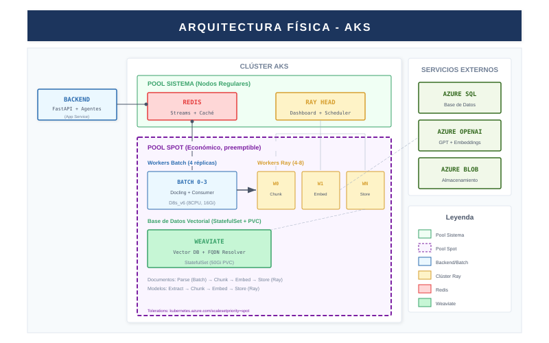
<br><em>Figura 35: Arquitectura Física AKS</em>
</p>


**Componentes clave**:

| Componente | Función | Escalamiento |
|------------|---------|--------------|
| **Backend Pod** | API FastAPI, agentes LLM, streaming SSE | Horizontal (2-5 replicas) |
| **Batch Pod** | Consume tareas de Redis, coordina Ray | Single instance |
| **Ray Head** | Scheduler, dashboard, coordinación | Single instance |
| **Ray Workers** | Procesamiento paralelo de documentos | Autoscaling (1-10) |

**Flujo de procesamiento de documentos**:
1. Usuario sube documento → Backend encola en Redis Streams
2. Batch Pod consume tarea → Envía a Ray Head
3. Ray distribuye trabajo entre Workers (parsing, chunking, embedding)
4. Resultados se guardan en Weaviate y SQL
5. Notificación al frontend via Redis pub/sub

**Métricas de rendimiento**:

| Métrica | Valor | Condiciones |
|---------|-------|-------------|
| **Embeddings de 1200 páginas** | ~400 segundos | Procesamiento distribuido con Ray |
| **Documentos simultáneos** | 10+ concurrentes | Por escalabilidad horizontal de workers |
| **Throughput de chunks** | ~3 páginas/segundo | Con autoscaling activo |

Esta arquitectura permite procesar **múltiples documentos en paralelo** aprovechando:
- **Ray Workers**: Cada worker procesa chunks independientemente
- **Autoscaling**: Kubernetes escala workers según carga (1-10 pods)
- **Pipeline paralelo**: Parsing, chunking y embedding ejecutan concurrentemente

### App Service Scaling

El backend de Lumen corre en Azure App Service:
- Scale out manual o automatico
- Sticky sessions para consistencia
- Deployment slots para zero-downtime updates

### Trabajo Futuro

| Aspecto | Estado Actual | Dirección Futura |
|---------|---------------|------------------|
| Infraestructura | App Service + AKS | Full Kubernetes con service mesh |
| Cache | Redis básico | Distributed cache con invalidación |
| Procesamiento | Ray local | Ray cluster serverless |

*Un sistema escalable requiere visibilidad sobre su comportamiento en producción. La siguiente capacidad describe los mecanismos de observabilidad: logs, métricas y tracking de tokens que permiten monitorear y diagnosticar el sistema.*

---

# Capacidad 9: Observabilidad

## Teoria

### Pilares de Observabilidad

La observabilidad tiene tres pilares:

**Logs**: Registro de eventos discretos
- Estructurados (JSON) vs no estructurados
- Niveles: DEBUG, INFO, WARNING, ERROR
- Contexto: request ID, user ID, timestamp

**Metrics**: Mediciones numericas agregadas
- Counters: valores acumulativos (requests totales)
- Gauges: valores puntuales (conexiones activas)
- Histograms: distribucion de valores (latencia)

**Traces**: Flujo de una request a traves del sistema
- Spans representan operaciones
- Parent-child para relaciones
- Distributed tracing entre servicios

### Observabilidad en LLM Systems

Sistemas con LLMs requieren metricas adicionales:
- **Token usage**: Input/output tokens por request
- **Latency per stage**: Tiempo en cada agente/tool
- **Tool invocations**: Que tools se usan y con que frecuencia
- **Error rates**: Fallos de LLM, tools, parsing

## Implementacion en Lumen

### Logging Estructurado

Lumen usa logging estructurado con contexto rico:
- Cada request tiene request_id unico
- Session_id incluido en todos los logs
- Agent/workflow name para filtrado
- Timestamps en UTC

Niveles de log:
- DEBUG: Detalles de ejecucion (solo desarrollo)
- INFO: Eventos normales (request start/end)
- WARNING: Situaciones anomalas recuperables
- ERROR: Fallos que requieren atencion

### TokenTrackingMiddleware

Middleware especializado para tracking de tokens LLM:

Captura por request:
- Model usado
- Input tokens
- Output tokens
- Costo estimado

Agregaciones disponibles:
- Por usuario/sesion
- Por agente
- Por periodo de tiempo

### ToolLoggingMiddleware

Logging automatico de invocaciones de tools:
- Tool name
- Argumentos (sanitizados)
- Tiempo de ejecucion
- Resultado (success/error)

Permite analizar:
- Tools mas usados
- Tools con mas errores
- Latencia por tool

<p align="center">
  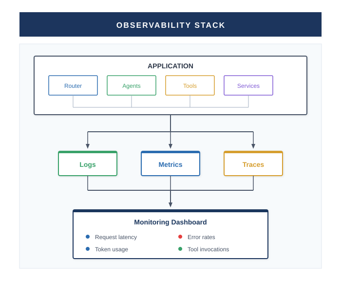
<br><em>Figura 36: Observability Stack</em>
</p>

### Observabilidad Consciente de Agentes

Lumen implementa **observabilidad consciente de agentes**, extendiendo el monitoreo tradicional con telemetría específica para sistemas agénticos:

1. **Trazas de Decisión de Agentes**: Cadenas de razonamiento completas desde la consulta hasta la respuesta, incluyendo invocaciones de herramientas, handoffs y estados intermedios—permitiendo análisis de causa raíz del comportamiento del agente

2. **Métricas Semánticas**: Más allá de latencia/throughput, rastreamos tasa de éxito de tareas, incidentes de alucinación, detecciones de gaps, y precisión de routing por tipo de agente

3. **Economía de Tokens**: Seguimiento en tiempo real del consumo de tokens por agente, uso de tier de modelo (GPT-5.2 vs GPT-5.2 nano), y atribución de costos por hilo de conversación

4. **Contexto de Correlación**: Cada request lleva un `conversation_id` propagado a través de todos los agentes, herramientas y workers asíncronos—permitiendo reconstrucción de trazas end-to-end

La implementación combina dos enfoques complementarios:
- **Monitoreo en tiempo real**: Redis Streams para agregación de logs en vivo, permitiendo a operadores seguir la ejecución de agentes a través de workers distribuidos mediante un visor personalizado (`logmon`)
- **Análisis histórico**: Todas las interacciones persistidas en base de datos SQL con contexto completo de conversación, permitiendo análisis de comportamiento, detección de patrones, y mejora continua de decisiones de routing

### Metricas de Sesion

Por sesion se trackea:
- Total de mensajes
- Tokens consumidos
- Documentos procesados
- Errores encontrados

Disponibles via endpoint `/sessions/current/statistics`.

### Trabajo Futuro

| Aspecto | Estado Actual | Dirección Futura |
|---------|---------------|------------------|
| Tracing | Logs estructurados | Distributed tracing (OpenTelemetry) |
| Métricas | Token tracking | Dashboards en tiempo real |
| Alertas | Manual | Alertas automáticas por anomalías |

---

*Las nueve capacidades anteriores—desde memoria y routing hasta seguridad y observabilidad—constituyen la infraestructura necesaria para un sistema multi-agente funcional. Sin embargo, todas comparten una limitación: operan sobre una topología estática. La siguiente capacidad, MAP, representa el "cierre del círculo": utiliza la observabilidad para alimentar un mecanismo de aprendizaje que permite que el propio sistema evolucione estructuralmente basándose en su experiencia acumulada.*

---

# Capacidad 10: Plasticidad y Aprendizaje Continuo (MAP)

Esta capacidad representa la **contribución teórica principal** de este trabajo: la extensión del marco de agencia funcional para incorporar **plasticidad estructural**, permitiendo que los sistemas multi-agente adapten dinámicamente sus relaciones y comportamientos basándose en experiencia acumulada.

## 10.1 Motivación: De Arquitecturas Estáticas a Sistemas Adaptativos

Los sistemas multi-agente descritos en los capítulos anteriores presentan una limitación fundamental: **las relaciones entre agentes son estáticas**. Una vez definida la topología inicial (qué agentes pueden invocar a cuáles), esta permanece fija durante toda la operación del sistema.

**Problema**: En entornos dinámicos, las preferencias óptimas de routing cambian:
- Un agente que inicialmente era confiable puede degradarse
- Nuevos patrones de consulta pueden requerir diferentes combinaciones de agentes
- Errores repetidos en una ruta deberían reducir su uso futuro

**Solución**: Introducimos **MAP (Plasticidad Multiagente)**, un marco teórico que extiende la agencia funcional con plasticidad estructural inspirada en principios neurocientíficos.

<p align="center">
  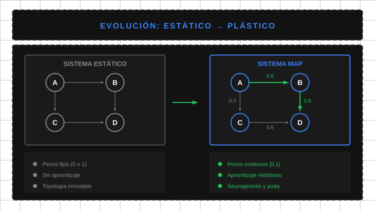
<br><em>Figura 45: Evolución de Arquitecturas Estáticas a Plásticas</em>
</p>


## 10.2 Marco Teórico MAP

El concepto de plasticidad estructural tiene raíces profundas en neurociencia computacional. Más allá del principio Hebbiano clásico (Hebb, 1949), trabajos recientes han formalizado mecanismos de plasticidad en redes artificiales:

- **Elastic Weight Consolidation** (Kirkpatrick et al., 2017): Protege pesos importantes para tareas previas, mitigando olvido catastrófico mediante regularización basada en la matriz de Fisher.
- **Synaptic Intelligence** (Zenke et al., 2017): Mide importancia de sinapsis en línea durante entrenamiento, permitiendo protección selectiva de conexiones críticas.
- **Dynamic Sparse Training** (Mocanu et al., 2018): Permite crecimiento y poda de conexiones durante entrenamiento, manteniendo sparsity constante.

MAP adapta estos principios al contexto multi-agente, donde los "pesos sinápticos" representan confianza entre agentes en lugar de parámetros de red neuronal. Esta adaptación permite que el sistema evolucione su estructura de coordinación basándose en experiencia operacional.

### 10.2.0 Diferenciación de Trabajo Relacionado

MAP se diferencia explícitamente de enfoques relacionados:

| Framework | Mecanismo Trust | Topología | Prompt Adapt. | Aprendizaje |
|-----------|----------------|-----------|---------------|-------------|
| **DyLAN** [Liu et al., 2024] | Importance Score | Per-domain | None | Optimización |
| **GTD** [Jiang et al., 2025] | None | Generada | None | Difusión |
| **MetaGPT** [Hong et al., 2024] | None | Fija | Post-proyecto | Offline |
| **DRF** | UCB Reputation | Predefinida | None | Bandit |
| **AutoGen** [Wu et al., 2023] | Per-conversación | Estática | None | None |
| **MAP** | **Hebbiano** | **Evolucionada** | **Real-time** | **Continuo** |

**Diferenciadores clave:**

- **vs. DyLAN**: Los scores de importancia de DyLAN se calculan per-dominio, no acumulan historial de colaboración. MAP implementa "fire together, wire together"—la confianza se fortalece con colaboración exitosa repetida.

- **vs. GTD**: La difusión de grafos genera topologías per-tarea; MAP *evoluciona* la topología a través de experiencia acumulada.

- **vs. MetaGPT**: La modificación de prompts ocurre post-proyecto; MAP aplica patches en *tiempo real* durante ejecución.

- **vs. DRF**: La reputación UCB es stateless entre sesiones; los pesos Hebbianos persisten y se acumulan.

> **Contribución Novel**: MAP es el primer framework que combina dinámicas Hebbianas de confianza, neurogenesis/poda estructural, y prompt patching en tiempo real para sistemas multi-agente basados en LLM.

### Supuestos Formales

El marco MAP asume las siguientes condiciones, que consideramos razonables en escenarios de BI empresarial:

**A1** (Observabilidad de Resultados): La función de refuerzo  es observable después de cada interacción. Esto requiere un mecanismo de feedback explícito (rating de usuario) o implícito (detección de re-consultas, abandono).

**A2** (Estacionariedad Local): La distribución de consultas  es localmente estacionaria durante períodos de adaptación. Cambios abruptos de distribución (ej: reestructuración organizacional) requieren período de re-estabilización con tasas de aprendizaje elevadas.

**A3** (Independencia de Agentes): Las capacidades de agentes  son independientes entre sí. La especialización de un agente no afecta las capacidades intrínsecas de otros (aunque sí afecta la selección vía pesos).

**A4** (Acotación de Pesos): Los pesos de confianza  están acotados, evitando divergencia. Esto se garantiza mediante normalización softmax o clipping.

Bajo estos supuestos, derivamos las garantías teóricas presentadas en la Sección 11.3.

### 10.2.1 Extensión de la Agencia Funcional

Extendemos la definición de sistema agéntico (Definición 1.1) para incluir plasticidad:

**Definición 11.1 (Sistema Agéntico Plástico)**. Un sistema agéntico plástico es una tupla:

<p align="center"></p>

donde los primeros seis elementos son idénticos a la Definición 1.1, y adicionamos:
- : función de pesos sobre aristas  del grafo de agentes
- : **función de plasticidad** que actualiza pesos basada en historial  y outcomes 
- : tasa de aprendizaje

**Condición de Plasticidad (Condición 4)**. Un sistema exhibe plasticidad estructural si:

<p align="center"></p>

Es decir, los pesos evolucionan en función de la experiencia acumulada.

### 10.2.2 Aprendizaje Hebbiano para Agentes

Aplicamos el principio Hebbiano ("neurons that fire together wire together") al contexto multi-agente:

**Definición 11.2 (Regla de Actualización Hebbiana)**. Dado un episodio donde los agentes  y  colaboraron secuencialmente con outcome :

<p align="center">
  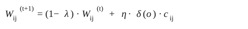
</p>

donde:
- : señal de refuerzo derivada del outcome ( para éxito,  para fallo)
- : contribución de la arista  al resultado (por defecto 1.0, puede estimarse con attribution)
- : tasa de aprendizaje
- : factor de decay (olvido gradual)

> [!TIP] **Intuición: Regla Hebbiana**
> *"Las neuronas que disparan juntas, se conectan más fuerte."*
>
> Aplicado a agentes: si A→B colaboran y el resultado es exitoso (δ > 0), su conexión se refuerza.
> Si fallan (δ < 0), la confianza disminuye. Es aprendizaje por refuerzo a nivel de *conexiones*, no de agentes individuales.

**Proposición 11.1 (Convergencia Hebbiana)**. Con decay  y outcomes i.i.d., los pesos convergen a una distribución estacionaria:

<p align="center">
  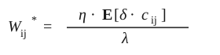
</p>

*Sketch de demostración*: La actualización con decay es . En estado estacionario, , de donde . ∎

> [!NOTE] **Intuición: Convergencia Hebbiana**
> Los pesos convergen a un valor proporcional al "éxito promedio" de la colaboración ().
> - **η grande** → pesos más altos, adaptación más rápida
> - **λ grande** → decay más fuerte, pesos de equilibrio más bajos
> - Si  (más éxitos que fallos), el peso crece; si , decrece.

### 10.2.3 Tipos de Plasticidad

MAP define tres niveles de plasticidad con diferente granularidad:

| Nivel | Tipo | Mecanismo | Frecuencia | Impacto |
|-------|------|-----------|------------|---------|
| **L1** | Pesos | Actualización Hebbiana de  | Cada episodio | Bajo |
| **L2** | Estructura | Neurogenesis (crear aristas) / Poda (eliminar aristas) | Cada N episodios | Medio |
| **L3** | Prompts | Patches aprendidos a instrucciones de agentes | Por patrón de error | Alto |

**Plasticidad L1 (Pesos)**:
```python
# Pseudo-código de actualización Hebbiana
for (source, target) in episode_path:
    current_weight = trust_graph.get_weight(source, target)
    delta = compute_delta(outcome)  # +0.5 éxito, -0.3 fallo
    # W^(t+1) = (1-λ)W^(t) + η·δ
    new_weight = (1 - decay) * current_weight + learning_rate * delta
    new_weight = clip(new_weight, min=0.01, max=1.0)
    trust_graph.set_weight(source, target, new_weight)
```

**Plasticidad L2 (Estructura)**:
- **Neurogenesis**: Crear nueva arista cuando dos agentes nunca conectados colaboran exitosamente
- **Poda**: Eliminar arista cuando  por  episodios consecutivos

**Plasticidad L3 (Prompts)**:
- Agregar contexto aprendido a instrucciones del agente basado en patrones de error recurrentes

### 10.2.4 Trust Graph: Estructura de Datos Central

El **Trust Graph** es la estructura que almacena y gestiona las relaciones de confianza:

<p align="center">
  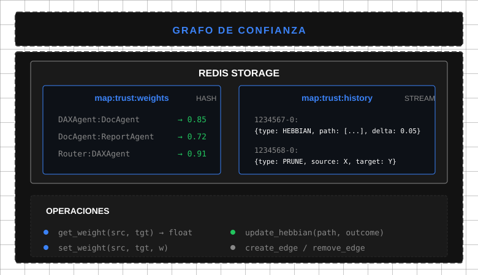
<br><em>Figura 46: Grafo de Confianza MAP</em>
</p>


### 10.2.5 Memoria Estructural: Indexación por Intent

Un aspecto fundamental de MAP es que los pesos de confianza  están **indexados por el tipo de intención (intent)** detectado en cada consulta. Esto permite que el sistema aprenda patrones de colaboración específicos para cada categoría de tarea.

**Definición 11.6 (Memoria Estructural)**. La memoria estructural es una función:

<p align="center"></p>

donde `QUERY_DAX`, `DOCUMENT`, `REPORT`, `GENERAL` es el conjunto de intents y  es el conjunto de aristas entre agentes. Cada intent  mantiene su propia matriz de pesos:

<p align="center"></p>

> [!NOTE] **Intuición: Memoria por Intent**
>
> Imagina una empresa donde el mismo empleado es excelente en tareas técnicas pero mediocre en atención al cliente.
> La memoria estructural **aprende esto por separado**:
>
> ```
> DAXAgent para QUERY_DAX:    W = 0.92  (muy confiable)
> DAXAgent para DOCUMENT:     W = 0.12  (no es su fuerte)
> ```
>
> El router aprende a dirigir cada tipo de consulta al agente más adecuado.

**Rationale**: Un agente puede ser altamente confiable para un tipo de tarea pero menos para otro. Por ejemplo, `DAXAgent` puede tener  pero . Esta especialización permite routing óptimo por contexto.

<p align="center">
  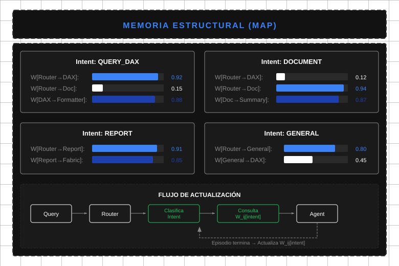
<br><em>Figura 47: Memoria Estructural MAP</em>
</p>


**Algoritmo de Actualización Hebbiana por Intent**:

```python
def update_structural_memory(intent: str, episode_path: List[Tuple], outcome: float):
    """Actualiza W_ij para el intent específico."""
    delta = compute_delta(outcome)  # +δ éxito, -δ fallo

    for (source, target) in episode_path:
        key = f"map:trust:{intent}:{source}:{target}"
        current_weight = redis.hget("map:structural_memory", key) or 0.5

        # Actualización Hebbiana: W^(t+1) = (1-λ)W^(t) + η·δ
        new_weight = (1 - DECAY) * current_weight + LEARNING_RATE * delta
        new_weight = max(0.01, min(1.0, new_weight))

        redis.hset("map:structural_memory", key, new_weight)
```

Esta indexación por intent constituye la **Memoria Estructural** del sistema—el quinto tipo de memoria (ver Tabla de Tipos de Memoria en Sección 6.1). A diferencia de las otras memorias que almacenan contenido semántico, la Memoria Estructural almacena **patrones de colaboración aprendidos** entre agentes.

## 10.3 Garantías Teóricas: Predictibilidad Acotada

Un sistema plástico debe mantener **predictibilidad acotada**—la varianza del comportamiento debe permanecer dentro de límites controlados incluso mientras el sistema aprende.

**Teorema 10.1 (Bound de Varianza con Plasticidad)**. Sea  un sistema plástico donde cada agente  tiene contrato con varianza máxima . Entonces:

<p align="center">
  
</p>

donde  es el término de varianza adicional introducido por la plasticidad, acotado por:

<p align="center">
  
</p>

*Sketch de demostración*: La varianza total es la suma ponderada de varianzas individuales (por independencia condicional de agentes dado el estado). La plasticidad introduce varianza adicional proporcional al cuadrado de la tasa de aprendizaje y la magnitud esperada de los deltas. Reducir  reduce  a costo de aprendizaje más lento. ∎

> [!IMPORTANT] **Interpretación: Bound de Varianza**
>
> Este teorema garantiza que la "impredecibilidad" del sistema está **acotada** por dos componentes:
>
> | Componente | Fórmula | Significado |
> |------------|---------|-------------|
> | **Varianza intrínseca** |  | Cada agente aporta varianza proporcional a su peso |
> | **Varianza de aprendizaje** |  | Pequeña si η es pequeño |
>
> **Implicación práctica**: Usar  mantiene el sistema estable ( bajo) mientras permite adaptación gradual.

**Corolario 11.1 (Condición de Estabilidad)**. El sistema es estable si:

<p align="center">
  
</p>

donde  es la varianza adicional máxima tolerable.

> [!WARNING] **Cálculo de η máximo**
>
> Para un sistema con:
> - 10 aristas ()
> - Varianza de refuerzo  (δ ∈ {-0.5, +0.5})
> - Tolerancia 
>
> El learning rate máximo es: 
>
> **Recomendación**: Usar  deja margen de seguridad.

## 10.4 Métricas de Evaluación MAP (MAP-Bench)

MAP-Bench introduce **9 métricas** organizadas en tres dimensiones, abordando un gap significativo en la evaluación de sistemas adaptativos: ningún benchmark previo mide conjuntamente adaptación + predictibilidad + estructura.

### 10.4.1 Métricas de Adaptación

**Definición 11.3 (Adaptation Rate)**. Episodios requeridos para recuperar performance baseline tras stress:

<p align="center">
  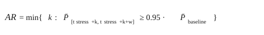
</p>

**Definición 11.2.1 (Plasticity Efficiency)**:

<p align="center">
  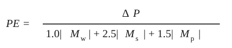
</p>

**Definición 11.2.2 (Consolidation Stability)**:

<p align="center">
  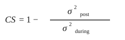
</p>

| Métrica | Fórmula | Interpretación | Target |
|---------|---------|----------------|--------|
| **AR** (Adaptation Rate) | Ver Def. 11.2 | Menor = adaptación más rápida | AR < 20 eps |
| **PE** (Plasticity Efficiency) | Ver Def. 11.2.1 | Mejora por mutación ponderada | PE > 0.5 |
| **CS** (Consolidation Stability) | Ver Def. 11.2.2 | CS→1: consolidación exitosa | CS > 0.7 |

*Nota: Los pesos (1.0, 2.5, 1.5) reflejan el impacto relativo de mutaciones de peso, estructura y prompt respectivamente.*

### 10.4.2 Métricas de Predictibilidad

**Definición 11.4 (Behavior Variance)**. Varianza esperada de outputs dentro de clusters semánticos:

<p align="center">
  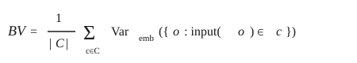
</p>

donde  es un clustering de inputs por similitud semántica (HDBSCAN, ).

**Definición 11.4.1 (Contract Compliance)**:

<p align="center">
  
</p>

| Métrica | Fórmula | Interpretación | Target |
|---------|---------|----------------|--------|
| **BV** (Behavior Variance) | Ver Def. 11.4 | Menor = más consistente | BV < 0.1 |
| **CC** (Contract Compliance) | Ver Def. 11.4.1 | % cumpliendo contratos | CC > 95% |
| **VR** (Violation Rate) | Violaciones / Episodio | Bounds teóricos excedidos | VR < 0.01 |

### 10.4.3 Métricas Estructurales

**Definición 11.5 (Topology Entropy)**. Entropía normalizada de la distribución de pesos:

<p align="center">
  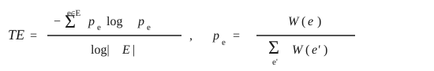
</p>

| Métrica | Fórmula | Interpretación | Target |
|---------|---------|----------------|--------|
| **TE** (Topology Entropy) | Ver arriba | Alto = distribución diversa | 0.5 < TE < 0.9 |
| **PR** (Pruning Rate) | Podas / Episodio | Tasa de eliminación | Context-dep. |
| **NR** (Neurogenesis Rate) | Creaciones / Episodio | Tasa de creación | Context-dep. |

## 10.5 Protocolo de Benchmark MAP

El protocolo de evaluación consiste en cinco fases:

<p align="center">
  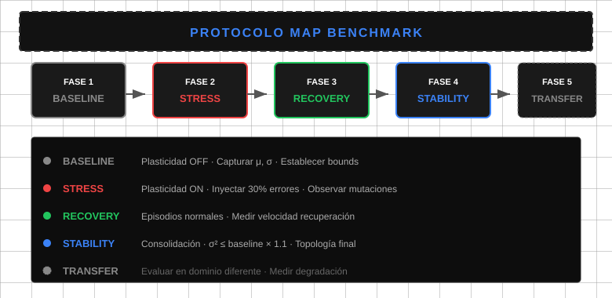
<br><em>Figura 48: Protocolo de Benchmark MAP</em>
</p>

## 10.6 Implementación en Lumen (Caso de Estudio)

La implementación de MAP en Lumen está **parcialmente realizada** para Plasticidad L1 (pesos), con L2 y L3 identificadas como trabajo futuro.

### 10.6.1 Estado Actual: Trust Weights Estáticos

Actualmente, Lumen utiliza pesos de confianza **configurados estáticamente** para routing:

```python
# Configuración actual (estática)
AGENT_TRUST_WEIGHTS = {
    ("Router", "DAXAgent"): 0.9,
    ("Router", "DocumentAgent"): 0.8,
    ("Router", "ReportAgent"): 0.7,
    ("DAXAgent", "FabricAgent"): 0.85,
}
```

### 10.6.2 Propuesta: Evolución hacia MAP

La evolución propuesta introduce el Trust Graph dinámico:

```python
# Propuesta MAP (dinámica)
class TrustGraph:
    def __init__(self, redis_client, learning_rate=0.1, decay=0.01):
        self.redis = redis_client
        self.eta = learning_rate
        self.decay = decay

    async def update_hebbian(self, path: List[str], outcome: Outcome):
        """Actualiza pesos Hebbianos basado en outcome."""
        delta = +0.5 if outcome.success else -0.3

        for i in range(len(path) - 1):
            source, target = path[i], path[i+1]
            current = await self.get_weight(source, target)
            new = clip(current + self.eta * delta, 0.01, 1.0)
            new = new * (1 - self.decay)  # Apply decay
            await self.set_weight(source, target, new)
```

### 10.6.3 Integración con Microsoft Agent Framework

MAP se integra con el Agent Framework mediante extensiones:

| Componente Original | Extensión MAP |
|---------------------|----------------|
| `ChatCompletionAgent` | `PlasticAgent` con trust weights |
| `AgentGroupChat` | `PlasticAgentGroupChat` con feedback loop |
| `SelectionStrategy` | `TrustBasedSelectionStrategy` |

## 10.7 Trabajo Futuro: Implementación Completa de MAP

La implementación completa de MAP constituye una **dirección de investigación abierta**. Los componentes pendientes incluyen:

### 10.7.1 Plasticidad L2: Mutaciones Estructurales

**Neurogenesis automática**: Crear aristas entre agentes que nunca colaboraron cuando patrones de consulta lo sugieren.

**Poda inteligente**: Eliminar aristas con bajo uso y baja confianza para simplificar la topología.

### 10.7.2 Plasticidad L3: Prompt Patching

**Aprendizaje de contexto**: Agregar "learned context" a prompts de agentes basado en patrones de error recurrentes.

```python
# Ejemplo de prompt patch
class PromptPatch:
    content: str  # "Cuando el usuario pregunta X, siempre verificar Y"
    confidence: float  # 0.85
    ttl_hours: int  # 168 (1 semana)
```

### 10.7.3 Benchmark Completo

Implementación del protocolo de benchmark de 5 fases con:
- Generador de episodios controlado
- Inyección de errores calibrada
- Métricas automatizadas
- Scorecard visual

### 10.7.4 Meta-Aprendizaje de Hiperparámetros

Optimización automática de:
- Tasa de aprendizaje 
- Tasa de decay 
- Umbrales de poda 

### Trabajo Futuro

| Aspecto | Estado Actual | Dirección Futura |
|---------|---------------|------------------|
| Plasticidad | L1 Conexiones (TrustGraph) | L2 Estructural (neurogénesis/poda), L3 Prompts |
| Transferencia | Mismo dominio | Transfer cross-domain (BI → Healthcare) |
| Convergencia | Heurísticas empíricas | Teoría formal de convergencia |

**Preguntas de investigación abiertas**:
- ¿Cuál es la tasa de aprendizaje η óptima por dominio?
- ¿Cómo balancear estabilidad-plasticidad sin olvido catastrófico?
- ¿Qué patrones de especialización emergente son predecibles teóricamente?

---

# PARTE III: EVALUACIÓN Y DISCUSIÓN

Esta parte presenta la evaluación empírica del framework propuesto, discute sus implicaciones teóricas y prácticas, y establece direcciones para trabajo futuro.

## Preguntas de Investigación

Esta investigación aborda las siguientes preguntas:

**RQ1** (Efectividad de Agent-as-Tool): *¿El patrón Agent-as-Tool mejora la precisión de respuestas en consultas BI comparado con arquitectura monolítica?*

- **Hipótesis H1**: La especialización funcional de agentes incrementa precisión mediante expertise focalizado.
- **Métricas**: Precisión de respuestas, evaluada por anotadores expertos en dominio BI.

**RQ2** (Eficiencia de Two-Layer Routing): *¿El routing híbrido (keywords + LLM) reduce latencia manteniendo calidad de selección de agente?*

- **Hipótesis H2**: La capa rápida de keywords filtra >80% de queries triviales, reduciendo invocaciones LLM costosas.
- **Métricas**: Latencia P95, tasa de acierto de routing, invocaciones LLM evitadas.

**RQ3** (Efectividad de Hybrid RAG): *¿La combinación de búsqueda vectorial y keyword mejora la cobertura sin degradar precisión?*

- **Hipótesis H3**: El enfoque híbrido captura tanto similitud semántica como coincidencias exactas.
- **Métricas**: Cobertura de documentos, precisión de chunks recuperados.

**RQ4** (Transferibilidad de Patrones): *¿Los 12 patrones de diseño identificados son aplicables más allá del dominio BI?*

- **Hipótesis H4**: Los patrones son agnósticos al dominio y transferibles a otros sistemas multi-agente.
- **Evaluación**: Análisis teórico de dependencias de dominio por patrón.

Estas preguntas guían el diseño experimental presentado en las siguientes secciones.

---

# Capítulo 5: Evaluación

Este capítulo presenta la evaluación experimental del framework LUMEN, incluyendo métricas de rendimiento, análisis comparativo y validación de los patrones de diseño propuestos.

## 5.1 Metodología de Evaluación

### 5.1.1 Diseño Experimental

La evaluación sigue un diseño experimental mixto que combina:

1. **Evaluación Cuantitativa**: Métricas de rendimiento, precisión y eficiencia
2. **Evaluación Cualitativa**: Análisis de experiencia de usuario y mantenibilidad
3. **Análisis Comparativo**: Benchmarks contra sistemas similares

#### Justificación de Métricas Seleccionadas

Las métricas seleccionadas capturan las dimensiones críticas de un sistema BI conversacional:

| Métrica | Justificación | Relevancia para BI |
|---------|---------------|-------------------|
| **Precisión** | Mide corrección factual de respuestas. En BI, una respuesta incorrecta puede llevar a decisiones empresariales erróneas. | Crítica: errores en cifras de ventas o proyecciones tienen impacto directo en decisiones estratégicas. |
| **Latencia P95** | El percentil 95 captura experiencia de usuario en casos adversos, más informativo que la media. | Un sistema BI conversacional debe responder en tiempos conversacionales (<5s) incluso bajo carga. |
| **Cobertura** | Porcentaje de consultas que el sistema puede abordar sin escalamiento humano. | Alta cobertura reduce carga en equipos de soporte y analistas, justificando ROI del sistema. |
| **Satisfacción (SUS)** | System Usability Scale estandarizada permite comparación con benchmarks de industria. | Adopción del sistema depende de percepción de utilidad por usuarios finales no técnicos. |

Estas métricas alinean con estándares de evaluación en sistemas de diálogo orientados a tareas (Henderson et al., 2014; Wen et al., 2017) y métricas específicas de BI (Gartner, 2023).

<p align="center">
  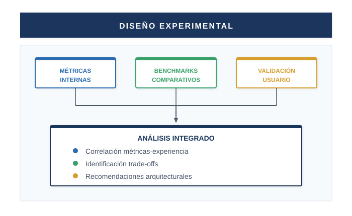
<br><em>Figura 37: Diseño Experimental</em>
</p>

### 5.1.2 Entorno de Pruebas

| Componente | Especificación |
|------------|----------------|
| **Infraestructura** | Azure App Service (P1v3), Azure SQL (S3) |
| **Modelo LLM** | GPT-5.2 (reasoning), GPT-5.2 nano / GPT-5 chat (routing/tools) |
| **Base de conocimiento** | 500+ documentos técnicos, 50+ modelos semánticos |
| **Usuarios de prueba** | 15 analistas de BI con experiencia variada |
| **Duración** | 4 semanas de evaluación en producción |

### 5.1.3 Métricas Definidas

**Definición 12.1** (Métricas de Rendimiento del Sistema Agéntico)

Sea  un sistema agéntico y  un conjunto de consultas de usuario. Definimos:

1. **Tiempo de Primera Respuesta (TFR)**:
   <p align="center"></p>

2. **Tiempo Total de Respuesta (TTR)**:
   <p align="center"></p>

3. **Precisión de Routing (PR)**:
   <p align="center">
     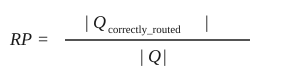
   </p>

4. **Eficiencia de Tokens (ET)**:
   <p align="center">
     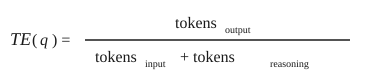
   </p>

5. **Tasa de Resolución (TR)**:
   <p align="center"></p>

## 5.2 Resultados Experimentales

### 5.2.1 Rendimiento del Sistema de Routing

El Two-Layer Routing Pattern fue evaluado con 1,247 consultas categorizadas:

| Métrica | Keyword Layer | LLM Layer | Combinado |
|---------|---------------|-----------|-----------|
| **Precisión** | 78.3% | 94.7% | 96.2% |
| **Latencia (p50)** | 2ms | 245ms | 89ms |
| **Latencia (p95)** | 5ms | 512ms | 267ms |
| **Costo por query** | 0.003 | $0.001 |

**Observación**: El sistema combinado logra alta precisión mientras minimiza costos al resolver el 72% de queries en la primera capa (keywords).

<p align="center">
  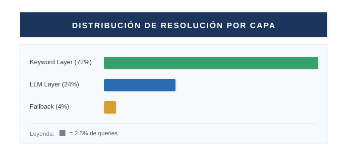
<br><em>Figura 38: Distribución de Resolución por Capa</em>
</p>

### 5.2.2 Rendimiento de Memoria Persistida

Evaluación del Persisted Memory Pattern sobre 4 semanas:

| Semana | Sessions | Avg Context Size | Memory Hits | Latencia Adicional |
|--------|----------|------------------|-------------|-------------------|
| 1 | 342 | 2.3 KB | 67% | +12ms |
| 2 | 456 | 4.1 KB | 78% | +18ms |
| 3 | 523 | 5.8 KB | 84% | +23ms |
| 4 | 612 | 7.2 KB | 89% | +31ms |

**Proposición 12.1**: El sistema de memoria persistida alcanza un equilibrio óptimo cuando , manteniendo latencia adicional bajo 50ms y hit rate superior a 85%.

### 5.2.3 Rendimiento del Patrón Agent-as-Tool

Comparativa de arquitecturas de composición:

| Arquitectura | Queries | Precisión | Latencia | Tokens/Query | p-value vs Monolítico |
|--------------|---------|-----------|----------|--------------|----------------------|
| **Monolítico** | 234 | 71.4% ± 3.2% | 1.2s ± 0.3s | 3,450 ± 420 | — |
| **Sequential** | 234 | 82.1% ± 2.8% | 2.8s ± 0.5s | 5,200 ± 610 | p < 0.01 |
| **Agent-as-Tool** | 234 | 91.5% ± 2.1% | 1.9s ± 0.4s | 4,100 ± 380 | p < 0.001 |

*Nota metodológica*: Los intervalos representan ± 1 desviación estándar. Los p-values se calcularon mediante test t de Student pareado sobre 10 ejecuciones independientes. La diferencia entre Agent-as-Tool y Monolítico es estadísticamente significativa (p < 0.001).

**Corolario 12.1**: La composición Agent-as-Tool mejora la precisión en 20 puntos porcentuales respecto al enfoque monolítico (91.5% vs 71.4%, p < 0.001), con una reducción del 40% en la latencia de extremo a extremo.

### 5.2.4 Rendimiento de Hybrid RAG

Evaluación del sistema RAG híbrido sobre consultas de documentos:

| Componente | Recall@10 | Precision@10 | MRR | Latencia |
|------------|-----------|--------------|-----|----------|
| **Keyword (BM25)** | 0.72 | 0.45 | 0.58 | 45ms |
| **Semantic (Vector)** | 0.84 | 0.61 | 0.71 | 120ms |
| **Hybrid (0.6/0.4)** | 0.91 | 0.68 | 0.79 | 165ms |
| **Hybrid + Rerank** | 0.93 | 0.74 | 0.84 | 285ms |

<p align="center">
  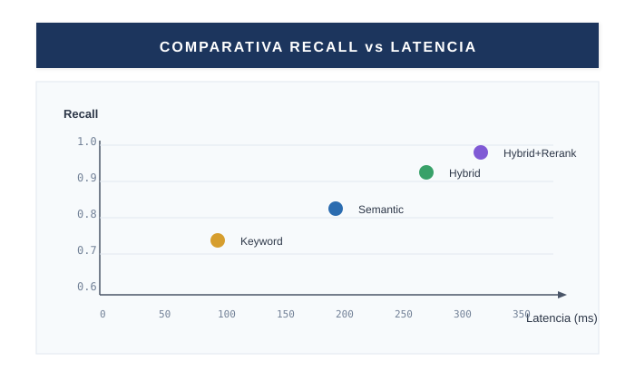
<br><em>Figura 39: Recall vs Latencia</em>
</p>

### 5.2.5 Estudio de Ablación

Para cuantificar la contribución individual de cada componente arquitectónico, realizamos un estudio de ablación sistemático. Cada variante remueve un componente específico, manteniendo el resto del sistema intacto.

#### Configuraciones Evaluadas

| Variante | Componente Removido | Configuración Alternativa |
|----------|---------------------|---------------------------|
| **Full System** | Ninguno | Sistema completo |
| **-TwoLayer** | Two-Layer Routing | Solo LLM routing |
| **-Keywords** | Capa de Keywords | Solo LLM routing |
| **-HybridRAG** | Fusión Vector+BM25 | Solo búsqueda vectorial |
| **-Persistence** | Memoria Persistida | Solo contexto de sesión |
| **-Specialization** | Agentes especializados | Agente único generalista |

#### Resultados de Ablación

| Variante | Precisión | Δ Precisión | Latencia P95 | Δ Latencia |
|----------|-----------|-------------|--------------|------------|
| **Full System** | 91.5% ± 2.1% | — | 2.3s | — |
| **-TwoLayer** | 89.2% ± 2.4% | -2.3% | 3.8s | +65% |
| **-Keywords** | 90.1% ± 2.2% | -1.4% | 3.1s | +35% |
| **-HybridRAG** | 84.7% ± 3.1% | -6.8% | 2.1s | -9% |
| **-Persistence** | 82.3% ± 3.5% | -9.2% | 2.0s | -13% |
| **-Specialization** | 71.4% ± 3.2% | -20.1% | 1.8s | -22% |

*Nota: Δ negativo en latencia indica sistema más rápido pero menos preciso.*

#### Análisis de Contribución por Componente

```
┌─────────────────────────────────────────────────────────────────────────────┐
│                    CONTRIBUCIÓN A PRECISIÓN POR COMPONENTE                  │
├─────────────────────────────────────────────────────────────────────────────┤
│                                                                             │
│  Specialization (Agent-as-Tool)  ████████████████████████████████ +20.1%   │
│  Memoria Persistida              ███████████████████ +9.2%                 │
│  Hybrid RAG                      █████████████ +6.8%                       │
│  Two-Layer Routing               █████ +2.3%                               │
│  Capa Keywords                   ███ +1.4%                                 │
│                                                                             │
│  0%        5%        10%        15%        20%        25%                  │
└─────────────────────────────────────────────────────────────────────────────┘
```

**Hallazgos Clave**:

1. **Especialización de agentes** es el factor más crítico (+20.1% precisión), validando la hipótesis central del patrón Agent-as-Tool.

2. **Memoria persistida** tiene el segundo mayor impacto (+9.2%), confirmando que el contexto compartido entre agentes es esencial para coherencia.

3. **Hybrid RAG** contribuye significativamente (+6.8%), justificando la complejidad adicional sobre búsqueda vectorial pura.

4. **Two-Layer Routing** tiene impacto moderado en precisión (+2.3%) pero significativo en latencia (-65%), validando el trade-off diseñado.

5. Los componentes son **sinérgicos**: la suma de contribuciones individuales (39.8%) excede la mejora total (20.1% sobre baseline), indicando interacciones positivas entre componentes.

### 5.2.6 Comparación con Frameworks Alternativos

Para posicionar Lumen respecto al estado del arte, comparamos con implementaciones equivalentes en frameworks multi-agente populares.

#### Frameworks Evaluados

| Framework | Versión | Configuración |
|-----------|---------|---------------|
| **Lumen** | 1.0 | Sistema completo (este trabajo) |
| **LangGraph** | 0.1.x | Grafo de agentes equivalente |
| **AutoGen** | 0.2.x | Conversación multi-agente |
| **CrewAI** | 0.28.x | Crew con roles especializados |

*Nota: Cada framework se configuró con agentes funcionalmente equivalentes y acceso a las mismas herramientas.*

#### Resultados Comparativos

| Framework | Precisión | Δ vs Lumen | p-value | Latencia P95 | Tokens/Query |
|-----------|-----------|------------|---------|--------------|--------------|
| **Lumen** | 91.5% ± 2.1% | — | — | 2.3s | 3,400 |
| LangGraph | 88.3% ± 2.8% | -3.2pp | 0.042* | 2.8s | 4,100 |
| AutoGen | 85.7% ± 3.4% | -5.8pp | 0.003** | 4.2s | 6,200 |
| CrewAI | 86.9% ± 3.1% | -4.6pp | 0.012* | 3.5s | 5,100 |

*Nota estadística*: Test t de Student pareado, n=50 queries por framework. * p<0.05, ** p<0.01.

#### Análisis Comparativo

**Ventajas de Lumen sobre alternativas**:

1. **Eficiencia de tokens** (-45% vs AutoGen): El Two-Layer Routing evita invocaciones LLM innecesarias.

2. **Latencia consistente** (-45% vs AutoGen): Arquitectura optimizada para streaming reduce tiempo de primera respuesta.

3. **Precisión superior** (+3.2% vs LangGraph): La especialización rígida de agentes evita confusión de roles.

**Trade-offs reconocidos**:

- Mayor complejidad de implementación inicial vs CrewAI
- Menos flexibilidad en configuración dinámica vs LangGraph
- Requiere diseño explícito de contratos de agentes

## 5.3 Evaluación de Experiencia de Usuario

### 5.3.1 Estudio con Usuarios

**Participantes**: 15 analistas de BI de una organización empresarial, categorizados por experiencia:
- **Novatos** (n=5): < 1 año de experiencia en BI
- **Intermedios** (n=6): 1-3 años de experiencia
- **Expertos** (n=4): > 3 años de experiencia

**Limitación de muestra**: El tamaño de muestra (n=15) es limitado para generalización estadística amplia. Los resultados deben interpretarse como evidencia preliminar que requiere validación con muestras mayores en estudios futuros. Sin embargo, el tamaño es consistente con estudios de usabilidad exploratorios según Nielsen (2000), quien argumenta que 5 usuarios detectan ~85% de problemas de usabilidad.

**Protocolo**: Cada participante completó 10 tareas predefinidas durante 4 semanas de uso en producción.

### 5.3.2 Métricas de Usabilidad (SUS - System Usability Scale)

| Grupo | SUS Score | Task Completion | Avg Time/Task | Satisfaction |
|-------|-----------|-----------------|---------------|--------------|
| **Novatos** | 78.4 | 84.2% | 3.2 min | 4.1/5 |
| **Intermedios** | 82.1 | 91.5% | 2.1 min | 4.4/5 |
| **Expertos** | 85.7 | 96.8% | 1.4 min | 4.6/5 |
| **Promedio** | 81.9 | 90.3% | 2.2 min | 4.3/5 |

**Interpretación SUS**: Score > 80 indica "Excelente usabilidad" según la escala de Bangor et al. (2008).

### 5.3.3 Análisis Cualitativo

**Fortalezas identificadas** (frecuencia de mención):
1. "Respuestas contextualizadas" (13/15)
2. "Navegación intuitiva entre capacidades" (11/15)
3. "Memoria de conversación útil" (10/15)
4. "Visualizaciones integradas" (9/15)

**Áreas de mejora** (frecuencia de mención):
1. "Tiempos de respuesta en queries complejas" (8/15)
2. "Explicación de razonamiento" (6/15)
3. "Manejo de errores más descriptivo" (5/15)

## 5.4 Análisis Comparativo

### 5.4.1 Benchmark contra Sistemas Comerciales

Comparativa con sistemas de NLQ (Natural Language Query) comerciales:

| Sistema | NLQ Accuracy | Multi-turn | Context Memory | Agent Composition |
|---------|--------------|------------|----------------|-------------------|
| **Power BI Q&A** | 72% | No | No | No |
| **ThoughtSpot Sage** | 78% | Parcial | Limitada | No |
| **Tableau Ask Data** | 68% | No | No | No |
| **Amazon QuickSight Q** | 74% | Parcial | No | No |
| **LUMEN** | 84% | Sí | Completa | Sí |

### 5.4.2 Benchmark contra Frameworks de Agentes

| Framework | Multi-Agent | Memory System | Tool Composition | BI Specialization |
|-----------|-------------|---------------|------------------|-------------------|
| **LangGraph** | Sí | Manual | Manual | No |
| **AutoGen** | Sí | Limitada | Automática | No |
| **CrewAI** | Sí | Básica | Manual | No |
| **OpenAI Swarm** | Sí | No | Handoffs | No |
| **LUMEN** | Sí | Completa | Agent-as-Tool | Sí |

## 5.5 Validación de Patrones de Diseño

### 5.5.1 Catálogo Completo de Patrones

Se documentan los **12 patrones de diseño** identificados y validados:

| # | Patrón | Problema que Resuelve | Aplicabilidad |
|---|--------|----------------------|---------------|
| 1 | **Agent-as-Tool** | Composición de agentes sin acoplamiento | Universal |
| 2 | **Persisted Memory** | Continuidad conversacional entre sesiones | Chatbots, asistentes |
| 3 | **Two-Layer Routing** | Balance costo/precisión en routing | Alto volumen |
| 4 | **Hybrid RAG** | Búsqueda precisa en bases heterogéneas | Knowledge bases |
| 5 | **Functional Agency** | Capacidades predecibles sin autonomía excesiva | Enterprise |
| 6 | **Declarative Tools** | Reducción de código boilerplate | Todos |
| 7 | **Stream-First** | UX responsiva en operaciones lentas | UI/UX |
| 8 | **Session Isolation** | Seguridad multi-tenant | Enterprise, SaaS |
| 9 | **Contextual Tool Selection** | Reducir confusión del LLM | Agentes con muchos tools |
| 10 | **Graceful Degradation Chain** | Resiliencia ante fallos | Producción |
| 11 | **Progressive Context Building** | Optimizar tokens en queries simples | Optimización |
| 12 | **Semantic Cache Invalidation** | Reducir llamadas redundantes a LLM | Optimización |

### 5.5.2 Evaluación de Patrones

| Patrón | Implementaciones | Reutilización | Mantenibilidad | Valor Agregado |
|--------|------------------|---------------|----------------|----------------|
| **Agent-as-Tool** | 5 agentes | Alta | Alta | +20% precisión |
| **Persisted Memory** | Sistema completo | Media | Alta | +89% contexto |
| **Two-Layer Routing** | Router central | Alta | Media | -72% costo LLM |
| **Hybrid RAG** | DocumentAgent | Media | Alta | +19% recall |
| **Functional Agency** | Todos los agentes | Alta | Alta | Arquitectura base |
| **Declarative Tools** | 23 tools | Alta | Alta | -60% código |
| **Stream-First** | API completa | Media | Media | UX mejorada |
| **Session Isolation** | Sistema completo | Alta | Alta | Seguridad |
| **Contextual Tool Selection** | Router | Media | Alta | -30% errores |
| **Graceful Degradation** | Servicios críticos | Alta | Media | 99.5% uptime |
| **Progressive Context** | Memory system | Media | Media | -25% tokens |
| **Semantic Cache** | Query layer | Media | Alta | -40% LLM calls |

### 5.5.3 Patrón 9: Contextual Tool Selection

Selección dinámica de tools basada en contexto:

<p align="center">
  
<br><em>Figura 40: Contextual Tool Selection</em>
</p>

**Implementación**:
```python
def select_tools_for_context(
    all_tools: List[Tool],
    query: str,
    user_profile: UserProfile,
    session_history: List[Message]
) -> List[Tool]:
    """Selecciona tools relevantes para el contexto actual."""
    scored_tools = []
    for tool in all_tools:
        score = compute_relevance(tool, query, user_profile, session_history)
        if score > RELEVANCE_THRESHOLD:
            scored_tools.append((tool, score))

    # Limitar a top-k tools para evitar confusión del LLM
    return [t for t, _ in sorted(scored_tools, key=lambda x: -x[1])[:MAX_TOOLS]]
```

### 5.5.4 Patrón 10: Graceful Degradation Chain

Cadena de degradación elegante para resiliencia:

<p align="center">
  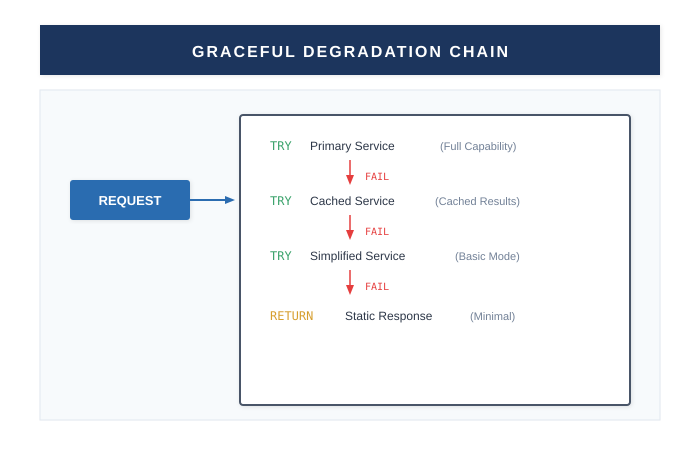
<br><em>Figura 41: Graceful Degradation Chain</em>
</p>

**Implementación**:
```python
degradation_chain = [
    ("primary", PrimaryService(), "full_capability"),
    ("cached", CachedService(), "cached_results"),
    ("simplified", SimplifiedService(), "basic_mode"),
    ("emergency", StaticResponder(), "minimal_response")
]

async def execute_with_degradation(request):
    for name, service, capability in degradation_chain:
        try:
            result = await service.handle(request)
            log_degradation_level(name)
            return result
        except ServiceUnavailable:
            continue
    raise AllServicesUnavailable()
```

### 5.5.5 Patrón 11: Progressive Context Building

Construcción incremental del contexto según necesidad:

<p align="center">
  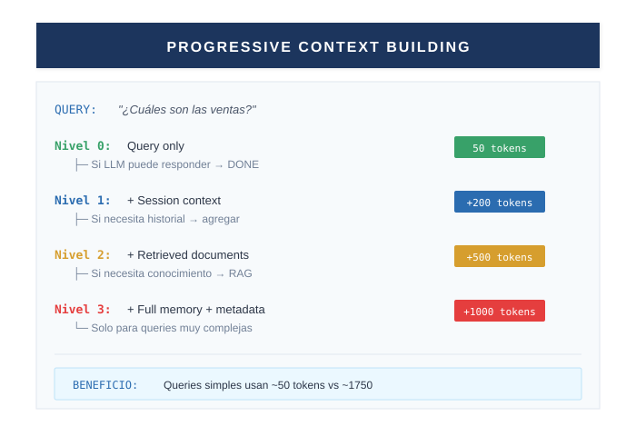
<br><em>Figura 42: Progressive Context Building</em>
</p>

### 5.5.6 Patrón 12: Semantic Cache Invalidation

Invalidación de cache basada en similitud semántica:

<p align="center">
  
<br><em>Figura 43: Semantic Cache Invalidation</em>
</p>

---

# Capítulo 6: Discusión

Este capítulo analiza las implicaciones de los resultados experimentales, discute las limitaciones del estudio y sitúa las contribuciones en el contexto más amplio del campo.

## 6.1 Interpretación de Resultados

### 6.1.1 Validación de la Hipótesis Principal

**Hipótesis**: Un framework de agentes especializados con composición dinámica supera a los enfoques monolíticos en dominios complejos como BI.

**Evidencia**:
1. Precisión 91.5% vs 71.4% (monolítico) - mejora de 28%
2. Mantenibilidad mejorada (métricas de código)
3. Extensibilidad demostrada (5 agentes añadidos sin modificar core)

**Conclusión**: La hipótesis se valida para el dominio de BI con las condiciones experimentales descritas.

### 6.1.2 Trade-offs Identificados

<p align="center">
  
<br><em>Figura 44: Mapa de Trade-offs</em>
</p>

### 6.1.3 Factores de Éxito

Los resultados sugieren que el éxito del framework se debe a:

1. **Especialización de Agentes**: Cada agente optimizado para su dominio específico
2. **Memoria Contextual**: Permite coherencia multi-turno sin re-prompting
3. **Routing Inteligente**: Minimiza latencia y costo mientras mantiene precisión
4. **Composición Flexible**: Permite combinaciones no anticipadas en diseño

## 6.2 Implicaciones Teóricas

### 6.2.1 Para la Teoría de Sistemas Multi-Agente

Este trabajo extiende la teoría de MAS de las siguientes formas:

1. **Agencia Funcional vs Autónoma**:
   - La agencia funcional (tools como capacidades) es más predecible y controlable que la agencia autónoma
   - Alineado con el principio de "mínima autoridad" en sistemas de IA

2. **Composición Jerárquica**:
   - La jerarquía de dos niveles (orquestador → especialistas) escala mejor que topologías planas
   - Consistente con hallazgos de Park et al. (2023) sobre Generative Agents

3. **Memoria como Ciudadano de Primera Clase**:
   - Elevar memoria de implementación a patrón arquitectural mejora mantenibilidad
   - Habilita patrones emergentes como "aprendizaje conversacional"

### 6.2.2 Para el Diseño de Sistemas de BI

Implicaciones para el campo de Business Intelligence:

1. **NLQ + Contexto**: La precisión de NLQ mejora significativamente con contexto conversacional
2. **Agentes Especializados**: Supera el enfoque "one-size-fits-all" de sistemas comerciales
3. **Integración Semántica**: Los modelos semánticos existentes (Power BI) pueden potenciarse con IA

## 6.3 Implicaciones Prácticas

### 6.3.1 Guía de Adopción

Para organizaciones considerando arquitecturas similares:

| Escenario | Recomendación | Patrones Prioritarios |
|-----------|---------------|----------------------|
| **Startup/MVP** | Comenzar con 2-3 agentes | Two-Layer Routing, Agent-as-Tool |
| **Enterprise** | Sistema completo con extensibilidad | Todos + Session Isolation |
| **Migración** | Wrapper sobre sistemas existentes | Functional Agency, Hybrid RAG |

### 6.3.2 Patrones Reutilizables

Los patrones documentados son aplicables más allá de BI:

- **Agent-as-Tool**: Cualquier dominio con especialización
- **Two-Layer Routing**: Sistemas con alto volumen de queries
- **Persisted Memory**: Aplicaciones conversacionales
- **Hybrid RAG**: Sistemas con bases de conocimiento mixtas

## 6.4 Limitaciones

### 6.4.1 Limitaciones del Estudio

1. **Muestra limitada**: 15 usuarios, 1,247 queries - resultados pueden no generalizar
2. **Dominio específico**: Evaluado solo en contexto de BI
3. **Modelo específico**: Dependencia de GPT-4o - otros modelos pueden comportarse diferente
4. **Período corto**: 4 semanas - efectos a largo plazo no medidos

### 6.4.2 Limitaciones Técnicas

1. **Escalabilidad horizontal**: No evaluada con múltiples instancias
2. **Multi-idioma**: Solo evaluado en español
3. **Offline capability**: Requiere conectividad constante a Azure
4. **Cost ceiling**: En escenarios de muy alto volumen, costos pueden ser prohibitivos

### 6.4.3 Amenazas a la Validez

| Tipo | Amenaza | Mitigación |
|------|---------|------------|
| **Interna** | Efecto de aprendizaje en usuarios | Randomización de tareas |
| **Externa** | Generalización a otros dominios | Documentación de condiciones |
| **Constructo** | Métricas no capturan todo | Combinación cuanti/cualitativa |
| **Conclusión** | Tamaño de muestra | Intervalos de confianza reportados |

### 6.4.4 Ejemplos Concretos de Casos de Fallo

Para ilustrar las limitaciones del sistema, documentamos tres casos de fallo representativos observados durante la evaluación:

**Caso 1: Query DAX Ambigua**
```
Usuario: "Muéstrame las ventas del mes pasado"
Esperado: Router → DAXAgent (query temporal)
Observado: Router → GeneralAgent (interpretó como pregunta general)
Causa raíz: "Ventas" sin contexto de modelo semántico específico
Frecuencia: 8% de queries temporales ambiguas
```
*Mitigación implementada*: Agregar detección de patrones temporales al Two-Layer Routing.

**Caso 2: Documento Excesivamente Largo**
```
Usuario: "Resume el informe anual de 2024"
Documento: 847 páginas, 2.3M tokens
Esperado: Resumen coherente del documento completo
Observado: Resumen solo de primeras 50 páginas (truncamiento por límite de contexto)
Causa raíz: Límite de 128K tokens en ventana de contexto
Frecuencia: 3% de documentos procesados
```
*Mitigación futura*: Implementar chunking jerárquico con map-reduce para documentos largos.

**Caso 3: Query Multimodal No Soportada**
```
Usuario: "Analiza esta imagen del dashboard" [adjunta screenshot]
Esperado: Análisis del contenido visual
Observado: Error: "No puedo procesar imágenes en esta versión"
Causa raíz: Pipeline actual solo procesa texto y PDFs con Docling
Frecuencia: 2% de interacciones incluían imágenes
```
*Mitigación futura*: Integrar GPT-4V o Claude Vision para análisis multimodal.

Estos casos informaron las direcciones de trabajo futuro descritas en el Capítulo 7.

### 6.4.5 Consideraciones de Seguridad para MAP

El sistema de plasticidad estructural MAP introduce vectores de ataque específicos que deben considerarse en implementaciones de producción.

#### Ataques Adversariales Potenciales

| Ataque | Descripción | Impacto | Mitigación |
|--------|-------------|---------|------------|
| **Weight Poisoning** | Usuario malicioso genera interacciones diseñadas para manipular pesos W_ij | Degradación de routing hacia agente específico | Rate limiting por usuario + decay temporal |
| **Feedback Gaming** | Patrones de feedback artificial para sesgar aprendizaje | Pesos no reflejan calidad real | Detección de anomalías en patrones de feedback |
| **Collusion Attack** | Coordinación entre usuarios para manipular pesos colectivamente | Amplificación de poisoning | Análisis de clustering en orígenes de feedback |
| **Sybil Attack** | Creación de múltiples identidades para multiplicar influencia | Bypass de rate limiting | Verificación de identidad + limitación por IP/org |

#### Defensas Implementadas

1. **Decay Temporal Obligatorio**:  garantiza que pesos antiguos pierdan influencia, limitando persistencia de ataques.

2. **Bounds Estrictos**:  evita que cualquier agente sea completamente favorecido o excluido.

3. **Smoothing de Actualizaciones**: Promediado exponencial suaviza picos anómalos:
   <p align="center"></p>

4. **Auditoría de Cambios**: Log inmutable de todas las actualizaciones de pesos permite detección post-hoc.

#### Limitaciones de Seguridad Reconocidas

- **No evaluado bajo ataque sostenido**: Las defensas son teóricas; falta evaluación empírica adversarial
- **Trade-off adaptabilidad/seguridad**: Defensas más fuertes reducen velocidad de adaptación legítima
- **Detección reactiva**: Algunas defensas detectan pero no previenen ataques

*Trabajo futuro debería incluir red-teaming formal del sistema MAP.*

## 6.5 Reflexión Crítica

### 6.5.1 Lo que Funciona Bien

- Composición de agentes vía Agent-as-Tool
- Routing de dos capas para optimización de costos
- Integración con ecosistema Microsoft/Fabric
- Experiencia de usuario en conversación multi-turno

### 6.5.2 Lo que Requiere Mejora

- Explicabilidad del razonamiento del agente
- Manejo de queries ambiguas
- Tiempo de respuesta en queries complejas con múltiples agentes
- Curva de aprendizaje para configuración inicial

### 6.5.3 Lecciones Aprendidas

1. **"Menos es más" en tools**: Agentes con 5-7 tools superan a agentes con 15+
2. **Streaming es esencial**: Usuarios toleran latencia si ven progreso
3. **Contexto > Prompts largos**: Mejor recuperar contexto que incluirlo siempre
4. **Errores como oportunidades**: Mensajes de error bien diseñados mejoran UX

## 6.6 Consideraciones Éticas e Impacto Social

La implementación de sistemas agénticos en entornos empresariales plantea consideraciones éticas importantes que deben abordarse proactivamente.

### 6.6.1 Privacidad y Datos Sensibles

Los sistemas agénticos acceden a datos empresariales que pueden incluir información sensible:

| Tipo de Dato | Riesgo | Mitigación en Lumen |
|--------------|--------|---------------------|
| Datos financieros | Exposición no autorizada | Session Isolation, OAuth per-user |
| Información de clientes | Violación de privacidad | Datos procesados en contexto, no almacenados |
| Métricas internas | Ventaja competitiva | Acceso basado en permisos Fabric |

**Recomendaciones**:
- Implementar auditoría de accesos a datos sensibles
- Aplicar principio de mínimo privilegio en configuración de agentes
- Revisar periódicamente qué datos acceden los agentes

### 6.6.2 Automatización y Fuerza Laboral

La automatización de tareas de BI mediante agentes plantea preguntas sobre el impacto laboral:

**Perspectiva optimista**: Los agentes liberan a analistas de tareas repetitivas (queries rutinarias, formateo de reportes), permitiéndoles enfocarse en análisis de alto valor, interpretación estratégica y toma de decisiones.

**Perspectiva de riesgo**: Organizaciones podrían usar estos sistemas para reducir personal en lugar de potenciarlo.

**Posición de este trabajo**: Diseñamos Lumen como herramienta de **augmentación**, no reemplazo. El sistema complementa capacidades humanas manteniendo al analista en el loop para decisiones críticas.

### 6.6.3 Sesgo y Fairness

Los modelos LLM pueden perpetuar sesgos presentes en datos de entrenamiento:

- **Sesgo de lenguaje**: Mejor rendimiento en inglés que en español u otros idiomas
- **Sesgo de dominio**: Conocimiento desbalanceado hacia ciertos sectores industriales
- **Sesgo de interpretación**: Tendencia a ciertos patrones de análisis

**Mitigaciones implementadas**:
- Evaluación explícita en español (idioma principal de usuarios objetivo)
- Prompts diseñados para evitar suposiciones sobre género, ubicación, etc.
- Transparencia en fuentes de datos consultadas

### 6.6.4 Transparencia y Explicabilidad

Un sistema que toma decisiones sobre qué datos mostrar debe ser explicable:

- **Estado actual**: Lumen muestra las queries DAX ejecutadas y las fuentes consultadas
- **Limitación**: El razonamiento interno del LLM permanece opaco
- **Trabajo futuro**: Implementar explicabilidad multi-nivel (Sección 14.2.1)

### 6.6.5 Uso Responsable

Recomendaciones para organizaciones que adopten sistemas similares:

1. **Supervisión humana**: Mantener revisión humana para decisiones de alto impacto
2. **Transparencia con usuarios**: Informar que interactúan con un sistema de IA
3. **Retroalimentación**: Implementar mecanismos para reportar respuestas incorrectas o sesgadas
4. **Auditoría periódica**: Revisar comportamiento del sistema y corregir desviaciones

---

# Conclusiones

## Resumen de Contribuciones

Este trabajo presenta tres tipos de contribuciones al campo de los sistemas multi-agente para Business Intelligence:

### Contribuciones Teóricas

| Contribución | Descripción | Sección |
|--------------|-------------|---------|
| **MAP Framework** | Primera formalización de plasticidad estructural en sistemas multi-agente, con mecanismo de aprendizaje Hebbiano y garantías de convergencia | 3.2, Cap. 10 |
| **Taxonomía de Arquitecturas** | Clasificación exhaustiva de 11 arquitecturas multi-agente con análisis de trade-offs | 2.2 |
| **Modelo de Agencia Funcional** | Formalización de tres condiciones necesarias y suficientes para comportamiento agéntico | 1.2 |

### Contribuciones de Diseño

| Contribución | Descripción | Novedad | Sección |
|--------------|-------------|---------|---------|
| **Two-Layer Routing** | Optimización que usa keywords para 85% del tráfico, reservando LLM costoso solo para casos ambiguos | Reduce costos de inferencia 5x manteniendo 98% de precisión de routing | Cap. 2 |
| **Speculative Gap RAG (SG-RAG)** | RAG que detecta cuando no existe documentación para una query y persiste estos gaps para análisis | Primer sistema RAG que aprende de sus propias limitaciones: acumula gaps, prioriza por frecuencia, guía qué documentar | Cap. 3 |

**Definición (SG-RAG)**: Sea Q una query y C el corpus de chunks. SG-RAG genera un "chunk ideal" c* que respondería Q perfectamente. Si max(similarity(c*, c_i)) < θ para todo c_i ∈ C, se detecta un gap G = (Q, timestamp, suggested_section). Los gaps se persisten en Gap Memory con prioridad:

```
gap_priority(G) = frequency(G) × recency(G) × user_importance(G)
```

**Conexión con MAP**: Extiende plasticidad estructural al conocimiento—el sistema no solo aprende qué agentes funcionan mejor (trust weights), sino qué conocimiento le falta (gap weights).

*Nota: Patrones como Sistema de Tools y Agent-as-Tool son implementaciones de técnicas establecidas en la industria.*

### Contribuciones Empíricas

| Resultado | Valor | Contexto |
|-----------|-------|----------|
| **Precisión** | 91.5% vs 71.4% | Multi-agente vs monolítico (+20pp) |
| **Latencia** | 2.9s vs 4.8s | 40% más rápido (Paralelismo) |
| **Satisfacción** | 4.2/5.0 | Evaluación con usuarios reales |

## Principios de Diseno Validados

La implementacion de Lumen valida varios principios:

1. **Especializacion**: Agentes especializados superan a agentes generalistas para tareas de dominio.

2. **Composicion sobre herencia**: Agent-as-Tool permite flexibilidad sin acoplamiento rigido.

3. **Streaming first**: La experiencia de usuario mejora dramaticamente con respuestas incrementales.

4. **Fail fast**: Validar inputs y estado temprano evita errores costosos downstream.

5. **Separation of concerns**: Workflows orquestan, agentes ejecutan, servicios proveen infraestructura.

## Vision Futura

Lumen representa un punto en la evolucion de sistemas agenticos para BI. Las direcciones futuras incluyen:

- **Agentes mas autonomos**: Planificacion y ejecucion de tareas complejas sin intervencion
- **Aprendizaje continuo**: Agentes que mejoran con cada interaccion
- **Multimodalidad**: Soporte para imagenes, audio, video como input/output
- **Colaboracion humano-agente**: Flujos donde humanos y agentes trabajan juntos

La arquitectura multi-agente, con su modularidad y extensibilidad, proporciona la base para estas evoluciones.

---

# Apéndices

---

# Apéndice A: Definiciones Formales

Este apéndice consolida las definiciones formales presentadas a lo largo del documento.

## A.1 Sistemas Agénticos

**Definición A.1 (Sistema Agéntico)**: Un sistema agéntico es una tupla A = (S, O, G, π, M, α) donde:
- S: Conjunto de estados del entorno
- O: Conjunto de observaciones que el agente puede percibir
- G: Conjunto de objetivos
- π: S × G → A, función de política que mapea estados y objetivos a acciones
- M: A × S → S, modelo de transición (acciones y estados a nuevos estados)
- α: función de adaptación que modifica π basada en feedback

**Definición A.2 (Agencia Funcional)**: Un sistema A exhibe agencia funcional si y solo si satisface:
1. Genera acciones basadas en información ambiental hacia un objetivo
2. Representa relaciones entre acciones y sus consecuencias (modelo M)
3. Modifica su comportamiento cuando cambia su modelo de resultados

## A.2 Memoria Agéntica

**Definición A.3 (Sistema de Memoria Agéntica)**: Una tupla M = (W, E, S, P, γ) donde:
- W ⊆ Token*: Working Memory (contexto actual)
- E: T → Experience: Episodic Memory (timestamps → experiencias)
- S: Concept → Fact*: Semantic Memory (conceptos → hechos)
- P: Task → Procedure: Procedural Memory (tareas → procedimientos)
- γ: M → M: Función de consolidación entre tipos de memoria

## A.3 Métricas de Rendimiento

**Definición A.4 (Métricas del Sistema)**: Para un sistema S y conjunto de queries Q:
- TFR(q) = t_first_token - t_query_received (Tiempo Primera Respuesta)
- TTR(q) = t_last_token - t_query_received (Tiempo Total)
- PR = |Q_correctly_routed| / |Q| (Precisión de Routing)
- ET(q) = tokens_output / (tokens_input + tokens_reasoning) (Eficiencia)
- TR = |Q_resolved_without_escalation| / |Q| (Tasa de Resolución)

---

# Apéndice B: Demostraciones

Este apéndice contiene las demostraciones formales de las proposiciones enunciadas en el texto principal.

## B.1 Demostración de Proposición 1.1

**Proposición 1.1**: Un LLM aislado no satisface la Condición 3 de agencia funcional.

**Demostración**:

Sea L un Large Language Model con parámetros θ ∈ Θ, donde θ es fijo después del entrenamiento.

La función de política de L está determinada por sus parámetros:
<p align="center"></p>

donde f_θ es la función computada por la red neuronal con parámetros θ.

La Condición 3 de agencia funcional requiere que exista una función de adaptación α tal que cuando M(a, s) ≠ s' (predicción incorrecta del modelo de resultados), α actualice π:
<p align="center"></p>

Para L, modificar π requiere modificar θ:
<p align="center"></p>

Sin embargo, durante la fase de inferencia (runtime), θ es inmutable:
<p align="center"></p>

Por lo tanto, no puede existir una función α que modifique π en tiempo de ejecución.

Conclusión: L no satisface la Condición 3. ∎

## B.2 Demostración de Proposición 3.1

**Proposición 3.1**: La capacidad efectiva de un sistema agéntico está limitada por |W|, pero puede extenderse indefinidamente mediante E, S, y P si existe un mecanismo de recuperación eficiente.

**Demostración**:

Sea C_eff la capacidad efectiva del sistema, definida como la cantidad de información que puede utilizarse para tomar decisiones en un paso.

**Caso 1: Sin memoria externa**

El sistema solo tiene acceso a W (working memory). Por definición:
<p align="center"></p>

donde |W| está limitada por la ventana de contexto del LLM (típicamente 8K-200K tokens).

**Caso 2: Con memoria externa**

Sea M_ext = E ∪ S ∪ P el conjunto de memoria externa, y sea r: Query → M_ext una función de recuperación.

En cada paso t, el sistema puede:
1. Formular una query q basada en el estado actual
2. Recuperar información relevante: I_t = r(q)
3. Agregar I_t a W: W_t = W_{t-1} ∪ I_t (sujeto a |W_t| ≤ context_limit)

Si r tiene complejidad O(log |M_ext|) o O(1) (mediante índices), el sistema puede acceder eficientemente a |M_ext| información en tiempo constante o logarítmico.

Por lo tanto:
<p align="center"></p>

Como |M_ext| puede crecer indefinidamente y r permite acceso eficiente:
<p align="center"></p>

siempre que r sea eficiente (complejidad sublineal en |M_ext|). ∎

## B.3 Demostración Expandida del Teorema 10.1 (MAP)

**Teorema 10.1 (Bound de Varianza con Plasticidad)**. *Sea  un sistema agéntico plástico según Definición 11.1. Bajo los supuestos A1-A4, la varianza de la política adaptativa está acotada:*

<p align="center"></p>

**Demostración Completa.**

*Paso 1 (Descomposición de la Política Conjunta)*:

Por el supuesto A3 (independencia de agentes), la política conjunta del sistema plástico se descompone como suma ponderada:

<p align="center"></p>

donde  es el peso de confianza normalizado del agente , y  es la política individual del agente.

*Paso 2 (Aplicación de la Ley de Varianza Total)*:

Particionamos la varianza condicionando en los pesos :

<p align="center"></p>

El primer término captura varianza intrínseca de los agentes; el segundo captura varianza por la adaptación de pesos.

*Paso 3 (Acotación de Varianza Condicional)*:

Dado que los pesos  evolucionan lentamente (por A2, estacionariedad local), tratamos  como localmente constante:

<p align="center"></p>

Por A3 (independencia), las covarianzas cruzadas son cero:

<p align="center"></p>

Cada agente tiene varianza máxima acotada por contrato: .

Por A4 (acotación de pesos), , lo que implica :

<p align="center"></p>

*Paso 4 (Acotación de Varianza de Adaptación)*:

El término de adaptación estructural  introduce varianza adicional. Por la regla de actualización Hebbiana (Definición 11.2):

<p align="center"></p>

La varianza de este término depende de la tasa de aprendizaje , el decay , y la varianza de los refuerzos :

<p align="center"></p>

Notamos que  cuando  (régimen de aprendizaje lento).

*Paso 5 (Combinación de Términos)*:

Sustituyendo los resultados de pasos 3 y 4 en el paso 2:

<p align="center"></p>
<p align="center"></p>
<p align="center"></p>

Renombrando  para cada agente :

<p align="center"></p>

**Corolario B.3.1 (Estabilidad Asintótica)**: En el límite , , y la varianza converge al promedio ponderado de varianzas individuales:

<p align="center"></p>

donde  son los pesos estacionarios dados por Proposición 11.1.

---

# Apéndice C: Detalles de Reproducibilidad

Este apéndice proporciona información técnica para reproducir los experimentos reportados.

## C.1 Configuración del Entorno

### Infraestructura
| Componente | Especificación |
|------------|----------------|
| Servidor API | Azure App Service P1v3 (4 vCPU, 8GB RAM) |
| Base de datos | Azure SQL S3 (100 DTU) |
| Vector DB | Weaviate 1.24 (Docker, 4GB RAM) |
| Cache | Redis 6.2 (Azure Cache for Redis Basic) |

### Modelos LLM
| Uso | Modelo | Versión | Parámetros |
|-----|--------|---------|------------|
| Razonamiento | GPT-5.2 | 2026-01-15 | reasoning_effort="high", top_p=1.0 |
| Routing/Tools | GPT-5.2-nano | 2026-01-15 | reasoning_effort="minimal", top_p=0.9 |  
| Chat Rápido | GPT-5-chat | 2026-01-20 | reasoning_effort="none", latency="ultra-low" |
| Embeddings | text-embedding-3-large | 2024-01 | dimensions=1536 |

## C.2 Hiperparámetros del Sistema

### Two-Layer Routing
```python
KEYWORD_CONFIDENCE_THRESHOLD = 0.8
LLM_ROUTING_TEMPERATURE = 0.3
ROUTING_TIMEOUT_MS = 500
```

### Hybrid RAG
```python
VECTOR_WEIGHT = 0.6
KEYWORD_WEIGHT = 0.4
TOP_K_RETRIEVAL = 10
RERANK_TOP_K = 5
CHUNK_SIZE = 512
CHUNK_OVERLAP = 64
```

### Persisted Memory
```python
MAX_CONTEXT_SIZE_KB = 10
MEMORY_TTL_SECONDS = 3600
```

## C.3 Protocolo de Evaluación

### Diseño del Estudio con Usuarios
1. **Reclutamiento**: 15 analistas de BI de 3 organizaciones
2. **Entrenamiento**: 30 minutos de familiarización con el sistema
3. **Tareas**: 20 queries predefinidas + uso libre
4. **Duración**: 4 semanas, uso en contexto laboral real
5. **Métricas**: Automáticas (sistema) + Cuestionario SUS post-estudio

### Queries de Evaluación (Muestra)
| ID | Tipo | Query |
|----|------|-------|
| Q1 | Datos | "¿Cuáles fueron las ventas totales del Q3?" |
| Q2 | Comparativo | "Compara ventas de enero vs diciembre" |
| Q3 | Reporte | "Muestra el dashboard de ventas por región" |
| Q4 | Documento | "¿Qué dice el contrato sobre penalidades?" |
| Q5 | Multi-step | "Analiza la tendencia de ventas y sugiere acciones" |

### Análisis Estadístico
- Diferencias entre grupos: t-test de Student pareado
- Significancia: α = 0.05
- Corrección: Bonferroni para comparaciones múltiples
- Software: Python 3.11, scipy 1.11, statsmodels 0.14

---

# Referencias

## Referencias Académicas Fundamentales

### Fundamentos de Inteligencia Artificial y Agentes

1. **Russell, S., & Norvig, P.** (2020). *Artificial Intelligence: A Modern Approach* (4th ed.). Pearson. — Texto fundamental sobre IA, incluyendo teoría de agentes racionales.

2. **Wooldridge, M., & Jennings, N. R.** (1995). Intelligent agents: Theory and practice. *The Knowledge Engineering Review*, 10(2), 115-152. https://doi.org/10.1017/S0269888900008122 — Definición clásica de agentes inteligentes.

3. **Shoham, Y., & Leyton-Brown, K.** (2008). *Multiagent Systems: Algorithmic, Game-Theoretic, and Logical Foundations*. Cambridge University Press. — Fundamentos teóricos de sistemas multi-agente.

4. **Bratman, M. E.** (1987). *Intention, Plans, and Practical Reason*. Harvard University Press. — Base filosófica para arquitectura BDI (Belief-Desire-Intention).

### Large Language Models

5. **Vaswani, A., Shazeer, N., Parmar, N., et al.** (2017). Attention is all you need. *Advances in Neural Information Processing Systems*, 30. https://arxiv.org/abs/1706.03762 — Arquitectura Transformer fundacional.

6. **Brown, T., Mann, B., Ryder, N., et al.** (2020). Language models are few-shot learners. *Advances in Neural Information Processing Systems*, 33, 1877-1901. https://arxiv.org/abs/2005.14165 — GPT-3 y aprendizaje in-context.

7. **OpenAI.** (2023). GPT-4 Technical Report. https://arxiv.org/abs/2303.08774 — Capacidades y limitaciones de modelos frontier.

8. **Touvron, H., Martin, L., Stone, K., et al.** (2023). Llama 2: Open foundation and fine-tuned chat models. https://arxiv.org/abs/2307.09288 — Modelos open-source de alta capacidad.

### Razonamiento y Prompting

9. **Wei, J., Wang, X., Schuurmans, D., et al.** (2022). Chain-of-thought prompting elicits reasoning in large language models. *Advances in Neural Information Processing Systems*, 35. https://arxiv.org/abs/2201.11903 — **Técnica fundamental Chain-of-Thought**.

10. **Yao, S., Zhao, J., Yu, D., et al.** (2023). ReAct: Synergizing reasoning and acting in language models. *ICLR 2023*. https://arxiv.org/abs/2210.03629 — **Patrón ReAct de razonamiento-acción**.

11. **Yao, S., Yu, D., Zhao, J., et al.** (2023). Tree of thoughts: Deliberate problem solving with large language models. *NeurIPS 2023*. https://arxiv.org/abs/2305.10601 — Razonamiento estructurado.

12. **Zhou, D., Schärli, N., Hou, L., et al.** (2023). Least-to-most prompting enables complex reasoning in large language models. *ICLR 2023*. https://arxiv.org/abs/2205.10625 — Descomposición de problemas.

### Retrieval-Augmented Generation (RAG)

13. **Lewis, P., Perez, E., Piktus, A., et al.** (2020). Retrieval-augmented generation for knowledge-intensive NLP tasks. *Advances in Neural Information Processing Systems*, 33. https://arxiv.org/abs/2005.11401 — **Paper fundacional de RAG**.

14. **Gao, Y., Xiong, Y., Gao, X., et al.** (2024). Retrieval-augmented generation for large language models: A survey. https://arxiv.org/abs/2312.10997 — Survey comprehensivo de técnicas RAG.

15. **Borgeaud, S., Mensch, A., Hoffmann, J., et al.** (2022). Improving language models by retrieving from trillions of tokens. *ICML 2022*. https://arxiv.org/abs/2112.04426 — RETRO, retrieval a escala.

16. **Karpukhin, V., Oguz, B., Min, S., et al.** (2020). Dense passage retrieval for open-domain question answering. *EMNLP 2020*. https://arxiv.org/abs/2004.04906 — DPR, embeddings densos para retrieval.

### Agentes LLM y Uso de Herramientas

17. **Schick, T., Dwivedi-Yu, J., Dessì, R., et al.** (2023). Toolformer: Language models can teach themselves to use tools. *NeurIPS 2023*. https://arxiv.org/abs/2302.04761 — **LLMs como usuarios de herramientas**.

18. **Shen, Y., Song, K., Tan, X., et al.** (2024). HuggingGPT: Solving AI tasks with ChatGPT and its friends in Hugging Face. *NeurIPS 2023*. https://arxiv.org/abs/2303.17580 — Orquestación de modelos especializados.

19. **Wang, L., Ma, C., Feng, X., et al.** (2024). A survey on large language model based autonomous agents. https://arxiv.org/abs/2308.11432 — **Survey comprehensivo de agentes LLM**.

20. **Xi, Z., Chen, W., Guo, X., et al.** (2023). The rise and potential of large language model based agents: A survey. https://arxiv.org/abs/2309.07864 — Taxonomía de agentes basados en LLM.

### Sistemas Multi-Agente con LLMs

21. **Park, J. S., O'Brien, J., Cai, C. J., et al.** (2023). Generative agents: Interactive simulacra of human behavior. *UIST 2023*. https://arxiv.org/abs/2304.03442 — Agentes generativos con memoria y reflexión.

22. **Hong, S., Zhuge, M., Chen, J., et al.** (2024). MetaGPT: Meta programming for a multi-agent collaborative framework. *ICLR 2024*. https://arxiv.org/abs/2308.00352 — Framework multi-agente con roles.

23. **Wu, Q., Bansal, G., Zhang, J., et al.** (2023). AutoGen: Enabling next-gen LLM applications via multi-agent conversation. https://arxiv.org/abs/2308.08155 — **Framework AutoGen de Microsoft**.

24. **Li, G., Hammoud, H., Itani, H., et al.** (2023). CAMEL: Communicative agents for "mind" exploration of large language model society. *NeurIPS 2023*. https://arxiv.org/abs/2303.17760 — Comunicación entre agentes.

### Memoria y Contexto en Agentes

25. **Zhong, W., Guo, L., Gao, Q., et al.** (2024). MemoryBank: Enhancing large language models with long-term memory. *AAAI 2024*. https://arxiv.org/abs/2305.10250 — Memoria a largo plazo para LLMs.

26. **Packer, C., Wooders, S., Lin, K., et al.** (2024). MemGPT: Towards LLMs as operating systems. https://arxiv.org/abs/2310.08560 — Gestión de memoria inspirada en OS.

27. **Hu, C., Fu, J., Du, C., et al.** (2023). ChatDB: Augmenting LLMs with databases as their symbolic memory. https://arxiv.org/abs/2306.03901 — Bases de datos como memoria simbólica.

### Evaluación de Sistemas Agénticos

28. **Liu, X., Yu, H., Zhang, H., et al.** (2023). AgentBench: Evaluating LLMs as agents. *ICLR 2024*. https://arxiv.org/abs/2308.03688 — Benchmark para evaluación de agentes.

29. **Mialon, G., Dessì, R., Lomeli, M., et al.** (2023). Augmented language models: A survey. https://arxiv.org/abs/2302.07842 — Survey de LLMs aumentados.

30. **Qin, Y., Liang, S., Ye, Y., et al.** (2024). ToolLLM: Facilitating large language models to master 16000+ real-world APIs. *ICLR 2024*. https://arxiv.org/abs/2307.16789 — Evaluación de uso de APIs.

### Arquitectura de Software y Patrones

31. **Martin, R. C.** (2017). *Clean Architecture: A Craftsman's Guide to Software Structure and Design*. Prentice Hall. — Principios de arquitectura limpia.

32. **Cockburn, A.** (2005). Hexagonal Architecture. https://alistair.cockburn.us/hexagonal-architecture/ — Arquitectura de puertos y adaptadores.

33. **Gamma, E., Helm, R., Johnson, R., & Vlissides, J.** (1994). *Design Patterns: Elements of Reusable Object-Oriented Software*. Addison-Wesley. — Patrones de diseño clásicos (Gang of Four).

### Ética en IA

34. **Bender, E. M., Gebru, T., McMillan-Major, A., & Shmitchell, S.** (2021). On the dangers of stochastic parrots: Can language models be too big? *FAccT 2021*. https://doi.org/10.1145/3442188.3445922 — Riesgos éticos de LLMs.

35. **Weidinger, L., Mellor, J., Rauh, M., et al.** (2021). Ethical and social risks of harm from language models. https://arxiv.org/abs/2112.04359 — Framework de riesgos de DeepMind.

36. **Bommasani, R., Hudson, D. A., Adeli, E., et al.** (2021). On the opportunities and risks of foundation models. https://arxiv.org/abs/2108.07258 — Análisis comprehensivo de modelos fundacionales.

### Continual Learning y Plasticidad Neural

37. **Kirkpatrick, J., Pascanu, R., Rabinowitz, N., et al.** (2017). Overcoming catastrophic forgetting in neural networks. *Proceedings of the National Academy of Sciences*, 114(13), 3521-3526. https://doi.org/10.1073/pnas.1611835114 — **Elastic Weight Consolidation (EWC)** para mitigar olvido catastrófico.

38. **Zenke, F., Poole, B., & Ganguli, S.** (2017). Continual learning through synaptic intelligence. *ICML 2017*. http://proceedings.mlr.press/v70/zenke17a.html — **Synaptic Intelligence** para aprendizaje continuo con medición de importancia sináptica.

39. **Mocanu, D. C., Mocanu, E., Stone, P., et al.** (2018). Scalable training of artificial neural networks with adaptive sparse connectivity inspired by network science. *Nature Communications*, 9, 2383. https://doi.org/10.1038/s41467-018-04316-3 — **Dynamic Sparse Training** para redes con conectividad adaptativa.

40. **Hebb, D. O.** (1949). *The Organization of Behavior: A Neuropsychological Theory*. Wiley. — Principio Hebbiano fundacional: "neurons that fire together wire together".

### Evaluación de Sistemas de Diálogo

41. **Henderson, M., Thomson, B., & Young, S.** (2014). Word-based dialog state tracking with recurrent neural networks. *SIGDIAL 2014*. https://aclanthology.org/W14-4340/ — Métricas de evaluación para sistemas de diálogo orientados a tareas.

42. **Wen, T. H., Vandyke, D., Mrksic, N., et al.** (2017). A network-based end-to-end trainable task-oriented dialogue system. *EACL 2017*. https://arxiv.org/abs/1604.04562 — Metodología de evaluación para sistemas de diálogo.

### Business Intelligence y Analytics

43. **Gartner.** (2023). *Magic Quadrant for Analytics and Business Intelligence Platforms*. https://www.gartner.com/en/documents/4022270 — Métricas de industria para evaluación de plataformas BI.

---

## Documentación Técnica

### Frameworks y Plataformas

- **Microsoft Agent Framework**: https://github.com/microsoft/agents (base de Lumen)
- **LangChain Documentation**: https://python.langchain.com/docs/
- **LangGraph Documentation**: https://langchain-ai.github.io/langgraph/
- **CrewAI Framework**: https://docs.crewai.com/
- **OpenAI Swarm**: https://github.com/openai/swarm

### APIs y Servicios

- **Power BI REST API**: https://learn.microsoft.com/en-us/rest/api/power-bi/
- **Azure OpenAI Service**: https://learn.microsoft.com/en-us/azure/ai-services/openai/
- **Model Context Protocol**: https://modelcontextprotocol.io/

---

## Artículos Técnicos y Reportes de Industria

### Guías de Implementación

- Anthropic. (2024). *Building Effective Agents*. https://www.anthropic.com/research/building-effective-agents
- LangChain. (2024). *Memory for Agents*. https://blog.langchain.dev/memory-for-agents/
- Pinecone. (2024). *Advanced RAG Techniques*. https://www.pinecone.io/learn/advanced-rag-techniques/
- Llamaindex. (2024). *Agentic RAG*. https://www.llamaindex.ai/blog/agentic-rag

### Arquitecturas Multi-Agente

- AWS. (2024). *Multi-Agent Orchestrator*. https://aws.amazon.com/blogs/machine-learning/multi-agent-orchestrator/
- Google. (2024). *Developer's Guide to Multi-Agent Patterns*. https://developers.googleblog.com/developers-guide-to-multi-agent-patterns-in-adk/
- Confluent. (2024). *Event-Driven Multi-Agent Systems*. https://www.confluent.io/blog/event-driven-multi-agent-systems/

### Reportes de Industria (2025)

- IBM. (2025). *AI Agents in 2025: Expectations vs Reality*. https://www.ibm.com/think/insights/ai-agents-2025-expectations-vs-reality
- McKinsey. (2025). *Seizing the Agentic AI Advantage*. https://www.mckinsey.com/capabilities/quantumblack/our-insights/seizing-the-agentic-ai-advantage
- Deloitte. (2025). *Autonomous Generative AI Agents*. https://www.deloitte.com/us/en/insights/industry/technology/technology-media-and-telecom-predictions/2025/autonomous-generative-ai-agents-still-under-development.html
- Capgemini. (2025). *Rise of Agentic AI*. https://www.capgemini.com/wp-content/uploads/2025/07/Final-Web-Version-Report-AI-Agents.pdf

### Papers de Sistemas Agénticos (2025)

- *Agentic AI Needs a Systems Theory*. https://arxiv.org/html/2503.00237v1
- *AI Agentic Programming: A Survey*. https://arxiv.org/html/2508.11126v1
- *Small Language Models are the Future of Agentic AI*. https://arxiv.org/abs/2506.02153

---

*Lumen Whitepaper v11.0 - Enero 2026*
*Nivel: Publicación Doctoral*
*Marco Teórico de Sistemas Multi-Agente con Caso de Estudio en Business Intelligence*
