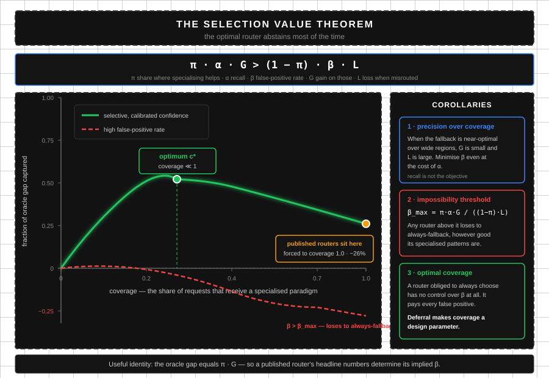
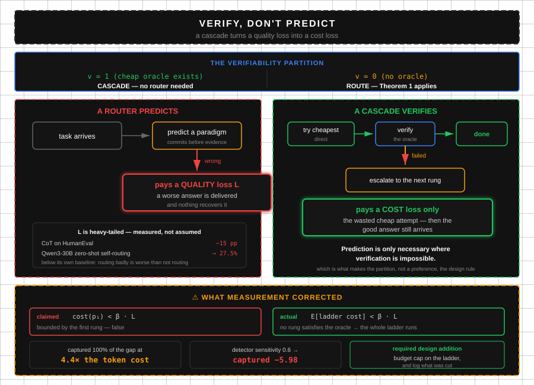
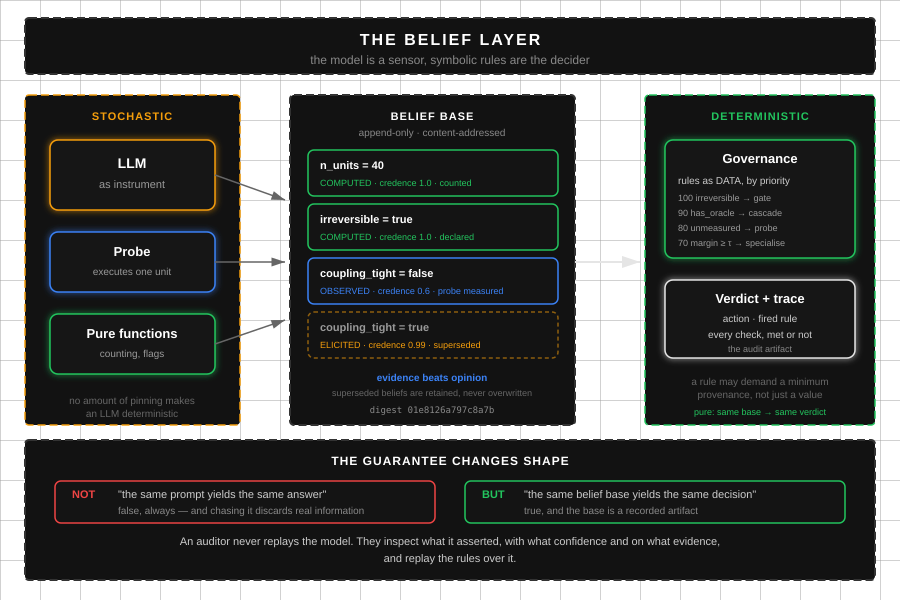
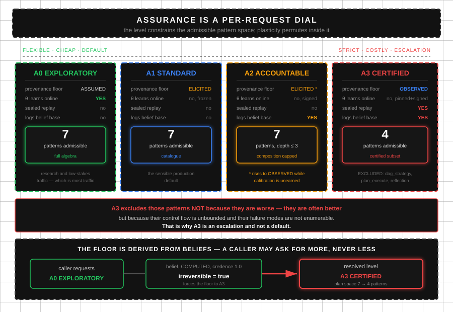
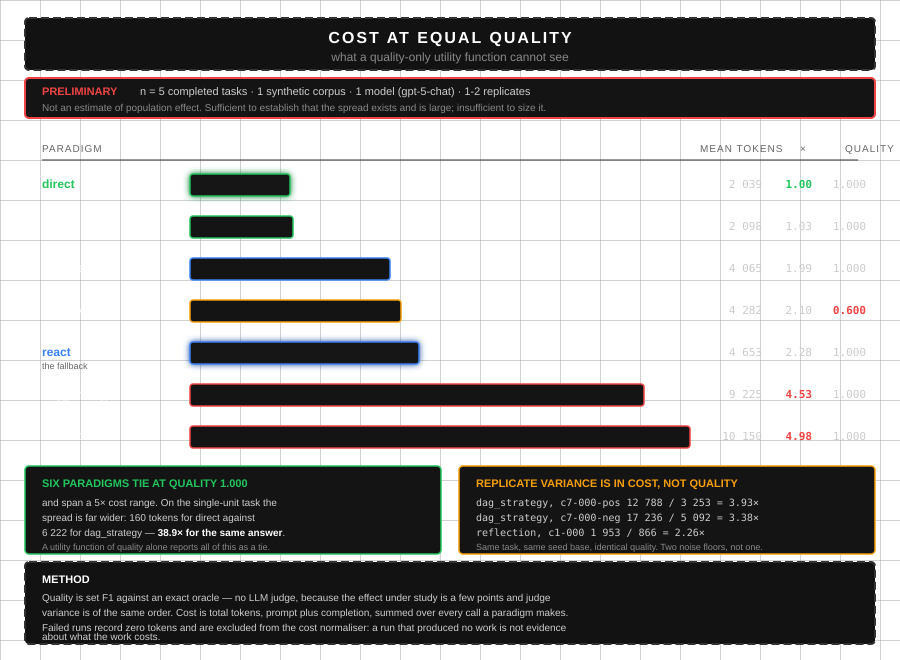
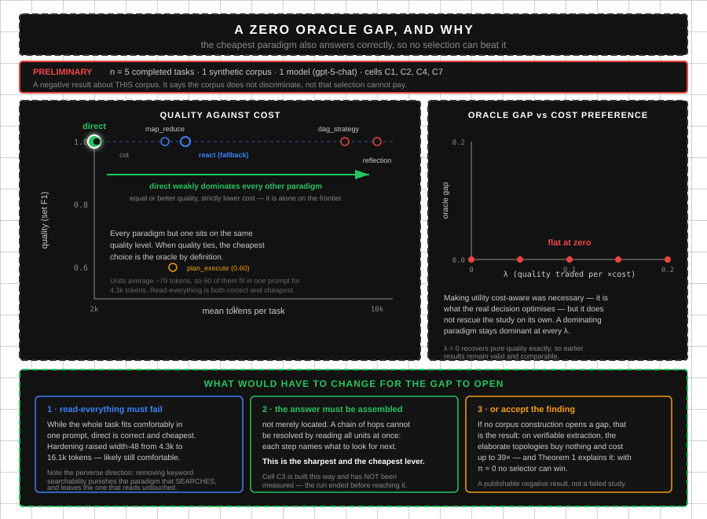

# Patrones de Orquestación Agéntica
## Un lenguaje de patrones con aplicabilidad medida

**Estado**: borrador de vocabulario, v0.1 · 2026-08-22
**Autor**: Ariel Edgardo Levy
**Compañero de**: `PLAN.md` (teoría) y `D:\Apps\paperlab` (evidencia)

---

# 0. Por qué este documento existe

El campo tiene hoy un problema de vocabulario, no de ideas. Existen al menos once
"arquitecturas" catalogadas, cuatro o cinco "estrategias" implementadas en cada
producto, y una docena de "patrones" en blogs — con nombres solapados, sin plantilla
común, y **sin ninguna afirmación falsable sobre cuándo conviene cada uno**.

La consecuencia práctica es medible, y está publicada. La selección por oráculo supera
al mejor paradigma fijo en **17,1pp**, el mejor router publicado captura sólo el 26% de
eso, y el auto-ruteo zero-shot de un LLM captura valor **negativo** — hay modelos que
caen por debajo de su propio baseline al intentar elegir su estrategia. Nadie sabe cuándo
usar qué, y eso cuesta dos tercios del valor disponible.

Lo que hizo valioso el catálogo de Fowler no fue inventar los patrones: fue **nombrarlos
con una plantilla consistente y escribir la sección "cuándo usarlo"**. Ese es el aporte
que falta acá, con una ventaja que Fowler no tenía: en este dominio el "cuándo usarlo"
se puede **medir**.

## 0.1 Los tres artefactos (y por qué separarlos)

Las diez pasadas de revisión sobre el plan produjeron un solo hallazgo estructural
importante: hay tres productos distintos, con audiencias, tiempos y modos de fallo
distintos, y v1 fracasó por mezclar los dos primeros.

| Track | Artefacto | Audiencia | Riesgo propio | Depende de |
|---|---|---|---|---|
| **T — Teoría** | Paper (T1, cs.LG) | Académica | Que lo scoopeen | E0 |
| **V — Vocabulario** | Este catálogo | Practitioners | Que no se adopte | nada ⇒ **ship first** |
| **M — Motor** | `paperlab` + engine | Ingeniería | Que nadie lo corra | E0 |

**Regla de secuenciación**: V se publica primero porque no depende de mediciones y
**no se puede scoopear como se scoopea un teorema** — nombrar bien es acumulativo. T
necesita E0. M convierte a V de opinión en evidencia.

## 0.2 La plantilla

Cada patrón se documenta igual. La disciplina de plantilla es la mitad del valor.

```
NOMBRE VERNÁCULO                          [expresión formal]
Intención        una línea, imperativa
Estructura       qué corre y en qué orden
Cómo funciona    mecánica, incluyendo qué se comparte y qué no
Aplicabilidad    condiciones sobre el vector de features (falsable)
Perfil G/L       ganancia esperada cuando aplica / pérdida cuando no
Modo de fallo    cómo se rompe, no cómo se luce
Visto en         sistemas reales
```

**"Aplicabilidad" es la sección que carga el peso.** Se escribe en términos del vector
de features, no en prosa. Un patrón cuya aplicabilidad no se puede escribir así todavía
no está entendido.

## 0.3 El vector de features

Todo el catálogo condiciona sobre estas siete cantidades. Cuatro son computables sin
modelo; tres requieren estimación.

| Sigla | Feature | Rango | Computable |
|---|---|---|---|
| `n` | unidades de trabajo independientes | 1..∞ | ✅ contar |
| `κ` | acoplamiento entre subresultados | 0..1 | ❌ estimar |
| `v` | existe oráculo barato (tests, schema, exact-match) | 0/1 | ✅ |
| `h` | horizonte desconocido | 0/1 | ❌ estimar |
| `ρ` | acciones irreversibles | 0/1 | ✅ |
| `χ` | escritura sobre estado compartido | 0/1 | ✅ |
| `B` | presupuesto (tokens / latencia) | escalar | ✅ dado |

⚠️ **Nunca condicionar sobre forma léxica.** `"how many"`, `"extract all"`, `"compare"`
son proxies ruidosos de `n` y `κ`. Ver el smell **Proxy Léxico** (§4.1).


## 0.4 El surface de herramientas es parte del patrón

Un patrón **no queda especificado por su flujo de control solo**. El mismo Bucle
Reactivo sobre un surface de una herramienta genérica y sobre uno diferenciado son
patrones distintos, con costos distintos y modos de fallo distintos. El catálogo describe
control de flujo; sin el surface, la mitad de la especificación falta.

Lo del retrieval es capa de herramientas, no variable del estudio: tiene que estar bueno
y quedarse quieto. Lo que es del agente es **qué herramienta llama, con qué
granularidad, en qué secuencia y con cuánto batching** — y eso *es* la topología.

**Un surface mínimo tiene cuatro propiedades:**

**1. Granularidades separadas, porque son la palanca de costo.** Medido sobre 3 unidades
de la misma consulta:

| herramienta | devuelve | tamaño |
|---|---|---|
| `search` | resúmenes | 312 chars |
| `keyword_search` | highlights `<< >>` | 937 |
| `semantic_search` | texto completo | 3.502 |
| `read` | texto completo | 3.501 |

**11× entre resumir y leer.** Un patrón que resume primero y lee selectivo paga una
fracción de uno que lee todo — y esa diferencia es **invisible** si toda búsqueda
devuelve el mismo excerpt de tamaño fijo.

**2. Léxico y denso expuestos por separado, no sólo fusionados.** Fusionar en una sola
herramienta híbrida **le saca la decisión al agente**. El híbrido es el default correcto,
pero si es lo único disponible el agente nunca puede pedir match exacto cuando necesita
un identificador, ni significado cuando necesita una paráfrasis. Medido en la celda
acoplada: denso recall 0,75, híbrido 0,50, léxico 0,25 — **la fusión perjudicó**, porque
RRF promedia rangos y un componente muy malo arrastra al bueno.

**3. La secuencia se enseña en las descripciones, no se fuerza.** El *snowball*:
encontrar un valor, después buscar con ese valor para ver dónde más aparece. Las
preguntas multi-hop son irresolubles sin eso, y un surface que no lo menciona mide si el
modelo lo inventa, no si la topología lo puede explotar.

**4. El batching es explícito.** *"pasá varios ids en una llamada, hasta 10, nunca uno
por unidad"*. Es control de costo que el agente puede ejercer o desperdiciar.

> ### ⚠️ Consecuencia para la aplicabilidad de todo el catálogo
>
> Varias secciones de "Aplicabilidad" **presuponen un surface decente sin decirlo**.
> "Falla cuando `n` es grande" es cierto con búsqueda utilizable; con búsqueda inservible
> falla por otro motivo y el patrón no tiene la culpa. Cualquier afirmación sobre un
> patrón que busca es condicional a la calidad del surface, y esa condición hay que
> declararla.

**Y habilita una medición que antes no existía.** La traza de uso de herramientas
distingue *"no lo encontró"* de *"lo encontró y razonó mal"*:

```
react   u=0.000  tok=30.611  iters=10
  calls: search×3, keyword_search×4, read×3
  units_read: 3    relevant_units_read: 0
```

Diez llamadas, tres modalidades, tres unidades leídas, **ninguna de las relevantes**.
Sin esa traza el cero es un misterio; con ella es un diagnóstico. Dos patrones con la
misma respuesta y el mismo conteo de tokens pueden haber usado el surface de maneras
completamente distintas, y esa diferencia es el objeto de estudio.


## 0.5 Factibilidad no es aplicabilidad

Las secciones de "Aplicabilidad" de este catálogo mezclan dos cosas distintas, y
separarlas cambia cómo se usa:

| | pregunta | cómo se responde |
|---|---|---|
| **Factibilidad** | ¿este patrón *puede* correr acá? | **aritmética** sobre lo que la tarea declara |
| **Aplicabilidad** | ¿*conviene* correrlo acá? | estadística, o medición |

La factibilidad es aguas arriba y es gratis. Cuántas unidades hay, cuán largas son, cuál
es el presupuesto — con eso alcanza para saber que un patrón no entra, **sin llamar al
modelo, sin estadística y sin aprender nada**.

Medido sobre cuatro escalas del mismo corpus:

| unidades | tokens | queda afuera, y por qué |
|---|---|---|
| 60 | 16k | nada |
| 500 | 135k | Turno Único y CoT por *contexto*; Map-Reduce por *conteo de llamadas* |
| 60 | 483k | Turno Único y CoT por contexto — **Map-Reduce sobrevive** |
| 500 | 1.272k | los tres |

> ### Map-Reduce no lo mata el tamaño, lo mata la cardinalidad
>
> Con 483k tokens de contenido en 60 unidades corre bien, porque **nunca los tiene todos
> juntos**. Con 500 unidades de 16k muere: 501 llamadas y un paso de reduce que concatena
> 500 hallazgos. Su cap está en el conteo de llamadas y en el reduce, no en el contexto —
> y confundir las dos cosas lleva a descartarlo donde sí sirve.
>
> El mismo cap vale para la Pizarra, que renderiza cada hallazgo en cada prompt de
> sub-agente: **acumular escala hasta que no.**

**Consecuencia para cualquier selector.** Una política aprendida que gasta episodios
descubriendo que Map-Reduce pierde en tareas de 500 unidades está aprendiendo aritmética
de la manera difícil. El cap era computable antes del primer token. Lo aprendido debería
ser *qué conviene entre lo que puede correr*, no dónde están los límites duros.

Y el corolario que vale para producción: **saber el largo y declinar no es una
degradación. Es la diferencia entre un sistema acotado y uno desbocado.**

---

# 1. Patrones estructurales

## 1.1 TURNO ÚNICO · `ATOM(a, T)`

**Intención** — Resolver la tarea en una sola invocación de un agente con sus herramientas.

**Estructura** — Un agente, un turno, sin bucle de control.

**Cómo funciona** — El prompt lleva toda la tarea. El agente puede llamar herramientas
dentro del turno, pero no hay reintento ni evaluación externa.

**Aplicabilidad** — `n = 1` ∧ `h = 0` ∧ `ρ = 0`.

**Perfil G/L** — G bajo (no hay nada que optimizar); L **muy bajo**. Es el piso.

**Modo de fallo** — Silencioso. Devuelve algo plausible cuando la tarea requería
verificación o iteración, y nada en la salida indica que faltó trabajo.

**Visto en** — El paradigma `Direct` de Select-then-Solve; cualquier endpoint de chat.

---

## 1.2 BUCLE REACTIVO · `LOOP(ATOM(a, T), g)`

**Intención** — Alternar razonamiento y acción hasta que una guarda declare terminado.

**Estructura** — Turno → herramienta → observación → turno, hasta `g` o tope de iteraciones.

**Cómo funciona** — El agente decide en cada vuelta si actúa o responde. El estado vive
en el historial de mensajes, lo que acota el horizonte útil al tamaño de contexto.

**Aplicabilidad** — `h = 1` ∨ (`v = 1` ∧ `n` chico). Con oráculo barato el bucle es
seguro porque la guarda es objetiva.

**Perfil G/L** — **G moderado y uniforme; L bajo en casi todo el dominio.** Es el patrón
de *máxima generalidad*: nunca óptimo, casi nunca catastrófico.

> ### ⭐ El Bucle Reactivo es el *sequential scan* de la orquestación
>
> En un optimizador de bases de datos el barrido secuencial nunca es el plan más rápido,
> pero siempre es correcto y su costo es predecible — por eso es el default cuando las
> estadísticas no alcanzan. El Bucle Reactivo ocupa exactamente ese lugar.
>
> Esto no es una metáfora decorativa: es la razón por la cual un ReAct simple le ganó a
> un portafolio de cuatro estrategias, y la razón por la cual **el fallback correcto de
> todo router es este patrón**. Un catálogo que no dice esto empuja a la gente a
> especializar donde no conviene.

**Modo de fallo** — Quema presupuesto girando cuando `n` es grande: no puede sostener
cuarenta documentos en contexto y pierde cobertura sin avisar.

**Visto en** — ReAct en Select-then-Solve (+44pp sobre Direct en GAIA); el default de
prácticamente todo agente con herramientas.

---

## 1.3 CADENA · `SEQ(p₁, …, pₙ)`

**Intención** — Encadenar etapas donde cada una consume la salida de la anterior.

**Estructura** — Etapas fijas, orden fijo, sin bucle.

**Cómo funciona** — La salida de la etapa `i` es la entrada de `i+1`. El flujo es
determinístico en su estructura y trivial de depurar.

**Aplicabilidad** — `κ` alto ∧ `h = 0`. El acoplamiento fuerte es lo que obliga a
serializar; si `κ` es bajo, serializar es puro costo de latencia.

**Perfil G/L** — G alto cuando `κ` es realmente alto; **L alto** cuando no lo es
(paga latencia serial sin necesidad).

**Modo de fallo** — Propagación de error: un fallo en la etapa 2 contamina 3..n sin que
nada lo detecte, porque no hay verificación entre etapas.

**Visto en** — `QueryWorkflowSimple` (Lumen); pipelines ETL.

---

## 1.4 ABANICO CON BARRERA · `PAR(p₁, …, pₙ)`

**Intención** — Ejecutar en paralelo y **esperar a todos** antes de continuar.

**Estructura** — Fan-out, barrera, fan-in.

**Cómo funciona** — Todas las ramas corren concurrentes; la agregación ve el conjunto
completo.

**Aplicabilidad** — `n > 1` ∧ `κ ≈ 0` ∧ **la etapa siguiente necesita el conjunto
completo** (deduplicación global, conteo total, corte temprano por "cero resultados").

**Perfil G/L** — G alto en latencia; L = el costo de la barrera, que es la rama más
lenta menos la media.

**Modo de fallo** — Barrera injustificada. Si la agregación sólo mapea o filtra por
ítem, la barrera desperdicia el tiempo de todas las ramas rápidas.

**Visto en** — Extracción exhaustiva multi-documento; embeddings en paralelo (Lumen).

---

## 1.5 TUBERÍA SIN BARRERA · `PIPE(items, s₁, …, sₖ)`

**Intención** — Pasar cada ítem por todas las etapas de forma independiente, sin
sincronizar entre etapas.

**Estructura** — Por ítem: `s₁ → s₂ → … → sₖ`. El ítem A puede estar en la etapa 3
mientras B sigue en la 1.

**Cómo funciona** — No hay punto de sincronización. El tiempo total es la cadena más
lenta de un ítem, no la suma de los máximos por etapa.

**Aplicabilidad** — `n > 1` ∧ `κ ≈ 0` ∧ **ninguna etapa necesita contexto cruzado**.

**Perfil G/L** — G alto y creciente con `n` y con la varianza entre ítems. L ≈ 0
respecto de `PAR` — es estrictamente mejor cuando la barrera no hace falta.

> **La distinción Barrera / Sin-Barrera es la decisión más subestimada del campo.**
> Es la única de esta lista que aparece explícitamente argumentada en un producto de
> primera línea: el harness de Claude Code documenta que *"una barrera es correcta SÓLO
> cuando la etapa N necesita contexto cruzado de todos los resultados de N−1"*.
> Eso es una heurística escrita a mano para `κ`, y su existencia en un contrato de
> herramientas de producción es la mejor evidencia de que este catálogo hace falta.

**Modo de fallo** — Si una etapa tardía resulta necesitar contexto global, hay que
rehacer todo con barrera. El error se descubre tarde.

**Visto en** — `pipeline()` en el harness de Claude Code.

---

## 1.6 GENERADOR–CRÍTICO · `CRITIC(p_gen, p_judge, k)`

**Intención** — Separar la producción de la evaluación, e iterar sobre la crítica.

**Estructura** — Generador produce, crítico evalúa, generador revisa. `k` rondas.

**Cómo funciona** — El crítico tiene un prompt y a veces un modelo distinto, y **no ve
el razonamiento del generador**, sólo su salida. Esa opacidad es deliberada: un crítico
que ve el razonamiento lo racionaliza.

**Aplicabilidad** — `v = 0` (no hay oráculo, así que la crítica lo sustituye) ∨
`ρ = 1` (irreversible, hace falta compuerta antes de comprometer).

**Perfil G/L** — G alto en calidad; L = costo multiplicado por `k+1`. Caro.

**Modo de fallo** — Colapso de acuerdo: generador y crítico con el mismo modelo y
prompt parecido convergen a aprobarse mutuamente en la primera ronda.

**Visto en** — Arquitectura Generador-Crítico (v1 §2.2.7); judge panels.

---

## 1.7 VERIFICADOR POR QUÓRUM · `VOTE(p, n, q)`

**Intención** — Correr `n` verificaciones independientes y aceptar sólo con `q` votos.

**Estructura** — `n` instancias en paralelo, cada una con **una lente distinta**;
decisión por quórum.

**Cómo funciona** — La independencia es el mecanismo. Con lentes idénticas se compra
redundancia; con lentes distintas (corrección, seguridad, reproducibilidad) se compra
**cobertura de modos de fallo**, que es lo que se quería.

**Aplicabilidad** — `v = 0` ∧ el costo de un falso positivo es alto. Es el sustituto
del oráculo cuando no hay oráculo.

**Perfil G/L** — G alto en precisión; L = `n×` el costo. El patrón más caro del catálogo.

**Modo de fallo** — Lentes correlacionadas. Tres verificadores con el mismo prompt son
un verificador con tres veces el costo.

**Visto en** — Verificación adversarial con quórum (harness de Claude Code).

---

## 1.8 BUCLE DE DRENAJE · `LOOP(PAR(finders), g_dry)`

**Intención** — Descubrir de cardinalidad desconocida hasta que `K` rondas no aporten
nada nuevo.

**Estructura** — Ronda de buscadores en paralelo → deduplicar contra lo ya visto →
repetir hasta `K` rondas secas.

**Cómo funciona** — La deduplicación se hace contra **todo lo visto**, no contra lo
aceptado. Deduplicar contra lo aceptado hace que los hallazgos rechazados reaparezcan
cada ronda y el bucle no converge nunca.

**Aplicabilidad** — `h = 1` ∧ `n` desconocido a priori.

**Perfil G/L** — G alto en cobertura (la cola larga de hallazgos es justamente lo que
los contadores fijos "top-N" pierden); L = costo no acotado a priori.

**Modo de fallo** — No convergencia por deduplicación mal anclada; o corte silencioso
por tope de rondas sin registrar qué quedó afuera.

**Visto en** — `loop-until-dry` (harness de Claude Code).

---

## 1.9 PIZARRA · `BB(p₁, …, pₙ; β)`

**Intención** — Coordinar agentes heterogéneos por estado compartido en lugar de por
mensajes.

**Estructura** — Agentes que leen y escriben una pizarra `β`; sin comunicación directa.

**Cómo funciona** — La pizarra es la única vía de coordinación. Eso desacopla a los
agentes entre sí, al precio de introducir contención sobre `β`.

**Aplicabilidad** — `κ` alto ∧ `n > 1` ∧ agentes heterogéneos. Es la alternativa a
`SEQ` cuando el acoplamiento existe pero **el orden no se conoce de antemano**.

**Perfil G/L** — G alto en tareas de agregación investigativa; L alto por contención y
por costo de contexto (todos leen todo).

**Modo de fallo** — La pizarra crece sin control y se vuelve el cuello de botella de
contexto: cada agente paga por leer lo que escribieron todos los demás.

**Visto en** — Arquitectura Blackboard, v1 §2.2.8.

---

## 1.10 AISLAMIENTO · `ISO(p)`

**Intención** — Correr `p` sobre una copia privada del estado mutable.

**Estructura** — Se materializa un workspace por rama; se reconcilia al final.

**Cómo funciona** — Convierte contención en costo de materialización. Habilita
paralelismo donde `PAR` corrompería estado.

**Aplicabilidad** — `χ = 1` ∧ `n > 1`. **Es la única respuesta correcta a `χ = 1`**;
las alternativas son serializar (lento) o corromper.

**Perfil G/L** — G = habilita el paralelismo; L = costo de setup por rama (no trivial:
cientos de ms y disco por rama).

**Modo de fallo** — Conflictos en la reconciliación, que reaparecen como el problema
secuencial que se quería evitar.

**Visto en** — `isolation: 'worktree'` (harness de Claude Code).

---

# 2. El patrón de control

## 2.1 ⭐ DIFERIMIENTO AL DEFAULT SEGURO · `κ(φ) ≤ τ ⟹ p*`

<p align="center">
  
<br><em>Figura 1: Teorema del Valor de Selección: la curva riesgo-cobertura y sus tres corolarios. El óptimo está en cobertura ≪ 1.</em>
</p>

**Intención** — Emitir un patrón especializado **sólo** dentro de la región de alta
confianza, y caer al Bucle Reactivo en todo el resto.

**Estructura** — Extraer `φ` → calcular confianza `κ(φ)` → si `κ > τ` usar el patrón
que `θ` indica; si no, `p*`.

**Cómo funciona** — La cobertura pasa a ser un parámetro de diseño, no una obligación.
Todos los routers publicados tienen cobertura 100% y por lo tanto **ningún grado de
libertad sobre su tasa de falsos positivos**: pagan todos los errores de ruteo.

**Aplicabilidad** — Siempre que exista un `p*` competitivo. Que es siempre (§1.2).

**Perfil G/L** — Es el patrón que *administra* G y L en vez de sufrirlos.

> ### La condición formal (Teorema del Valor de Selección)
>
> Con `π = P(el especializado gana)`, precisión `α`, falso positivo `β`, ganancia `G`
> y pérdida `L`, rutear supera al mejor fijo si y sólo si:
>
> ```
>     π · α · G  >  (1 − π) · β · L
> ```
>
> **Corolario 1 — precisión sobre cobertura.** Si `p*` es casi óptimo en amplias
> regiones, `G` es chico y `L` grande ⟹ hay que minimizar `β` aun sacrificando `α`.
>
> **Corolario 2 — umbral de imposibilidad.** `β_max = π·α·G / ((1−π)·L)`. Todo router
> con `β > β_max` **pierde garantizado** contra siempre-fallback, por buenos que sean
> sus patrones especializados.
>
> **Corolario 3 — cobertura óptima.** Existe `τ*`, y en general `cobertura(τ*) ≪ 1`.
> **El router óptimo se abstiene la mayor parte del tiempo.**
>
> Identidad útil: la brecha del oráculo es exactamente `π·G`. Los 17,1pp medidos por
> Select-then-Solve **son** `π·G`, lo que permite despejar `β` implícito de cualquier
> router publicado a partir de sus números de portada.

**Modo de fallo** — `κ` mal calibrada. Una confianza que no correlaciona con acierto
convierte a `τ` en un número arbitrario.

**Visto en** — En ningún router de agentes publicado. Es teoría establecida en
clasificación selectiva (regla de Chow, 1970) y *learning-to-defer*, sin aplicar acá.

---

## 2.2 ⭐ REBANADA DE RECONOCIMIENTO · `PROBE(p_cheap, 1 unidad) → φ`

**Intención** — Obtener las features que no son computables **ejecutando una tajada
mínima del trabajo real**, en lugar de pedirle a un modelo que las estime.

**Estructura** — Correr el patrón más barato sobre **una** unidad; observar qué pasó;
derivar `κ`, `h` y el `n` efectivo de lo observado; recién entonces decidir el plan para
las unidades restantes.

**Cómo funciona** — El problema con las features DERIVED (§0.3) es que preguntarle a un
LLM "¿esta tarea está muy acoplada?" produce una opinión: cuesta tokens, no es
determinística y no es evidencia. La sonda produce **evidencia**: si al procesar la
unidad 1 el agente tuvo que pedir información de otra unidad, `κ` es alto — *medido, no
estimado*.

Y lo que hace al patrón netamente superior a una llamada de estimación: **el costo se
amortiza**. La sonda no es overhead, es la primera unidad de trabajo, que había que
hacer igual. Una llamada de estimación es 100% desperdicio; una sonda es 0%.

**Aplicabilidad** — `n > 1` ∧ alguna feature DERIVED indefinida. Es decir: exactamente
la situación en la que el Diferimiento al Default Seguro tendría que abstenerse.

**Perfil G/L** — G = convierte una abstención en una decisión informada, recuperando
cobertura sin subir `β`. L ≈ 0, porque el costo ya estaba presupuestado.

> Esto es **muestreo para estimación de cardinalidad**, que es cómo un optimizador de
> bases de datos resuelve el mismo problema desde los años 80: no le pregunta a nadie
> cuántas filas va a devolver un predicado, muestrea la tabla. La sonda es esa idea
> trasladada, y no la encontré aplicada en orquestación agéntica.

**Modo de fallo** — Unidad 1 no representativa. Se mitiga sondeando `k` unidades al azar
en vez de la primera, a costa de `k` veces el presupuesto de sonda.

**Visto en** — En ningún sistema que haya revisado. Candidato a aporte original.

---

## 2.3 ⭐ CASCADA DE TOPOLOGÍAS · `TRY(p₁) →fail TRY(p₂) →fail … pₖ`

<p align="center">
  
<br><em>Figura 2: Partición por verificabilidad: un router paga pérdida de calidad, una cascada paga pérdida de costo. Incluye la corrección que salió de medir.</em>
</p>

**Intención** — Intentar el patrón más barato y **escalar a uno estructuralmente
distinto sólo ante señal de fallo**, en lugar de predecir de antemano cuál conviene.

**Estructura** — Escalera ordenada por costo. Cada peldaño tiene un detector de fallo.
Se sube sólo cuando el peldaño actual falla la verificación.

**Cómo funciona** — La escalera se ordena con el vector de features (más barato primero
entre los aplicables). El detector de fallo es el oráculo cuando existe: tests, schema,
exact-match, compilación.

**Aplicabilidad** — `v = 1`. Requiere un detector de fallo barato. Sin él, no hay señal
de escalamiento y hay que volver a rutear.

**Perfil G/L** — Y acá está el punto:

> ### ⭐ Teorema de Dominancia de la Cascada
>
> Un **router** que se equivoca paga `L` — una **pérdida de calidad**: entregaste peor
> respuesta.
>
> Una **cascada** que se equivoca paga `cost(p₁)` — una **pérdida de costo**: gastaste
> el intento barato y después igual conseguiste la buena respuesta al escalar.
>
> **La cascada convierte una pérdida de calidad en una pérdida de costo.**
>
> Con `π` la probabilidad de que el barato alcance y `s` la sensibilidad del detector:
>
> ```
> Regret del router   = (1 − π) · β · L          [L = pérdida de CALIDAD, cola gruesa]
> Regret de la cascada = (1 − π) · cost(p₁) + (1 − s) · L
> ```
>
> Con un detector confiable (`s → 1`) el segundo término desaparece y la cascada domina
> al router en **calidad**. Pero el costo **no** está acotado por `cost(p₁)`.
>
> > ### ⚠️ Corrección medida (2026-08-23)
> >
> > Una versión anterior de esta sección afirmaba que la cascada domina cuando
> > `cost(p₁) < β·L`. **Es falso, y la medición lo mostró.** Cuando una tarea no
> > satisface al oráculo en ningún peldaño, la cascada **recorre la escalera completa**.
> > La cota real es el costo *esperado de la escalera*, no el del primer peldaño:
> >
> > ```
> > E[costo cascada] = Σ_d  P(llegar al peldaño d) · cost(p_d)
> > ```
> >
> > En el estudio sintético de `tests/test_science.py` la cascada captura el **100% de
> > la brecha a 4,4× el costo** del mejor paradigma fijo. La dominancia en calidad es
> > real; el precio es grande y hay que declararlo.
> >
> > De ahí sale una adición de diseño obligatoria: **la escalera necesita tope de
> > presupuesto.** Cortar el escalamiento cuando el costo acumulado supera un múltiplo
> > del costo del fallback, y registrar el corte (ver §4.13, Corte Silencioso).
>
> **La sensibilidad del detector es la variable crítica, y un detector malo es
> catastrófico, no meramente subóptimo.** Con `s = 0,6` la fracción capturada medida cae
> a **−5,98**: un fallo no detectado deja la cascada parada en un peldaño barato con una
> respuesta mala. Es el análogo estructural de T1 — igual que un router con `β` alto
> pierde, una cascada con `s` bajo pierde, y pierde más fuerte.
>
> **Corolario — la Regla de Partición por Verificabilidad:**
>
> ```
> v = 1  (existe oráculo barato)  ⟹  usar CASCADA. No hace falta router.
> v = 0  (no existe oráculo)      ⟹  hay que rutear, y aplica la disciplina de T1.
> ```
>
> **No hace falta predecir qué paradigma gana si podés probar el barato y verificar.**
> Rutear sólo es necesario donde *no se puede verificar*.

**Modo de fallo** — Detector de fallo con baja sensibilidad. Un detector que aprueba
respuestas malas devuelve el problema al régimen del router, con el costo de la escalera
ya pagado. La sensibilidad del detector, no la calidad de los peldaños, es la variable
crítica.

**Visto en** — Como *patrón* es un port de las cascadas de modelos (barato→caro), bien
conocidas en serving de ML. Lo que no encontré es la **cascada sobre topologías** ni el
teorema de dominancia. La honestidad importa acá: el patrón es prestado, el resultado
es nuevo.

---

## 2.4 ⭐ CAPA DE CREENCIAS · el LLM como sensor, reglas simbólicas como decisor

<p align="center">
  
<br><em>Figura 3: El LLM como sensor: procedencia, credencia y la garantía que sí existe.</em>
</p>

**Intención** — Obtener decisiones auditables **sin** pretender que el LLM sea
determinístico.

**Estructura** — El LLM emite *creencias*: proposiciones tipadas con credencia,
procedencia y evidencia. Una capa simbólica determinística razona sobre la base de
creencias y decide.

**Cómo funciona** — La garantía cambia de forma, y esto es todo el punto:

```
NO   "el mismo prompt da la misma respuesta"           ← falso, siempre
SÍ   "la misma base de creencias da la misma decisión" ← verdadero, y auditable
```

La base de creencias es un artefacto registrado, así que el auditor **nunca replica el
modelo**. Inspecciona qué afirmó, con qué confianza y sobre qué evidencia, y replica
las reglas sobre eso.

El campo que carga el peso es la **procedencia**:

| Procedencia | Qué es | Credencia |
|---|---|---|
| `COMPUTED` | función pura del payload (contar unidades) | 1,0 por construcción |
| `OBSERVED` | medido ejecutando una sonda (§2.2) | evidencia, no opinión |
| `ELICITED` | el modelo lo afirmó | la que declare, **sujeta a calibración** |
| `ASSUMED` | prior, hasta que llegue algo mejor | la más débil |

Las reglas pueden exigir procedencia mínima. Una acción irreversible admite sólo
`COMPUTED`/`OBSERVED`: *la opinión de un modelo de que una acción es segura no es
evidencia admisible para tomarla.* Eso es una compuerta de gobernanza en términos
epistémicos, no un caso especial escondido en el código de ruteo.

**Aplicabilidad** — Siempre. No tiene costo cuando la garantía es baja.

**Modo de fallo** — **Credencias mal calibradas.** Un modelo que dice 0,8 y acierta la
mitad de las veces es peor que inútil: el número invita a una confianza que no ganó.
Se mide con diagrama de confiabilidad y ECE, y hasta que la calibración esté ganada las
reglas exigen `OBSERVED` y el sistema **sondea en vez de confiar**.

> ⚠️ **Dos cantidades que es fácil confundir, y confundirlas corrompe la auditoría.**
> **Credencia** es cuán seguro estás de que la proposición vale. **Valor** es la
> magnitud del efecto. El margen de θ es un *hecho certero sobre un efecto grande*:
> credencia 1,0, valor 0,9. Codificarlo como credencia 0,9 reporta un hecho computado
> como si fuera incierto, y un revisor no puede distinguir "no sé" de "sé que es chico".
> Las reglas necesitan umbrales de magnitud **separados** de los de credencia.

**Visto en** — Dirección activa de la literatura: [Soft Symbolic Control /
governance layer](https://arxiv.org/abs/2511.17673), [Verify Before You
Commit](https://arxiv.org/pdf/2604.08401), [ABBEL
(Berkeley)](https://bair.berkeley.edu/blog/2026/07/26/abbel/). Precaución en
[Superficial Beliefs](https://arxiv.org/pdf/2606.11016). Linaje BDI-HTN vía
MINERVA/HADD (Zenodo 20003407). Encuadre: **Kautz Type-2** (`Symbolic[Neuro]`).

---

## 2.5 ⭐ DIAL DE GARANTÍA · la garantía es por request, no del sistema

<p align="center">
  
<br><em>Figura 4: La garantía por request: A0→A3, y el piso derivado de creencias que pisa un pedido barato.</em>
</p>

**Intención** — Cobrar la reproducibilidad **sólo donde hace falta**, y dejar que el
resto del tráfico use el sistema completo.

**Estructura** — Un nivel de garantía por request. El piso lo derivan las creencias
*sobre* el request; el caller puede pedir más, nunca menos.

**Cómo funciona** — El nivel **acota el espacio de patrones admisibles**. La plasticidad
permuta libremente *dentro* de ese espacio.

| Nivel | Procedencia | θ aprende online | Sellado | Patrones |
|---|---|---|---|---|
| **A0** exploratorio | `ASSUMED` | **sí** | no | álgebra completa |
| **A1** estándar | `ELICITED` | no | no | catálogo |
| **A2** rendible | `ELICITED`* | no | no | catálogo, profundidad ≤3 |
| **A3** certificado | `OBSERVED` | no | **sí** | subconjunto certificado |

\* sube a `OBSERVED` si la calibración no está ganada.

**El default es el extremo flexible.** La estrictez es escalamiento, no postura
permanente. El determinismo puro casi nunca se necesita, y un modo global obliga a todo
el tráfico a pagar por el request más estricto.

> ### La relación central
>
> `A3` excluye los patrones cuyo control de flujo no es acotado ni sus modos de fallo
> enumerables — bucles sin cota, replan, pizarra emergente. **No porque sean peores:
> suelen ser mejores.** Por eso A3 es escalamiento y no default.
>
> Medido en el harness: un caller que pide A0 sobre una tarea irreversible obtiene A3
> igual, y el espacio de planes cae de 7 patrones a 4. El piso lo fuerza una creencia
> `COMPUTED` con credencia 1,0, no una preferencia.

**Aplicabilidad** — `ρ = 1` fuerza A3. `χ = 1` fuerza A2. Un tenant regulado fuerza A3.
Todo lo demás queda a pedido del caller.

**Perfil G/L** — G = no pagás garantía donde no la necesitás, que es la mayor parte del
tráfico. L = cada escalón cuesta cobertura y tokens.

**Modo de fallo** — Pisos mal declarados. Si `irreversible` no está marcado en la tarea,
el piso no sube y la decisión más consecuente corre en el nivel más barato.

**Visto en** — En ningún sistema que haya revisado. [Neuro-Symbolic Agents for Regulated
Process Automation](https://arxiv.org/html/2606.13405v1) lo pide explícitamente como
agenda de investigación.

---

# 3. Resultados preliminares medidos

Las afirmaciones de aplicabilidad de este catálogo son falsables, y estas son las
primeras mediciones. **Son preliminares** — 5 tareas completas, un corpus sintético, un
modelo — y las figuras lo dicen adentro, no en el epígrafe.

<p align="center">
  
<br><em>Figura 5: seis paradigmas empatan en calidad 1,000 y abren 5× de rango de costo.
En la tarea de una unidad el rango es 38,9× por la misma respuesta.</em>
</p>

Eso confirma §1.1 con número duro: los patrones caros **sobrepagan donde no hay nada que
optimizar**. Y expone algo que no esperaba: **la varianza entre réplicas idénticas vive
en el costo, no en la calidad** — `dag_strategy` sobre la misma tarea, 12.788 vs 3.253
tokens, con utilidad idéntica. Son dos pisos de ruido distintos y hoy sólo se mide uno.

<p align="center">
  
<br><em>Figura 6: la brecha del oráculo es cero a todo λ, porque el paradigma más barato
también responde bien. Un resultado negativo sobre este corpus, con su explicación.</em>
</p>

**El Turno Único domina débilmente a todos los demás** en estas celdas: calidad igual o
mejor, costo estrictamente menor. Cuando la calidad empata, el más barato *es* el oráculo
por definición, y ninguna selección puede ganarle.

Y hay una dirección perversa que conviene registrar: **sacar la buscabilidad léxica del
corpus castiga al patrón que busca y deja intacto al que lee.** Endurecer contra keywords
hace que el Turno Único gane *más*, no menos. Lo que abre la brecha no es dificultad: es
que la respuesta haya que **ensamblarla y no encontrarla** — que es exactamente lo que
hace una cadena de hops, y es la celda que todavía no se midió.

---

# 4. Anti-patrones (smells)

Esta es probablemente la sección más útil del documento: son los errores que el campo
está cometiendo **ahora**, con nombre.

## 4.1 PROXY LÉXICO
**Síntoma** — La regla de selección condiciona sobre frases: `"how many"`,
`"extract ALL"`, `"who are the most"`.
**Por qué falla** — Son proxies ruidosos de `n` y `κ`. Un "how many" sobre un documento
no necesita descomposición. Sube `β` directamente.
**Arreglo** — Contar `n`. Nunca inferirlo del fraseo.
**Visto en** — Prompts de router en productos de RAG agéntico.

## 4.2 ROUTER EN PROSA
**Síntoma** — La decisión de estrategia es un prompt en lenguaje natural a un LLM.
**Por qué falla** — No es determinístico ⟹ la misma consulta rutea distinto entre
corridas ⟹ **no se puede medir qué estrategia es mejor** ⟹ no se puede aprender. Es la
causa raíz: bloquea la mejora, no sólo la precisión.
**Arreglo** — Procedimiento de decisión puro sobre `φ`, con `θ` versionado.
**Visto en** — Documentado en la literatura: el auto-ruteo zero-shot hace caer a
Qwen3-30B a 27,5%, **por debajo de su propio baseline**.

## 4.3 CRECIMIENTO DE LISTA NEGRA
**Síntoma** — Una regla del tipo `NEVER usar X para: [lista que crece]`.
**Por qué falla** — Es sobreajuste manual por anécdota. Cada excepción documenta un
falso positivo que nadie midió.
**Arreglo** — Si hace falta una lista negra, `β` ya es demasiado alto: abstenerse.
**Visto en** — Reglas de router que acumulan cláusulas `NEVER ... para: [...]`.

## 4.4 COMPULSIÓN DE COBERTURA
**Síntoma** — El router **siempre** elige un patrón. No existe "no sé".
**Por qué falla** — Sin abstención no hay control sobre `β` (§2.1). Es el techo del 26%.
**Arreglo** — Diferimiento al Default Seguro.
**Visto en** — Select-then-Solve, FlowBank, TRACE-Router, Uno-Orchestra, y todo
router de estrategia desplegado que haya revisado.

## 4.5 SOPA DE CONSTANTES
**Síntoma** — Decenas de umbrales mágicos afinados a mano.
**Por qué falla** — Sin feedback loop sólo se afinan por anécdota, y cada constante es
una hipótesis no testeada.
**Arreglo** — Que salgan de `θ` aprendido, o que tengan una garantía (ver §4.7).
**Visto en** — Estrategias tipo DAG con verificar-replanificar, que suelen acumular
más de una docena de umbrales por estrategia: profundidad de replan, umbral de listo,
retornos decrecientes, topes de iteración y de llamadas. Correlación incómoda: la
estrategia más afinada a mano tiende a ser la que peor generaliza.

## 4.6 ESCAPE HATCH
**Síntoma** — Un parámetro de override (`force_strategy`, `strategy=`) para pisar el
router a mano.
**Por qué falla** — No es un feature, es un voto de no confianza. Y enmascara la
medición: los casos donde el router fallaba se corrigen a mano y nunca entran al dataset.
**Arreglo** — Si hace falta, el problema es `β`. Arreglar el router o abstenerse.
**Visto en** — Parámetros de override de estrategia en APIs de agentes.

## 4.7 REPLAN SIN COTA
**Síntoma** — Bucle de verificar-replanificar sin presupuesto monótono decreciente.
**Por qué falla** — No hay garantía de terminación. Es el modo de fallo AutoGPT.
**Arreglo** — `m` replanificaciones máximas **con presupuesto decreciente**; entonces el
costo total está acotado y el proceso termina demostrablemente.
**Visto en** — `DAG_MAX_REPLAN_ITERATIONS = 3` acota las vueltas pero no el presupuesto.

## 4.8 DETERMINISMO POR EXCLUSIÓN
**Síntoma** — Se busca reproducibilidad **prohibiendo** que el LLM participe en la
decisión: las features que necesitan modelo se descartan y el router se abstiene.
**Por qué falla** — Tira información que el modelo genuinamente tiene, trata al LLM como
contaminante en vez de instrumento, y sigue prometiendo una garantía imposible. La
pregunta correcta no es "cómo saco al LLM" sino "cómo razono sobre lo que dijo".
**Arreglo** — Capa de creencias (§2.4). El LLM es sensor; la garantía es sobre el
razonamiento, no sobre el modelo.
**Visto en** — La primera versión de este propio catálogo, corregida el 2026-08-23.

## 4.9 MODO DETERMINÍSTICO GLOBAL
**Síntoma** — El sistema entero corre en un nivel de garantía: o todo reproducible, o
nada.
**Por qué falla** — Obliga a **todo** el tráfico a pagar el costo del request más
estricto. Y como la garantía cuesta cobertura, un modo global estricto degrada las
decisiones que no necesitaban garantía ninguna.
**Arreglo** — Dial de garantía por request (§2.5), con piso derivado de creencias.
**Visto en** — La escalera D0-D3 de la versión anterior de este catálogo.

## 4.10 CREDENCIA CONFUNDIDA CON TAMAÑO DE EFECTO
**Síntoma** — Un estadístico aprendido se guarda en el campo de credencia: margen 0,9 →
`credencia = 0,9`.
**Por qué falla** — Reporta un hecho computado como si fuera incierto, y el auditor no
puede distinguir "no sé" de "sé que el efecto es chico". Corrompe justamente la
distinción que hace auditable a la capa de creencias.
**Arreglo** — Umbrales de magnitud separados de los de credencia. Un margen de θ es
credencia 1,0 con valor 0,9.
**Visto en** — Este código, detectado por una invariante que rechaza `COMPUTED` con
credencia distinta de 1,0.

## 4.11 DIAGNÓSTICO SIN ACCIÓN
**Síntoma** — Se le da al patrón una señal de que su respuesta está mal, en un punto
donde ya no puede corregirla.
**Por qué falla** — Medido: darle contabilidad de cobertura a Plan-Execute **bajó** su
calidad de 0,250 a 0,111. Usó la herramienta, se enteró de que le faltaban unidades, y no
tenía camino de vuelta: los sub-agentes ya habían terminado. Gastó tokens en enterarse de
algo que no podía accionar.
**Arreglo** — La señal tiene que llegar **antes** del punto de no retorno, o venir con la
capacidad de actuar. Si el fallo es estructural, ninguna señal lo compensa.
**Visto en** — Este harness, A/B del 2026-08-23. Contradijo la predicción del análisis,
que llamaba a la cobertura "la adición de mayor apalancamiento" para ese patrón.
**Confirmado bajo réplica** — De los cuatro efectos de ese A/B, éste es el único que movió
**dos celdas reproducibles** (+0,444 en una, −1,000 en otra). Uno de los otros tres se
retiró por caer entero sobre la celda que se da vuelta sola. Que el efecto adverso sea el
que mejor sobrevive al test de atribución no es casualidad cómoda: es el que tenía
mecanismo estructural detrás.

## 4.12 ABARATAR LA OPERACIÓN CARA
**Síntoma** — Se agrega una herramienta que hace más barata una operación costosa.
**Por qué falla** — Abarata también **la decisión de usarla**. Medido: `read_all` bajaba
el costo de una lectura completa 7,6×, y el efecto neto sobre el Bucle Reactivo fue
**+27% de costo** — leyó todo más seguido de lo que necesitaba. La herramienta hizo
barato el acto, no el juicio.
**Arreglo** — Emparejar el abaratamiento con una señal de costo: *"esto consume el 40% de
tu presupuesto"*. Y medir el efecto de segundo orden, que es el que sorprende.
**Visto en** — Este harness, A/B del 2026-08-23.

## 4.13 CORTE SILENCIOSO
**Síntoma** — El sistema acota cobertura (top-N, sin reintento, muestreo) sin registrarlo.
**Por qué falla** — Una truncación no registrada se lee como "cubrimos todo".
**Arreglo** — Registrar siempre qué quedó afuera.

---

## 4.14 CAPACIDAD SIN PRESIÓN
**Síntoma** — Se agrega una herramienta para un problema que en el régimen medido no
existe, y se reporta el resultado como si la herramienta hubiera sido evaluada.
**Por qué falla** — Medido: cuatro herramientas de memoria de trabajo (`note`, `notes`,
`plan`, `advance`) expuestas sobre 28 filas dieron **un note, una compactación y cero
planes**. En un corpus donde todo entra en un prompt no hay presión de contexto, así que
una herramienta de memoria de trabajo no tiene trabajo. La maquinaria de compactación,
medida aparte en 29× de reducción, nunca se disparó. **Exponer una capacidad no es
proveerla, y ofrecerla no es medirla.**
**Arreglo** — Antes de atribuirle un efecto a una herramienta, verificar en la traza que
se la haya llamado. Un contador de uso por herramienta convierte "no ayudó" en "no se
usó", que son diagnósticos opuestos. Y medir la herramienta en el régimen donde el
problema que resuelve existe.
**Vale la pena** — El brazo quedó siendo una **réplica** accidental, y como réplica
produjo el piso de ruido que forzó a retirar otro resultado. Un resultado nulo bien
instrumentado paga.
**Visto en** — Este harness, brazo `cognitive` del 2026-08-23.

## 4.15 FALLO DE TRANSPORTE PUNTUADO COMO FALLO DE PATRÓN
**Síntoma** — El harness atrapa toda excepción y puntúa la tarea en cero. Un 429 del
endpoint, un timeout o una conexión cortada quedan registrados como "el patrón respondió
mal".
**Por qué falla** — No es ruido: **es sesgo con dirección**. La exposición a un límite de
tasa es proporcional a la cantidad de llamadas, así que los patrones que más llaman —
justamente los que están bajo prueba — absorben más fallos de transporte que los que hacen
una sola llamada. El control (los que no usan herramientas) queda estructuralmente
protegido. El resultado es un estudio que penaliza la orquestación por la cuota del
proveedor y lo reporta como calidad.
**Medido** — Tres filas de `gold_deep` grabadas con `utility=0,000` por un 429 del endpoint
de embeddings, todas en paradigmas que usan herramientas: `reflection`, `react`,
`dag_strategy`. Ninguna en `direct` ni `cot`, que no llaman al retriever.
**Arreglo** — Clasificar la excepción y **excluir** el fallo de infraestructura de toda
estadística, grabándolo igual: que ocurrió es parte del registro, pero no es una medición.
La clasificación tiene que ser **angosta** — 429, 5xx, timeouts, transporte — porque el
error opuesto (excusar un bug real como un parpadeo de red) favorece al patrón, que es
exactamente lo que un harness existe para no hacer. Un `KeyError` por unidad alucinada
sigue sacando cero.
**Y atacar la causa** — Respetar `Retry-After` hace que la corrida sobreviva cuando otro
usa la cuota; precalentar el caché en serie hace que uno no sea ese otro. Las dos cosas,
no una.
**Visto en** — Este harness, 2026-08-23, primera corrida sobre un corpus de 483k tokens.

# 5. Cómo se mide la aplicabilidad

Un catálogo sin mediciones es otro blog de opiniones. Lo que separa este documento de
eso es que **cada afirmación de "Aplicabilidad" y cada perfil G/L es falsable y se mide
en un arnés público**: `D:\Apps\paperlab`.

Protocolo: para cada tarea del corpus, correr **todos** los patrones; registrar
`(región de features × patrón → utilidad, costo)`. Esa única tabla es a la vez la Tabla 1
del paper y los datos de aplicabilidad del catálogo. Un experimento, dos entregables.

## 5.1 Supervivencia al cambio de modelos

Riesgo real: las capacidades de los modelos se mueven cada pocos meses. Un catálogo con
números adentro se vence.

**Regla de diseño**: los patrones se enuncian **estructuralmente** (la estructura cambia
despacio); todas las afirmaciones de rendimiento viven en un dataset compañero,
estampado con versión de modelo y fecha, re-ejecutable. El catálogo dice *"aplica cuando
`κ` es alto"*; el dataset dice *"con gpt-5-chat en ago-2026, G = 12,4pp"*.

Esa separación es también la razón por la que el formato puede sobrevivir: es un catálogo
con **evidencia versionada**, no un PDF con una tabla congelada.

---

# 6. Estado y próximos pasos

| # | Item | Estado |
|---|---|---|
| 1 | Vocabulario y plantilla | ✅ este documento |
| 2 | 10 patrones estructurales + patrón de control | ✅ borrador |
| 3 | 8 anti-patrones con nombre | ✅ borrador |
| 4 | Arnés de medición | 🔶 en curso (`paperlab`) |
| 5 | Corpus estratificado por celdas de features | ⬜ pendiente |
| 6 | Perfiles G/L medidos por patrón × región | ⬜ requiere E0 |
| 7 | Diagrama por patrón | ⬜ |
| 8 | Nombres en inglés (canónicos para adopción) | ⬜ |
| 9 | Sitio público | ⬜ **la adopción necesita distribución** |

**Pendiente de decisión**: los nombres canónicos deberían fijarse en inglés antes de
publicar. Nombrar es acumulativo y difícil de revertir — un patrón mal nombrado
arrastra el error para siempre. Vale una pasada dedicada sólo a naming.
